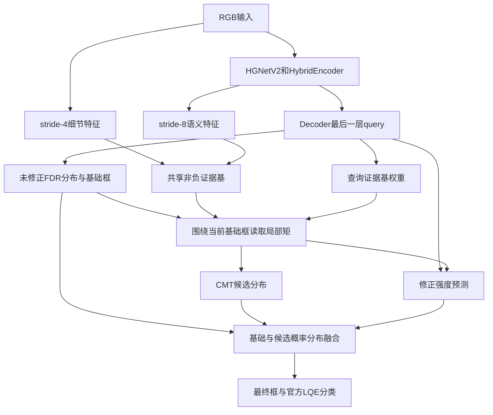

# CMT-FINE-MR 实现与使用说明

本文描述当前的准确率导向实现。模型保留官方 D-FINE 的 backbone、HybridEncoder、FDR、GO-LSD、postprocessor 和 COCO evaluator，在最后一个 decoder 层增加查询条件化矩证据与质量增益选择。官方配置与评测口径不变。

## 1. 设计目标

上一版 CMT 在 DUT 上表现为 AP75 略有提高，但整体 AP 未提高且 AR 下降。当前版本针对三个能力缺口修改：

1. 证据由 RGB 单通道图升级为细节与语义融合的共享证据基；
2. 局部矩窗口围绕当前层未修正预测框，而不是第一层初始参考框；
3. 门控升级为离散修正强度选择，并用候选框相对基础框的真实定位质量监督；
4. 小目标获得更大的修正预算，中大目标仍保留小幅精修和回退能力；
5. 不再向分类 query 直接叠加矩描述符，分类排序仍由 D-FINE 分类头和 LQE 完成。

当前实现以提高 AP、APsmall 和 ARsmall 为目标，不增加相位一致性损失。

## 2. 数据流



## 3. 查询条件化语义证据

`EvidenceEncoder`分别提取：

- RGB 的 stride-4 细节特征；
- HybridEncoder 第一层输出的 stride-8 语义特征，上采样到 stride 4；
- 融合后输出默认 8 个非负证据基。

第 q 个查询预测凸组合权重：

\[
\pi_q=\operatorname{softmax}(f_\pi(q)),\qquad
E_q(x,y)=\sum_k\pi_{qk}E_k(x,y).
\]

实现先为每个证据基构建积分原始矩，在窗口读取后组合原始矩，再计算质心和协方差。因此不用为每个 query 创建完整分辨率证据图。矩计算使用 FP32，主干与 decoder 仍可使用 AMP。

窗口由当前层未修正的基础框确定。默认支持尺度为 `[0.5, 1.0, 2.0]`，最小半径 2 个输入像素。三个窗口的中心与描述由 query 自适应融合。

## 4. 小目标优先的候选分布

CMT 对 D-FINE 的四边概率分布生成一个候选分布。当前预测框的输入等效边长为：

\[
s_q=\sqrt{(Ww_q)(Hh_q)}.
\]

修正预算为：

\[
r_q=r_{min}+(r_{max}-r_{min})
\sigma\left(\frac{\log\tau-\log(s_q+\epsilon)}{T}\right).
\]

默认 `tau=32`、`r_min=0.15`、`r_max=1.0`。小目标允许较强的矩投影；中大目标保留较弱精修。尺寸输入停止梯度，避免模型通过改变预测尺度操纵预算。

CMT 默认只作用于最后一个 decoder 层。`refine_layers=all` 和显式层索引仍可用于消融。

## 5. 定位增益强度选择

模型保留基础分布 \(P^0\) 和完整 CMT 候选分布 \(P^C\)，预测离散强度：

\[
a\in\{0,0.25,0.5,1\}.
\]

推理时使用强度概率的期望，并在概率空间融合：

\[
P^{out}=(1-a)P^0+aP^C.
\]

训练时，对同一 Hungarian 匹配和同一 GT 比较四个插值候选：

\[
J(a)=L_{relative-L1}(b(a),y)+2L_{GIoU}(b(a),y)+0.02a,
\]

\[
a^*=\arg\min_a J(a).
\]

候选质量标签停止梯度。候选框还有独立定位损失，因此初始强度偏向 0 时，证据与候选分支仍能学习。`fixed_gain`可以设为 0、0.25、0.5 或 1，用于固定强度消融；设为 0 时精修输出逐位返回原 FDR logits。

## 6. 损失

| 损失 | 默认权重 | 作用 |
|---|---:|---|
| `loss_cmt_evidence` | 0.10 | 监督共享证据基的聚合中心响应 |
| `loss_cmt_center` | 0.10 | 弱监督匹配查询的矩中心 |
| `loss_cmt_candidate` | 0.50 | 独立训练完整 CMT 候选框 |
| `loss_cmt_gain` | 0.10 | 选择定位代价最低的修正强度 |

CMT辅助损失只作用于最终普通查询。官方 VFL、bbox、GIoU、FGL、DDF、DN和GO-LSD流程保持不变。

## 7. 配置与训练

入口配置：

```powershell
python train.py -c configs/dfine/cmt_fine_mr_hgnetv2_s_coco.yml --use-amp --seed 42
```

加载 D-FINE 权重进行 tuning：

```powershell
python train.py -c configs/dfine/cmt_fine_mr_hgnetv2_s_coco.yml --use-amp --seed 42 -t path/to/dfine_s.pth
```

恢复完整训练状态：

```powershell
python train.py -c configs/dfine/cmt_fine_mr_hgnetv2_s_coco.yml --use-amp -r output/run/last.pth
```

当前结构与旧 CMT-FINE-MR checkpoint 的 CMT 参数不兼容。使用旧权重时应作为 tuning 权重加载，复用能够匹配的 D-FINE 主体参数，重新初始化 CMT。

## 8. 消融

| 实验 | 配置 |
|---|---|
| 官方路径 | `mode=baseline` |
| 只训练证据，不修改框 | `mode=evidence_only` |
| 零阶矩 | `mode=mass_only` |
| 一阶矩 | `mode=first_order` |
| 完整矩 | `mode=full` |
| 固定不修正 | `fixed_gain=0.0` |
| 固定弱修正 | `fixed_gain=0.25` |
| 单证据基 | `evidence_bases=1` |
| 去除小目标优先 | `min_size_budget=1.0,max_size_budget=1.0` |
| 所有层精修 | `refine_layers=all` |

推荐核心实验顺序：baseline、full、full+fixed_gain=0、full+fixed_gain=0.25、单证据基、无尺寸优先。所有实验同时报告 AP、AP50、AP75、APsmall、APmedium、APlarge、ARsmall 和 AR100。

还应加入参数量相近的普通局部特征精修分支，判断收益来自矩描述还是新增高分辨率语义特征。

## 9. 评测与测试

评测命令和指标保持官方 D-FINE 形式：

```powershell
python train.py -c configs/dfine/cmt_fine_mr_hgnetv2_s_coco.yml -r output/run/best_stg1.pth --test-only
```

单元测试：

```powershell
python -m unittest discover -s tests -p "test_cmt_fine_mr.py" -v
```

测试覆盖矩合并、AMP下FP32矩、查询选择不同证据基、投影方向、完整反向传播、固定消融冻结和D-FINE输出契约。

## 10. 计算与边界

- RGB细节编码直接输出stride-4特征，避免上一版全分辨率卷积的主要开销。
- 所有证据基的积分矩每张图只计算一次；query窗口使用四点gather读取。
- 查询条件化发生在读取后的K个原始矩上，不产生`B×Q×H×W`张量。
- CMT只能精修已有查询。如果编码器和query选择阶段没有覆盖目标，最后一层CMT无法恢复该目标。
- 查询条件化能够提高实例区分能力，但不保证复杂拥挤窗口一定分离正确。
- 当前实现尚未验证ONNX和TensorRT导出。
- 单元测试证明张量契约、数值有限性和梯度路径成立；真实检测收益必须由完整训练与消融确认。
