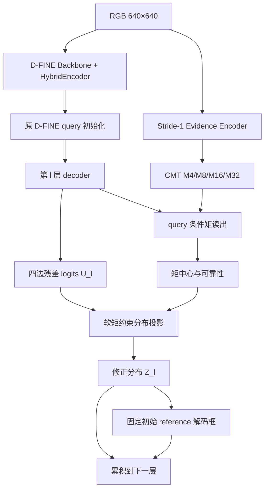
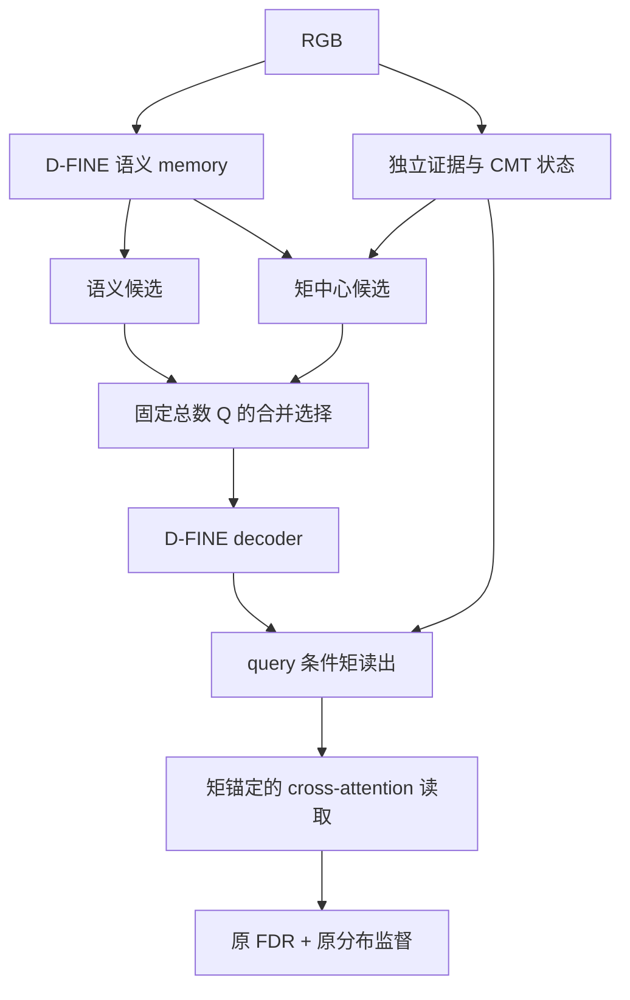
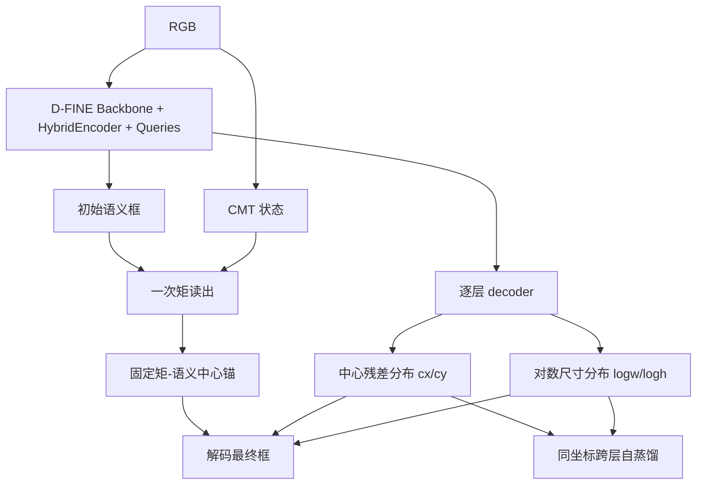

# 基于 D-FINE 融合 CMT 的三版新模型方案与优先级

> 日期：2026-09-16。本文重新以 D-FINE 为基础组织检测器，不沿用已有 CMTDet 的 encoder、decoder 或 MI-attention 结构。只继承 CMT（Conservative Moment Transport，守恒矩输运）的数学定义。
>
> 状态：研究设计，尚未实现、训练或验证收益。优先级按“问题针对性、与 D-FINE 的结合深度、可验证性及工程风险”综合排序，不是预测的 AP 排名。输入默认固定为 640×640，RGB 单帧，COCO 格式标注；不以 RK3588 部署为约束，但需要控制训练成本。
>
> 来源：已阅读 [D-FINE 论文](https://arxiv.org/html/2410.13842v1)、[官方仓库](https://github.com/Peterande/D-FINE)及相关 decoder、criterion、坐标转换源码。此次读取的是官方 master 页面与原始文件；GitHub API 限流，未取得可核验的 commit SHA。实施时必须固定上游 commit，并重新核对接口。既有数学约定见 [CMT 完整研究方案](CMT与CMTDet完整研究方案.md)与 [CMT 数学核验说明](CMT数学核验说明.md)。

## 1. 推荐结论

**第一优先：方案 A，CMT-FINE-MR——矩约束的分布精修。** 保留 D-FINE 的框边界分布和训练主体，将 CMT 的中心证据转化为对四边分布的软约束。CMT 直接影响最终分布，而不是增加一个容易被忽略的特征支路。创新集中、消融清楚，最适合作为论文主线的第一版。

**第二优先：方案 B，CMT-FINE-QM——矩锚定候选与证据读取。** 改造候选进入 decoder 的过程和 cross-attention 的读取位置，解决“目标没有进入候选集合，后续精细回归无从发挥”的问题。对召回缺口可能更有效，但 query selection 已有大量工作，需要证明收益来自格内矩而非更多候选或更高分辨率。

**第三优先：方案 C，CMT-FINE-CS——矩锚定的中心—形状分布解耦。** 将 D-FINE 四边残差分布重参数化为中心残差与对数宽高分布，使 CMT 成为定位坐标基准。结构创新更强，但需要重新实现分布监督并重新验证收敛；建议作为 A 获得支持后的高风险研究方向。

这些名称是本文的工作名，不表示已经完成重名检索或确立独立模型品牌。

| 维度 | A：矩约束分布精修 | B：矩锚定候选与读取 | C：中心—形状分布解耦 |
|---|---|---|---|
| 核心干预位置 | 每层 FDR 分布输出 | encoder-to-decoder、cross-attention | 分布参数化与整个回归头 |
| 主要假设 | 有候选，但定位统计随相位漂移 | 弱目标候选遗漏或读取位置偏离 | 平移误差与形状误差被四边回归耦合 |
| CMT 的必要作用 | 给四边分布提供共同的中心约束 | 给候选提供格内坐标、给读取提供位置 | 提供中心分布的外部坐标锚 |
| 原 D-FINE 可复用程度 | 高 | 较高 | backbone/encoder/decoder 主体可复用，回归损失需改 |
| 主要风险 | 错误证据推动四边一起偏移 | Top-K 仍不连续，增加重复或背景候选 | CMT 中心错误、分布支持不足、预训练头失配 |
| 训练成本预期 | 低至中增量，需实测 | 中等增量，严格固定 query 数 | 中等增量，收敛成本不确定 |
| 更适合观察的收益 | AP75、Tiny AP、IoU 波动、定位型 PFR | Tiny AR、候选覆盖率、漏检型 PFR | 中心波动与宽高波动分离、Tiny AP75 |
| 推荐顺序 | 1 | 2 | 3 |

若 D-FINE 的基线诊断显示大部分 Tiny GT 根本没有可用候选，应将 B 提前。若候选覆盖已经充分，而匹配框持续发生中心漂移，应优先 A。不能仅凭其他模型的 PFR 推断 D-FINE 的失效来源。

## 2. 为什么 D-FINE 与 CMT 是互补关系

### 2.1 D-FINE 已经解决的事情

D-FINE 用跨 decoder 层残差更新的离散分布表示框边修正，采用非均匀支持以细化定位，并通过 GO-LSD 把最终层定位分布传给较浅层。它已经具有精细分布回归，不能把“首次使用分布预测”作为新模型贡献。[论文方法部分](https://arxiv.org/html/2410.13842v1)

其官方模型入口连接 backbone、HybridEncoder 和 DFINETransformer；公共配置包含 stride 8/16/32 语义特征。具体规模会覆盖公共默认值，所以不把某个公共默认层数或宽度当作全部 D-FINE 型号的固定属性。[模型入口](https://github.com/Peterande/D-FINE/blob/master/src/zoo/dfine/dfine.py)、[公共配置](https://github.com/Peterande/D-FINE/blob/master/configs/dfine/include/dfine_hgnetv2.yml)

### 2.2 尚需验证的缺口

“输出分布精细”不代表“输入到分布头的位置证据稳定”。当一个小目标只有数个输入像素，语义特征或候选位置的轻微变化，仍可能推动整组边界分布变化。

因此本研究不批评 D-FINE 的分布粒度不够，而提出待验证假设：

> 在分布精修之前，提供独立、可追溯的格内定位统计，可能减少精细回归所依赖的位置证据波动；精细分布负责边界形状，CMT 负责提供中心证据及其可靠性描述。

CMT 的空间二阶矩与 D-FINE 的边界分布不是同一种量。前者描述学习证据在空间中的分散，后者描述离散框修正支持上的预测权重；两者都不能不经校准就解释为真实误差方差。

### 2.3 实施必须遵守的源码事实

1. decoder 中初始框形成后，FDR 使用固定的 `ref_points_initial`；下一层 attention 的 `ref_points_detach` 可以更新。这是两个不同用途的参考量。
2. `pred_corners` 是累积的分布 logits。当前源码保留其跨层梯度，而对后续读取参考框和部分 query 状态做 detach。不能无意中统一截断或统一放开。
3. FGL 的 target 来自与预测同一 reference 的坐标转换；GO-LSD 的分布蒸馏也要求同一 bin 对应相同物理含义。
4. 官方实现中的四边顺序为 `left, top, right, bottom`。论文书写顺序不应直接作为代码索引。
5. encoder 选中的 query 内容和框存在 detach；若只在被截断的位置加入可学习 CMT 分支，必须提供其他训练梯度。

以上根据 [decoder](https://github.com/Peterande/D-FINE/blob/master/src/zoo/dfine/dfine_decoder.py)、[criterion](https://github.com/Peterande/D-FINE/blob/master/src/zoo/dfine/dfine_criterion.py)和 [坐标工具](https://github.com/Peterande/D-FINE/blob/master/src/zoo/dfine/dfine_utils.py)核对。

**共同禁区：** 每层更换 FDR 的基准中心和宽高，却继续累加旧 logits、沿用旧 FGL target 或直接做跨层 KL。这会让同一 bin 的物理位置改变，产生坐标不自洽。

## 3. 三版共用的 CMT 核心

### 3.1 输入、证据与状态

输入 `X∈R[B,3,640,640]`，有效像素掩码 `V∈{0,1}[B,1,640,640]`。采用独立的 stride-1 窄证据网络：

`X → 3×3 Conv → pointwise activation → depthwise 3×3 + pointwise Conv → 1×1 logit Z → E=V·ReLU(Z)`。

首版证据宽度 16，宽度 8/32 为消融。避免多层全分辨率宽通道卷积；不用语义特征乘法门控原始 E，也不输入绝对位置编码。中心热图损失直接监督 Z，绕开 ReLU 死区。上述选择是工程起点，非已证明最优设置。

以输入像素中心 `x=(j+0.5,i+0.5)` 为坐标。对 stride-s 单元 Ω、原点 o：

$$
m=\sum_{\Omega}E(x),\quad
p=\sum_{\Omega}(x-o)E(x),\quad
Q=\sum_{\Omega}(x-o)(x-o)^\top E(x).
$$

输出 `M_s=[m,p_x,p_y,Q_xx,Q_xy,Q_yy]`。默认直接编码 M4，再合并为 M8/M16/M32。640 输入时 M4 为 `[B,6,160,160]`。

M4 每图 153600 个 FP32 数，约 0.586 MiB；这只是原始状态，不包含证据网络激活、梯度和优化器内存。不能据此宣称整个 CMT 显存很小。

### 3.2 守恒合并

子单元原点 o_k 合并至 O，令 d_k=o_k−O：

$$
m_P=\sum_km_k,\qquad
p_P=\sum_k(p_k+d_km_k),
$$
$$
Q_P=\sum_k[Q_k+p_kd_k^\top+d_kp_k^\top+m_kd_kd_k^\top].
$$

这些是经典矩换原点恒等式。网络贡献在于让其成为检测中的显式状态接口，不在于声称发明新的矩定理。原始状态不经过 BN、ReLU 或任意通道混合；可学习投影只能作用于其派生描述。

主规格选 stride 4：2×2 单元的六矩对四个证据值可以是可逆编码，不能把该情形包装为全新的有损压缩原理。stride 2 保留为高精度对照。

### 3.3 查询读出

对 query 的输入像素参考中心 r，令非负空间权 v_qk，在同一原点聚合：

$$
D=\sum_kv_{qk}m_k,\quad
N=\sum_kv_{qk}(p_k+(o_k-r)m_k),
$$
$$
T=\sum_kv_{qk}[Q_k+p_k(o_k-r)^\top+(o_k-r)p_k^\top+
m_k(o_k-r)(o_k-r)^\top].
$$

若 D>ε：

$$c_M=r+N/D,\qquad \Sigma_E=T/D-(N/D)(N/D)^\top.$$

每个 query 输出质量、中心、协方差、有效标志、支持边界比例与多窗口中心分歧。描述向量经投影后可进入语义 query；原始 M_s 保持独立。

建议用三种局部支持，半径由预测框尺度和最小输入半径决定，640 首试最小半径 4 px，支持倍率 0.75/1.5/3。小框优先 M4，较大框可读较粗状态，始终进行坐标换原点。跨尺度硬切换可能引入新的不连续性，因此尺度交界可用两个读出的凸混合，且要单独消融。

**准确性边界：** 单元常量非负权下以上读出精确；对连续变化核只是分块近似。完整证据的矩守恒不等于查询窗口读出严格平移等变，更不等于整网 PFR 为零。

### 3.4 可靠性与监督

在已匹配训练正样本上，以框中心构造有最小宽度的中心证据监督，同时约束背景证据；这是 box-supervised center evidence，不是实例分割真值。忽略区不施加负监督。小目标可采用有上限的尺度权重，避免极小框噪声主导。

中心可靠性门依据 query、质量、跨窗口分歧、支持有效比例等预测。无有效质量时强制回退。证据空间方差只作为输入特征，不能直接等同定位置信度或用 `sqrt(12Σ)` 充当框宽高。

多目标共享窗口会使中心混合。用更细单元、多个有限支持和语义门控减轻问题；不能宣称六矩可以唯一分离多个实例。

## 4. 方案 A：CMT-FINE-MR，矩约束的分布精修

### 4.1 完整 story

小目标在整数平移后可能仍被 query 捕获，但其中心证据发生变化，四条边的预测共同漂移。D-FINE 精细表示每条边，却没有要求它们共同满足一个来自压缩前证据的中心约束。

受矩约束下最小相对熵投影启发，将 CMT 中心作为软几何约束，对 D-FINE 的边界分布做最小必要修正。保留原分布提供的边界细节，可靠矩证据只调整其中与中心漂移相关的分量。

可检验的预测是：定位型翻转、中心回映射误差和 AP75 改善，且完整一阶矩优于仅有质量的证据分支。不要求所有类别或大目标都有同样收益。

### 4.2 结构与数据流



输入语义 memory、query 与参考框仍沿用 D-FINE。每层得到的 query 读取 CMT，输出 `c_M∈R[B,Q,2]`、描述 `d_M∈R[B,Q,Dm]`、门 `g∈[0,1][B,Q,1]`。投影前后分布均为 `[B,Q,4,K]`，`K=reg_max+1`。

类别分支首版仅接受 `q+α·MLP(d_M)`，α 为可学习小残差系数；不直接用质量代替类别置信度。这样可检验 CMT 是否改善置信度波动，同时保留“仅定位作用”的独立消融。

### 4.3 与官方坐标一致的中心约束

为简洁起见，在输入像素坐标推导。初始参考框为 `b0=(cx0,cy0,w0,h0)`，固定于 decoder 第一层初始预测之后。令 `r=abs(reg_scale)`，`z_k=weighting_function(k)`，`μ_e=Σ_kP_e(k)z_k`。

按官方距离转换，四边可以写为：

$$
x_1=c_x^0-w_0/2-(w_0/r)\mu_L,\quad
x_2=c_x^0+w_0/2+(w_0/r)\mu_R,
$$
$$
y_1=c_y^0-h_0/2-(h_0/r)\mu_T,\quad
y_2=c_y^0+h_0/2+(h_0/r)\mu_B.
$$

因而框中心为：

$$
c_x(P)=c_x^0+a_x(\mu_R-\mu_L),\quad a_x=w_0/(2r),
$$
$$
c_y(P)=c_y^0+a_y(\mu_B-\mu_T),\quad a_y=h_0/(2r).
$$

这组约束把“图像空间的矩中心”接到“四边分布的一阶期望差”，不是把证据协方差硬解释成边界分布方差。

### 4.4 软约束 KL 投影

原 FDR 更新先给出：

$$U_l=Z_{l-1}+\Delta U_l(q_l),\qquad P_e^0=\operatorname{softmax}(U_{l,e}).$$

其中 Z 是上层实际使用的、已经校正的分布 logits。初始层无历史项时置零。然后求：

$$
\min_{\{P_e\}}\sum_e\operatorname{KL}(P_e\Vert P_e^0)
+\frac{\rho_x}{2}[c_x(P)-c_{M,x}]^2
+\frac{\rho_y}{2}[c_y(P)-c_{M,y}]^2,
$$

满足每条边 P_e 非负且总和为 1。`ρ_axis=g·ρ0/max(size_axis,4)^2`，单位为像素倒平方。ρ0 是可配置无量纲强度；读出无效时 ρ=0，严格退化为原 FDR 更新。

拉格朗日驻点给出水平方向的指数倾斜：

$$
P_R^\lambda(k)\propto\exp(U_R(k)+\lambda_xa_xz_k),\quad
P_L^\lambda(k)\propto\exp(U_L(k)-\lambda_xa_xz_k),
$$
$$
\lambda_x=\rho_x[c_{M,x}-c_x(P^\lambda)].
$$

竖直方向以 B/T 类似处理。令 `f(λ)=λ−ρ(c_M−c(λ))`，则

$$f'(\lambda)=1+\rho a^2[\operatorname{Var}_{P_R^\lambda}(z)+
\operatorname{Var}_{P_L^\lambda}(z)]>0.$$

所以每轴是单变量、单调的求根问题。可以用固定 3–5 次带步长保护的 Newton 更新，以 FP32、log-softmax 和有界初始值计算；记录残差，未收敛时采用保守限制或回退。不把有限迭代输出宣称为精确最优解。

这一步的数学基础是经典最小相对熵投影；本方案的研究点是使用守恒的图像空间矩，约束 decoder 内有共同坐标基准的边界分布。它不是独立于证据质量的性能保证。

本次用 NumPy FP64 对一组合成的 33-bin 分布做了数值核查：中心对偶变量导数的有限差分误差约为 6.41e-12，8 次 Newton 更新后的驻点残差约为 1.44e-15；中心从 16.44386 移至 17.41694，更接近软目标 18.2。该检查仅验证本例的公式与求根关系，不是 PyTorch 梯度测试，不验证官方支持上的所有情况，也不构成检测收益证据。

### 4.5 训练与梯度

总损失：

$$L_A=L_{\text{D-FINE}}(Z,b,score)+\lambda_E L_E+
\lambda_C L_{\text{center}}+\lambda_G L_{\text{gate}}.$$

* FGL 监督校正后的 Z，reference 仍是原固定 b0。
* GO-LSD 也使用各层校正后且坐标支持一致的 Z，最后层教师 stop-gradient；不另引入移动 reference。
* L_center 只在匹配、质量有效的实例上作用，归一化尺度至少为 4 输入像素。
* L_gate 可用 detached 的“矩中心相对语义中心是否更接近 GT”构造软目标。它只在训练时使用 GT；推理完全从预测量产生门。
* 前若干 epoch 从 ρ=0 缓慢增加，防止未学习的证据破坏预训练分布。
* Newton 采用可微固定迭代或显式隐式梯度，首版优先固定迭代并做有限差分检查；不能在 solver 中意外包裹 no_grad 使 CMT 检测梯度消失。

需要监测 gate 是否塌缩为零、gate 是否全开，以及语义 logits 是否越来越大以抵消投影。若只有加大监督权重才能强行让 CMT 起作用，需检查证据是否真正有价值。

### 4.6 代码落点、成本与风险

新增 `cmt.py`、`moment_reader.py`、`moment_distribution_projection.py`；在 `dfine.py` 分支生成矩状态，在 decoder 每层 `pred_corners` 与 `distance2bbox` 之间投影，在 criterion 增加辅助项。

投影成本约 `O(B·Q·L·K·I)`，I 为固定 solver 迭代数。通常比全分辨率证据 CNN 更容易控制，但 softmax kernel launch 和反向图不能忽略。禁止逐 query Python 循环。

主要风险：矩中心是背景中心或两目标中点；有限支持限制可达中心；强投影通过改变边界分布间接损伤框宽高。因此同时记录宽高变化和分布 KL，比较“仅输出框中心平移”强对照。若简单平移得到相同 AP/PFR 且更稳，复杂投影缺乏成立理由。

### 4.7 A 的决定性消融

1. D-FINE 原版。
2. D-FINE + 同参数证据特征残差，不读矩。
3. 质量 m + 同一投影接口。
4. m+p 的中心约束。
5. m+p+Q 的可靠性描述。
6. 完整 CMT，但破坏换原点项，仅作为诊断性干预。
7. 最终框中心修正，不修改分布。
8. A 完整版；ρ=0 必须数值回归原版。
9. 各层投影 vs 仅最后层投影；无门 vs 学习门。
10. 同 solver 成本的通用 MLP 分布修正，排除额外容量因素。

不能将故意错误的矩实现作为唯一基线；它只能辅助解释机制。

## 5. 方案 B：CMT-FINE-QM，矩锚定候选与证据读取

### 5.1 完整 story

再精细的回归也无法修复没有进入 query 集合的目标。小目标的语义响应弱，输入平移还可能改变候选排序及注意力落点。其瓶颈可能早于 FDR。

将 CMT 保留的格内位置用于构造少量补充候选，并让其位置影响语义读取，再交给原 D-FINE 做边界分布精修。核心是让“守恒位置证据”获得进入检测推理的通道，而不是简单增大 query 数量。

候选密度或动态 query 本身已有先例，例如 [DQ-DETR](https://arxiv.org/abs/2404.03507)；[DDQ](https://openaccess.thecvf.com/content/CVPR2023/papers/Zhang_Dense_Distinct_Query_for_End-to-End_Object_Detection_CVPR_2023_paper.pdf)也研究候选覆盖和重复。因此创新必须由“带格内坐标的矩候选与读取”体现。

### 5.2 结构



总 Q 固定，例如基线 300 时首试 225 个语义候选、75 个矩候选；0%、12.5%、25% 矩配额为消融，不把 25% 当作普适最优。

### 5.3 矩候选

在 M4 的每个单元及固定邻域读出 `D,c_M,Σ`；使用局部支持改善跨格目标，单元内质心只作一项输入。把原语义 memory 在 c_M 附近采样出的语义、矩描述和候选有效性输入共享评分头：

$$s_j=\operatorname{MLP}([f_{\rm sem}(c_{M,j}),d_{M,j}]),$$
$$r_j=(c_{M,j}+\Delta c_j,\;w_j,h_j).$$

宽高由语义回归，不能从证据二阶矩直接确定。中心残差有界；候选评分必须包含背景负样本。候选在选取前接受密集或局部正样本监督，不能期待 hard Top-K 自动训练未选中位置。

用源单元 ID 去除同一路径重复，合并候选后保持固定 Q。首版不新增预测框 NMS；若研究多样性筛选，必须作为单独组件并报告，避免把其收益归给 CMT。

### 5.4 矩锚定读取

对第 l 层 query 得到 c_M 和当前参考中心 c_ref：

$$\tilde c_q=c_{\rm ref}+g_q(c_M-c_{\rm ref}).$$

以此作为 cross-attention 的读取中心，学习偏移仍由 query 产生：

$$x_{q,h,k}=\tilde c_q+\operatorname{diag}(w_q,h_q)\,u_{q,h,k}.$$

坐标统一由输入像素转换到每层 feature 坐标；读取值仍来自语义 memory，注意力权重仍由模型学习。矩描述作为 query 的小残差输入，训练梯度不依赖候选选择路径。

`Σ_E` 首版只参与门和描述，不强制转换为采样椭圆；这样减少新的“方差=对象大小”假设。各层 attention 中心可以改变，但原 FDR 的固定初始框不能随之改变。

### 5.5 训练、收益预期与限制

保留 D-FINE 分布损失，增加 E 的中心监督与候选监督。DN queries 与正常 queries 共用 CMT reader，但严格保留 DN attention mask；任何 GT 坐标只能用于既有训练去噪机制和监督，不能在推理候选生成中出现。

需要分别验证：

* selector-only：只替换候选；
* reader-only：原候选 + 矩引导读取；
* 两者联合；
* 仅增加同数量普通高分辨率语义候选；
* 相同 query 数与相同计算成本的比较。

记录 Top-Q 的 GT 覆盖率、Tiny 候选中心误差、跨相位候选存活率及最终 AR。如果只是候选数增多而 AP 不升、重复框增加，方案并未成功。

候选存活率应按同一个 GT 的可匹配性定义，不按 Top-K 排名索引定义；不同相位 query 的排序本来就可能不同。

### 5.6 工程边界

主要修改 `_get_decoder_input`、候选监督和 cross-attention reference。不需要重写 FGL；预训练 FDR 头可保留。

尽量只对选中 query 进行复杂矩读出；密集 M4 候选阶段用固定小邻域卷积式统计，避免 25600 个候选逐个大窗口求和。对离散选择的梯度与选前监督做专门检查。

B 最适合的实验证据是“相同 Q 下，Tiny 候选覆盖提高且最终 AP/PFR 同时改善”。仅有 query 热图更好看不能构成方法证据。

## 6. 方案 C：CMT-FINE-CS，矩锚定的中心—形状分布解耦

### 6.1 完整 story

平移导致的框中心误差与对象大小变化具有不同几何性质。四边分布能共同表达两者，但中心平移需要相对边协同变化。对于小目标，这种协调误差可能对 IoU 特别敏感。

CMT 提供独立中心锚，将定位重参数化为“围绕矩锚的中心残差分布 + 语义形状分布”，保留 D-FINE 的逐层分布残差精修和自蒸馏思想，使模型显式区分位置与形状。

该假设需要通过中心—宽高误差分解检验。不能声称 cxcywh 本身是新发明；新意候选在于守恒空间证据、固定坐标锚与分布精修的共同设计。

### 6.2 结构与变量



初始语义框 `(c0,w0,h0)`。读 CMT 后建立：

$$c_* = c_0+g_0(c_M-c_0).$$

一个 query 在同一次前向的所有 decoder 层共享 c_*、w0、h0 和中心归一化尺度 `s_c=(max(w0,4),max(h0,4))`。它们不是逐层更新的目标；用于 attention 的当前预测框可以继续更新。

预测四组分布，但含义改为 `P_cx,P_cy,P_logw,P_logh`。中心残差支持 ξ 包含正负值、零附近较密；尺寸残差支持 ζ 为有界对数尺度。所有层共用支持。

### 6.3 解码与监督

$$
c_x^l=c_{*,x}+s_{c,x}\sum_kP_{cx}^l(k)\xi_k,\qquad
c_y^l=c_{*,y}+s_{c,y}\sum_kP_{cy}^l(k)\xi_k,
$$
$$
w^l=w_0\exp\!\left(\sum_kP_{\log w}^l(k)\zeta_k\right),\qquad
h^l=h_0\exp\!\left(\sum_kP_{\log h}^l(k)\zeta_k\right).
$$

这是“对数尺寸期望再指数化”，不能在实现时悄悄换成“尺寸指数的期望”。这里宽高恒正，中心仍可由残差修正，不受证据中心硬绑定。

每组 logits 逐层残差累加，保留 D-FINE 的精修思想。GT 分布目标改为：

$$
t_{cx}=(c_x^{GT}-c_{*,x})/s_{c,x},\quad
t_{cy}=(c_y^{GT}-c_{*,y})/s_{c,y},
$$
$$t_{\log w}=\log(w^{GT}/w_0),\qquad
t_{\log h}=\log(h^{GT}/h_0).$$

在各自实际支持上做邻近 bin 的插值监督，辅以正常 L1/GIoU 和分类损失。这不再是官方四边 FGL，必须使用新名字，例如 `loss_center_dist`、`loss_shape_dist`。

训练生成分布 target 时 detach 坐标基准；解码侧可允许 c_* 经框损失学习。必须记录这一非对称梯度设计，并用冻结 anchor / 可训练 anchor 消融检查目标移动是否影响训练。若采用全 detach anchor，则 CMT 必须通过辅助监督和 query 描述路径获得梯度。

同一 query 的锚和支持跨层一致，才能直接做 teacher-student KL。中心和形状分别蒸馏，teacher detach；匹配的分类仍一对一。保留匹配并集思想时，需沿用冲突消解规则，不能让同一个预测同时回归到两个不同 GT。

### 6.4 支持、饱和与预训练

中心支持首试覆盖归一化残差 [-2,2]，尺寸支持首试 log 比例 [-log4,log4]，每组 33 bins；这些是待调参数，不保证覆盖所有 GT。必须统计 out-of-support 比例和端点概率，必要时扩展支持或改进初始框，不能只裁剪后忽略损失。

backbone、encoder、decoder attention 可加载 D-FINE 预训练参数；新的回归输出头、对应 LQE 和分布损失不能直接当作语义相同的参数加载。分类质量估计需重新训练或先关闭，保证它读取的是新分布含义。

### 6.5 与 A 的根本区别

A 在原四边分布空间内施加软中心约束，保留回归接口；C 改变模型预测什么。CMT 不仅帮助修正中心，还定义了中心残差的坐标基准。

C 的风险更大：如果矩锚错误，中心分布需要学会抵消；若初始框尺寸差，形状支持也可能饱和。多个目标混合时不能用“平移协变”理论保证锚正确。

### 6.6 必需的对照

1. 原 D-FINE。
2. 改成中心—形状分布，但完全不用 CMT。
3. 使用普通热图 soft-argmax 中心锚。
4. 使用 CMT 锚，关闭一阶矩，只保留单元中心。
5. 完整 C + 原语义锚回退。
6. 无中心/形状分开蒸馏 vs 分开蒸馏。
7. 固定锚 vs 每层移动锚并正确重映射支持的扩展版本。

主版本不实施第 7 项复杂扩展，避免把动态坐标变换与核心创新混在一起。

## 7. 为什么不直接“给 D-FINE 加一个 P2 + CMT attention”

这可以作为强工程基线，但不能自动构成当前问题下最有说服力的方法。额外 P2、更多 query、更大输入都可能提高 Tiny AP，却不能证明收益来自保留格内矩。

本方案三版分别给 CMT 明确的职责：

* A：约束输出分布的几何中心。
* B：提供候选位置并决定在哪里读取语义。
* C：定义中心回归的坐标锚。

每条路线都需要一个“相同输入证据但不用守恒矩”的对照；否则独立高分辨率分支本身就是无法排除的解释。

已有 [Integral Regression](https://arxiv.org/abs/1711.08229)和 [DSNT](https://arxiv.org/abs/1801.07372)已经研究从空间响应中可微读取坐标。因此不能把求质心或 soft-argmax 写成主要新颖点。

[抗混叠池化](https://proceedings.mlr.press/v97/zhang19a.html)研究下采样与平移稳定性，应作为不同干预机制的对照，而不作为 CMT 的同义词。本次定向检索没有建立“此前从未有人提出”的证据；投稿前还需围绕 moment-constrained detection、distribution projection、center-shape factorization 完成系统检索。

## 8. 统一训练与评价方案

### 8.1 先建立 D-FINE 自身基线

在同一数据划分、640 输入几何、训练数据增强和预训练来源下，先训练官方 D-FINE 配方。DUT/DetFly 分别实验；有视频来源时按序列隔离划分，避免相邻帧跨集合。

首先诊断：

1. Tiny 的 encoder Top-Q 覆盖率。
2. 在已覆盖 GT 中，各 decoder 层中心/宽高/IoU 误差。
3. PFR 翻转来自置信度门槛、定位门槛还是候选不存在。
4. 固定真实 GT 对齐后的候选条件下，纯 CMT 中心误差是否更小。

第 4 项是使用 GT 的机制诊断，不能作为正常模型评测，也不能用于推理。

### 8.2 首版训练原则

* 保留官方训练主体及增强策略，单独增加 CMT 辅助监督；先用同一 D-FINE 规模对比，不同时换骨干。
* 输入固定 640×640；关闭动态输入尺寸以利于精确尺度和吞吐对比。若后续启用多尺度训练，需独立配对。
* 从预训练 D-FINE 出发，证据支路先短暂预热，主检测路径保持可用，然后平滑放开 CMT。所有方案统一报告预热和总训练时间。
* 不沿用过去未经吞吐验证的 200 epoch 配方。先测 100–300 个稳定 iteration 的 forward/backward/optimizer 时间和完整 val 时间，再确定训练预算。
* FP32 计算矩、归一化及 A 的求根；语义分支按硬件用 AMP。避免每个 query/chunk 重复转换整个特征图。
* CMT 不在推理时依赖 GT 尺度；尺度门只能由预测框或候选统计给出。
* 第一轮不加入双相位一致性损失，先隔离结构贡献。后续若加入，同样给原 D-FINE 添加一致性训练作为控制。

### 8.3 检测指标

保留标准 COCO AP50:95、AP50、AP75、AR及原 COCO 尺度指标；另报告预处理后框面积 <100 像素²的 AP50:95 和 AR50:95，并写明 maxDets。

输入尺度 Tiny 指标应在完整检测评价框架中，将非目标尺度 GT 按正确 area/ignore 规则处理，不能简单删除非 Tiny 标注后把对应正确检测全部算成假阳性。原图尺度 COCO AP_small 与输入尺度 AP_tiny 必须分列。

另外报告负样本误报率、参数量、GFLOPs、峰值显存、每 epoch 时间和端到端推理时间。精度与计算量共同用于选择最终模型，而不以一个理想 FLOPs 数替代实际吞吐。

### 8.4 相位指标与避免误导

主实验沿用四相位 (0,0)/(1,0)/(0,1)/(1,1)，固定输入后整数移动、预测框逆向对齐。报告 PFR、conditional PFR、phase0 dropout、mean/all/any recall、score range 与 IoU range；±2/±3 作为补充。

阈值在 val 冻结，test 不调；按序列做 bootstrap，序列不足时明确独立块数量限制。既报告统一阈值下的结果，也可补充各模型独立 val 校准或匹配召回操作点，避免靠降低置信度或增加稳定漏检获得较低 PFR。

**成功条件不是“PFR 降低”一个指标：** Tiny AP/AR 不下降且稳定性改善，或者给出清楚的精度—稳健性折中。若全尺度 AP 提升但 Tiny 稳定性不改善，最多支持通用检测改进，不支持本文的相位机制主张。

### 8.5 机制证据与否证条件

| 路线 | 应观察到的中间变化 | 否证或降级信号 |
|---|---|---|
| A | 矩中心更可靠，投影减少中心漂移，分布修正幅度适度 | gate 几乎全关；只靠大投影降低召回；普通 MLP 等效 |
| B | 固定 Q 下 Tiny 候选覆盖和跨相位存活提高 | 仅增加重复框；普通额外候选同样有效 |
| C | 中心残差变化与尺寸变化更清楚分离，CMT 锚有效 | 大残差长期抵消矩锚；仅改参数化已得到全部收益 |
| 共用 CMT | m+p 优于 m；正确换原点优于格中心近似 | 通道打乱、关闭位置统计对结果没有影响 |

PFR 是阈值化决策指标，不能由一个质心误差定理直接推出。应把理论限定在证据统计和条件读出，把检测结论留给实验。

## 9. 建议的实现接口与消融开关

以下为设计接口，尚不是当前仓库已经支持的参数：

```yaml
model:
  base: dfine
  variant: cmt_fine_mr  # cmt_fine_qm / cmt_fine_cs
  input_size: [640, 640]

cmt:
  enabled: true
  evidence_channels: 16
  moment_order: 2
  readout_stride: 4
  reader: cell_weighted
  min_radius_px: 4
  support_scales: [0.75, 1.5, 3.0]
  state_dtype: float32
  semantic_residual: true

moment_refinement:       # A only
  enabled: true
  layers: all
  projection: soft_kl
  solver_steps: 4
  strength: 1.0
  learned_gate: true
  fixed_fdr_reference: true

moment_queries:          # B only
  fraction: 0.25
  keep_total_queries: true
  guided_readout: true

center_shape:            # C only
  fixed_anchor: true
  num_bins: 33
  center_support: [-2.0, 2.0]
  log_size_support: [-1.386294, 1.386294]

training:
  evidence_warmup: true
  phase_consistency: false
```

按 variant 校验配置，不适用的参数应报错或从 resolved config 明确移除，不能静默接受。保存原始 config、解析后 config、上游 commit、权重来源、随机种子、操作阈值和预处理元信息。

必须提供独立 forward 模式：`baseline`、`evidence_only`、`mass_only`、`full_moments`、`full`；模式切换不改变数据、训练预算或其他组件。

几何单元测试至少覆盖：原点变换、块合并、有效 mask、输入/feature/normalized 坐标转换、无质量回退、二阶矩数值精度。A 另测 ρ=0 等价、投影残差与梯度；B 另测 query 总数和 DN mask；C 另测编解码互逆、target 支持边界、同一 query 跨层支持一致。

## 10. 论文“提出的方法”如何组织

建议以 A 作为主论文版本，方法章按以下逻辑组织：

1. **Problem formulation。** 定义整数平移相位与检测状态波动，区分输入尺度和原图尺度。
2. **Conservative localization evidence。** 定义 stride-1 证据、矩状态、换原点合并及成立条件。
3. **Moment-conditioned distribution refinement。** 从四边分布期望推出中心表达，再给出软 KL 约束及可微求解。
4. **Reliability and optimization。** 说明污染、低质量和候选失配，定义门、辅助损失以及与 FGL/GO-LSD 的兼容。
5. **Implementation。** 明确 D-FINE 是基础模型，列新增计算与训练差异。

拟议主张应是：

> 我们在精细分布回归中引入压缩前保留的定位矩，并以软几何约束将其接入边界分布精修，从而检验对小目标相位漂移的针对性改善。

不要写成“D-FINE 原模型无法保留位置”“严格解决了相位不稳定”“首次使用统计矩”，也不应将 FDR、GO-LSD 或经典 KL 投影本身列为原创贡献。

如果 B 更有效，论文主线改为“从格内位置证据到候选可达性”；如果 C 更有效，改为“矩锚定的位置—形状分布建模”。不要把三版都堆进同一个主模型来制造模块数量。

## 11. 执行顺序与最终选择

1. 固定官方 D-FINE 版本并复现 640 基线，测吞吐与 Tiny 失败来源。
2. 实现三版共用的 CMT 核心和普通证据分支对照。
3. 先做 A 的仅最后层投影，验证坐标、梯度和有效性，再扩展各层。
4. 若候选缺失限制收益，实现 B 的 selector-only，再做 reader-only。
5. 仅在矩中心本身已经有实证价值时，启动 C 的分布头重参数化。
6. 用同训练预算、同预训练来源和多随机种子选最终模型；最后再验证 A+B 是否真正互补。

**首选交付目标是一个结构清楚、可退化到原 D-FINE、能被消融否证的 CMT-FINE-MR，而不是一次性堆叠所有可能改进。**

## 12. 核心参考来源

* [D-FINE 论文](https://arxiv.org/abs/2410.13842)：基模型、FDR 与 GO-LSD。
* [官方仓库](https://github.com/Peterande/D-FINE)：实现与训练载体。
* [dfine_decoder.py](https://github.com/Peterande/D-FINE/blob/master/src/zoo/dfine/dfine_decoder.py)：候选、参考框与逐层分布。
* [dfine_criterion.py](https://github.com/Peterande/D-FINE/blob/master/src/zoo/dfine/dfine_criterion.py)：FGL、蒸馏与匹配。
* [dfine_utils.py](https://github.com/Peterande/D-FINE/blob/master/src/zoo/dfine/dfine_utils.py)：非均匀支持与坐标互转。
* [DQ-DETR](https://arxiv.org/abs/2404.03507)：Tiny 场景下动态候选的已有工作。
* [DDQ](https://openaccess.thecvf.com/content/CVPR2023/papers/Zhang_Dense_Distinct_Query_for_End-to-End_Object_Detection_CVPR_2023_paper.pdf)：候选覆盖与重复控制。
* [Integral Regression](https://arxiv.org/abs/1711.08229)、[DSNT](https://arxiv.org/abs/1801.07372)：可微坐标期望读取的已有工作。
* [Making Convolutional Networks Shift-Invariant Again](https://proceedings.mlr.press/v97/zhang19a.html)：抗混叠与平移稳定性对照。
