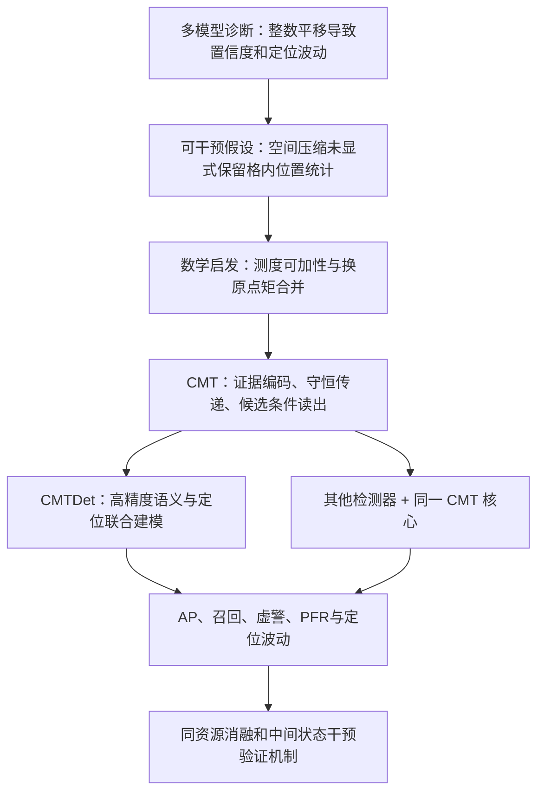
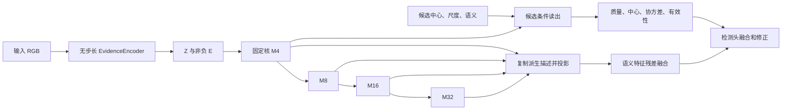
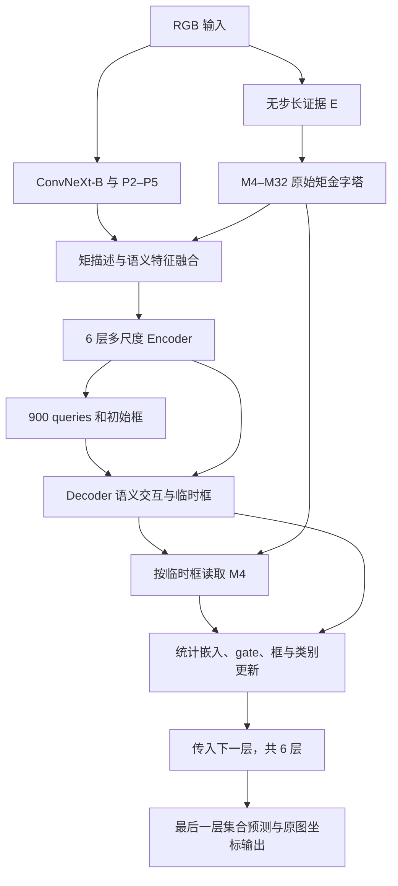

# CMT 与 CMTDet：面向相位稳健小目标检测的完整研究方案

> 工程更新：已基于本设计实现 PyTorch 初版，当前实际接口、已实现范围及差异以[实现结构与接口说明](../实现与实验参考/实现结构与接口说明.md)为准；使用方法见[训练与测试操作指南](../实现与实验参考/训练与测试操作指南.md)。下文保留研究设计的原始措辞，外部模型接入等部分仍为后续计划。

> 版本：研究设计 v1.0，2026-09-13。任务：RGB 单帧目标检测，以小目标检测精度和采样相位稳健性为核心；CMTDet 以争取具有明确评测范围的 SOTA 为目标。板端部署、轻量化、低延迟和算子／图优化不属于本方案的研究约束。
>
> 本文是可以继续实现的设计规格，不是已经完成训练的模型论文。经典矩恒等式、在明确假设下推导出的误差界、拟议的网络设计、待验证的性能主张分别标明。不预填 AP 提升，不承诺达到 SOTA。

## 1. 方案定位与阅读导航

**CMT（Conservative Moment Transport，守恒矩输运）是一套“学习定位证据—编码空间矩—按坐标合并—面向候选读出”的可插拔模块。CMTDet 是以此模块为核心组织高分辨率证据、语义特征和迭代检测的完整检测器。**

这里的 transport 是局部坐标状态在空间合并中的换原点输运，不是视频运动估计，也不求解最优输运问题。

本方案建议采用一条统一的研究主线：

> 小目标的检测状态对整数像素平移敏感 → 假设空间压缩中格内位置统计的丢失是其中一个可干预因素 → 在压缩前显式编码定位证据的低阶空间矩，并在后续计算中保持其坐标含义 → 让候选检测同时利用语义与这些可追溯的定位状态 → 检验检测精度、相位稳健性和跨模型收益是否同时改善。

模块不等于一个随处替换的 `Conv2d`。完整接入通常有两个连接点：输入／浅层证据入口，以及 neck／head 的读取入口。它具有框架无关的数学接口，但各检测框架仍需要适配代码。

### 1.1 与已有文档的关系

用户指定的[《数学启发的小目标轻量检测研究路线与完整方案》](../早期研究背景/数学启发的小目标轻量检测研究路线与完整方案.md)主要定义了 **BCPS**：背景约束下的可检测性保持。此前的 **CMT** 实际定义在[《相位稳定性问题的三条独立解决路线与 SCI 论文方案》](../早期研究背景/相位稳定性问题的三条独立解决路线与SCI论文方案.md)第 5 节，并在[方法章节写作方案](../早期研究背景/面向SCI一区的相位稳定性论文定位与方法章节写作方案.md)第 9 节展开。

本文承接 CMT 的原始定义，不把 BCPS 改名成 CMT，也不将背景零空间、模板 Mahalanobis 距离或 BCPS 的损失混入主方法。

| 内容 | 旧 CMT 研究原型 | 本文确定的方向 |
|---|---|---|
| 目标 | 轻量网络中的位置保持 | 高检测精度与相位稳健性 |
| 证据提取 | 极窄的 4 通道支路 | 可扩展的全分辨率卷积分支，默认宽度 32 |
| 状态 | 零阶、两个一阶矩 | 最小核心保留三个矩；完整版本增加三个二阶矩用于离散程度描述和读出误差诊断 |
| 传递 | 一次 stride 4 压缩 | stride 4 起始、逐级精确合并的矩金字塔；stride 2 作独立强对照 |
| 读出 | 每格固定 5×5 窗口 | 以候选位置和尺度为条件的非负局部读出 |
| 检测器 | 小型 FPN 载体 | 高容量语义网络、P2–P5、多尺度 Transformer 与矩引导迭代头 |
| 通用性 | 原型层面 | 模块接口、特征接入和预测接入分别定义 |
| 证据要求 | 精度—成本曲线 | 同资源精度、公平机制消融、相位指标、跨模型／跨数据集 |

### 1.2 文档组织

- 第 2～3 节：论文 story、可主张的贡献、与近邻的区别。
- 第 4～9 节：坐标约定、完整数学推导、背景与多目标边界。
- 第 10～12 节：CMT 模块、CMTDet 全结构、外部模型适配。
- 第 13～16 节：训练、配置接口、实验、实施顺序。
- 第 17～18 节：论文方法章节写法、参考文献与数值核验。

## 2. 可直接展开为论文的完整 story

### 2.1 问题：少量像素上的误差更容易跨越检测阈值

微小目标的有效证据有限，整数像素平移可能改变其与采样网格的相对位置。在原图中仍然是同一目标，但模型预测的置信度和定位可能波动，最终跨过置信度、IoU 或后处理门槛。

对一个宽为 \(w\)、高不变的矩形，若预测仅有水平误差 \(0\le d<w\)，则

$$
\operatorname{IoU}(d)=\frac{(w-d)h}{(w+d)h}=\frac{w-d}{w+d}.
\tag{1}
$$

给定匹配阈值 \(\tau\)，满足 IoU≥\(\tau\) 要求

$$
d\le w\frac{1-\tau}{1+\tau}.
\tag{2}
$$

例如 \(w=4,\tau=0.5\) 时水平误差预算仅约 1.33 像素。这说明相同绝对定位波动对小框更严重；它没有证明观测到的 PFR 全部来自定位，更没有证明全部来自首层下采样。

已有实验可作为**跨模型的现象证据**。最近 DetFly 的实验只有 val；RT-DETR 使用拉伸输入而 YOLO 使用 letterbox，尺度组并不是相同实例集合。已有个别实验还记录了预处理路径的框坐标差异。这些报告支持进一步研究，但正式论文需要解决一致性检查问题，不能通过放宽门槛把差异直接视为已排除，也不能用不同口径的 PFR 数值给模型稳定性排序。

### 2.2 缺口：语义特征不要求保留可解释的格内位置状态

步长卷积、池化和后续非线性压缩可以学到有用特征，却通常没有显式约束：一个单元中的目标证据总量是多少，以及这些证据位于单元内部哪里。

并非所有卷积都会丢失这些信息；足够的通道也可以隐式编码位置。因此本文提出的是一个待实验证明的结构假设：

> 与让后续网络隐式重新估计相比，在压缩前显式保留并传递定位任务所需的低阶空间统计，可能降低一部分由网格变化放大的位置误差。

### 2.3 数学启发：可加测度的矩，支持改变分区后的精确合并

一片非负定位证据可以看成离散测度。对这片证据，质量、质心以及二阶分布统计可以用有限个数描述。当子区域合并时，只要正确转换参考原点，这些统计不需要重新访问所有像素就能精确合并。

数学直接导向三项结构要求：

1. 证据必须在第一次数值下采样前产生，不能从已经消失的特征声称恢复原始格内位置。
2. 矩状态必须有独立的原始传递通路，不能经过普通 BN、激活或随意的通道混合后继续称为原始矩。
3. 检测头必须真正读取这些位置状态；只将其作为普通 attention 特征，无法充分检验守恒机制。

### 2.4 方法：保留状态、条件读出、语义校正

我们拟提出 CMT：先学习全分辨率非负定位证据，再构造可合并的空间矩金字塔；普通语义分支读取矩的派生特征，候选检测头则直接从原始矩中获得局部质量、中心与分散程度。

局部窗口会受背景、邻居和截断影响，因此 CMT 不采用“每个窗口质心就是目标框中心”的假设。读出区域以候选为条件，融合多个支持范围，并保留可学习的语义回归与可靠性门控。二阶矩帮助描述混合程度和约束局部近似误差，而不被当作真实目标宽高或已校准的不确定性。

### 2.5 完整检测器与通用性形成同一条证据链

CMTDet 将强语义网络与独立的定位状态通路共同用于候选产生、语义交互和框精修。其目的不是用弱基线证明模块有效，而是在充分训练的高精度基线上检验 CMT 的收益上限。

另外，在 YOLO、RT-DETR、Cascade R-CNN 等不同范式上接入同一个 CMT 核心，检验收益是否依赖某一种 head。各框架内先做原模型与 `+CMT` 配对，再讨论跨框架趋势。



## 3. 创新定位、近邻与命名

建议将潜在方法贡献收敛为一项核心和两项落实：

1. **核心：检测任务中的可组合空间矩状态。** 将压缩前的位置统计作为明确状态贯穿多尺度计算，并区分精确传递与条件读出。
2. **落实一：具有可检查误差来源的候选读出。** 在同一坐标下聚合质量、一阶矩和二阶矩，分析分区近似、背景污染与证据失配如何影响中心；用这些量辅助语义判别和定位。
3. **落实二：围绕 CMT 构建高精度 CMTDet，并验证外部模型适配。** 网络组织和实验证据共同说明方法价值。

矩恒等式、soft-argmax、残差门控、FPN、Transformer、候选 Top-K 本身都不作为独立新发明。达到 SOTA 是实验目标，不是新的数学贡献。

| 近邻 | 已有内容 | CMT 需要证明的实质差异 |
|---|---|---|
| [Integral Regression](https://arxiv.org/abs/1711.08229)、[DSNT](https://arxiv.org/abs/1801.07372) | 从热图／概率图进行可微坐标读出 | 低阶坐标状态在压缩过程中被保存并跨层合并；不是仅在末端换一个坐标读出函数 |
| [SPD-Conv](https://arxiv.org/abs/2208.03641) | 空间到通道重排及学习投影 | CMT 保留明确的任务统计，通常不可逆；必须比较相同证据、相同输出宽度的投影 |
| [BlurPool](https://proceedings.mlr.press/v97/zhang19a.html)、[LPS](https://arxiv.org/abs/2210.08001) | 抗混叠／多相采样与平移行为 | CMT 不选择一个相位，而传递包含格内位置的状态；不声称整网严格等变 |
| [Gaussian-Hermite Sampling](https://arxiv.org/html/2603.17098v1) | 用 Gaussian-Hermite 矩处理采样与平移，正文讨论 wrap-shift 条件 | CMT 不做全局中心化不变描述或图像重构，目标是局部绝对坐标读出与检测定位 |
| [Deformable DETR](https://arxiv.org/abs/2010.04159)、[DINO](https://arxiv.org/abs/2203.03605) | 多尺度查询、可变形注意力和成熟训练设计 | CMT 增加独立的压缩前位置统计来源；查询和 DINO 训练技巧属于载体 |
| BCPS | 受背景约束的采样可检测性 | CMT 不要求局部背景为仿射子空间，而对学习后的非负证据保留坐标统计 |

本次定向查阅不足以证明方案此前从未出现。投稿前还需要围绕 moment-preserving pooling、spatial moments for detection、moment-guided query refinement 等检索全文和代码，逐条比较算子与使用位置。

**命名存在明确重名风险：** CVPR 2022 已有 [CMT: Convolutional Neural Networks Meet Vision Transformers](https://arxiv.org/abs/2107.06263)。本项目按用户选择保留 `CMT` 和 `CMTDet`；论文首次出现必须写全 Conservative Moment Transport，并说明与已有 CMT backbone 无关。代码建议用 `ConservativeMomentTransport`，不要把已有 CMT 论文的骨干当作本方法来源。

## 4. 符号、坐标和模块边界

### 4.1 统一几何约定

输入为经过一次固定几何预处理的 \(X\in\mathbb R^{B\times3\times H\times W}\)。使用连续图像边缘坐标：像素 \((i,j)\) 的中心为

$$x_{ij}=(j+0.5,i+0.5).\tag{3}$$

框采用同一坐标中的 `xyxy`，框中心为两角平均，宽高为边缘差。CMT 内部距离统一用**模型输入像素**，而不是混用 feature stride 和归一化坐标。

第 \(s\) 级单元 \(\Omega_{s,k}\) 为连续边界 \([sk_x,s(k_x+1))\times[sk_y,s(k_y+1))\) 中的像素集合，原点

$$o_{s,k}=s(k_x+0.5,k_y+0.5).\tag{4}$$

输入必要时只向右和下 padding 到 32 的倍数，保留有效像素掩码 \(V\)。证据在 padding 区域置零；\(V\) 不使用 GT。ignore 标注只屏蔽训练损失与对应评测实例，不能在模型前向中依靠标注抹掉背景。真实图像边缘的目标不自动被训练丢弃。相位诊断另外建立公共有效区域与感受野边界子集。

仿射预处理信息作为 `GeometryMeta` 保存。所有 DETR 归一化 reference boxes 先乘实际有效坐标尺度再送 CMT，读取后再按同一规则归一化，不能只依赖张量形状猜测有效宽高。

### 4.2 主要符号

| 符号 | 含义／形状 |
|---|---|
| \(Z,E\) | 证据 logit 与非负定位证据，\(B\times1\times H\times W\) |
| \(m,\boldsymbol p,\boldsymbol Q\) | 单元的质量、局部一阶向量、局部二阶对称矩阵 |
| \(M_s\) | 二阶版状态，\(B\times6\times H/s\times W/s\) |
| \(S_s\) | 语义特征，默认 256 通道，与 \(M_s\) 分开存储 |
| \(q,r,b\) | 候选特征、参考中心、候选框 |
| \(w_q(x)\) | 非负候选空间权函数，不是检测置信度 |
| \(D,\boldsymbol N,\boldsymbol T\) | 相对候选原点聚合的零、一、二阶量 |
| \(\hat c,\Sigma_E\) | 读出的证据中心、证据空间协方差 |
| \(g\) | 学习到的融合门；不是理论上已知的正确率 |

以下省略 batch 和证据通道下标。默认单通道证据；若扩展到 \(K_E\) 通道，每通道独立进行同样计算。多通道不自动代表多个实例。

## 5. 数学核心一：从离散证据到守恒状态

### 5.1 证据测度

令

$$Z=h_\theta(X),\qquad E(x)=V(x)\max(Z(x),0).\tag{5}$$

定义 \(\mu(A)=\sum_{x\in A}E(x)\)。这是学习到的非负离散测度；质量单位是模型证据单位。它不是光学能量、目标真实像素数或前景分割真值。

框中心监督负责把证据塑造成定位有用的形状。语义网络负责类别和复杂背景。质量守恒会同时保存错误的背景响应，因此绝不能将“守恒”表述为自动去背景。

### 5.2 最小核心：三个矩

对原点为 \(o_k\) 的单元，定义

$$m_k=\sum_{x\in\Omega_k}E(x),\qquad
\boldsymbol p_k=\sum_{x\in\Omega_k}(x-o_k)E(x).\tag{6}$$

保存通道 \([m,p_x,p_y]\)。\(m\ge0\)，一阶矩可正可负。

固定块边长 \(s\) 时，核为

$$K_0(a,b)=1,\quad K_x(a,b)=b+0.5-s/2,\quad
K_y(a,b)=a+0.5-s/2.\tag{7}$$

用无 bias、stride=\(s\) 的固定卷积／分块求和即可得到矩。这些是作用于 \(E\) 的积分核，不是直接对 RGB 的差分卷积。

### 5.3 完整版：增加三个二阶矩

定义

$$\boldsymbol Q_k=\sum_{x\in\Omega_k}(x-o_k)(x-o_k)^\top E(x).\tag{8}$$

完整状态按固定顺序保存

$$M_k=[m_k,p_{x,k},p_{y,k},Q_{xx,k},Q_{xy,k},Q_{yy,k}].\tag{9}$$

新增核是 \(K_x^2,K_xK_y,K_y^2\)。\(Q\) 是关于单元原点的原始二阶矩，**不是已经中心化的协方差**；\(Q_{xy}\) 也可以为负。

增加二阶量的理由有两个：对局部质量的空间分散程度进行描述，以及计算第 7 节的误差上界。它不保证恢复多目标，不直接解码框宽高。最小三矩版本必须保留为主消融，以判断二阶量是否值得。

### 5.4 换原点公式：完整推导

将若干互不相交子单元合成父区域，父原点为 \(O\)，令 \(d_k=o_k-O\)。因为

$$x-O=(x-o_k)+d_k,$$

父质量为

$$m_P=\sum_km_k.\tag{10}$$

一阶矩展开为

$$\boldsymbol p_P=\sum_k\left(\boldsymbol p_k+d_km_k\right).\tag{11}$$

二阶展开

$$
\begin{aligned}
(x-O)(x-O)^\top
={}&(x-o_k)(x-o_k)^\top\\
&+(x-o_k)d_k^\top+d_k(x-o_k)^\top+d_kd_k^\top,
\end{aligned}
$$

得到

$$\boldsymbol Q_P=\sum_k\left[
\boldsymbol Q_k+\boldsymbol p_kd_k^\top+d_k\boldsymbol p_k^\top
+m_kd_kd_k^\top\right].\tag{12}$$

直接平均一阶矩，或者对子单元方差取均值，都漏掉原点间距项。实现中应把式 (10)～(12) 作为一个整体算子。

### 5.5 结合性与层级无关性

假设从原点 \(o\) 先移到 \(O_1\)，再移到 \(O_2\)，对应位移为 \(d_1,d_2\)。一阶修正为 \((d_1+d_2)m\)；二阶的交叉项展开后恰好合成

$$\boldsymbol p(d_1+d_2)^\top+(d_1+d_2)\boldsymbol p^\top
+m(d_1+d_2)(d_1+d_2)^\top.$$

因此两次换原点与直接换到 \(O_2\) 一致。结合有限求和的可交换／可结合性，逐级 `1→2→4→8` 的结果与直接 `1→8` 一致，只差浮点舍入顺序。

**命题 A：** 只要每个像素恰好归属一个叶单元、合并没有重叠重复计数，状态在任意合法合并树上的最终值都等于原始证据的直接求和。

这是经典矩代数在本模块中的正确性要求，不作为首次提出的新定理。

### 5.6 质心、协方差与守恒范围

当 \(m_P>0\)，

$$c_P=O+\frac{\boldsymbol p_P}{m_P},\qquad
\Sigma_P=\frac{\boldsymbol Q_P}{m_P}
-\frac{\boldsymbol p_P\boldsymbol p_P^\top}{m_P^2}.\tag{13}$$

对于任何向量 \(v\)，\(v^\top\Sigma_Pv\) 是非负证据分布下的一维方差，因此 \(\Sigma_P\succeq0\)。明显负特征值意味着数值精度或实现错误；仅允许对很小的浮点负值作显式数值修正并记录。

守恒范围是 \(E\) 的零、一、二阶统计。六个数不能恢复任意块内图像，也不是任意检测任务的充分统计量。任意非线性分类器仍可能需要被丢掉的高阶信息，所以语义通路必须保留。

### 5.7 为什么总量单独不够

同一单元中，质量为 \(a\) 的单点分别位于 \(x_1,x_2\)。两种情形均有 \(m=a\)，但

$$\boldsymbol p^{(1)}-\boldsymbol p^{(2)}=a(x_1-x_2).\tag{14}$$

仅有总量的读出无法区分两者。三个矩可以区分其质心；六个矩还能表达离散程度。但是“普通卷积一定无法区分”并不成立，普通通道可能学会类似统计，必须用实验比较。

## 6. 数学核心二：相位变化与误差分解

### 6.1 条件平移等变性

对整数位移 \(\delta\)，若证据满足 \(E_\delta(x)=E_0(x-\delta)\)，并且读取区域包含同一完整证据支持、没有裁剪及新增外部污染，则变量代换给出

$$m_\delta=m_0,\quad
c_\delta=c_0+\delta,\quad
\Sigma_\delta=\Sigma_0.\tag{15}$$

单元内状态会随目标跨越网格重新分配；式 (15) 不表示粗网格张量在一像素位移下只需做整数 feature-map 平移。它表示正确合并后得到的统计不依赖目标落入哪个粗单元。

**证据网络采用所有空间算子 stride=1、共享卷积、逐像素非线性和逐像素通道归一化时，整数平移在不受 padding 影响的内部区域可以保持等变。** 本方案保留这条独立证据通路，不在它内部引入来自有步长语义特征的乘法 gate。否则证据本身可能继承语义通路的相位误差。

这项条件性质不包括缩放插值、有限边界、一般 subpixel 平移、后续 query 变化、Top-K、分配或 NMS。

### 6.2 真实证据失配的误差界

把一个相位的证据回映射到参考坐标，设

$$E'(x)=E(x)+e(x),\quad A=\sum_xE(x)>0,
\quad\epsilon=\sum_x|e(x)|<A.$$

这里 \(e\) 可有符号，但 \(E'\ge0\)。设参考质心为 \(c\)，相关支持域内 \(\|x-c\|\le R\)。由 \(\sum_x(x-c)E(x)=0\)，

$$c'-c=\frac{\sum_x(x-c)e(x)}{A+\sum_xe(x)}.\tag{16}$$

应用三角不等式得到

$$\|c'-c\|\le\frac{R\epsilon}{A-\epsilon}.\tag{17}$$

该式说明：证据质量越低，相同绝对扰动可能造成越大位置误差；远处的错误背景证据会放大质心偏差。守恒不能使 \(\epsilon\) 消失，它仅避免在后续矩压缩中再引入本不必要的统计损失。

### 6.3 背景、邻居与截断

若局部证据由目标和干扰相加，质量分别为 \(A_T,A_B\)，中心为 \(c_T,c_B\)，则

$$c-c_T=\frac{A_B}{A_T+A_B}(c_B-c_T).\tag{18}$$

若从完整目标删除质量 \(A_R<A_T\)、中心为 \(c_R\) 的部分，剩余质心偏差为

$$c_{\mathrm{kept}}-c_T=
\frac{A_R}{A_T-A_R}(c_T-c_R).\tag{19}$$

读出范围太大增加污染，太小增加截断；这就是候选条件、多支持范围和语义 fallback 的直接动机。

### 6.4 坐标变换与重新采样不能混淆

对已经存在的离散测度只变换坐标，令 \(y=Ax+t\)，并把原点变为 \(o'=Ao+t\)。每个证据原子的质量保持不变，直接展开得到

$$m'=m,\quad p'=Ap,\quad Q'=AQA^\top,
\quad c'=Ac+t,\quad\Sigma'=A\Sigma A^\top.\tag{19a}$$

因此 RT-DETR 的两轴缩放、letterbox 的缩放和平移、normalized／输入像素坐标之间的读出转换，都可以使用明确的仿射规则。这里是离散原子的坐标推送，不是连续密度值的重采样，不需要把每个质量额外乘一个面积 Jacobian。

如果先 resize 图像，再重新运行证据网络，得到的是新的 E，通常不等于上述坐标推送。不能用式 (19a) 声称 CMT 对图像缩放严格等变。非等比拉伸改变实际输入目标形状，同名尺度组也可能改变。

## 7. 数学核心三：候选条件读出及其可检查误差

### 7.1 把“原始状态守恒”和“选择性读取”分开

原始 \(M_s\) 由式 (10)～(12) 精确传递。候选 \(q\) 根据参考中心 \(r_q\) 和宽高产生一个非负空间权函数 \(w_q(x)\in[0,1]\)。理想读出为

$$D_q^*=\sum_x w_q(x)E(x),\qquad
\boldsymbol N_q^*=\sum_x(x-r_q)w_q(x)E(x).\tag{20}$$

这一步选择了一个新的加权测度，不声称仍保存整幅图像原来的总质量。若要求细粒度非线性权函数的积分，有限阶矩一般不能精确恢复，需要明确近似。

### 7.2 默认空间权函数

使用紧支持、非负且一阶连续的乘积核

$$f(t)=(1-t^2)_+^2,\qquad
w_q(x)=f\left(\frac{x_x-r_x}{a_x}\right)
f\left(\frac{x_y-r_y}{a_y}\right).\tag{21}$$

其中 \((z)_+=\max(z,0)\)，\(a_x,a_y>0\) 是半支持宽度。选它是为了在支持边缘连续归零并限制远处背景，不是因为无人机形状服从这个核。

默认三组半宽为

$$a_{q,t}=\operatorname{clip}\left(\kappa_t(w_q^{box},h_q^{box})/2,\,6,\,192\right),
\quad\kappa=(0.75,1.5,3.0).\tag{22}$$

单位是输入像素，默认值服务 1024 输入，可配置。最小 6 避免初期小框使窗口几乎无证据；最大 192 是局部建模范围，超出时语义路径仍可独立检测大目标。三组窗口不保证都干净，必须记录混合场景。

### 7.3 用单元常量权读出，保留格内矩

默认从最细 \(s=4\) 状态读取，令 \(v_{qk}=w_q(o_k)\)。相对候选原点 \(r\)，取 \(d_k=o_k-r\)：

$$\widehat D_q=\sum_kv_{qk}m_k,\tag{23}$$

$$\widehat{\boldsymbol N}_q=
\sum_kv_{qk}(\boldsymbol p_k+d_km_k),\tag{24}$$

$$\widehat{\boldsymbol T}_q=
\sum_kv_{qk}\left[\boldsymbol Q_k+\boldsymbol p_kd_k^\top
+d_k\boldsymbol p_k^\top+m_kd_kd_k^\top\right].\tag{25}$$

它们**精确等于单元内权重恒定的非负加权证据**的矩，对式 (20) 的连续核离散采样积分则是近似。先求每个格的质心再简单平均不等价，因为会抹掉质量权重。

实现查询时，枚举所有与核支持相交的单元；不能仅枚举中心在支持内的单元后又声称完整误差界。中心权重为零的边界单元可不贡献式 (23)～(25)，但必须计入下述近似误差检查。

### 7.4 从二阶矩推导读出误差界

设 \(w_q\) 在单元 \(k\) 上 Lipschitz 常数为 \(L_k\)，则

$$|w_q(x)-w_q(o_k)|\le L_k\|x-o_k\|.$$

令 \(T_k=\operatorname{tr}(\boldsymbol Q_k)\)。非负加权 Cauchy–Schwarz 给出

$$\sum_{x\in\Omega_k}\|x-o_k\|E(x)\le\sqrt{m_kT_k}.\tag{26}$$

因此分母误差满足

$$|D_q^*-\widehat D_q|\le
\epsilon_D=\sum_kL_k\sqrt{m_kT_k}.\tag{27}$$

对分子，利用 \(\|x-r\|\le\|o_k-r\|+\|x-o_k\|\)，得到

$$\|\boldsymbol N_q^*-\widehat{\boldsymbol N}_q\|\le
\epsilon_N=\sum_kL_k\left[\|o_k-r\|\sqrt{m_kT_k}+T_k\right].\tag{28}$$

令 \(\hat u=\widehat{\boldsymbol N}/\widehat D\)。如果 \(\widehat D>\epsilon_D\)，则

$$
\left\|\frac{\boldsymbol N_q^*}{D_q^*}-\hat u\right\|
\le\frac{\epsilon_N+\|\hat u\|\epsilon_D}
{\widehat D-\epsilon_D}.
\tag{29}
$$

推导只需写成 \((\Delta N-\hat u\Delta D)/(\widehat D+\Delta D)\)，再使用式 (27)～(28)。界的单位是输入像素；分母条件不成立时只能报告 `bound_uninformative`，不能返回一个看似很小的数。

对式 (21)，一维导数最大绝对值为 \(8/(3\sqrt3)\)，所以可用保守全局常数

$$L\le\frac8{3\sqrt3}\sqrt{a_x^{-2}+a_y^{-2}}.\tag{30}$$

该界通常偏宽。默认将其作为机制诊断，**不将上界数值直接宣称为检测框误差，也不强制用它筛除真实目标**。它控制的是同一已学习证据、同一候选核的矩近似误差；背景混合和候选错误不由此消除。

### 7.5 与相位稳健性的联系

若证据、参考中心和核同时按 \(\delta\) 平移，理想式 (20) 的中心严格平移。两个相位实际使用固定分区近似，若其有效上界分别为 \(b_0,b_\delta\)，则

$$\|\hat c_\delta-\delta-\hat c_0\|\le b_0+b_\delta.\tag{31}$$

若证据或 query 本身不随输入正确平移，式 (31) 还需加入相应失配项。本文因此将误差区分为：

$$\text{观测输出误差来源}=
\text{证据变化}+
\text{候选／核变化}+
\text{矩读出近似}+
\text{语义回归与决策变化}.
\tag{32}
$$

式 (32) 是误差来源的分析框架，不是已经证明每项独立相加的统计模型。

### 7.6 多支持范围融合

每个候选得到三组 \((D_t,N_t,T_t)\)。由候选语义和各组描述预测 \(\lambda_t\ge0,\sum_t\lambda_t=1\)，在相同原点下融合：

$$D=\sum_t\lambda_tD_t,\quad
N=\sum_t\lambda_tN_t,\quad
T=\sum_t\lambda_tT_t.\tag{33}$$

它等价于对 \(\sum_t\lambda_tw_t\) 的加权读出，不会因为三个窗口重叠就自动把原质量乘三。不能直接跨尺度相加不同原点下的 \(N\)。三组近似界可在固定 \(\lambda\) 下凸加权，但 \(\lambda\) 在两个相位之间变化仍属于额外失配。

### 7.7 低质量回退与可微性

\(D>0\) 时，

$$\hat c_E=r+N/D,\qquad
\Sigma_E=T/D-(N/D)(N/D)^\top.\tag{34}$$

数值实现中使用 \(D_{safe}=\max(D,\epsilon)\)，记录 `valid_mass=D>eps`，无效时返回参考中心、零修正和无效标志。定理只适用于真实正分母，没有把 `eps` 看成实际证据。

对固定非负权，证据中心对一个像素的导数为

$$\frac{\partial \hat c_E}{\partial E(x)}=
\frac{\tilde w(x)(x-\hat c_E)}{D}.\tag{35}$$

这说明梯度能指导证据向有用位置分布，也说明低质量会放大梯度。矩求和与除法采用 FP32，检测分支可 AMP；低质量候选不施加直接质心监督。证据 logit 辅助损失绕开 ReLU 的死区。

## 8. 检测头：使用矩，但不被错误质心绑架

设语义候选框为 \(b_{sem}=(c_{sem},w,h)\)。用其中心作为 CMT 读出原点。描述符包含：\(\log(1+D)\)、按半支持宽归一化的中心偏移、归一化协方差三个元素、有效质量、有效支持比例及窗口间中心分歧。

对每个单独窗口采用 8 维描述：质量 1、偏移 2、协方差 3、有效质量 1、有效支持比例 1。三个窗口共 24 维，加归一化最大中心分歧 1，得到 25 维。分歧是启发性诊断，不是目标个数估计。

语义特征与描述符共同预测融合门 \(g\in[0,1]\) 和有界残差 \(r_c\)，得到

$$c_{out}=c_{sem}+g\odot(\hat c_E-c_{sem})+r_c.\tag{36}$$

默认两个坐标共用一个 scalar gate，易于解释；两轴独立 gate 作为消融。残差初始为零，采用 \(r_c=0.25\max((w,h),4)\odot\tanh(t_c)\)。无效质量强制 \(g=0\)，语义预测仍可通过残差分支工作。

完整 query 特征另接收矩描述的残差投影，再预测类别和宽高。因此 CMT 有机会影响置信度，而不只是定位。宽高继续由语义分支回归；**不能令宽高等于 \(\sqrt{12\Sigma_{xx}},\sqrt{12\Sigma_{yy}}\)**，因为那只在特定均匀目标模型下有意义，本方案中心证据不是均匀框内密度。

gate、残差、分类和 query 变换都破坏了简单的最终框等变保证。需要记录 gate 分布、纯矩中心误差、最终中心误差，以及残差是否长期抵消矩修正。

## 9. 多目标与背景：必须直面的限制

同一窗口中的两个等质量点，在中点具有与单一目标不同的二阶矩，但仅靠六个矩一般仍无法唯一恢复两个目标。二阶矩可以提示分布更散，也可能只是单目标证据模糊；它不提供可靠的多目标判决。

主方案采用三个有限措施：

1. 以各自 query 的位置和尺度读取证据，而非对整幅图读一个质心。
2. 保留 stride 4 状态和多支持范围，降低跨对象混合的机会；stride 2 和像素级读取作为更细粒度对照。
3. 通过候选语义、跨窗口差异和受监督 gate 保留普通定位退路。

这些措施不能保证区分同一粗单元中两个难以分离的目标。若密集任务中出现系统性退化，下一版再研究显式实例证据槽、像素级查询读取或更细状态；这些都需要额外训练及消融，不能把单通道方案称为已解决拥挤场景。

默认支持 RGB 中所有尺寸对象，但研究重点为小目标。对于大目标仍提供类无关中心证据和语义框回归，不根据推理时不可用的 GT 尺度开关 CMT。

## 10. CMT 可插拔模块的完整结构

### 10.1 外部接口与内部四个组件

```text
CMTModule
├── EvidenceEncoder          # X -> Z/E
├── MomentPyramid            # E -> M4/M8/M16/M32
├── MomentFeatureAdapter     # M_s + S_s -> S'_s；只读原始状态
└── CandidateMomentReader    # M4 + candidate -> 统计、描述符、有效性
```

`CMTModule` 的数学核心不依赖 YOLO 或 DETR 类。检测器专有的 query 更新、框解码和监督转换放在外部 `DetectorAdapter`。

| 组件 | 输入 | 输出 | 详细作用 |
|---|---|---|---|
| EvidenceEncoder | 归一化 RGB `B×3×H×W`；padding mask | `Z/E: B×1×H×W` | 在首次下采样前学习位置证据 |
| MomentEncoder | E 与像素坐标定义 | `M4: B×6×H/4×W/4` | 用固定 4×4 核统计零、一、二阶空间矩 |
| MomentMerge | 子状态及其 origins、strides | 父状态，六通道 | 严格按式 (10)～(12) 合并 |
| MomentFeatureAdapter | `M_s`、同尺度语义 `S_s` | 与 `S_s` 同形状的 `S'_s` | 把派生统计送给语义网络；不修改 raw moments |
| CandidateMomentReader | M4、候选 `r/wh/q`、图像几何 | 每候选三个窗口统计及 25 维描述 | 局部条件读取，处理跨单元位置 |
| DetectorAdapter | 原生 head 输出、CMT 读出 | 修正特征／框／分类输出 | 保持对应框架的类别和后处理约定 |

### 10.2 默认证据网络

完整版本使用以下网络，所有空间 stride 为 1：

1. `Conv3×3(3→32) + PixelLayerNorm + GELU`。
2. 四个残差块，dilation 分别为 `1/2/4/8`。
3. 每个块：`DWConv3×3(dilation=d) → PixelLayerNorm → PWConv(32→64) → GELU → PWConv(64→32) → residual add`。
4. `Conv1×1(32→1)` 得到 Z，再按式 (5) 得到 E。

`PixelLayerNorm` 只对每个像素的通道维做归一化，不跨空间位置统计。最后一层不用 LN；bias 从小正值 0.001 起步，配合 logit 热图监督避免无梯度状态。

其理论感受野边长是

$$1+2+2(1+2+4+8)=33,\tag{37}$$

即输入半径 16。相位机制实验需要额外报告离 padding 边缘至少 `16+max_shift` 的目标子集；它与常规评测仅排除被平移截断目标的 clean 集并列，不能临时删除难例来改善主指标。

证据支路宽度 `16/32/64`、是否用 dilation 均可配置。默认 32 不是因为算力约束，而是避免在定位证据支路中无控制地复制完整语义 backbone。若使用大核／更深证据网络，必须同步调整边界诊断半径。

### 10.3 矩金字塔

先 `E→M4`，再依次三次 `Merge2×2` 得到 `M8/M16/M32`。不同层是同一个 E 的不同分区，不是各层分别预测的新热图。`E→M2→M4` 只作为验证相同合并结果的实现对照，不要求在主模型中存储 M2。

在 1024×1024 输入时：

| 状态 | 张量形状 | 单元覆盖 |
|---|---|---|
| E | `B×1×1024×1024` | 一个输入像素 |
| M4 | `B×6×256×256` | 4×4 像素 |
| M8 | `B×6×128×128` | 8×8 像素 |
| M16 | `B×6×64×64` | 16×16 像素 |
| M32 | `B×6×32×32` | 32×32 像素 |

总存储的状态元素数为 `6×(256²+128²+64²+32²)=522,240`，FP32 约 1.992 MiB／图。它不包括 E、证据网络中间激活、梯度、backbone 或 decoder。不能把它当作全模型显存。

**重要的秩边界：** 2×2 单元只有四个证据值；六矩的编码矩阵秩为 4，其中 \(Q_{xx}=Q_{yy}=m/4\)，仅 \(Q_{xy}\) 在三个基本矩之外增加独立信息。令局部位置为 \((a/2,b/2)\)，\(a,b\in\{-1,1\}\)，则该像素的证据可以精确恢复为

$$E_{ab}=m/4+a p_x/2+b p_y/2+abQ_{xy}.\tag{37a}$$

所以 stride 2 六矩不是有损信息瓶颈，不能靠该版本证明“少量统计代替全部局部证据”。4×4 六矩矩阵秩为 6，小于 16，才构成明确的低阶统计压缩。三个矩对 stride 2 也只有秩 3，需要分别说明。本文把 stride 4 定为主研究规格；若最终精度更好的模型选择 stride 2，应如实改写为保留局部完整证据的坐标组织方式，并与等价的可逆重排作比较。

**raw 状态路径的规则：** 不用 BN／ReLU，不单独学习六通道 scale，不做 bilinear resize，不用普通卷积覆盖原状态。高分辨率父子转换只用精确合并；若需要反向拆分，必须读取已有子状态，不能从父状态伪造子状态。

### 10.4 把矩送给语义网络

对每个单元计算一个派生描述，不原地覆盖 M：

$$d_{s,k}=\left[
\log(1+m_k),\frac{p_x}{sD_k},\frac{p_y}{sD_k},
\frac{\Sigma_{xx}}{s^2},\frac{\Sigma_{xy}}{s^2},
\frac{\Sigma_{yy}}{s^2},\mathbf1_{m_k>\epsilon},\nu_k
\right],\tag{38}$$

其中 \(D_k=\max(m_k,\epsilon)\)，\(\nu_k\) 为单元中实际有效像素比例。质量无效时偏移／协方差描述置零；\(\Sigma\) 使用同样的有效性分支计算。

与语义通道 C 对齐：

$$S'_s=S_s+\eta_s\,A_s(d_s),\tag{39}$$

\(A_s\) 默认 `Conv1×1(8→64) → GELU → Conv1×1(64→C)`；\(\eta_s\) 为可学习标量，初始化 `1e-3`。\(A_s\) 可使用常规归一化，因为它产生的是普通特征，不再声称具有原始矩含义。

该接口支持不同 neck 通道数。即使 \(\eta_s\) 最终趋近零，原始矩读出仍存在；需在消融中区分特征接入和直接坐标接入的独立价值。

外部模型若使用不同特征网格原点，必须由 `feature_geometry` 显式指定。只有分区一致时才能逐格相加；否则从 E 按目标分区重新编码，或仅使用候选读取接口。不能通过把 raw 矩做 bilinear resize 来伪造几何对齐。语义特征本身的插值不受此限制。

### 10.5 候选读取的工程约定

- 默认所有候选从 M4 读取，避免按预测框尺寸硬切换矩层级所引入的新不连续；其他尺度主要供语义融合。
- 读取框来自模型预测，不来自 GT；GT 仅用于训练损失和事后诊断。
- 根据核支持范围枚举单元，直接 gather 已有矩，不对 raw moments 做 RoIAlign。
- 查询按 32 或 64 个一组 chunk，矩金字塔每图只构造一次，六层 decoder 复用。
- 三个窗口共用候选原点，先换原点、再加权、最后融合；禁止对已归一化中心做无质量权的平均。
- 紧支持核在边缘归零，可减少支持枚举变化引起的突变；它并未消除固定单元分区误差。
- 默认不在训练中加入自适应树细分。`readout_stride=1` 是像素级强对照，`2/4/8` 是粒度消融，需按式 (37a) 分清无损与有损情况。



## 11. CMTDet：完整高精度检测器

### 11.1 明确主结构

推荐主版本 **CMTDet-B**：`ConvNeXt-B 语义骨干 + P2–P5 特征金字塔 + 多尺度可变形 encoder + 矩引导迭代 decoder + 独立 CMT 状态通路`。

选择成熟骨干和成熟集合预测训练，是为了获得可靠高精度基线；**CMTDet 是新的整体检测系统，不能将已有 backbone 或 DINO 结构重新算作本论文的创新模块。** 如果实验表明更强 backbone 更合适，可在固定 CMT 接口下替换，不改变守恒数学。

参考骨干的结构来自 [ConvNeXt 作者实现](https://raw.githubusercontent.com/facebookresearch/ConvNeXt/main/models/convnext.py)；Transformer 和去噪训练采用 [DINO 作者实现](https://github.com/IDEA-Research/DINO)作为参考。这两者都是结构与训练来源，不在此声称其为当前最佳公开模型。

### 11.2 全网张量账本

默认输入 1024×1024，batch 维省略，\(K\) 为类别数；DUT、DetFly 的类别映射由数据配置给出。

| 阶段 | 具体结构 | 输出形状 | 功能 |
|---|---|---|---|
| 输入 | 固定 RGB letterbox、归一化、有效区域记录 | `3×1024×1024` | 公共预处理 |
| E 分支 | 第 10.2 节完整无步长网络 | `1×1024×1024` | 独立位置证据 |
| M 分支 | 编码与精确合并 | M4–M32 | 独立原始矩 |
| 语义 stem | Conv4×4，s4，3→128；channel LN | `128×256×256` | 语义入口 |
| C2 | 3 个 ConvNeXt block | `128×256×256` | 浅层语义 |
| C3 | LN+Conv2×2 s2，128→256；3 blocks | `256×128×128` | 局部结构 |
| C4 | LN+Conv2×2 s2，256→512；27 blocks | `512×64×64` | 中高层语义 |
| C5 | LN+Conv2×2 s2，512→1024；3 blocks | `1024×32×32` | 大范围上下文 |
| P2–P5 | 1×1 横向投影至 256；top-down 加和；3×3 平滑 | `256×256²/128²/64²/32²` | 多尺度语义融合 |
| P2'–P5' | 式 (38)～(39)，对应 M4/M8/M16/M32 | 与 P2–P5 相同 | 让语义读取矩信息 |
| Encoder | 6 层，多尺度 deformable attention，D=256 | `87,040×256` | 多尺度上下文 |
| Query 初始化 | 两阶段 proposal，保留 900 个候选 | `900×256`，reference `900×4` | 构造检测查询 |
| Decoder | 6 层矩引导迭代 block | 每层 `900×256` 与 `900×4` | 联合语义和矩精修 |
| 分类／框输出 | 每个 query K 类 logit + 4 框参数 | `900×K` 与 `900×4` | 集合预测 |
| 后处理 | 固定 Top-K，坐标反变换 | 原图 `boxes/scores/labels` | 主版本按集合预测，不默认加 NMS |

其中 `87,040=256²+128²+64²+32²`。每个 ConvNeXt block 的普通操作为 `DWConv7×7 → channel LN → PW expand 4× → GELU → PW project → LayerScale → residual`。使用预训练权重时必须记录原始来源及数据规模。

P5 由 C5 投影和平滑得到，P4→P2 递推：横向投影加上高一级特征的 2 倍最近邻上采样，再 3×3 平滑。这里的上采样只作用于普通语义特征。

### 11.3 Encoder 与候选初始化

每层 encoder 使用 8 attention heads，每个 head 在每个 level 取 4 个可学习采样点；FFN 宽度 2048，6 层，dropout 默认 0。输入含 padding mask、level embedding 和 2D sine position encoding。

候选初始化沿用两阶段集合预测：encoder token 预测类别与 normalized box，以冻结的规则选择 Top-900 reference boxes，query content 使用学习向量及 encoder 语义初始化。由于 P2 已含矩派生特征，候选评分能读取局部位置证据。

**默认不额外增加一套 CMT Top-K proposal 分支。** 增加候选席位本身可能提升 tiny recall，也可能重新引入峰值／Top-K 不连续；它应作为后续可选扩展，与普通热图候选做同数量对照。先检验既有 query 是否能通过共享语义和 CMT 读出获益。

当 GT 数超过 query 数，集合预测容量不足，必须审计并调整所有同资源基线；不能只在新模型中增加 query 数。

### 11.4 矩引导迭代 decoder：消除数据流循环

第 \(l\) 层输入上一层 query \(q^{l-1}\) 和参考框 \(b^{l-1}\)：

1. query self-attention，处理候选之间的语义关系。
2. 以 \(b^{l-1}\) 为参考，对四级 encoder memory 做多尺度 deformable cross-attention。
3. FFN 输出 \(\tilde q^l\)，普通临时回归头产生 \(b_{sem}^l\)。
4. 将 \(b_{sem}^l\) 转成输入像素坐标，得到当前读出中心和三组支持范围。
5. CMT reader 从共享 M4 读出统计，得到三窗口描述及混合中心。
6. `MLP(25→256→256)` 投影描述，残差加到 \(\tilde q^l\) 后做 LN，得到 \(q^l\)。
7. 根据 \(q^l\) 预测分类、宽高修正、gate 和中心残差；中心按式 (36) 组合。
8. 最终 \(b^l\) 的副本作为下一层参考框，默认 `detach_reference_between_layers=true`，公平基线相同；层内 CMT 读出对当前中心／尺度保持梯度。

不存在“先需要最终框才能读取，再用读取产生同一个最终框”的代数循环，因为 reader 使用步骤 3 的临时框。最终中心采用有界修正后转换为 normalized 格式；训练阶段不要提前裁到图像边缘掩盖越界回归误差，后处理再统一裁剪。

宽高在 normalized logit 空间迭代，中心在输入像素空间融合；两个坐标系统的转换通过独立函数完成。分类最终 logits 接收矩描述，但不把原始质量直接乘到类别概率上充当未经校准的 objectness。

更具体的 head 规格如下，均为普通 MLP，不另取创新名称：

| head | 输入→隐藏→输出 | 输出使用 |
|---|---|---|
| 临时语义框 | `256→256→256→4` | `sigmoid(logit(clamp(b_prev))+delta_sem)`，得到 normalized `cxcywh` |
| 窗口混合 | `[q_tilde, descriptor25]:281→128→3` | softmax 得三窗口质量权 \(\lambda\) |
| 矩特征嵌入 | `25→256→256` | 加入 query，再 LN |
| 类别 | `256→K` | sigmoid 类别 logits，由匹配损失训练 |
| 宽高修正 | `256→256→2` | 在临时框宽高 logit 上加修正后 sigmoid |
| 中心 gate | `256→128→1` | sigmoid；质量无效时乘 0 |
| 中心残差 | `256→128→2` | 按式 (36) 的 tanh 幅度约束 |

隐藏层用 GELU；临时框和宽高修正的末层零初始化，gate bias 默认 −2，中心残差末层零初始化。类别 head 跨层共享，其余上述 head 默认各 decoder 层独立，原始 E/M 始终共享。由两个初始化为零的回归修正得到的行为不是性能保证，需检查前期 gate 与辅助监督是否成功启动。

模型内 normalized 框统一除以 padded 输入 `(W,H,W,H)`，`GeometryMeta` 同时保存原图在 padded 输入中的有效矩形。Deformable attention 的 valid-ratio 转换在专门适配函数中执行。用于下一层 `logit` 的 reference 副本裁到 `[1e-5,1−1e-5]`；当前层计算 box loss 的输出保留裁剪前中心。这样数值安全处理不会冒充当前层定位正确。



### 11.5 模型版本与 SOTA 的范围

| 版本 | 用途 | 推荐设置 |
|---|---|---|
| CMTDet-R50 | 机制与复现对照 | ResNet-50，同样 P2–P5 和 decoder，640／1024 |
| CMTDet-B | 主研究模型 | 本节 ConvNeXt-B，1024 输入 |
| CMTDet-L | 精度上限探索 | 更大预训练骨干、更高输入；资源单独报告 |

这里 R50/B/L 不是经过实验得到的最优族。首先在 CMTDet-B 与其完全相同的 `CMT disabled` 载体上验证，再扩大规模。

SOTA 主张应具体限定为“指定数据集、指定 split、指定标注和指标、可比预训练资源、单模型／单尺度协议”下的最优或有竞争力结果。不能由 DUT／DetFly 上的结果声称通用 COCO 检测 SOTA，也不能将全幅低分辨率基线与新方法的切片／多尺度融合直接比较后归因于 CMT。

尽管速度不是优化目标，仍需报告参数、训练资源、MAC/FLOPs 口径、峰值显存及推理成本，供复现和公平比较。1024 输入的高容量网络不承诺能在现有 16 GB GPU 上以预定 batch 训练；可用 R50／640、梯度累积和 checkpointing 做机制开发，不能把开发版本成绩当作 B 版性能。

## 12. 将 CMT 插入其他检测模型

### 12.1 三个接入等级，分别说明能检验什么

| 等级 | 改动范围 | 能检验的内容 |
|---|---|---|
| `feature` | 独立 E/M；neck 特征加矩描述；head 和解码原样 | 矩派生特征的可迁移性；不能单独证明精确坐标传递被使用 |
| `readout` | E/M + 原生候选框旁接可微 CMT refinement | 原始矩用于坐标读出的可迁移性 |
| `full` | feature + readout | CMT 完整机制的迁移；是主要通用性版本 |

完整插件通常增加参数、激活和训练损失，所以不是“零训练修改”或“无成本提升”。所有 baseline 应增加同样证据网络与辅助监督的强控制，隔离 CMT 状态本身的贡献。

### 12.2 YOLO11／YOLO26 等密集检测器

**特征接入：** 从归一化输入并行产生 E，按原生 neck 输出 stride 构造矩描述，投影到对应 C 后相加；不要求为原本没有 P2 的模型新增 P2。若新增，另列 `+P2` 独立对照。

**读出接入：** 原生头先产生 raw class 和可微解码的候选框；以这些框为条件，执行第 8 节中心 refinement，再进入原生筛选和后处理。训练在筛选前运行，不能先用不可微的 NMS 筛出少量正框后才训练模块。

对 DFL 等距离分布回归，**不能直接移动 anchor/reference point 后继续使用旧分布标签**。推荐保留原分布损失监督临时框，同时对 refined box 增加可微 L1/GIoU 监督；在无矩的控制组保留同形状 refinement 网络和同样损失。分配器保持原算法，其具体读取临时框还是最终框必须冻结并在两组一致；第一版固定读取临时框，避免把分配改变混入机制。

YOLO26 的具体原生输出和 one-to-one／one-to-many 路径以已安装框架代码为准。若有双分支训练，两条有监督路径都需使用一致的插件规格；推理依照实际导出分支，不额外假设一定执行 NMS。

密集框数可能很大，可按 level／候选 chunk 计算相同 reader；若为节约训练只读取正样本而推理读取所有候选，必须让分类特征分支训练覆盖背景，并明确这种训练差异。优先实现完整分块计算，之后再讨论近似。

### 12.3 RT-DETR

在 hybrid encoder 的多尺度特征上使用 `feature` 接口；在 decoder 各层临时框之后接 `readout` 接口，原始 query 和去噪流程保留。没有 P2 的原生模型继续使用原有尺度，CMT 的 M4 仍独立可读。

RT-DETR 原生几何预处理可能是非等比拉伸，必须使用其实际 \(s_x,s_y\) 和输入像素坐标。跨框架通用性主比较在每个模型内部保持原生协议；如果增加统一 letterbox 评测，则所有相关模型需要相应训练／验证，另列共同协议，不能仅在测试时更换预处理。

### 12.4 Cascade R-CNN

在 FPN 各层加入 `feature` 接口。各 cascade stage 先按原生 delta coder 解码临时 RoI 框，再执行 CMT 中心修正；修正后框供下一阶段使用，并依据这些实际 proposals 重新生成下一阶段训练 targets。

普通 RoIAlign 可继续读取语义特征。raw M 由独立 reader 按绝对坐标直接读取，不能对六通道矩直接 RoIAlign 后声称坐标矩仍精确。

保留原生 cascade 的阶段 IoU 阈值、类别设置和 NMS。每阶段引入的 refined box 损失及 proposal 更新方式在无矩控制组相同。第一版可先只在最后一阶段 refinement，之后以明确消融验证多阶段接入。

### 12.5 通用性实验的判定

每个框架至少比较 `原模型 / +同证据和辅助监督 / +CMT-feature / +CMT-full`，验证 AP、AP75、Tiny AP、all-phase recall 和 PFR。YOLO11 与 YOLO26 属于相近范式，不能只靠二者就声称跨范式通用；集合预测和两阶段检测器提供更强证据。

“通用性”指相同数学核心通过薄适配层产生可重复收益，不要求不同框架都用相同学习率，也不要求模块对任意 checkpoint 无训练即有效。若某个框架无收益或退化，应报告而不是删除该框架。

## 13. 训练：监督来源、损失与完整流程

### 13.1 证据监督只使用训练标注

对于每个 GT 框中心 \(c_i\)，构造截断高斯中心模板：

$$\bar H_i(x)=\exp\left[-\frac12\sum_{d\in\{x,y\}}
\frac{(x_d-c_{i,d})^2}{\sigma_{i,d}^2}\right]
\mathbf1_{|x_d-c_{i,d}|\le3\sigma_{i,d},\ d=x,y},\tag{40}$$

$$\sigma_i=\operatorname{clip}((w_i,h_i)/6,1,3).$$

在完整离散支持上归一化为单位总量，再按真实图像边界裁掉不可见部分。边界目标因此可能有质量小于 1，**不对每个平移后的残缺支持重新归一化**。最终 \(H=\sum_iH_i\)。

这是框中心监督模板，不是真实目标分割。模板宽度与框尺寸的映射属于监督设计，需要同监督对照；不能把模板的单位质量当作真实 E 的计数保证。

定义支持域 P 与合法背景 B，ignore 不进损失。证据损失作用于 Z：

$$L_{heat}=\frac{\sum_{x\in P}\operatorname{Huber}(Z(x)-H(x))}{\max(|P|,1)}
+\beta\frac{\sum_{x\in B}\operatorname{Huber}(Z(x))}{\max(|B|,1)}.\tag{41}$$

背景项默认 \(\beta=1\)，负图像只计算背景项。可以增加训练背景 hard mining，但必须对所有同证据控制组一致。一个全图计数损失会约束质量却不能保证位置，初版不默认加入。

### 13.2 检测损失

CMTDet 使用集合预测的类别、L1 box、GIoU 以及各 decoder 层辅助损失；匹配代价先固定为成熟实现的设置，例如 class/L1/GIoU 权重 2/5/2，实际 loss 系数与 matcher 系数分开配置。去噪分支只在训练存在，遵循固定版本 DINO 的构造、mask 和损失，不作为本方法新贡献。[DINO 官方配置](https://raw.githubusercontent.com/IDEA-Research/DINO/main/config/DINO/DINO_4scale.py)

默认最终 refined box 参与集合预测匹配，临时语义框另使用已匹配的同一 GT 做辅助监督，避免语义 fallback 退化。不开 CMT 的对照保留临时／最终 head 结构和对应监督。

### 13.3 质心与门控监督

对匹配到 GT 的候选，训练时检查：核中心支持未严重裁剪、目标中心模板覆盖充足、读出窗口不含其他 GT 的主要中心支持、\(D>\epsilon\)。满足条件的候选才进入直接质心损失：

$$L_{cent}=\frac1{|\mathcal I|}\sum_{i\in\mathcal I}
\operatorname{SmoothL1}\left(
\frac{\hat c_{E,i}-c_i^{gt}}{\max((w_i^{gt},h_i^{gt}),4)}\right).\tag{42}$$

逐轴 max，单位为输入像素。\(|\mathcal I|=0\) 时该项为零，必须记录各尺寸组有效监督覆盖率；拥挤样本仍参与检测和证据监督，不被丢弃。

为了避免 gate 永远趋零，可在有监督候选上定义 detached 目标：比较纯矩中心与临时语义中心的归一化误差，矩更好且质量有效时标为 1，否则为 0，使用低权重 BCE 训练 gate。它是训练期的经验可靠性标签，不能称为置信度校准。

默认保留较小 residual 正则，约束额外修正幅度并记录是否掩盖矩通路。不能用过强正则强迫错误质心成为最终预测。

### 13.4 总损失和推荐起点

$$L=L_{det}+\lambda_{tmp}L_{semantic\ box}
+\lambda_hL_{heat}+\lambda_cL_{cent}
+\lambda_gL_{gate}+\lambda_rL_{residual}.\tag{43}$$

起点：\(\lambda_{tmp}=0.5,\lambda_h=1,\lambda_c=0.1,\lambda_g=0.05,\lambda_r=10^{-3}\)。这里各损失归一化按本节，数值是待调参数，不是已经验证的最优权重。

先测证据支路各项梯度范数，再用验证集的小规模搜索调节；不能根据训练损失数字大小直接判断哪个梯度主导。主干、证据分支和矩适配层分组记录梯度与学习率。

### 13.5 是否加相位一致性训练

**初版主方法不依赖专门的多相位损失。** 先用普通增强和本节监督验证“结构性位置状态是否有效”。否则四视图额外训练可能解释全部收益。

若后续增加二视图证据一致性，仅在共同有效区域比较对齐后的 E；若加框／置信度一致性，则应采用 `baseline / baseline+一致性 / CMT / CMT+一致性` 的 2×2 实验。不要把 POML、PCOT 或其他路线未经独立消融直接叠入主方法。

### 13.6 训练日程

1. 审计类别、有效框、ignore、原图尺寸与序列划分，固定 train/val/最终评测协议。
2. 先训练／复现高精度普通载体至合理收敛，记录 matched GT、query recall 与 P2 收益。
3. CMT 新增权重随机初始化；语义模型与公平基线使用完全相同预训练资源。
4. 总训练进度前 5% 使用小的矩融合强度，同时训练证据和检测；随后将辅助损失与融合上限平滑升到设定值。
5. 默认 100 epochs 作为 DUT／DetFly 的开发起点；AdamW，新层 LR `1e-4`，预训练 backbone LR `1e-5`，weight decay `1e-4`，梯度裁剪 0.1，cosine schedule。epoch 数随收敛情况调整，所有对照使用相同预算和调整规则。
6. 全局有效 batch 16 为起点，资源不足用梯度累积；要记录 microbatch、累积次数、GPU 数和全局有效 batch。精度目标不意味着必须在 16 GB GPU 上强行固定大 batch。
7. 每轮 val；保存 last、最佳 AP 和最佳 Tiny AP checkpoint，主 checkpoint 选择标准在训练前指定。主表只用一个预先定义标准选择的模型，不拼接各指标的最佳 epoch。
8. 固定预算的主对照完整训练；工程早停可用于调试，正式比较若使用早停需所有模型相同规则并报告实际训练量。
9. 最终冻结方案后做多种子、外部数据集及独立评测；记录 optimizer、scheduler、AMP scaler、RNG 和 sampler 状态，支持真正恢复训练。

高分辨率增强需要记录变换后 tiny 的尺度分布。默认采用标准颜色增强、水平翻转和温和尺度变化，不在主实验独占加入 Mosaic、切片或多尺度测试。

## 14. 可修改、可扩展的实现规格

### 14.1 数据结构与职责

```python
# 接口示意，不是已经存在的可调用实现。
@dataclass
class MomentState:
    mass: Tensor                 # [B, Ke, Hs, Ws]
    first: Tensor                # [B, Ke, 2, Hs, Ws]
    second: Optional[Tensor]     # [B, Ke, 3, Hs, Ws]: xx, xy, yy
    stride_xy: tuple             # 模型输入像素单位
    origin_offset_xy: tuple      # 默认 (s/2, s/2)
    valid_fraction: Tensor

class CMTModule(nn.Module):
    def encode(self, images, geometry) -> dict[int, MomentState]: ...
    def fuse_features(self, features, states, feature_geometry): ...
    def read_candidates(self, states, boxes, query_features, geometry): ...

class DetectorAdapter(nn.Module):
    def decode_native(self, raw_predictions, geometry): ...
    def refine(self, native_candidates, cmt_readout): ...
    def losses(self, outputs, targets): ...
```

所有数据集最后转成统一 `ImageSample`：RGB 路径、原图 `xyxy`、类别、ignore、image_id、sequence_id 和 split。DUT、DetFly、Anti-UAV 各自通过 adapter 完成，模型不读取数据目录名或依赖某一种 TXT 格式。

### 14.2 建议配置

```yaml
model:
  name: cmtdet
  backbone: convnext_base
  semantic_dims: [128, 256, 512, 1024]
  semantic_depths: [3, 3, 27, 3]
  input_size: [1024, 1024]
  geometry: letterbox
  neck_strides: [4, 8, 16, 32]
  hidden_dim: 256
  encoder_layers: 6
  decoder_layers: 6
  attention_heads: 8
  points_per_level: 4
  ffn_dim: 2048
  queries: 900
  moment_proposals: false
  detach_reference_between_layers: true
  share_class_head: true
  share_refinement_heads: false
cmt:
  enabled: true
  evidence_channels: 1
  evidence_width: 32
  evidence_dilations: [1, 2, 4, 8]
  activation: relu_with_logit_supervision
  state_order: 2
  pyramid_strides: [4, 8, 16, 32]
  preserve_raw_state: true
  moment_dtype: float32
  fusion: residual_descriptor
  fusion_init: 0.001
  readout_stride: 4
  readout_kernel: compact_biquadratic
  support_factors: [0.75, 1.5, 3.0]
  support_halfwidth_min: 6.0
  support_halfwidth_max: 192.0
  query_chunk: 32
  mass_epsilon: 1.0e-6
  centroid_gate: semantic_and_moment
  residual_fraction: 0.25
  bounds: diagnostic
loss:
  temporary_box: 0.5
  evidence_heatmap: 1.0
  centroid: 0.1
  gate: 0.05
  residual: 0.001
  paired_phase: 0.0
train:
  epochs: 100
  effective_batch_size: 16
  lr_new: 1.0e-4
  lr_backbone: 1.0e-5
  weight_decay: 1.0e-4
  warmup_fraction: 0.05
  grad_clip: 0.1
  val_interval: 1
  primary_checkpoint_metric: AP50_95
  resume: null
eval:
  official_detection_protocol: dataset_specific
  sampling_phase_scheme: four_phase
  phase_steps: [[0, 0], [1, 0], [0, 1], [1, 1]]
  report_internal_state: true
```

配置需有类型与依赖校验。例如 `state_order=1` 时禁止伪造二阶误差界，二阶描述槽用零填充以维持 head 输入维度；`enabled=false` 不计算 E/M；`readout_stride=1` 必须直接提供像素证据；`query_chunk` 不得改变输出数值口径。

### 14.3 forward 和消融模式

| mode | 执行内容 | 用途 |
|---|---|---|
| `baseline` | 普通语义检测器 | 原始精度 |
| `evidence_aux` | 加同样 E 网络和辅助监督，不用矩 | 额外监督／参数对照 |
| `feature_only` | 矩特征融合，无坐标读取 | 特征收益 |
| `readout_only` | 直接读矩，不做 neck 融合 | 定位状态收益 |
| `full` | 完整 CMT | 主方法 |
| `diagnostic` | 完整输出加 E/M/query/readout，默认不写大张量到磁盘 | 机制分析 |
| `oracle_evidence` | 人工／GT 证据，仅明确的离线研究脚本 | 数学和误差隔离，绝不计正式检测结果 |

`moment_order`、`compression_mode`、`gate_enabled` 等与 forward mode 独立。`mass_only` 将其他描述位置置零、维持 adapter 参数维度；`learned_projection` 输出通道同宽，但不能对其执行有物理意义的矩正确性断言。

训练／评测／诊断共用几何工具。保存完整 config、代码 commit、预训练与数据 manifest hash、原生 decoder 类型和每项消融开关。

## 15. 实验设计：让 story 的每一段都能被否定或支持

### 15.1 三个研究问题

**RQ1：结构机制是否成立？** 原始矩真的跨层保存了 E 的坐标统计；真实 E 是否提供比普通低分辨率读出更稳定的位置？

**RQ2：检测是否更好？** 在强基线和公平资源下，小目标 AP、AP75、召回和误报是否改善？

**RQ3：稳定性和通用性是否改善？** 在不牺牲检测能力的前提下，PFR、dropout、置信度和定位波动是否降低；是否跨越不同数据集与检测范式？

### 15.2 先完成数学和软件正确性验证

| 检查 | 输入／比较 | 通过要求 |
|---|---|---|
| 编码恒等式 | 随机非负 E、多个 stride | 固定核结果等于直接求和 |
| 合并恒等式 | 1→2→4→8 与 1→8 | 零、一、二阶矩一致 |
| origin 变换 | 非零父原点与非方形坐标 | 式 (11)～(12) 等于直接计算 |
| 相位移动 | 完整支持的单点、blob，跨单元 | 回移质心一致；总量／协方差不变 |
| 加权读出 | 展开单元常量权后直接逐像素计算 | 式 (23)～(25) 一致 |
| 核近似误差 | 紧支持核逐像素真值 | 有效时真误差不超过式 (29) |
| 无效输入 | 零质量、padding、空图、越界候选 | 无 NaN，无伪造有效坐标 |
| 梯度 | FP64 小张量 gradcheck | 远离 ReLU、clip 分段边界时通过 |
| 数值路径 | FP32 对照 AMP、batch/chunk 划分 | 原始矩固定 FP32；输出误差可接受 |

数学核验只验证公式／实现，不能当作训练收敛、创新性或真实相位改善证据。随本文提供的脚本只执行其中 NumPy 代数检查，PyTorch 梯度与全网络检查仍待实现。

### 15.3 真实证据场的因果诊断

对冻结模型分别执行四类实验：

1. **真实输入平移：** X 整数平移后重新计算 E、语义和完整输出，测实际系统变化。
2. **只平移同一 E：** 固定已经产生的 E，严格数组平移，候选也按相同位移变换，检验压缩和读出自身的变化。
3. **固定候选：** 用基准相位的 query 支持随 GT／整数位移对齐，不重新 Top-K，隔离 query 改变。
4. **交换状态：** 语义分支来自相位 A，读取几何对齐后的相位 B 的 E/M，检验收益主要来自哪条路径。

后三者是 oracle／intervention 机制实验，不作为正常推理成绩。保留真实背景、遮挡、双目标和低质量失败例，不只展示理想单点。

直接记录 \(\|E_\delta-T_\delta E_0\|_1\)、质量变化、纯矩中心波动、核近似误差、gate、最终 box 变化。逐层得到的时间顺序和干预证据，比单纯热图更加接近因果分析，但仍需防范干预造成分布外输入。

### 15.4 核心消融矩阵

| ID | 设置 | 排除的替代解释 |
|---|---|---|
| A0 | 高精度普通载体 | 整体参考 |
| A1 | 同证据网络、同 heatmap 监督、普通 feature 融合与回归 | 额外支路／辅助任务 |
| A2 | M0-only，描述通道补零 | 是否只需额外 objectness 热图 |
| A3 | M0+一阶矩 | 格内位置统计的独立价值 |
| A4 | 六矩完整状态，但固定单窗口 | 二阶描述的价值 |
| A5 | 六矩＋多支持范围＋同形状 gate | 候选读出的必要性 |
| A6 | 取消换原点项的受控错误模型 | 验证代数结构必要性；仅机制反例，不能充作强基线 |
| A7 | 同宽自由学习压缩／投影，普通学习读出 | 是否只是固定滤波形式 |
| A8 | 相同 E 的 SPD＋同宽投影 | 一般空间重排能否替代 |
| A9 | 低分辨率热图＋offset／积分定位 | 是否就是已有热图读出 |
| A10 | 同 E 的像素级条件积分，stride1 | 不压缩时的直接积分强基线 |
| A11 | 同资源浅层加宽／P2 增强 | 额外容量和分辨率 |
| A12 | full，但关 neck 融合／关 readout／关 gate／关 residual | 通路依赖和旁路退化 |

这里 A4→A5 同时涉及窗口融合和 gate 时，实际还要拆成 2×2 子消融，不能仅靠一个差值归因两个因素。对所有适用的对照，证据支路、heatmap、临时框监督、最终框损失、预训练、input size、训练步数保持一致。

**因为现在不要求速度，A10 尤其重要。** 如果同 E 的像素级读出始终更准确而成本可接受，CMT 压缩结构的必要性需要重新论证；不能再用不存在的板端约束回避这个对照。CMT 的主张应接受“可组合多尺度状态是否提供额外精度／稳健性价值”的检验。

### 15.5 主检测指标与 SOTA 对比

- 按数据集官方规则报告 AP50:95、AP50、AP75、召回；若原始 benchmark 有专用指标，同时保留其原始定义。
- 单独报告基于原图框面积的 COCO small／medium／large 与输入尺度 tiny 分层。两个定义不可互换。
- 小目标主要表：输入等效边长 \(s_{in}=\sqrt{w_{in}h_{in}}\) 的 `<10`、`10–32`、`≥32` 和派生 `<32`。
- 有负图时报告负帧误报率和每负帧框数；没有负图不能用空值声称低误报，需在合法的背景评测集验证。
- 与充分训练的 YOLO、RT-DETR／DINO 类、Cascade 类以及在目标 benchmark 上具有竞争力的专门小目标方法比较；在实验冻结时重新核验最新可复现文献，不把旧方法列表当作当前 SOTA 排行。

拆成两张表：**同 backbone／同资源的归因表**和**各方法最佳合规配置的性能表**。预训练数据、输入尺度、训练 epoch、TTA／切片、query 数、模型集成必须显式列出。

### 15.6 相位评测协议

沿用既有 sampling-phase-sensitivity 协议，但正式论文前核查 runner 的预处理与模型原生路径一致性。主实验在原生 resize/pad 后作 `(0,0)/(1,0)/(0,1)/(1,1)` 四个无插值整数平移，预测减去位移后再匹配同一 GT。

对实例 \(i\) 的四个检测状态 \(d_{i,\phi}\in\{0,1\}\)：

$$\operatorname{PFR}=\frac1N\sum_i
\mathbf1\{\min_\phi d_{i,\phi}<\max_\phi d_{i,\phi}\},\tag{44}$$

$$\operatorname{ConditionalPFR}=\frac{N_{flip}}{N_{any}},
\qquad
\operatorname{Dropout}_0=\frac{\#\{i:d_{i,0}=1,\min_\phi d_{i,\phi}=0\}}
{\#\{i:d_{i,0}=1\}}.\tag{45}$$

无分母时输出不可计算，不设为 0。报告 all／any／mean phase recall、分数极差、IoU／中心波动、高置信 dropout，以及各指标分母和 bootstrap CI。

**“全部漏检”也会得到 PFR=0。** 因此有效成功必须同时具备：PFR／dropout 改善、all-phase recall 不恶化、标准 AP 和误报没有被牺牲。还要固定相同样本集合，并在各模型的共同可检测子集上做补充分析，避免 conditional 指标换分母掩盖问题。

置信度阈值在各比较组内预先固定，补充匹配召回或固定虚警率的比较，不能为每个相位单独调阈值。Bootstrap 优先以视频／序列为 block；没有序列信息时使用 image block，但明确相关帧使区间可能过窄。

`±2/±3` 与更多相位作为补充：同样数量的位移点做幅度比较；9/25/49 点累积结果不能仅因 PFR 上升就证明位移越大越敏感，因为检测机会数也增加。

### 15.7 数据划分与当前已有实验的使用

DUT、DetFly、Anti-UAV 的 split 以实际数据审计为准。对于视频抽帧，优先按原视频／序列分组，避免近邻帧泄漏。已有 train/val 若为随机帧划分，应将相关性限制写入报告。

当前 DetFly 已做的 val 诊断可以用于形成假设，但不能再把同一 val 同时称为“未见过的独立确认集”。若数据只有 train/val，可在训练部分按序列划分开发集、冻结后使用保留评测集；如果原 val 已被反复用于决策，最终应增加合法的独立数据或外部验证。不得通过临时拆分已看过的 val 创造“未见测试集”的说法。

跨模型尺度比较有两种合法口径：各自原生输入尺度组，或共同原图实例／统一几何协议。原生 RT-DETR 拉伸和 YOLO letterbox 会产生不同的 \(s_{in}\) 分组，不能把它们的同名 Tiny 行视作相同对象集合。

### 15.8 成功与否定条件

| 结果 | 应有结论 |
|---|---|
| CMT 相对同监督强对照 AP 和相位稳健性均提高 | 核心方向获得支持，继续多种子与外部模型 |
| AP 提高但相位指标无改善 | 有检测收益，当前相位机制 story 不充分 |
| PFR 降低但 all-phase recall／AP 降低 | 不能称为有效解决问题 |
| Oracle E 有效、真实 E 无效 | 证据学习是瓶颈，守恒代数不能补救 |
| 增加容量／heatmap 即有全部收益 | CMT 独立价值未被证实 |
| 直接像素积分始终更好 | 检查 CMT 压缩必要性及主贡献定位 |
| gate 几乎全关或 residual 完全抵消矩 | 模型没有实际依赖提出的状态机制 |
| 双目标场景退化 | 限制适用范围或另研究实例表征 |
| 同资源有效，最佳模型仍非最优 | 可报告方法收益；不能写已达 SOTA |

核心结论至少 3 个独立训练种子，报告均值／波动及配对差值。超参数和模型选择均在训练／开发数据完成，最终冻结后统一评测。

## 16. 实施顺序与工作包

| 阶段 | 交付物 | 进入下一阶段的条件 |
|---|---|---|
| P0 数学实现 | encoder/merge/reader、坐标与单元测试 | 直接求和、合并、梯度、边界核验通过 |
| P1 真实证据 | EvidenceEncoder、热图监督、真实图诊断 | E 对目标定位有用，背景污染可测 |
| P2 插件最小验证 | 一种成熟模型 + feature/readout/full | 优于同证据同监督强对照 |
| P3 CMTDet | 本文完整双通路高精度检测器 | 收敛、AP／稳定性提升可复现 |
| P4 泛化与 SOTA | 多框架、多数据集、多种子、强对照 | 结果支持实际贡献范围 |
| P5 论文整理 | 方法推导、机制图、主表、失败分析 | 每个主张均有对应证据 |

第一阶段不需要训练庞大网络。第三阶段不应等所有复杂功能都完成再检验核心位置状态是否有用。这里给出的是验收条件，不承诺固定几天内获得论文创新或 SOTA。

## 17. 论文“提出的方法”章节建议

英文题目可用：**CMTDet: Conservative Moment Transport for Phase-Robust Small Object Detection**。标题中的 high-accuracy 或 SOTA 在真实结果足够时再决定是否使用。

推荐正文组织：

```text
3. Sampling-Phase Sensitivity in Small Object Detection
   3.1 Intervention and evaluation protocol
   3.2 Multi-model / multi-dataset observations
   3.3 Scope of the structural hypothesis
4. Conservative Moment Transport
   4.1 Evidence–semantics decomposition
   4.2 Moment encoding and coordinate-aware composition
   4.3 Candidate-conditioned readout and approximation analysis
   4.4 Moment-guided detection and reliability
5. CMTDet and Cross-Detector Integration
   5.1 Dual-stream multi-scale architecture
   5.2 Moment-guided iterative decoder
   5.3 Supervision and implementation
   5.4 Plug-in interfaces
6. Experiments
7. Limitations and discussion
```

如果期刊篇幅紧张，可将第 5 节并入方法，将完整二阶展开、误差界、接口和软件检查放补充材料。正文至少保留：三矩编码、换原点合并、候选读出、最终框融合，以及各自的假设边界。

方法摘要草案：

> 微小目标的检测证据集中于有限像素，其预测易受采样网格相对位置影响。本文研究空间压缩过程中显式位置状态的保持，提出守恒矩输运模块 CMT。该模块从无步长定位分支学习非负证据，将其编码为可逐级合并的低阶空间矩，并通过坐标一致的候选条件读出，为检测提供质量、位置和分散程度信息。我们区分原始矩传递的精确性与选择性读出的近似性，分析证据失配、背景污染和分区近似对中心估计的影响。在此基础上构建 CMTDet，将独立矩通路与高容量语义网络、多尺度编码和迭代检测相结合，并设计面向密集、集合预测和两阶段检测器的可插拔接口。实验将联合评估标准检测精度、采样相位稳健性、模块机制和跨模型适用性。

以上仍使用研究设计时态。正式投稿时替换为已经完成的事实，并填入真实统计结果。

建议关键图表：

1. 同一真实小目标四相位预测及对齐中心轨迹。
2. 同一证据跨越粗单元时 M0 与 M1 如何重新分配、正确合并保持中心。
3. 原始矩通路与普通语义通路的分工，以及不可混用的操作。
4. 候选窗口变化、背景污染、理论近似上界与实际误差。
5. CMTDet 完整结构和一个 decoder block 展开图。
6. 同资源主表、CMT 核心消融、跨框架配对结果、背景／多目标失败表。

## 18. 参考资料、核验状态与下一步

### 18.1 本次定向查阅的一手来源

下列链接用于界定近邻或选择成熟载体。未据此声称完成穷尽查新；Gaussian-Hermite 方案查阅了 HTML 正文的矩和 wrap-shift 部分，其理论条件不能外推到本方法的有限边界检测。

1. [Sun et al. Integral Human Pose Regression](https://arxiv.org/abs/1711.08229)：积分坐标读出近邻。
2. [Nibali et al. Numerical Coordinate Regression with Convolutional Neural Networks / DSNT](https://arxiv.org/abs/1801.07372)：可微坐标读出近邻。
3. [Zhang. Making Convolutional Networks Shift-Invariant Again](https://proceedings.mlr.press/v97/zhang19a.html)：抗混叠与平移行为。
4. [Sunkara & Luo. SPD-Conv](https://arxiv.org/abs/2208.03641)：空间到通道重排及小目标动机。
5. [Rojas-Gomez et al. Learnable Polyphase Sampling](https://arxiv.org/abs/2210.08001)：多相采样近邻。
6. [Singh et al. Accurate Shift Invariant CNNs Using Gaussian-Hermite Moments](https://arxiv.org/html/2603.17098v1)：矩与采样的直接近邻。
7. [Zhu et al. Deformable DETR](https://arxiv.org/abs/2010.04159)：多尺度可变形注意力载体。
8. [Zhang et al. DINO](https://arxiv.org/abs/2203.03605)、[作者实现](https://github.com/IDEA-Research/DINO)：集合预测、query 和训练参考。
9. [Liu et al. A ConvNet for the 2020s](https://arxiv.org/abs/2201.03545)、[ConvNeXt 作者结构](https://raw.githubusercontent.com/facebookresearch/ConvNeXt/main/models/convnext.py)：主模型语义骨干来源。
10. [Guo et al. CMT: Convolutional Neural Networks Meet Vision Transformers](https://arxiv.org/abs/2107.06263)：说明 CMT 缩写已存在，与本项目不是同一种方法。

### 18.2 本文的完成与未完成范围

已完成：明确主线、维度／坐标一致的数学定义和推导、模块与完整网络的数据流、外部框架适配设计、训练和实验规范；附带代数核验脚本和实测输出。

尚未完成：CMT／CMTDet 的 PyTorch 全网实现、真实训练、AP 或相位改善验证、跨框架适配实现以及 SOTA 对比。本文中的超参数均为有明确作用的初始化方案，而不是实验最优值。

数值核验入口：[verify_cmt_math.py](../数学核验/verify_cmt_math.py)；输出：[cmt_math_verification.json](../数学核验/cmt_math_verification.json)。它只使用合成非负数组，不读取数据集、不连接实验服务器、不训练模型。详细核验说明见[数学核验说明](CMT数学核验说明.md)。
