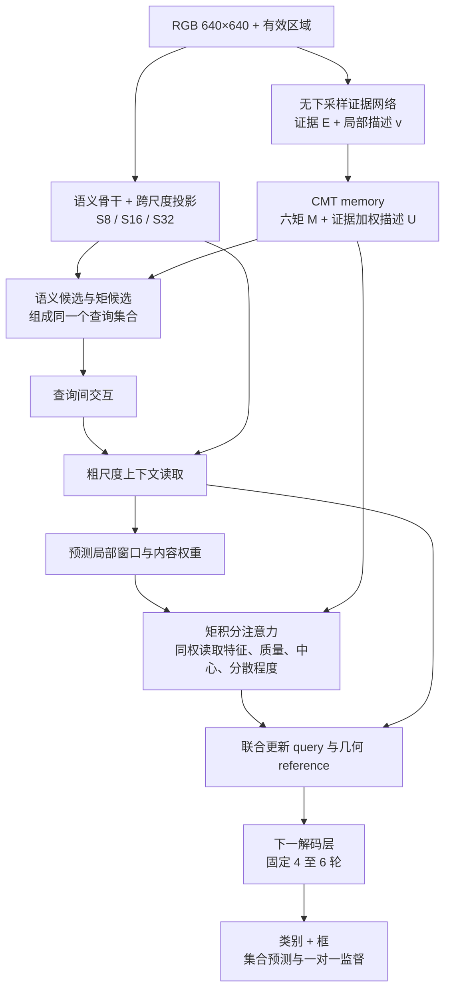
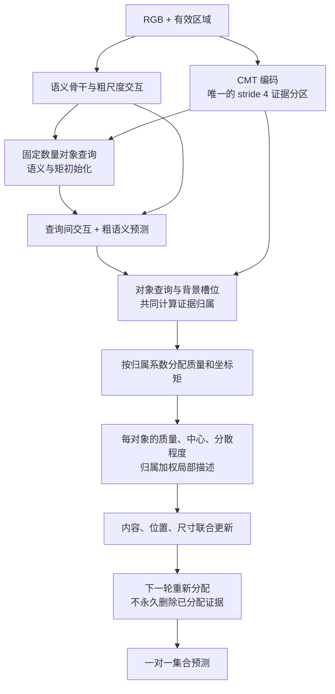
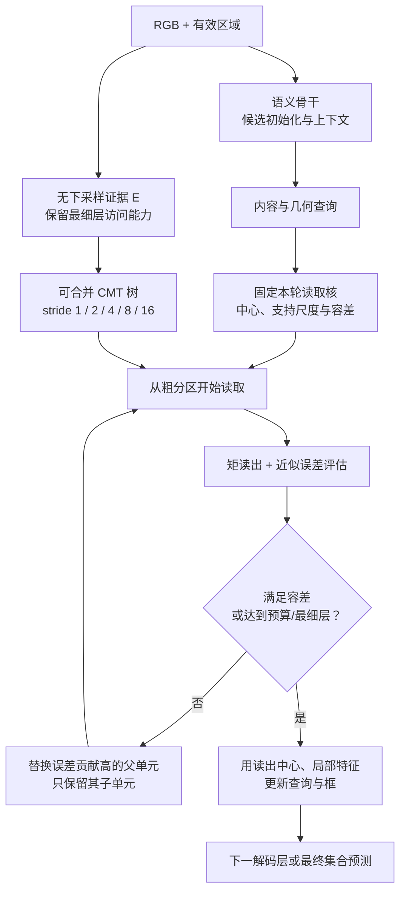

# DETR 与 CMT 融合的三种 CMTDet 结构候选与优先级

> 后续实现状态：候选一已在miattn分支实现，见[结构与实现](../实现与实验参考/miattn分支CMTDet-I结构与实现.md)。下文保留方案提出时的设计和验证计划，不作为完整训练已经完成的声明。

> 研究设计稿，2026-09-15。本文重新设计检测器，不以当前 main 或 tiny-optimize 的代码结构为约束。输入仍以 RGB 单帧、640×640 为主；目标是检测能力和小目标相位稳健性，不以 RK3588、实时部署或算子优化为研究目标。
>
> CMT 的全称沿用 **Conservative Moment Transport（守恒矩输运）**，定义来自[核心研究方案](CMT与CMTDet完整研究方案.md)。本文提出的是待实现、待检验的候选结构，优先级是研究判断，不是实测性能排名。没有预填 AP/PFR 或承诺达到 SOTA。

## 1. 推荐结论

推荐首先实现 **CMTDet-I：矩积分注意力检测器**。它把 CMT 从辅助定位分支提升为解码器的主要局部读取机制：同一份证据既决定查询读到的局部特征，也给出该查询的几何状态。

另外两个候选分别改变“多个查询如何分配证据”和“每个查询应该以多细的分辨率读取证据”。三者都保留 DETR 的集合预测、查询间交互和一对一监督，但组织网络的核心不同。

| 优先级 | 候选名称 | 检测器的核心变化 | CMT 的不可替代部分 | 最适合检验的问题 | 主要风险 |
|---|---|---|---|---|---|
| 1 | **CMTDet-I：Moment-Integral Attention，矩积分注意力** | 用可解释的区域积分更新局部特征与几何查询；粗语义负责识别和上下文 | 跨压缩保持格内坐标，并在同一权重下联合读取特征、质量和中心 | 坐标信息进入实际 attention 和查询更新后，能否降低小目标的定位与检测翻转 | 证据偏置、窗口漏覆盖、细粒度语义表达不足 |
| 2 | **CMTDet-O：Evidence Ownership，证据归属竞争** | 用所有查询共同竞争一份 CMT 证据，替代彼此独立的局部读出 | 在查询归属分配中仍保持质量与一、二阶矩的可追溯性 | 小目标是否因查询重复占用邻近强证据而被遗漏、被相邻目标吸引 | 归属塌缩、同格多目标不可辨识、训练比候选一复杂 |
| 3 | **CMTDet-R：Readout-Adaptive Refinement，读出自适应细化** | 每个查询根据矩积分的近似误差决定继续读取哪一级细节 | 可合并矩构成分区无关的底座，二阶量提供细化依据 | 与固定读取粒度相比，按实际定位需求细化能否提高精度和稳健性 | 误差界过松、动态分区自身不稳定、工程复杂 |

候选一优先，是因为它最直接连接“压缩前保留什么信息”和“最终检测怎样使用这些信息”，且在稀疏反无人机场景也有明确意义。候选二在拥挤小目标场景的潜力更大，但需要额外证明 DUT/DetFly 中确实存在证据竞争问题。候选三数学辨识度高，但必须先证明读出误差是实际瓶颈。

**不建议第一次实现就把三者叠加。** 三种候选共享 CMT 基础设施，但对应不同研究假设；先选一条完成可解释的证据链，再判断另外两条是否值得扩展。

## 2. 文献检索范围与设计判断

### 2.1 检索范围

检索覆盖 DETR 的集合预测、查询初始化、局部与区域注意力、多尺度特征、密集监督、定位分布，以及小目标专用设计。来源采用论文原文、CVF/ECVA/OpenReview 和作者 arXiv 页面。2026 年的新条目中，未核验会议录用的信息统一按预印本处理。

代表性检索词包括 `DETR tiny object query`、`moment spatial detection transformer`、`DETR integral attention`、`DETR slot competition`、`quadtree attention`、`Gaussian-Hermite sampling`。`moment retrieval` 大量指视频片段检索，不能作为空间矩检测的同类方法。

这是面向结构决策的广泛检索，不是穷尽性新颖性证明。下面的区别是根据已查阅方法作出的研究判断；“尚未发现同构方案”不等于“保证此前无人提出”。

### 2.2 DETR 的思想值得保留，具体流水线可以重构

| 方法与来源 | 已有设计思想 | 对 CMTDet 的启发与取舍 |
|---|---|---|
| [DETR，2020](https://arxiv.org/abs/2005.12872) | 将检测作为集合预测，用二分匹配约束唯一输出 | 保留对象集合和全局竞争；不必照搬单尺度、固定位置编码和完整 encoder-decoder 堆叠 |
| [Deformable DETR](https://arxiv.org/abs/2010.04159) | 在参考点附近从多尺度特征稀疏取样 | 稀疏访问值得保留；CMT 应回答点采样之外的格内位置统计怎样进入预测 |
| [DAB-DETR](https://arxiv.org/abs/2201.12329) | 将显式框坐标作为查询位置先验，逐层更新 | 显式几何查询已有先例；CMT 的区别必须是坐标来源和更新算子，而不是仅给 query 增加四维框 |
| [DINO](https://arxiv.org/abs/2203.03605) | 去噪、混合查询选择和迭代框学习改善训练 | 将成熟训练方法作为公平基线；不能把采用 DN 或 Top-K 算作本论文创新 |
| [SMCA](https://openaccess.thecvf.com/content/ICCV2021/papers/Gao_Fast_Convergence_of_DETR_With_Spatially_Modulated_Co-Attention_ICCV_2021_paper.pdf) | 用空间调制约束 attention 的区域 | 用矩产生窗口几何有价值；单纯加一个 Gaussian attention mask 已不足以形成新贡献 |
| [BoxeR](https://arxiv.org/abs/2111.13087) | 围绕参考区域构造 box-attention，读取区域内网格特征 | “从点改成框内读取”本身不是创新；需要比较是否真正保存并读取压缩前的空间矩 |
| [AdaMixer](https://arxiv.org/abs/2203.16507) | 通过自适应空间/尺度采样和混合构造查询式检测器，简化额外编码网络 | 说明 DETR 思想允许重做解码器；CMTDet 的结构身份可以来自读出与状态更新，而非骨干更换 |
| [DDQ](https://openaccess.thecvf.com/content/CVPR2023/html/Zhang_Dense_Distinct_Query_for_End-to-End_Object_Detection_CVPR_2023_paper.html) | 兼顾候选密度与查询区别性 | 候选召回和重复查询都要测；CMT 质心候选也会重复，不能默认矩能解决去重 |
| [Co-DETR](https://arxiv.org/abs/2211.12860) | 用训练辅助头和不同标签分配强化监督 | 强监督可以作为精度版本的公共配方；主创新不靠额外训练头堆叠 |

### 2.3 近期高性能 DETR 给出的设计取舍

| 方法与来源 | 已有内容 | 本文的使用方式 |
|---|---|---|
| [RT-DETR，CVPR 2024](https://openaccess.thecvf.com/content/CVPR2024/papers/Zhao_DETRs_Beat_YOLOs_on_Real-time_Object_Detection_CVPR_2024_paper.pdf) | 分离尺度内语义交互与跨尺度融合，改进查询质量 | 粗尺度全局语义与细尺度定位可承担不同职责；但 CMTDet 不把少算 P2 作为论文目的 |
| [LW-DETR](https://arxiv.org/abs/2406.03459) | ViT、投影器与较浅的检测解码器；窗口/全局交互 | 深 encoder 加深 decoder 不是必选项；层数应服务信息需求 |
| [D-FINE，ICLR 2025](https://arxiv.org/abs/2410.13842) | 逐层细化框分布，并通过定位自蒸馏改善学习 | 可选用分布式尺寸回归，但应把“预测框分布”与“观测到的证据空间矩”严格分开 |
| [DEIM，CVPR 2025](https://openaccess.thecvf.com/content/CVPR2025/papers/Huang_DEIM_DETR_with_Improved_Matching_for_Fast_Convergence_CVPR_2025_paper.pdf) | Dense O2O 与匹配感知损失提高监督效率 | 训练配方可能解释大量收益，必须与基线共享；无人机被缩得过小时，不能机械照搬 Mosaic |
| [DEIMv2，2025 预印本](https://arxiv.org/abs/2509.20787) | 使用 DINOv3 特征及空间适配器连接强语义和多尺度细节 | 可将强预训练语义作为上限实验；单纯“强 backbone + 高分辨率支路”已有充分先例 |
| [RT-DETRv4，2025 预印本](https://arxiv.org/abs/2510.25257) | 通过语义注入与自适应蒸馏利用视觉基础模型 | 教师数据和蒸馏成本必须单列；CMT 收益需在相同预训练条件下成立 |
| [RF-DETR，ICLR 2026 论文版本](https://arxiv.org/html/2511.09554v2) | 以强预训练和共享权重结构搜索适配不同数据分布 | 没有脱离数据分布的最优查询数/层数；先固定公平结构，再用 val 选容量 |

### 2.4 小目标专用方法和必须区分的近邻

| 方法与来源 | 已有内容 | CMTDet 必须增加的实质内容 |
|---|---|---|
| [QueryDet，CVPR 2022](https://openaccess.thecvf.com/content/CVPR2022/html/Yang_QueryDet_Cascaded_Sparse_Query_for_Accelerating_High-Resolution_Small_Object_Detection_CVPR_2022_paper.html) | 在粗位置引导下稀疏使用高分辨率细节；它不是经典 DETR 解码器方法 | 局部高分辨率访问只是载体，需说明位置统计如何保持和使用 |
| [NWD / AI-TOD-v2](https://arxiv.org/abs/2206.13996) | 讨论小框对 IoU 位移误差的敏感性并改进分配 | 同样的绝对框偏移会放大小目标 PFR；必须报告输入像素中心误差，不能把阈值效应全部归因于采样 |
| [DQ-DETR，ECCV 2024](https://www.ecva.net/papers/eccv_2024/papers_ECCV/html/9775_ECCV_2024_paper.php) | 计数、密度引导特征增强、动态查询选择 | 只按 CMT 质量决定查询数会接近已有思路；质量也不天然等于实例数 |
| [Salience DETR，CVPR 2024](https://arxiv.org/abs/2403.16131) | 处理查询选择的尺度偏差和冗余，分层筛选显著 token | 小目标证据不能因分类分低过早被删；使用一阶/二阶坐标状态才是 CMT 的额外依据 |
| [Dome-DETR，2025 预印本](https://arxiv.org/html/2505.05741v1) | 密度响应、窗口稀疏 attention、渐进查询初始化 | “密度图 + 窗口 attention + 动态 query”不再足够新；CMT 的局部坐标代数和读出机制必须可单独验证 |
| [D³R-DETR，2026 预印本](https://arxiv.org/html/2601.02747v1) | 用空间/频率信息改善密度和细粒度表征 | 加频域支路不自动补上守恒坐标状态；该方向与 CMT 主线关联较弱，不纳入首版 |
| [TinyFormer，2026 预印本](https://arxiv.org/html/2605.25046v1) | 高分辨率捷径与空间语义适配，连接 YOLO 式多尺度融合和集合预测 | “保细节 + 强语义 + NMS-free”已有近邻；不能仅以这三个词定义 CMTDet |
| [Slot Attention](https://arxiv.org/abs/2006.15055) | 多个对象槽位竞争输入特征 | 候选二必须传递可加的几何证据并验证归属结果；softmax 的维度改变本身不新 |
| [QuadTree Attention，ICLR 2022](https://arxiv.org/abs/2201.02767) | 从粗到细选择重要区域进行 attention | 候选三的细化依据必须是定位读出误差，而不是重新包装 attention Top-K |
| [Gaussian-Hermite Sampling，2026 预印本](https://arxiv.org/abs/2603.17098) | 以矩与采样处理平移行为，实验主要围绕分类一致性 | 必须比较空间矩用途和边界假设；CMT 保留检测所需的绝对坐标，不宣称所有平移下整网不变 |
| [DSNT](https://arxiv.org/abs/1801.07372) / [Integral Human Pose Regression，ECCV 2018](https://openaccess.thecvf.com/content_ECCV_2018/html/Xiao_Sun_Integral_Human_Pose_ECCV_2018_paper.html) | 从热图通过可微坐标期望得到连续坐标 | “质心/soft-argmax能回传梯度”已有先例；必须验证压缩前坐标统计和查询闭环带来的额外价值 |

上述论文的公开 AP 来自不同输入、骨干、预训练和训练预算，不宜在这里拼成一张 SOTA 排名表。本文提取其设计依据，候选结构与优先级由这些依据和 CMT 的数学限制共同决定。

## 3. 三种候选共享的数学基础

### 3.1 CMT 负责保存什么

像素中心坐标记为 \(x=(j+1/2,i+1/2)\)。在固定输入画布上先用无下采样的证据网络生成

$$E(x)=V(x)\operatorname{ReLU}(h_\theta(X)(x)),\qquad E(x)\ge0.$$

\(V\) 是有效区域掩码。证据在第一次数值下采样前形成；从深层特征上采样出的热图不具有“保存原始格内位置”的同样含义。

对单元 \(\Omega_k\)、原点 \(o_k\)，保存六通道状态：

$$m_k=\sum_{x\in\Omega_k}E(x),\quad p_k=\sum_{x\in\Omega_k}(x-o_k)E(x),\quad Q_k=\sum_{x\in\Omega_k}(x-o_k)(x-o_k)^TE(x).$$

即 \([m,p_x,p_y,Q_{xx},Q_{xy},Q_{yy}]\)。这些是证据统计，不是框参数、不是真实目标面积，也不是检测误差的概率分布。

### 3.2 合并、选择和学习需要分开

合并到父原点 \(O\)，令 \(d_k=o_k-O\)：

$$m_P=\sum_km_k,\quad p_P=\sum_k(p_k+d_km_k),$$
$$Q_P=\sum_k(Q_k+p_kd_k^T+d_kp_k^T+m_kd_kd_k^T).$$

这些恒等式保持同一片证据的质量和低阶坐标统计。对派生描述子可以做 MLP/归一化；原始矩不能经任意 BN、激活或通道混合后继续按上述公式解释。

查询对不同单元赋予非负权 \(a_{qk}\) 时，是构造一个新的加权测度。针对参考中心 \(r_q\)：

$$D_q=\sum_k a_{qk}m_k,\quad N_q=\sum_k a_{qk}[p_k+(o_k-r_q)m_k],$$
$$T_q=\sum_k a_{qk}\{Q_k+p_kd_k^T+d_kp_k^T+m_kd_kd_k^T\},\quad d_k=o_k-r_q.$$

有效质量下，中心与协方差为

$$\mu_q=r_q+N_q/D_q,\qquad \Sigma_q=T_q/D_q-(N_q/D_q)(N_q/D_q)^T.$$

其中二阶量描述证据的分散程度。不能直接令 \(w,h=\sqrt{\operatorname{diag}\Sigma}\)，因为中心监督生成的证据形状并非目标轮廓。

### 3.3 “精确”到哪里结束

1. 固定非负证据的编码和换原点合并是代数恒等式。
2. 单元内常量权下的加权矩读出也精确。
3. 单元内变化的 attention 核只能近似；六矩不能恢复任意核与任意语义特征的乘积。
4. 学习证据、候选位置、筛选集合、attention 权重和最终分类都可能随相位改变。

因此目标是**降低完整检测器的相位敏感性**，不是证明整个网络严格平移等变。已有[数学核验](CMT数学核验说明.md)还说明：2×2 六矩可恢复四个证据值，4×4 六矩才是真正有损的统计压缩。主机制实验以 stride 4 为起点，stride 2/1 是上限对照。

### 3.4 共同的语义与坐标接口

三种候选均使用两类 memory：

| 对象 | 形状/含义 | 允许的处理 |
|---|---|---|
| 语义 \(S_8,S_{16},S_{32}\) | 640 输入时为 80²、40²、20² token，每 token 256 维 | 常规卷积、Transformer、融合与采样 |
| 坐标状态 \(M_4,M_8,M_{16},M_{32}\) | 每单元 6 维 FP32 原始矩 | 固定编码、换原点合并、明确的非负加权 |
| 派生描述 \(d_k\) | log mass、归一化均值/协方差、有效比例 | 可学习投影，仅作控制和特征 |
| 查询 \(z_q\) | 内容 \(q_q\)、中心 \(r_q\)、尺寸 \(b_q\)、读出诊断 | 内容由 attention 更新；几何在输入像素坐标内更新 |

采用独立高分辨率位置状态，不代表取消所有高分辨率语义。首版可使用 64 通道的浅层 \(S_4\) 作为局部 key；它不参加全图 256 通道的密集 Transformer 编码。后续必须与完整 P2 语义强基线比较，确认收益不是资源不对称造成的。

### 3.5 不要求高速，为什么还使用矩压缩

不设置实时部署目标，允许增加模型容量和局部读取精度；但多查询、多层全分辨率读取仍有训练资源成本。矩状态提供一种显式保留格内位置、并可在不同粒度间聚合的几何接口，其价值应是以可管理的训练成本使用这些证据。

从信息量看，同一证据的完整像素表示包含六矩所包含的全部信息。**不能声称六矩压缩比完整证据具有更多信息，也不能先验声称压缩必然提高精度。** 精度优先的实验必须包含逐像素坐标期望/积分强对照，并同时报告成本。

如果最终只有stride 1版本有效，应把贡献定位为查询组织和积分读出，而不能继续把“低阶矩压缩保留关键位置”当作已验证的主要收益；如果保留压缩在相近精度下明显减轻训练成本，则如实呈现该取舍。使用矩是待证明的设计选择，不是为维持CMT名称而固定的结论。

## 4. 候选一：CMTDet-I，矩积分注意力检测器（优先级 1）

### 4.1 完整 story

小目标只有少量可靠位置证据，离散点采样可能对网格相位敏感。更强的语义网络能改善识别，但未必让解码器读取到的特征与其回归的几何位置具有一致来源。

受可加测度积分启发，我们先保存非负定位证据的空间矩，再让查询对一片证据进行区域加权。用同一组权重同时生成局部特征和位置观测，使“看到什么”和“看到的东西在哪里”来自同一份支持域。CMTDet-I 据此构造联合内容—几何解码器，以 CMT 积分替代局部路径中的点采样，保留粗尺度语义交互用于上下文与类别判断。

待验证的核心主张：**同源的内容与几何读出，可以减少微小位移下的读出错位和后续框抖动，而不仅是增加一个热图辅助损失。**

### 4.2 整体结构



解码器的每轮流程是“查询交互 → 粗语义预测 → 局部积分观测 → 几何更新”。它并非先完成整个 DETR 框预测再外挂一次修正；后续层的读取位置和分类内容都受上一轮 CMT 观测影响。

### 4.3 让局部特征也具有可加来源

仅用六个几何矩无法恢复语义向量。因此额外从证据网络的全分辨率浅层输出生成 \(v(x)\in\mathbb R^{16}\)，并保存

$$U_k=\sum_{x\in\Omega_k}E(x)v(x).$$

\(U_k\) 为 16 通道的证据加权描述总量，合并时直接求和；与原始六矩分别存储。\(v\) 可以有符号，非负约束只要求 \(E\) 与查询权重。该扩展是新的设计部分，不能声称旧六矩接口已经包含这些信息。

640 输入时：\(E\) 为 1×640×640，\(v\) 为 16×640×640，\(M_4\) 为 6×160×160，\(U_4\) 为 16×160×160。\(v\) 是局部外观描述，类别和场景上下文仍来自语义网络。对照必须包含“保留 U、去掉一二阶矩”，隔离额外外观容量的贡献。

### 4.4 矩积分注意力的计算

对一个 attention head，查询给出参考 \(r\)、半支持宽度 \(a\) 和内容向量 \(q\)。默认几何核为

$$w_q(x)=\prod_{d\in\{x,y\}}\left(1-[(x_d-r_d)/a_d]^2\right)_+^2.$$

从同一单元的浅层/粗语义与矩派生描述生成 key \(k_j\)，构造非负权：

$$a_{qj}=w_q(o_j)\exp\big(\operatorname{clip}(q^Tk_j/\sqrt d,-c,c)\big).$$

在实现中用稳定的对数归一化，质量为零时启用显式 fallback。使用一组权重计算

$$D_q=\sum_j a_{qj}m_j,\quad V_q=\frac{\sum_j a_{qj}U_j}{D_q},\quad \mu_q=r_q+\frac{\sum_j a_{qj}(p_j+d_jm_j)}{D_q}.$$

二阶读出使用第 3 节的 \(T_q\)；输出为

$$\operatorname{MIA}(q,r,b)=\{V_q,D_q,\mu_q,\Sigma_q,\text{valid},\text{support}\}.$$

与普通 token softmax 相比，归一化基准是被选择的**证据质量**。有效单元可写成 \(\alpha_{qj}=a_{qj}m_j/D_q\)，但归一化后的平均特征不应写回原始矩库。

稳定化时可以减去公共最大 logit 来计算均值，但用于门控的质量诊断应保存恢复尺度后的 \(\log D_q\)，不能把任意平移后的 softmax 分母当作原始质量。不同查询的核和内容权重不同，\(D_q\) 也不是校准后的目标存在概率。

多个 head 分别建模不同方向/支持范围。特征 head 可拼接投影；几何 head 若需融合，应先以非负系数混合 \(D,N,T\)，然后求中心，不能简单平均质心。

首版局部积分全部读取 \(M_4,U_4\)，同时提供 3 个支持范围，避免重复累加不同尺度上同一份质量。多尺度矩作为不同读出专家时，用凸组合并明确其等价核。

具体起点是4个积分 head，每个 head 的 key 为32维；同一 head 内对3个核做非负凸组合，半支持宽度为 \(\operatorname{clip}(\kappa_m(w,h)/2,4,96)\)，\(\kappa_m\in\{0.75,1.5,3.0\}\)。因此多支持是核的混合，不是在同一次质量总量中无说明地重复计入父子网格。每个 head 的局部描述由16维投影到64维，拼接后回到256维；几何融合系数另行归一化。

### 4.5 几何查询不是四个无解释的隐藏数

每个查询维护 \(z_q^t=(q_q^t,r_q^t,\ell_q^t,\eta_q^t)\)：内容、像素中心、对数宽高、上轮读出质量诊断。每轮先由粗语义产生预测 \(\bar r,\bar\ell,\bar q\)，随后积分。

$$q^{t+1}=\operatorname{FFN}\big(\operatorname{LN}(\bar q+W_vV+W_d\operatorname{desc}(D,\mu,\Sigma))\big),$$
$$r^{t+1}=\bar r+g\odot\operatorname{clip}(\mu-\bar r,-a,a)+\rho\,\operatorname{diag}(\bar w,\bar h)\tanh h_r(q^{t+1}),$$
$$\ell^{t+1}=\bar\ell+h_{wh}(q^{t+1},V,\operatorname{desc}(D,\Sigma)).$$

\(g\in[0,1]^2\) 由内容、质量、多支持中心分歧、有效区域比例预测；无有效质量时置零。\(\rho\) 是可配置的残差幅度，例如从 0.1 起步。残差不能大到让 CMT 路径在所有样本中都可被无代价绕过，但也不能禁止语义修正带偏的证据。

最终类别头直接读取 \(q^{t+1}\)，所以 CMT 不仅影响中心，也参与分类所使用的局部信息。尺寸由学习头回归；分布式尺寸头可另做精度实验，注明与 D-FINE 等已有设计的关系。

### 4.6 候选入口与低质量回退

第一版保持固定总查询数 300：150 个语义候选、150 个矩候选。两类候选进入同一解码器、一对一匹配和最终输出集合，不是两个检测结果做 ensemble。

- 语义候选：对语义 memory 做分类/框预测并选 Top-K，属于已有 DETR 技术。
- 矩候选：在 stride 4 memory 上用重叠局部窗口读取质量/中心；由局部语义与矩描述联合评分，选 Top-K。初始位置用窗口矩中心，尺寸由语义头产生，不直接由协方差决定。
- 去重主要交给查询交互和集合损失；需记录候选重复率。局部极大值过滤若使用，必须作为显式消融，避免它先删除邻近小目标。
- 无有效矩时以对应窗口中心和可学习 query 作回退，不能产生 NaN；训练早期使用证据辅助监督帮助启动。

150/150 只是起点，应比较 300/0、225/75、150/150、0/300。在稀疏数据上固定查询通常已足够，不额外引入密度计数器。查询 Top-K 仍可能随相位切换，必须测 **decoder 前的 proposal coverage 和中心变化**，不能因后面有矩积分就忽略入口不稳定。

### 4.7 首版规格与可调整范围

| 模块 | 首版建议 | 扩展/消融 |
|---|---|---|
| 语义骨干 | ResNet-50，便于与成熟 DETR 对齐 | 精度上限用强分层骨干或 DINOv3；配套基线共享预训练 |
| 语义 memory | S8/S16/S32，d=256；1 至 2 个跨尺度交互块 | 完整 P2 语义强对照；d=384 仅在同容量实验中比较 |
| 证据网络 | 全分辨率 width=16，4 个 stride-1 残差块，空洞率 1/2/4/8 | width=32；必须与等容量普通卷积分支对照 |
| 原始状态 | 六矩，stride 4；U 的通道为16 | 三矩；stride 2/1；U-only |
| 解码器 | 4 层，每层 8 个查询 self-attention heads、粗尺度 context 和 4 个积分 heads | 6 层；仅末层积分；每层积分 |
| 积分支持 | 0.75/1.5/3.0 倍预测框；半宽夹在4和96输入像素之间 | 大目标由粗语义路径处理，96是局部路径起点而非实例尺寸限制 |
| 查询 | 总数300，语义/矩各150 | 稀疏数据100/300；密集数据用训练集计数确定更高上限 |
| 输出 | 类别分数与输入画布坐标框，再映回原图 | 保留普通 DETR 的统一最终输出格式 |

采用基础模型不代表将精度上限限定在 ResNet-50。先验证机制，再加大骨干；否则难以判断收益来自 CMT 还是预训练。

### 4.8 相比近邻究竟新在哪里

候选一不是把“Gaussian 窗口”“质心回归”或“两个分支”本身当新方法。需要证明的组合差异为：

1. 压缩前的几何矩与证据加权局部描述形成可加 memory；
2. 同一 attention 权重产生特征和显式几何观测；
3. 观测同时控制内容更新、框更新和下一层读取位置。

相对 [BoxeR](https://arxiv.org/abs/2111.13087) 与 [AdaMixer](https://arxiv.org/abs/2203.16507)，重点是读取的信息状态不同，而不只是区域或采样布局不同；相对 [D-FINE](https://arxiv.org/abs/2410.13842)，CMT 提供的是输入证据统计而非预测坐标分布。若一个普通 ROI/热图读出在相同资源下具有同样收益，必须缩小本候选的创新主张。

相对 [DSNT](https://arxiv.org/abs/1801.07372) 与 [Integral Regression](https://openaccess.thecvf.com/content_ECCV_2018/html/Xiao_Sun_Integral_Human_Pose_ECCV_2018_paper.html)，中心期望本身不是创新。这里待验证的差别是：先保存压缩前格内坐标，再按对象查询读取，并将同源局部内容和几何观测放入多轮集合预测。必须同时比较“粗热图soft-argmax”与“完整像素热图soft-argmax”，避免只选择量化误差较大的弱对照。

### 4.9 风险、代价与否定条件

- 非负证据也可能集中在背景，积分会保存背景偏差；需测试近邻污染和窗口误定位。
- 只保留16维局部外观可能不足以判别复杂背景；增加维度必须配对同容量对照。
- 第一版没有全 P2 Transformer，但每查询大窗口积分仍可能很贵。额外开销约为 \(O(BHW C_E)+O(BLN_qH_aK(d_v+d_k))\)，其中 \(C_E\) 为证据网络每像素运算量，\(H_a\) 为积分head数，K为每head实际访问单元数；未包含语义骨干与query交互。普通卷积下 \(C_E\) 随宽度近似平方增长，不能把高分辨率支路称为“免费”。
- 矩输出经过相同固定权精确，并不意味着学习 key 和权重本身等变。
- 若训练后 gate 普遍接近0，或去掉格内一阶信息完全不影响 AP/PFR，则“CMT 主导检测”的说法没有证据。

### 4.10 最有辨识度的验证

固定证据网络、语义骨干、查询数和训练配方，比较：普通局部点采样 → 相同窗口 ROI 读取 → 只有质量加权 → 完整矩积分 → 完整矩积分但把格内一阶信息抹去。分别测 AP、候选召回、每层中心误差、同一 GT 的相位中心波动与 PFR。

额外比较“内容/几何用不同权重”与“同权读取”。如果同权方案没有优势，应把创新收敛为矩几何更新，不应继续主张内容—几何一致性已经被验证。

## 5. 候选二：CMTDet-O，证据归属检测器（优先级 2）

### 5.1 完整 story

小目标的可用证据少。在查询式检测器中，多个查询可以独立读取同一片强响应，而弱目标的证据没有被任何查询持续使用。微小平移又可能改变这些查询之间的相对优势，导致重复预测、实例遗漏或定位被邻近目标吸引。

这是一条需要额外验证的机制假设，不能由 PFR 本身推出。受测度分解和对象槽位竞争的启发，CMTDet-O 将图像证据视为可分配的公共资源：每个空间单元的证据在所有对象查询和背景槽位之间进行软归属，再把分配后的质量与坐标矩用于更新对象状态。

核心主张是：**在一个共同归属约束下组织几何证据，能够缓解独立查询的重复占用，并使弱目标获得更连续的实例解释。** 它改变的是 DETR 查询之间的证据关系，而不仅是单个 query 的 attention 形式。

该路线更适合含邻近目标、复杂背景或明显重复查询的数据。如果 DUT/DetFly 的主要失败是单个目标根本没有证据响应，归属竞争可能无效，甚至加剧背景压制；这也是其优先级低于候选一的原因。

### 5.2 整体结构与数据流



与候选一共享证据编码和粗语义接口。区别在于：候选一允许各查询独立定义自己的加权测度；候选二先对一份共同测度进行对象级分解，再计算每个对象的观测。

### 5.3 输入与状态定义

| 输入/状态 | 形状 | 含义 |
|---|---|---|
| 原始矩 \(M_4\) | \(B\times25600\times6\) | 640 输入下唯一、互不重叠的 stride 4 单元；不重复放入同一区域的父单元 |
| 局部描述总量 \(U_4\) | \(B\times25600\times16\) | 与候选一相同的证据加权外观；不是几何矩的一部分 |
| 归属 key \(K_4\) | \(B\times25600\times32\) | 局部语义、上下文和矩描述的投影 |
| 对象状态 | \(B\times N_q\times(d+4)\) | 内容、中心和宽高；首版 \(N_q=300,d=256\) |
| 背景槽位 | 一个可学习槽位及逐单元背景 logit | 接收未解释的证据；不是最终检测类别之一 |
| 归属系数 \(\beta\) | \(B\times(N_q+1)\times25600\) | 每个单元在对象与背景之间的分配比例 |

可为分类保留多头 context attention，但几何归属首版只维护一个共同的 \(\beta\)。如果每个 head 都复制一份质量，不能把所有 head 的结果相加后仍声称总质量守恒。

### 5.4 归属分配：归一化方向为何重要

查询 \(q\) 和单元 \(j\) 的兼容性定义为

$$\ell_{qj}=\frac{\phi(q_q)^Tk_j}{\sqrt{d_k}}-\lambda_d\sum_{v\in\{x,y\}}\left(\frac{o_{jv}-r_{qv}}{a_{qv}}\right)^2.$$

其中 \(a_q\) 是由当前框和内容决定的正值支持尺度，设置下限防止极小框造成数值尖峰；距离项可做有界截断。背景 logit \(\ell_{0j}\) 从逐单元语义和背景槽位生成。随后对**同一空间单元上的所有查询**归一化：

$$\beta_{qj}=\frac{\exp\ell_{qj}}{\sum_{u=0}^{N_q}\exp\ell_{uj}},\qquad \sum_{q=0}^{N_q}\beta_{qj}=1.$$

普通 cross-attention 通常对一个查询访问的空间 token 归一化；这里先规定每份证据被谁解释。为生成每个 query 的平均特征，再用其获得的总质量归一化。

归属竞争本身已有 [Slot Attention](https://arxiv.org/abs/2006.15055) 等先例；[Mask DINO](https://arxiv.org/abs/2206.02777) 也把查询与高分辨率像素表示关联。新设计需要落在**压缩前坐标状态的归属分解、对象几何更新及相位行为**，不能把改变 softmax 维度作为主要贡献。

不要求每个查询获得相同质量，也不设 Sinkhorn 的等质量边际。图像中对象数量、证据强度和遮挡情况不同，强行等分会产生虚假对象。这里的 CMT“输运”指矩的换原点和聚合，不应因此将整个方法包装成已经求解了某个最优输运问题。

### 5.5 归属下的矩守恒

选共同全局原点 \(O\)，将每个单元的局部状态换到同一坐标系：

$$p_j^O=p_j+(o_j-O)m_j,$$
$$Q_j^O=Q_j+p_jd_j^T+d_jp_j^T+m_jd_jd_j^T,\qquad d_j=o_j-O.$$

对每个对象和背景槽位，定义

$$m_q=\sum_j\beta_{qj}m_j,\quad p_q^O=\sum_j\beta_{qj}p_j^O,\quad Q_q^O=\sum_j\beta_{qj}Q_j^O.$$

因为逐单元的归属系数和为1，得到

$$\sum_{q=0}^{N_q}m_q=\sum_jm_j,\qquad \sum_{q=0}^{N_q}p_q^O=\sum_jp_j^O,\qquad \sum_{q=0}^{N_q}Q_q^O=\sum_jQ_j^O.$$

这些恒等式的意义是：所有被编码的证据都有去向，其质量和低阶坐标统计可追溯；**它们不保证归属对象正确，也不保证不同查询获得独立的真实实例。** 背景槽位必须计入恒等式，最终输出可以不显示它。

数值实现宜以查询附近坐标聚合，再在核验时换到共同原点，避免大绝对坐标导致协方差相减的精度损失。数学上的全局表达不意味着实现必须直接保存大数二阶矩。

对象观测为

$$\mu_q=O+p_q^O/m_q,\quad \Sigma_q=Q_q^O/m_q-(p_q^O/m_q)(p_q^O/m_q)^T,$$
$$V_q=\frac{\sum_j\beta_{qj}U_j}{m_q}.$$

其输出接口仍是特征、质量、中心和分散程度，但这些量都受其他查询的归属状态影响。

### 5.6 对象状态迭代与几何读出的作用

每层执行：

1. 查询交互与粗尺度 context 形成语义预测 \(\bar q,\bar r,\bar b\)。
2. 根据预测状态和共享 key 计算 \(\beta\)，所有对象同时更新。
3. 从分配后的矩计算 \(V,\mu,\Sigma,m\)。
4. 用 \(V\) 更新内容，用带门控的 \(\mu-\bar r\) 修正中心，用学习头更新尺寸。
5. 输出该层类别与框，下一层重新计算归属。

内容与几何更新可采用第 4.5 节的接口，但诊断量增加“归属熵、背景比例、前后层归属变化”。质量不足时仍保留语义回退，不能直接将该查询判为无目标。

原始 memory 保持不变。第一轮的错误归属不应永久删除某个区域的证据，否则早期错误会变成之后无法纠正的遗漏。归属图是随对象解释更新的中间变量，而不是一次性擦除掩码。

### 5.7 如何只用框标注训练

基础监督仍使用 Hungarian 匹配后的类别和框损失。另加两个可独立关闭的监督：证据监督和软归属监督。

设每个 GT 中心产生局部 Gaussian 目标 \(G_g(x)\)，在单元内积分为 \(G_{gj}\)。定义非零背景基准 \(G_{0j}\)，构造

$$y_{gj}=\frac{G_{gj}}{G_{0j}+\sum_hG_{hj}},\qquad y_{0j}=\frac{G_{0j}}{G_{0j}+\sum_hG_{hj}}.$$

依据该层 Hungarian 匹配，把 GT \(g\) 的目标分配给匹配查询 \(\pi(g)\)，其他对象查询的归属目标为0。对前景相关单元与背景单元分层采样，计算软交叉熵：

$$\mathcal L_{own}=-\sum_j\omega_j\left[y_{0j}\log\beta_{0j}+\sum_gy_{gj}\log\beta_{\pi(g),j}\right].$$

它是基于框中心构造的**弱监督归属目标**，不是实例分割真值。Gaussian 重叠处使用软目标，不假装知道两个框中每个像素属于哪个对象。\(\omega_j\) 用于避免大量背景单元淹没小目标；不使用测试集调节它。

去噪查询单独走训练辅助路径，不进入正常对象查询的公共归属分母，否则 GT 派生查询可能抢走正常查询的证据，并造成训练/推理不一致。训练去掉 DN 的版本应作为基础复现，再加入共享 DN 配方。

不要只通过降低归属熵强迫稀疏分配：这可能使背景槽位吞掉所有证据。分类、框监督及前景平衡的归属目标共同负责避免塌缩，守恒恒等式本身不提供语义监督。

### 5.8 首版规格和取舍

| 项目 | 建议 | 理由 |
|---|---|---|
| 语义骨干与 memory | 与候选一相同，先用 ResNet-50 | 隔离查询组织的贡献 |
| 唯一归属分区 | stride 4，25600个单元 | 保持格内信息，保证没有父子重复计数 |
| 查询与背景 | 300个对象 + 1个背景；4轮更新 | 固定集合便于与基线公平比较 |
| 归属 key | 32维，单组几何归属 | 控制全局竞争矩阵成本，避免多头重复质量 |
| 语义交互 | d=256，多头查询交互和粗语义 context | 背景辨别与尺寸仍依赖语义 |
| 辅助损失 | 证据监督；归属权重从0.1起做 val 消融 | 归属不应压倒检测目标；数值只是起点 |
| 细粒度上限 | stride 2/1 对照；可在后续引入自适应分区 | 检查同格多目标的信息瓶颈 |

300×25600 约为768万个对象—单元配对，单张 FP32 矩阵约29.3 MiB，尚未计入背景、key、梯度、临时结果及多层保存。完整训练显存远大于这个数字。首版可以分块计算稳定 softmax 和聚合，但必须保持跨所有查询的归一化。

局部化竞争可减小代价，却会引入窗口漏覆盖和离散候选变化；它应是后续显式变体。即便在局部实现中，也必须给未被对象覆盖的证据保留背景归属，不能丢弃后继续宣称全图质量守恒。

### 5.9 风险与关键反证

- **同格不可分问题：** 一个单元内若包含两个目标，单个 \(\beta_{qj}\) 只能按同样比例拆分其全部低阶统计，不能恢复两个独立目标的具体分布。六矩不是实例解混器。需要更细分区或其他证据通道时，必须承认新增信息来自哪里。
- **强者压制弱者：** 相邻强目标可能获得更大归属，导致弱目标更难恢复。比较不同尺寸比、距离和背景对比度的成对目标，而不是只报告平均 AP。
- **查询身份切换：** 集合预测允许 query 编号改变。评估稳定性须按 GT 身份匹配，不能把 query ID 改变直接当作检测翻转。
- **归属错误守恒：** 错误分配也完全满足守恒。代数检查通过不能作为检测有效性的证据。
- **应用匹配度：** 如果实际数据几乎没有邻近目标且重复查询不是主要错误，优先级应进一步降低。

最关键对照是“独立查询读取”“Slot 式竞争但只有池化特征”“竞争 + 质量”“竞争 + 完整矩”。只有最后两者的差异成立，才能说明 CMT 有独立作用。额外记录重复预测、未被覆盖 GT、对象到背景质量比例，以及按目标间距分组的 AP/PFR。

## 6. 候选三：CMTDet-R，读出自适应细化检测器（优先级 3）

### 6.1 完整 story

同样大小的空间压缩单元，对大目标与极小目标未必同样合适。即使质量和坐标矩被完整保存，查询核在单元内变化时，使用单元中心权重仍有积分近似误差。对极小框，较小的绝对位置读出误差也可能明显影响 IoU。

受自适应数值积分启发，CMTDet-R 不为所有查询预设相同的读取粒度，而让每个查询先读取粗分区，再根据可计算的读出误差指标细化必要单元。CMT 的可合并矩保证细化前后表示同一份底层证据，避免“换层就换一份不可比几何状态”。

核心主张是：**把细节访问与当前几何读取的误差需求连接起来，比统一尺度或显著性 Top-K 更有利于小目标定位。** 由于当前目标不要求板端实时，本方案的价值首先是按需求恢复细节、解释定位误差；节省计算只是可能的附加结果。

### 6.2 整体结构



粗语义网络始终负责候选召回和全局识别。细化不能恢复一个完全没有被查询覆盖的对象，所以首版保留 stride 8 语义候选和 stride 4 矩候选入口，不把目标召回全部押在 stride 16 上。

### 6.3 唯一分区与可细化 memory

构造 \(M_1,M_2,M_4,M_8,M_{16}\)。它们由同一个 \(E\) 编码和合并。对每个查询维护一个叶单元集合 \(\mathcal P_q\)，满足：

1. 叶单元彼此不重叠，覆盖本次核的支持区域所需的空间；
2. 同一块证据只能由一个层级表示，不同时读取父、子单元；
3. 细化时把一个父单元替换为对应子单元，原始未加权矩总量不变；
4. 支持边界相交单元也纳入误差计算，不能仅检查中心权重大于0的单元。

各层可由缓存或按需合并获得。保存最细证据是能够继续细化的前提；仅保留六矩的 stride 4 memory，无法凭空重建其16个像素证据。

输入输出接口：

| 模块 | 输入 | 输出 |
|---|---|---|
| 核生成器 | query 内容、中心和预测宽高 | 固定本轮的非负平滑核 \(w_q(x)\)、支持域、请求容差 |
| 分区控制器 | 矩树、当前分区、误差贡献 | 新分区、访问单元数、停止原因 |
| 积分读出 | 分区及各单元原始矩 | 质量、中心、协方差、误差诊断 |
| 局部语义读取 | 同一支持域、局部描述总量/浅层特征 | 分类与尺寸所需的局部信息 |
| 状态更新器 | 粗语义预测 + 读出结果 | 新 query、新框和下一层读取状态 |

### 6.4 从矩到读出误差：完整约束

以下针对固定的学习证据 \(E\) 和固定核 \(w\)，比较单元近似与逐像素积分。令

$$D^*=\sum_xw(x)E(x),\qquad N^*=\sum_xw(x)(x-r)E(x),\qquad \mu^*=r+N^*/D^*.$$

单元常量核近似为

$$\widehat D=\sum_kw(o_k)m_k,$$
$$\widehat N=\sum_kw(o_k)[p_k+(o_k-r)m_k],\qquad \widehat\mu=r+\widehat N/\widehat D.$$

设单元内核的 Lipschitz 常数上界为 \(L_k\)，记

$$t_k=\operatorname{tr}Q_k=\sum_{x\in\Omega_k}\|x-o_k\|^2E(x).$$

由 Lipschitz 性与 Cauchy–Schwarz 不等式，

$$|D^*-\widehat D|\le\epsilon_D=\sum_kL_k\sqrt{m_kt_k},$$
$$\|N^*-\widehat N\|\le\epsilon_N=\sum_kL_k\left[\|o_k-r\|\sqrt{m_kt_k}+t_k\right].$$

第二式使用 \(x-r=(o_k-r)+(x-o_k)\) 展开，再分别界定一阶距离和二阶距离总量。若 \(\widehat D>\epsilon_D\)，则

$$\|\mu^*-\widehat\mu\|\le b_q=\frac{\epsilon_N+\|\widehat N/\widehat D\|\epsilon_D}{\widehat D-\epsilon_D}.$$

这是**当前核、当前证据下的积分近似误差界**。它不是真实 GT 中心误差界，也不是检测概率的置信区间。若证据本身偏向背景，即使 \(b_q=0\)，中心仍然可能错误。

对第 4.4 节的紧支撑核，设 \(f(z)=(1-z^2)_+^2\)，有 \(\sup_z|f'(z)|=8/(3\sqrt3)\)。一个可用的全局 Lipschitz 上界为

$$L\le\frac{8}{3\sqrt3}\sqrt{a_x^{-2}+a_y^{-2}}.$$

首版使用这个可核验的几何核；不用不连续的内容 Top-K 权重冒充同样可证的平滑核。若引入内容调制，必须同时控制其单元内变化，重新计算 \(L_k\)。

一次细化过程内冻结 (r,a,w)，只调整分区；否则“误差下降”可能只是换了被积分的函数。下一解码层更新 query 后，再重新计算核和误差。

### 6.5 细化规则与停止条件

将每个单元对 \(\epsilon_D,\epsilon_N\) 的贡献分别记为 \(e_{Dk},e_{Nk}\)。用

$$s_k=e_{Nk}+\|\widehat N/\widehat D\|e_{Dk}$$

作为首版细化优先级，将贡献最大的可分单元替换为子单元，然后重算读出与误差。该规则是与误差界相关的贪心启发式，不保证每次分裂都取得全局最优收益；应直接记录实际变化。

请求容差可以相对当前短边设置：

$$\tau_q=\alpha\max\{\min(\bar w_q,\bar h_q),4\},$$

例如 \(\alpha=0.02\) 为起点，并同时设置绝对上下限。预测尺寸早期不可靠，必须先做固定绝对容差的对照；不能把这个比例解释为必然达到某个 IoU。

在以下任一条件满足时停止：

- 有效误差界满足 \(b_q\le\tau_q\)；
- 达到本查询最大访问预算；
- 所有相关单元达到允许的最细粒度。

预算与最细粒度停止时，若容差仍未满足，必须记录 `tolerance_met=false`。\(\widehat D\le\epsilon_D\) 时该中心误差界不可用，应继续细化或采用语义回退，不通过将分母随意 clamp 后宣称界成立。

stride 1 叶单元以像素中心为原点时，离散证据的格内 \(t_k=0\)，对同一离散像素积分不再有该类单元近似误差。这仍不是恢复连续图像信息，也不是消除了学习证据的相位变化。

### 6.6 与相位稳定性的数学联系及边界

假设在忽略边界的整数平移 \(\delta\) 下，证据和本轮核都同步平移，则逐像素理想读出满足 \(\mu^*_\delta-\delta=\mu^*_0\)。如果两个相位的近似界分别有效，则三角不等式给出

$$\| (\widehat\mu_\delta-\delta)-\widehat\mu_0\|\le b_\delta+b_0.$$

因此控制积分近似误差，可以控制**在上述前提下**由分区近似引入的中心波动。真实系统的 \(E\)、核参数、候选选择和边界处理不一定满足该前提，应把它们产生的误差另行测量，而不是用这条不等式解释整网 PFR。

语义特征的近似误差也不在上述标量/坐标界内。若局部特征随空间剧烈变化，用同一分区读取特征不自动具有同样保证。

### 6.7 首版规格与训练

| 项目 | 建议 |
|---|---|
| 语义骨干/查询数 | 与候选一共用 ResNet-50、d=256、300查询 |
| 语义路径 | S8/S16/S32；不按矩误差裁剪全局语义候选 |
| 几何路径 | stride 16开始；细化到4作为基础版本，2/1作为可配置上限 |
| 解码层 | 4层；先只在后2层启用细化，之后比较每层启用 |
| 容差 | 固定0.1/0.25/0.5输入像素与相对短边容差分别消融 |
| 访问预算 | 以支持域初始叶数为下限，试256/1024等上限；超预算须显式标记 |
| 特征读出 | U或浅层S4的局部读出；与几何误差诊断分开命名 |
| 训练监督 | 检测、证据监督；选定分区内正常反向传播 |

分区选择首版 detach，训练和推理执行同一确定性规则，不假装离散 split 可直接求导。可加“与更细分区读出一致”的辅助损失，但细分区教师也是当前证据的读出，并不是真值；它只能减少读取近似差异。

如果预算小于支持域初始叶数，需要提高初始分区尺度、增大预算或明确采用未满足预算的回退，不能静默截断支持域。对空证据单元可以精确跳过，条件是其质量为0且不丢掉必要的有效区域诊断。

### 6.8 为什么排第三

现有[数学核验](CMT数学核验说明.md)已经提示，一些中心误差界比实际误差宽得多。若绝大多数查询都细化到最细层仍无法有效利用粗层，则复杂控制器可能不如固定 stride 4 或直接逐像素读取。

此外，hard split 决策本身可能因相位跨过阈值而变化。这不必然导致最终结果更差，但应测量分区变化率、实际读出误差和 PFR；不能因为使用误差界就先验断言路由稳定。

与 [QuadTree Attention](https://arxiv.org/abs/2201.02767) 和 [QueryDet](https://openaccess.thecvf.com/content/CVPR2022/html/Yang_QueryDet_Cascaded_Sparse_Query_for_Accelerating_High-Resolution_Small_Object_Detection_CVPR_2022_paper.html) 的区别应是“坐标读出近似误差驱动的分区”，而不是粗到细的结构外观。需要在相同访问预算下比较随机、质量、attention 分数、二阶分散量与误差界驱动选择，并与固定粒度的强对照比较。

如果误差指标不能预测实际读取误差，或自适应选择比固定细网格更不稳定，应停止扩展该路线。它适合作为数学试验性方向，不适合未经先导实验就承担整篇论文的主要结果。

## 7. 三种结构怎样体现独立的检测器创新

### 7.1 保留的是 DETR 的哪些思想

共同保留：有限对象集合、可交互的对象查询、端到端类别/框输出、一对一匹配监督，以及通过迭代更新改善预测。

共同重构：不把全图单尺度 encoder → 常规 cross-attention → 独立框 MLP 当作固定模板。三条路线分别重做局部证据读取、对象间证据组织和读取分辨率决策。

| 比较项 | 普通 DETR + 一个末端 CMT 修正头 | 候选一 | 候选二 | 候选三 |
|---|---|---|---|---|
| CMT 何时参与 | 已有框之后 | 每轮局部内容与几何更新 | 所有对象共同解释图像时 | 每轮决定读取哪些细节时 |
| 是否改变后续 query 行为 | 有限或没有 | 改变内容和下轮支持域 | 改变竞争关系与对象状态 | 改变分区、观测与下轮状态 |
| 检测器新增机制 | 较弱 | 同源内容—几何积分 | 共享测度的对象归属分解 | 误差控制下的观测细化 |
| 最关键对照 | 去掉修正头 | 同等外观分支但无坐标矩 | 有竞争但无坐标矩 | 同等细节预算但无误差控制 |
| 最有价值的分析 | 最终框差异 | 层间中心、内容变化与相位波动 | 弱目标遗漏、重复归属与相邻干扰 | 误差界有效性、分区变化与真实近似误差 |

“CMT 不可替代”指候选机制的数学状态依赖 CMT；不代表其他方法不可能实现相同检测性能。论文要通过强替代模块的对照证明它值得使用，而不是在结构图中把 CMT 画得更大。

### 7.2 CMT 模块创新与 CMTDet 系统创新分别怎样证明

模块层面：固定现有检测器主体，用一致接口比较普通池化/坐标读出与 CMT，验证位置统计确有作用。通用性接入应后续单列，不能用其他骨干更强造成的 AP 提升代替它。

系统层面：至少包含下列四组，骨干、预训练、数据、输入和训练预算一致：

| 编号 | 系统 | 要回答的问题 |
|---|---|---|
| B0 | 成熟 DETR 基线 | 公共训练配方的合理水平 |
| B1 | B0 + 普通高分辨率语义/热图分支 | 收益是否只来自额外容量和细节 |
| B2 | B0 + 可插拔 CMT，尽量保留原解码器 | 模块本身的收益 |
| B3 | 选中的 CMTDet 新结构 | 围绕 CMT 重做查询读出/组织是否进一步有效 |

B3 优于 B0 只能证明整体有效；B3 对 B2 的增益和机制诊断，才更直接支撑“检测器结构本身是重要创新”。若 B3 没有胜过 B2，可以保留 CMT 模块成果，但应降低系统结构的贡献表述。

## 8. 共用训练设计：先隔离机制，再追求精度上限

### 8.1 数据和预处理

- 使用 COCO 格式的检测标注；保持数据集原有训练/验证/测试边界，不因候选表现重新划分。
- RGB 单帧、固定640×640模型输入。默认等比例缩放并补边，保存有效区域、变换矩阵和原始框面积。
- 学习图像增强应同步变换框与有效区域；重新按变换后的框构造证据监督，不能把旧证据热图独立 resize 后当作严格坐标监督。
- 机制主实验固定输入尺度、关闭 Mosaic/MixUp 和测试时增强，避免目标尺寸组成及插值变化掩盖原因。精度版本可启用增强，但基线与候选共享，且说明多少 tiny 目标被缩到不可辨认。
- 如果视频帧构成数据集，应核查序列跨 split 的泄漏并按序列做统计不确定性分析。DetFly 若只有被授权使用的 val，报告中保留其验证集身份；不能把调参使用过的 val 改称独立 test。

### 8.2 损失组织

基础目标为

$$\mathcal L=\mathcal L_{set}+\lambda_E\mathcal L_E+\lambda_{aux}\mathcal L_{aux}+\lambda_{route}\mathcal L_{route}.$$

- \(\mathcal L_{set}\)：Hungarian 匹配后的分类、L1 框和 GIoU；匹配成本可从2/5/2起步，回归项权重5/2，分类权重1。不同框架的分类损失尺度不同，不能直接混用权重。
- \(\mathcal L_E\)：基于 GT 中心 Gaussian 的非负证据监督；使用前景与背景分别归一化的 Huber/MSE，空图只算背景。Gaussian 宽度按输入目标尺寸设定并设置像素下限，避免 tiny 监督退化为不可学习的尖点。
- \(\mathcal L_{aux}\)：中间层集合监督，可包含证据候选的定位与类别监督。每层匹配策略明确固定，不在实验间任意更换。
- \(\mathcal L_{route}\)：候选二可用软归属监督；候选三可用细读出一致性；候选一首版可设为0。没有必要让所有候选都有相同数量的额外损失。

证据监督权重建议先从 \(\lambda_E=1\) 开始做0/0.1/1的敏感性分析。幅度取决于归一化方式；它是实现起点，不是已经验证的最优值。保持证据输出初始非零，例如正偏置，并监测 ReLU 全零导致的冷启动失败。

可选的中心观测损失只在支持域覆盖目标且无明显多目标混合时启用；把多目标窗口的质心强行拉到其中一个目标，会与矩的实际语义冲突。全局检测损失始终监督最终框。

无需为恒等守恒另设一个可学习损失来“逼近”：正确编码与合并本来就应满足它。可以对实现误差做检查，不能让网络通过学习补偿错误的矩公式。

### 8.3 推荐的第一轮机制配方

| 参数 | 起点 | 目的 |
|---|---|---|
| 输入 | 640×640，固定letterbox | 与已有相位实验连接 |
| 骨干 | ImageNet预训练ResNet-50 | 成熟可复现的共同基线 |
| 训练周期 | 先做12轮小规模趋势检查，主实验50轮；未收敛则统一扩至100轮 | 各模型同预算比较，同时给出延长训练的收敛曲线 |
| 优化器 | AdamW，主体LR \(2\times10^{-4}\)，预训练骨干 \(2\times10^{-5}\)，weight decay \(10^{-4}\) | DETR类模型可用的初始搜索点，需由val确认 |
| batch | 有效batch16；显存不足使用梯度累积 | 不预设单卡可放下所有候选 |
| 调度 | 约1轮warmup后cosine；记录真实优化步数 | 避免不同数据量下只比较epoch |
| 精度 | 语义路径AMP；矩累加和除法FP32 | 将数值误差与机制分开 |
| 稳定训练 | gradient clip 0.1/1.0作为val候选；记录梯度与AMP跳步 | 检查证据分母和门控带来的不稳定 |
| DETR常规改进 | 首先共享辅助层监督；DN单独开关，增强版本双方同步加入 | 不将训练技术差异归于结构 |
| 随机种子 | 先单种子筛选；基线与最终候选至少3种子 | 区分微小收益和随机波动 |

有效 batch 相同不意味着包含 BatchNorm 的单卡小 batch 与大 batch 完全等效。共享骨干可冻结预训练 BN；证据支路使用不依赖 batch 统计的归一化，相关设置在所有对照中一致。

上述配方只用于新候选的研究起点，没有针对现有5060 Ti训练日志给出速度保证。参数量、FLOPs、峰值显存和训练耗时需在实现后实际测量；这次文档不把纸面规格当作可运行性能。

### 8.4 相位训练应如何引入

第一轮先**不使用专门相位一致性损失**，检验结构是否带来改进。随后做2×2实验：基线/新结构 × 无/有相同平移一致性训练。

若引入成对整数平移，映回共同坐标后，按 GT 身份匹配预测，约束类别、中心或局部读出的一致性；不能按固定 query 编号一一比较。边界裁切或可见性不同的 GT 应使用共同有效集合。

如果提升只出现在使用一致性训练时，论文应表述为结构与训练联合方法，并证明它优于基线使用相同训练，不能说结构天然解决了相位问题。

## 9. 验证“解决了什么”的实验矩阵

### 9.1 最终结果应同时看精度、稳健性和漏检

| 维度 | 必报指标/内容 | 它避免的误判 |
|---|---|---|
| 常规精度 | COCO AP、AP50、AP75、AR及尺度分组 | 只改善稳定性却整体检测变差 |
| 极小目标 | 原图bbox面积<100像素²的AP50:95/AR50:95，并注明maxDets | 将原图尺寸与模型输入尺寸混淆 |
| 机制分组 | 输入画布上的bbox面积或等效边长，明确边界；另报原图面积分组 | 把图像缩放产生的不同尺寸分布当模型差异 |
| 相位行为 | 沿用已有冻结协议的1px主实验、±2/±3补充，PFR、phase0 dropout、置信度/定位波动 | 临时改变相位或匹配口径制造改善 |
| PFR分母 | 原协议总分母、基准命中/至少一次命中的条件分母和各组数量 | 稳定漏检造成PFR虚低 |
| 绝对定位 | 映回共同输入坐标后的中心偏差、边界偏差与尺寸偏差 | 小框IoU阈值放大效应被全部当作读出失稳 |
| 误报 | 负样本帧误报率或数据可支持的背景误报统计 | 增加响应和召回却引入大量背景检测 |
| 成本 | 同设备参数量、FLOPs口径、训练时长、峰值显存和推理延迟 | 额外细节容量被误认为纯机制收益 |

相位步长、移位是在预处理前还是后、补边方式、置信度阈值、IoU阈值、跨相位匹配和有效实例集合全部固定。DUT已有模型出现过口径不一致，新的检测器不能重犯同样问题。实现前读取当时有效的 sampling-phase-sensitivity 协议，报告协议版本。

原图“<100像素²”与“输入等效边长<10”属于不同统计；letterbox缩放后面积相应改变。tiny+small等派生组按实例并集重新计算，不能平均已有组的比率。val+test若合并，也仅作明确标注的描述性汇总，不能替代独立test结论。

### 9.2 对相位问题的因果定位

按下列顺序记录同一 GT 的中间状态：


PFR是末端行为指标；这条链能区分证据生成、候选遗漏、读取近似、分类波动和IoU阈值效应。若CMT读出已很稳定但分类置信度仍翻转，应加强同源内容读取或语义监督，不能继续盲目加矩阶数。

三个候选各有一项额外记录：I记录内容/几何同权与独立权的差别；O记录归属随相位的变化和邻近目标竞争；R记录真实逐像素读出误差、上界松紧程度与分区变化。

### 9.3 强对照与机制破坏实验

1. **同样高分辨率、没有矩：** 以普通池化、ROI式读取或空间重排保留相近细节容量；验证不是“多了一条高分辨率支路”。
2. **质量保留、抹去格内位置：** 令格内一阶矩为0，位置退化为单元中心，并使用内部一致的退化二阶状态；不能制造不可能的负协方差状态。
3. **仅一阶与完整二阶：** 检查二阶诊断的增益。如果三通道已足够，不因追求数学复杂而强行保留六通道。
4. **固定网格与平移网格：** 保持同一证据，改变分区原点，先测纯读出，再测完整模型；使用共同有效区域排除边界。
5. **移除辅助损失但保留算子 / 移除算子但保留辅助损失：** 区分辅助热图监督与实际CMT读取的贡献。
6. **普通抗混叠下采样与完整P2语义：** 与强而朴素的替代方法比较，不只和信息更少的弱基线比较。

机制破坏应分为“训练相应退化模型”的公平性能实验与“冻结模型时替换”的依赖诊断。后者会引起分布偏移，不能单独用其掉点幅度量化模块贡献。

### 9.4 多数据集与统计

优先延续已有 DUT 和 DetFly 的真实实验协议，之后选择有足够极小目标及不同背景的数据验证泛化。不能只挑选支持度A的数据展示结果，也不能把之前设想的理想结果表当作实测依据。

将视频序列或原始采集单元作为 bootstrap block，报告改进的区间及样本数；帧间高度相关时，不宜把每帧当独立样本估计极窄置信区间。对预先指定的tiny主指标和全尺度AP给出主结论，其他分组作为解释。

不能要求每一个数据集的 PFR 都按尺寸严格单调。更有说服力的是：在控制召回和尺寸/阈值影响后，新方法稳定改善目标群体中的读出或检测波动，同时保持或提高检测精度。

## 10. 实现边界和推进顺序

### 10.1 推荐的可替换接口

将候选结构组织为以下接口，而不是在一个巨型 forward 中堆开关：

```text
EvidenceEncoder(images, valid_mask)
    -> evidence, local_descriptor
MomentMemory.encode(evidence, local_descriptor)
    -> raw_moments, descriptor_sums, cell_origins, valid_geometry
SemanticEncoder(images)
    -> semantic_pyramid
QueryInitializer(semantic_pyramid, moment_memory)
    -> query_content, boxes, proposal_diagnostics
ObservationOperator(query_state, moment_memory, semantic_pyramid)
    -> local_content, geometric_observation, validity, diagnostics
QueryUpdater(query_state, observation, coarse_context)
    -> new_query_state, prediction
SetCriterion(predictions, targets, auxiliary_outputs)
    -> named_losses
```

三种候选分别替换 `ObservationOperator`：I是独立同源积分；O额外接收完整query集合并共同分配；R接收可细化memory并返回分区。对O不能逐query独立调用而改变全局归一化；接口可以返回批量对象观测。

坐标系统只定义一次：原图、输入画布、归一化query坐标和单元局部原点之间的换算有明确函数。矩分支采用输入像素坐标，避免隐含 stride 因子；可学习层使用无量纲描述时显式除以支持尺度。

配置至少独立控制：候选类型、证据编码宽度、矩阶数、压缩stride、局部描述维度、查询来源比例、语义/局部读取方式、解码层数、几何门控、辅助损失、DN、相位增强及数值精度。关闭任何项时说明哪些参数不再参与训练，消融模式应可独立训练。

### 10.2 按证据决定是否继续

| 阶段 | 要交付的结果 | 继续条件 |
|---|---|---|
| 0：代数与数值核验 | 编码/合并/换原点、空质量、边界、梯度与极端尺寸检查；I同权验证，O归属守恒，R误差界验证 | 所有已声明恒等式与边界成立 |
| 1：固定证据的纯读出 | 合成小目标、真实图像中固定证据上的相位对比 | 读出确实减少可归因于分区的误差 |
| 2：候选一的最小模型 | 相同R50、640配方下B0/B1/B2/B3及基础消融 | 全模型tiny精度/稳健性收益不是稳定漏检或额外容量造成 |
| 3：机制分析与扩展 | 中间状态、同权/异权、三矩/六矩、不同数据与种子 | 论文主张与实际机制一致 |
| 4：精度上限 | 更强语义骨干、更多层、共享强训练配方 | 增益在强基线上仍有价值 |

候选二只有在阶段2–3发现查询竞争/近邻吸引确实显著时升级实现。候选三先在冻结证据上检查误差指标是否足够紧、是否能有效分配细节，再决定是否接入整网。

### 10.3 若选择候选一，论文方法章节的建议顺序

建议暂定标题为：**CMTDet: Moment-Integral Queries for Phase-Robust Small Object Detection**。这是工作标题，正式命名前需再次检索同名方法。

方法章节可按以下逻辑组织：

1. **Problem formulation and design principle：** 定义整数平移、坐标还原、检测行为变化；区分压缩读出问题与IoU小框敏感性，提出同源内容—几何观测原则。
2. **Conservative evidence memory：** 从压缩前证据到质量、一二阶坐标矩及外观总量，给出合并恒等式与信息损失边界。
3. **Moment-integral query decoding：** 定义核、同权积分、语义预测—矩观测—query更新闭环，解释为何不是DETR末端修正。
4. **Learning and inference：** 集合损失、证据监督、查询初始化、空质量回退及数值细节。DN等已有技术作为训练细节交代。
5. **Properties and limitations：** 说明哪些操作精确、哪些近似，提出需要实验检验的机制预测，不给整网严格等变的虚假定理。

论文的贡献可以聚焦为“现象与分析、CMT表示与读出、围绕该观测构建的检测器及验证”。无需为了凑贡献数再拼接一个密度、频率或复杂分配模块。若最终证据支持候选二或三，则用对应的对象归属/误差细化机制替换第3部分，而不是三条路线全部作为互不连接的模块。

## 11. 结论与设计状态

当前推荐实现 **CMTDet-I**：它让 CMT 同时进入局部特征、显式几何和下一层查询行为，最直接服务“相位稳定性问题 → 可追溯位置表示 → 检测行为改善”的研究主线。

**CMTDet-O** 是对象间关系层面的更大胆重构，适合先确认存在证据竞争的场景。**CMTDet-R** 是数值读出层面的数学路线，适合先验证误差界的实际可用性。

本次完成的是文献支持下的结构设计和可证伪实验方案，没有实现新模型、运行训练或验证SOTA。文中的候选名称、模块组合、初始参数和优先级均为设计判断；论文来源支撑的是已有方法和边界，不代表这些候选已经通过同行评审或完成穷尽的新颖性确认。
