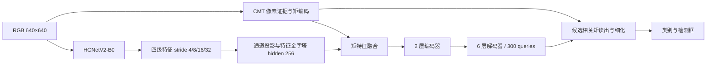

# HGNetV2-B0 骨干与训练指南

更新：2026-09-14。当前正式配置为 [cmtdet_hgnetv2_b0.yaml](../../configs/cmtdet_hgnetv2_b0.yaml)，输入固定 **640×640**。该配置用 HGNetV2-B0 替换前一版 Nano256 候选的骨干，保留 hidden=256、2 层编码器、6 层解码器、300 queries、P2 和完整 CMT。它不是将原来更大的 CMTDet-B 配方仅替换骨干后得到的参数量。

## 1. 结构与兼容性

骨干实现位于 [hgnetv2.py](../../src/cmtdet/hgnetv2.py)，参考 [D-FINE HGNetV2 实现](https://github.com/Peterande/D-FINE/blob/master/src/nn/backbone/hgnetv2.py)。采用标准 B0 stem、SE 聚合及 LAB（可学习仿射），不添加分类头。与 D-FINE 部分检测配置只取末端特征不同，这里返回四个 stage，供 CMTDet 保留高分辨率 P2。

| stage | 中间通道 | 输出通道 | HG block 数 | block 内层数 | 卷积形式 | 640 输入的输出 |
|---|---:|---:|---:|---:|---|---|
| 1 | 16 | 64 | 1 | 3 | 标准 3×3 | B×64×160×160 |
| 2 | 32 | 256 | 1 | 3 | 标准 3×3 | B×256×80×80 |
| 3 | 64 | 512 | 2 | 3 | 轻量 5×5 | B×512×40×40 |
| 4 | 128 | 1024 | 1 | 3 | 轻量 5×5 | B×1024×20×20 |



示意图压缩了逐层解码/细化反馈。CMT 数学机制、损失、坐标约定及原有五种 forward 模式未改变，具体接口仍见[实现结构与接口说明](实现结构与接口说明.md)和[消融实验指南](消融实验指南.md)。

`model.backbone=hgnetv2_b0` 选择新骨干，`dims=[64,256,512,1024]`、`depths=[1,1,2,1]` 是 B0 规格声明，其中 depths 指 HG block 数。校验器拒绝与 B0 不一致的规格，避免配置名与实际结构不符。特征金字塔从骨干的 `out_channels` 获取通道数。后续添加骨干可以遵守同样的四级特征接口。

历史 ConvNeXt 配置仍能使用；没有 backbone 字段的旧配置/检查点仍解释为 ConvNeXt，Python 配置类的兼容默认值没有改变。因此，**训练新骨干必须显式传入本页的新配置**。不能用旧 ConvNeXt 完整 checkpoint 对 HGNetV2 直接 resume，必须新建实验。加载新模型 checkpoint 测试或恢复时，会自动恢复其骨干配置。

## 2. 预训练权重与 BN

本地已经准备并校验 `weights/PPHGNetV2_B0_stage1.pth`。服务器下载源码后需要单独准备权重；权重不会被打包进源码。

Linux 下在项目根目录执行：

```bash
mkdir -p weights
curl -fL --retry 3 https://github.com/Peterande/storage/releases/download/dfinev1.0/PPHGNetV2_B0_stage1.pth -o weights/PPHGNetV2_B0_stage1.pth
sha256sum weights/PPHGNetV2_B0_stage1.pth
```

验证使用的文件 SHA256：`70a372e8cbc59b34c5da2943261ecb633faf304a58e7e05461a27bd8d8b7f3d1`。

默认 `hgnet_use_lab=true` 与该预训练权重匹配。加载器严格检查键和形状，只允许补齐转换权重中缺少的 BN `num_batches_tracked` 计数器，不忽略缺失的卷积、LAB、BN 仿射或运行统计量。关闭 LAB 后不能继续加载这份含 LAB 的权重。

默认 `hgnet_freeze_norm=true`：骨干 BN 使用预训练运行均值/方差，冻结其仿射参数；其他骨干参数仍参与训练。这是针对 microbatch=2 的设置，梯度累积不会把 BN 的实际 batch 从 2 变成 16。调用 `model.train()` 后 BN 仍保持 eval。训练入口会拒绝“冻结 BN、随机初始化、没有预训练也没有 resume”的组合。

若要从头训练，显式设置 `--set model.hgnet_freeze_norm=false`，并重新评估实际 batch 和 BN 统计稳定性。这是不同训练条件，不能直接视为预训练配方的等价替代。

## 3. DUT 正式训练

沿用现有 DUT→COCO 转换及 train/val/test 划分、坐标协议，不重新划分数据。下面假定已存在 `data/dut_coco/data.yaml`；数据准备细节见[训练与测试操作指南](训练与测试操作指南.md)。所有命令从 CMTDet-main 根目录执行。

```bash
python -m pip install -e ".[test]"
python -m cmtdet train \
  --config configs/cmtdet_hgnetv2_b0.yaml \
  --data data/dut_coco/data.yaml \
  --pretrained-backbone weights/PPHGNetV2_B0_stage1.pth \
  --output runs/dut_hgnetv2_b0_seed42 \
  --device cuda
```

| 设置 | 值 |
|---|---|
| 输入 / queries | 640×640 / 300 |
| hidden / FFN / encoder / decoder | 256 / 1024 / 2 / 6 |
| P2 / CMT | 开启 / full，宽度32、二阶矩 |
| attention_chunk / CMT query_chunk | 4096 / 400 |
| batch / 梯度累积 | 2 / 8，名义有效 batch=16 |
| epoch / warmup | 200 / 5 |
| 主学习率 / 骨干学习率 | 1e-4 / 1e-5 |
| AMP / 初始 scale / 梯度裁剪 | 开启 / 16 / 0.1 |
| val_interval / patience | 1 / 0（不启用早停） |

200 epoch 是继承的实验日程，**不是已验证的最佳训练时长或速度承诺**。先在目标 5060 Ti 16GB 上做同分辨率小样本容量检查，将上面 output 改成新的 smoke 目录，并追加 `--limit-images 16 --stop-after-epochs 1`。该检查会截断样本，不能用其 AP 判定检测能力，也不能准确外推完整 epoch 的数据读取和验证耗时。正式训练去掉这两个限制参数。

恢复训练：

```bash
python -m cmtdet train --resume runs/dut_hgnetv2_b0_seed42/last.pt --data data/dut_coco/data.yaml --output runs/dut_hgnetv2_b0_seed42 --device cuda
```

完整测试：

```bash
python -m cmtdet test --weights runs/dut_hgnetv2_b0_seed42/best.pt --data data/dut_coco/data.yaml --split test --output runs/dut_hgnetv2_b0_seed42_test --device cuda
```

训练进度、批次/epoch 日志、best/last、COCO 12 项指标、原始标注框面积严格小于100像素²的 AP50:95/AR50:95，以及测试结果保存机制继续沿用现有系统。不要复用旧骨干的非空输出目录开启新训练。

## 4. 参数、计算量与验证边界

实测记录位于 `runs/hgnetv2_validation/`：

| 检查 | 结果 |
|---|---|
| 骨干注册参数量 | 1,850,396 |
| 当前配置整网注册参数量（包含冻结参数） | **15,207,118（15.21M）** |
| 640×640、batch1、full 推理计数 | **203.67 GFLOPs** |
| 公开权重对齐 | 相同权重、相同640输入，四级特征与参考实现逐元素完全相等 |
| 自动化测试 | 33项通过，包含五种模式损失/反向、新骨干加载与 BN 行为 |
| CLI 集成 | DUT 2张样本、64输入工程配置，完成训练→last恢复→测试；AMP跳步为0 |

FLOPs 使用 PyTorch FlopCounterMode，乘加计2；未计入不支持的 grid_sample、gather、部分逐元素运算和归约。它是统一口径下的已计数前向计算量，不能作为完整算子总量或训练速度。原始结果：[cost_640.json](../../runs/hgnetv2_validation/cost_640.json)、[参考对齐](../../runs/hgnetv2_validation/reference_equivalence.json)、[测试记录](../../runs/hgnetv2_validation/tests.xml)。

本地 RTX3060 Laptop 上两次模型前向约358/363ms，仅作定位线索，不代表5060 Ti训练速度。单独分段测量中骨干约6.9ms，编码器约174.6ms，矩读出约120.8ms，说明剩余执行瓶颈仍在骨干之外。本次没有修改 attention 的重复 FP32 转换或矩读出的同步行为。减少骨干参数本身不能保证解决此前的训练耗时问题。

640检查是推理；CLI训练检查是64的缩小工程模型，不能据此保证正式640训练显存或精度。尚未进行该模型全量收敛训练、检测精度比较和 PFR 实验。是否保留原有检测能力，需要同数据协议下训练验证。

## 5. 消融与来源

用新配置分别训练既有 CMT 模式，保持 backbone、预训练、BN策略、输入、训练日程和随机种子一致。骨干对比应保留相同检测头/CMT设置，并报告各自预训练来源，不能把不同预训练条件的收益全部归因于骨干。旧配置留作历史复现。

HGNetV2 基础块改编自 D-FINE，保留 Apache-2.0 许可和作者声明；详见 [THIRD_PARTY_NOTICES.md](../../THIRD_PARTY_NOTICES.md)及包内许可。新增部分主要是四级输出接口、冻结 BN 训练行为、严格权重加载和 CMTDet 工厂接入。


[训练性能优化第二阶段](CMTDet训练性能优化第二阶段实现说明.md)：主配置使用 `cmt.pair_product_backend=explicit`、`model.checkpoint_encoder=false`。显存不足时可开启checkpoint；旧checkpoint恢复会保留历史求积设置。
