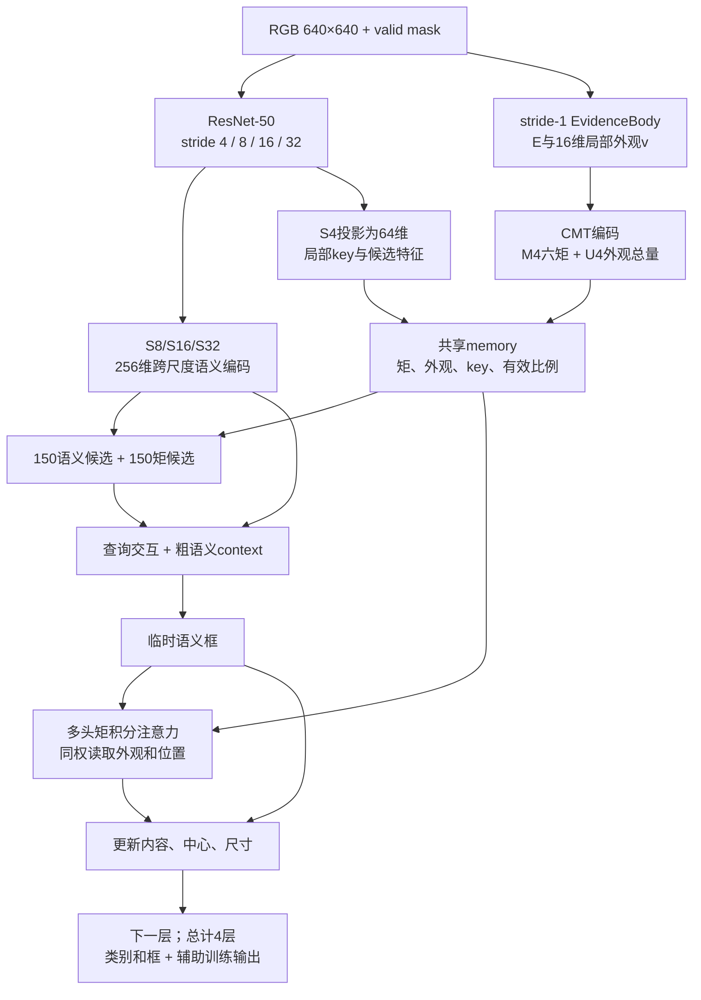

# miattn 分支 CMTDet-I：结构与实现

> 设计依据为[三种结构候选](../CMT核心方案/DETR与CMT融合的三种CMTDet结构候选与优先级.md)中的候选一。实现、正确性验证和检测性能验证是三个不同阶段。

## 1. 方法主线

小目标的少量位置证据容易在空间压缩和离散读取中改变。CMTDet-I在第一次下采样前建立非负证据，保存单元内部坐标矩；每个对象查询用同一组权重积分局部外观和几何状态，再用观测同时更新分类内容、框中心和下一层查询位置。

四轮解码都执行“语义预测→矩积分→内容/几何更新”，CMT的输出进入后续计算；它不是DETR末端接修正头。没有用NMS合并两套检测结果。最终输出是一个对象集合，用Hungarian一对一监督。

## 2. 实际数据流

主配置为`configs/cmtdet_i_r50_640.yaml`。固定640输入，ResNet-50，语义维度256，1层encoder、4层decoder，300个普通查询。训练另带去噪查询；数量由GT数量和`model.denoising`共同确定，沿用公共训练系统。

语义分支只对S8/S16/S32做256维编码。S4保留为64维局部特征，不建立全图P2 Transformer。也支持已有ConvNeXt/HGNetV2骨干；选择HGNetV2时仍需提供它要求的dims/depths配置。

## 3. 模块、形状与代码

| 模块 | 输入 | 输出，省略batch | 实现 |
|---|---|---|---|
| ResNet50 | 3×640×640 | 256×160²、512×80²、1024×40²、2048×20² | `resnet.py` |
| 语义投影与encoder | 后三个骨干层级 | 8400×256 token、padding mask | `miattn.py::CMTDetI` |
| EvidenceBody | 输入图像 | 16×640²隐特征；E为1×640²，v为16×640² | `IntegralMemory` |
| 原始几何状态 | E和valid | M4为25600×6，FP32 | `moments.encode` |
| 外观总量 | E、v | U4为25600×16，FP32 | `IntegralMemory` |
| 局部key | 64维S4与8维矩描述 | 25600×4×32，FP32 | `IntegralMemory.keys` |
| 矩候选 | 重叠5×5单元窗口的矩、局部特征 | 中心、预测尺寸、类别、内容 | `IntegralMemory` |
| 矩积分 | query、临时框、共享memory | head统计、局部内容、质量、中心偏移、支持域 | `MomentIntegralAttention` |
| 联合更新 | 语义query、临时框、矩观测 | 新query、新框、质量/门控诊断 | `IntegralUpdate` |
| 集合损失 | 各层预测、GT | 检测、辅助、DN、证据、候选等命名损失 | `losses.py::DetectionLoss` |

`model.py::CMTDet(config)`是向后兼容的模型工厂：`model.architecture=cmtdet_i`创建新类，`legacy`创建原检测器。旧checkpoint可继续加载，但旧整网权重不是新架构的初始化权重。骨干预训练和整网恢复是不同入口。

## 4. 实际积分公式

单元以中心 \(o_j\) 为原点保存

$$M_j=(m_j,p_{xj},p_{yj},Q_{xxj},Q_{xyj},Q_{yyj}),\qquad U_j=\sum_{x\in\Omega_j}E(x)v(x).$$

不对原始矩做LayerNorm或插值。LayerNorm只用于语义和派生描述。U独立保存，不能由六矩恢复。

对head \(h\)，query产生3个支持核的softmax混合系数 \(\pi_{ht}\)。半宽为预测框宽高的一半乘0.75/1.5/3，夹在4–96输入像素：

$$w_t(x)=\prod_{d=x,y}\left(1-[(x_d-r_d)/a_{td}]^2\right)_+^2,$$
$$A_{hj}=\left[\sum_t\pi_{ht}w_t(o_j)\right]\exp\left[\operatorname{clip}\left(q_h^Tk_{jh}/\sqrt{32},-8,8\right)\right].$$

同一个 \(A_{hj}\) 读取U和换原点后的M：

$$D_h=\sum_jA_{hj}m_j,\quad N_h=\sum_jA_{hj}[p_j+(o_j-r)m_j],\quad V_h=\frac{\sum_jA_{hj}U_j}{D_h}.$$

二阶量同样换原点后求和。不同head先以非负系数混合D/N/T，再求中心与协方差，不直接平均质心。读出归一化、矩运算、几何更新使用FP32。外观head拼接后线性投影回256维；这比方案稿中逐head独立投影更一般，跨head混合仍不改变几何积分定义。

内容注入为`query + local_content + geometry_embed`，再接LayerNorm与FFN。中心更新使用二维sigmoid gate乘矩中心偏移，再加最多为预测宽高0.1倍的有界学习残差。宽高由学习头调整，不等同于证据协方差。

质量小于`cmt.mass_epsilon`时中心偏移和gate置0，无效head局部内容置0；所有除法有显式安全分母。`order=1`时二阶统计及描述禁用。`mass_only`把证据视为位于单元中心的点质量，保留内部一致的退化状态。

## 5. 候选初始化和监督

矩候选用重叠5×5单元均匀窗口，通过固定换原点卷积一次生成所有窗口矩，不逐候选运行Python循环。窗口中心取质心，尺寸独立预测。局部语义和矩描述负责类别评分，选150个，与150个语义候选组成同一集合。

新增可关闭的密集候选监督，训练未进入Top-K的正样本：

- GT中心所在单元为类别正样本；背景使用focal，ignore区域屏蔽。
- 唯一GT中心对应的单元监督候选框L1；多个GT挤入一个单元时保留类别监督、跳过歧义框回归。
- 权重`mia.proposal_loss_weight`默认1；禁用矩候选时不计算。

该监督属于候选召回设计，应在论文中交代并单独消融，不能把它的收益全部归于积分算子。

证据监督沿用离散归一化中心Gaussian，增强后重新构造。正常训练在DataLoader CPU worker中生成目标热图，避免loss中逐GT读取CUDA标量。自定义调用没有预生成目标时仍有兼容回退。

默认启用检测、辅助层、DN、证据、候选损失；关闭额外centroid/gate/residual和temporary损失，先检验结构与基础监督。相关损失仍可显式启用，权重为0时跳过无用匹配/诊断计算。

## 6. 高效实现与资源开关

1. **共享memory。** 一张图只编码一次M/U/key，所有层共享；不在query循环中反复把整张特征转FP32。
2. **精确局部gather。** 按支持半径分桶，只访问完整相关单元，不通过少取样点改变算子。
3. **有界块。** `cmt.query_chunk`限制query数，`mia.cell_budget`限制单块访问单元总量；大窗口自动减小块内query数。预算不截断支持域，单窗口超过预算时仍完整读取。
4. **一次元数据同步。** 每轮读出只做一次半径分桶CPU传输，没有每query `.item()`。
5. **head/支持向量化。** 4个head和3个支持核在张量维度计算，不用12层Python循环重复读取。
6. **独立checkpoint开关。** evidence、encoder、readout分别控制。正式配方关闭读出checkpoint以减少重算；显存不足时可开启。
   证据编码及其输出头默认整体FP32（`mia.evidence_fp32=true`），避免近空证据的大梯度在FP16边界溢出；不只是末端求和转FP32。
7. **纯PyTorch。** 不依赖自定义CUDA/Triton安装；没有声称所有操作均已融合。

`mia.reader_backend=reference`访问全网格，仅用于数值核验，不作为正式训练推荐。它与bucket采用相同单元权重，测试比较了前向与反向。

| 开关 | 是否改变研究结构 |
|---|---|
| query_chunk、cell_budget、checkpoint、bucket/reference | 执行资源；浮点求和顺序可有微小差异 |
| heads、value_dim、支持范围、stride、层数、query来源 | 改变研究结构，需独立训练 |
| shared_weights、content_weights、geometry_to_content | 方法机制消融 |
| AMP | 数值精度选择，需对照一致 |

CMT-I不使用旧`cmt.fusion_init`、`cmt.reader_backend`；积分后端是`mia.reader_backend`。旧字段保留用于legacy兼容，主配置不列出。旧`learned/spd/no_origin`和bounds不属于可用MIA配置，传入会报错。

## 7. forward mode

| mode | 证据监督 | 局部U进入query | 矩中心更新 | 矩候选 |
|---|---|---|---|---|
| baseline | 否 | 否 | 否 | 否 |
| evidence_aux | 是 | 否 | 否 | 否 |
| feature_only | 是 | 是 | 否 | 否 |
| readout_only | 是 | 否 | 是 | 可配置 |
| full / diagnostic | 是 | 是 | 是 | 可配置 |

feature_only禁用key中的一二阶描述，保留质量和有效性；内容仍可通过普通学习头影响框。diagnostic与full执行同样算子，返回已有mass/centroid/gate/support，不是另一个模型。

严格隔离局部积分时，让所有变体先设置`mia.moment_queries=0`，再单独测矩候选。默认mode同时改变路径和候选来源，不能把全部差异归于一个算子。`geometry_to_content=false`仅关闭更新器中的几何描述注入，不关闭key和候选中的几何信息。

`model.detach_references=true`断开层间reference梯度；同层支持核对临时框仍可微，CMT内容继续进入下一层。每层都有集合辅助监督。

## 8. 指标口径

标准COCO指标保留原始标注坐标。**CMTDet-I的附加特小目标指标强制使用输入尺度**：

- `AP50_95_input_bbox_area_lt100`
- `AR50_95_input_bbox_area_lt100_maxDets100`
- `GT_input_bbox_area_lt100`

GT框先按预处理裁剪、缩放，再判断宽×高严格小于100像素²。等于100排除；采用实际整数resize对应的sx/sy，不只使用理想ratio。

附加评估同时变换GT和预测，并用COCO面积ignore规则处理其他尺寸对象；只给GT换面积会误处理未匹配预测。测试覆盖原图18×18→输入9×9、20×20→10×10排除、原图9×9放大后排除及高分误报。

`AP_small`仍是标准COCO指标，不是输入面积<100。AR对IoU=.50:.05:.95平均，maxDets=100；无符合条件GT为−1。报告保存变换后的GT和预测，可复查分组。

## 9. 研究边界

本实现没有完成完整数据集收敛实验，没有证明SOTA或PFR改善。矩编码/同权积分成立，不代表证据生成、Top-K与整网严格平移等变。请通过[训练与消融教程](CMTDet-I训练测试与消融教程.md)组织公平实验。
