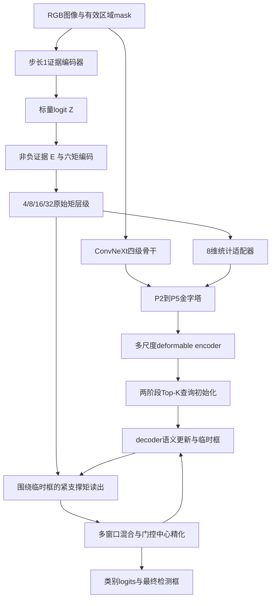

# CMT / CMTDet PyTorch 实现结构与接口

> 当前正式配置使用HGNetV2-B0；新骨干在`src/cmtdet/hgnetv2.py`，经`model.backbone`选择，输出stride4/8/16/32四级特征。详见[骨干结构与兼容说明](HGNetV2-B0骨干与训练指南.md)。下文原ConvNeXt骨干描述对应历史配置，CMT和检测器接口仍沿用。

## 1. 设计定位与实现边界

本实现将《CMT与CMTDet完整研究方案》转为可训练的研究代码。CMT 是 Conservative Moment Transport：将像素级非负证据压缩为空间矩，在合并网格和候选框读出时显式运输坐标原点，保留质量、质心和二阶空间分布的信息。CMTDet 在集合预测检测器中同时使用矩特征融合和候选相关矩读出。

代码可运行不等于方法的研究假设已经成立。当前没有正式收敛训练、SOTA 对比或 CMT 相位实验。既往冻结模型的 PFR 实验只能支持检测输出存在平移敏感性，不能单独证明某个下采样算子是唯一原因。

当前检测器是自行实现的 ConvNeXt 风格骨干、FPN、多尺度可变形注意力和迭代集合预测头。它参考 Deformable DETR/DINO 的方法组成，但不是官方 DINO 的逐项复现。未实现外部模型接入、DDP、EMA、自动调参、多尺度增强或中途 batch 的精确恢复。

## 2. 文件与职责

| 文件 | 职责与扩展位置 |
|---|---|
| `src/cmtdet/config.py` | 配置结构、默认值、YAML及命令行覆盖、合法性检查 |
| `moments.py` | 无检测器依赖的六矩编码、原点转换、合并、候选读出 |
| `cmt.py` | 图像证据提取、特征融合、查询级矩精化 |
| `attention.py` | 基于 PyTorch grid_sample 的多尺度可变形注意力 |
| `model.py` | 骨干、金字塔、encoder、decoder、DN、forward modes |
| `geometry.py` | 框格式、IoU/GIoU |
| `losses.py` | Hungarian匹配、检测、DN、证据及质心门控损失 |
| `data.py` | COCO Dataset、letterbox、元信息、DUT转换 |
| `evaluation.py` | COCO与严格小于100面积指标、逐图原始结果 |
| `engine.py` | 训练、验证、日志、checkpoint、恢复、测试 |
| `cli.py` | 用户入口；不在命令行层实现模型逻辑 |
| `scripts/run_ablations.py` | 冻结消融配置并可选执行训练 |

模块之间通过 Tensor、MomentState 和显式字典传递信息，不依赖全局可变的模型单例。修改结构时首先修改对应配置和模块，再扩展单元测试。

## 3. CMTDet 数据流



每层 decoder 都产生检测预测；训练监督最终层、前面各层及 encoder 选出的候选。训练时额外加入 DN 查询，测试时完全移除。图中 decoder 循环为固定层数，不是收敛到某条件才停止。

## 4. 坐标契约

输入是 `images: [B,3,H,W]`，RGB、ImageNet标准化；`valid: [B,1,H,W]` 的1表示真实图像区域，0表示右下填充。CLI 使用 H=W，且为32倍数。低层矩函数允许符合各级整除条件的其他尺寸。

- 原图及输入图均使用连续边缘坐标；像素中心为 `(x+0.5,y+0.5)`。
- 每个 stride=s 单元的原点为 `((j+0.5)s,(i+0.5)s)`。
- 检测框是归一化的 `[cx,cy,w,h]`，相对于整个填充后输入。
- `CMTModule.read_candidates` 的框必须转成输入像素坐标 `[cx,cy,w,h]`。
- 输出评价时使用每张图实际 sx/sy 还原原图坐标，不能仅使用理想浮点缩放比例。
- `valid_fraction` 描述单元有效比例；输入边界附近的证据仍可能受卷积填充影响，不属于严格的无限域平移保证。

## 5. CMT模块

### 5.1 证据编码器

输入图像经过3×3卷积、逐像素通道 LayerNorm、GELU，以及膨胀率1/2/4/8的深度卷积残差块，最后1×1卷积输出 `Z:[B,1,H,W]`。每个残差块为深度3×3卷积、PixelNorm、1×1扩展到2C、GELU、1×1回到C。

`E = ReLU(Z.float()) * valid` 是进入矩模块的非负证据。默认宽度32。PixelNorm只沿通道归一化，没有使用整图空间均值。热图损失监督原始 Z，能够给负侧 logit 提供梯度；不要把监督改成只有 ReLU 输出而不检查死区。

### 5.2 固定矩编码与精确合并

单元 C、原点 c、像素坐标 x、局部位移 u=x−c：

\[
m=\sum_{x\in C}E(x),\quad p=\sum E(x)u,\quad Q=\sum E(x)uu^T.
\]

`MomentState.values:[B,6,H/s,W/s]` 按 `[m,p_x,p_y,Q_xx,Q_xy,Q_yy]` 排列；同时保存 `stride/order/valid_fraction`。编码使用固定卷积核，不存在待学习的矩核。

子单元原点到父原点的位移为 d，则：

\[
m'=m,\quad p'=p+md,\quad Q'=Q+dp^T+pd^T+mdd^T.
\]

把四个子单元转到同一父原点后相加，就得到父单元原始矩。这一步是离散求和恒等式；FP32下只存在浮点误差。不能直接池化 p/Q，也不能把不同原点下的值直接相加。

默认直接编码stride4，再精确合并到8/16/32。stride1/2读出控制会从相应细网格开始；stride8读出仍生成stride4状态供P2融合。因此 `cmt.stride` 控制候选读出分辨率，不表示禁用P2的4尺度矩特征。

二阶矩不能重建一般4×4单元内的全部16个像素。2×2六矩对四个像素可达到满列秩，因此stride2是较强的信息保留对照，不能把它当成和stride4相同的信息压缩。

### 5.3 特征融合接口

`describe(state)` 输出8通道：`log(1+m)`、按stride归一化的2维质心、按stride²归一化的3维协方差、质量有效标志、有效像素比例。空质量的归一化统计置零。适配器为 `8→64→C` 的1×1卷积与GELU，乘可学习标量后残差加到对应FPN特征；标量初始值0.001。

构造时提供 `{stride: channels}`，按stride从小到大与传入feature列表对应。目前主实现支持4/8/16/32组成的金字塔。未来接入外部网络时需要显式核验其像素原点、缩放、padding和特征尺寸；通道适配并不自动解决坐标契约。

### 5.4 候选读出

候选中心 r、宽高 w/h，默认三组半径 `a_t=clamp(f_t*(w,h)/2,6,192)`，`f=[0.75,1.5,3]`。注意 factors 对应全宽高比例，半径中有除以2。

对单元中心 c 定义正权重：

\[
\alpha_{t,C}=\prod_{k\in\{x,y\}}\left(1-((c_k-r_k)/a_{t,k})^2\right)_+^2.
\]

先将每个单元的 p/Q 从 c 转到 r，再乘 alpha 后求和，得到每窗口 `[M,Px,Py,Sxx,Sxy,Syy]`。程序局部枚举单元并 gather 原始矩，不对原始矩执行grid_sample；support与权重保留对候选框的梯度，索引枚举本身离散。

输出：`stats:[B,Q,T,6]`；`support:[B,Q,T,2]`；`descriptor:[B,Q,25]`；可选 `bounds:[B,Q,T]`。每窗口8维描述，三个窗口共24维，额外1维是归一化质心分歧。单窗口模式零填充描述槽位，保持下游参数维数一致。

这里对单元内采用常值核权重，近似连续变化的逐像素核。原点运输精确，不意味着核积分近似误差为零。可选bounds依据矩和核Lipschitz上界估计该近似的质心误差；证书条件不满足时返回inf，不能将inf解读为检测失败。它不约束语义网络、Hungarian匹配或最终AP。

### 5.5 查询精化

查询 `[B,Q,D]` 与25维描述拼接，MLP预测三个窗口的softmax混合权重。混合的是原始统计量，之后才计算质心偏移 `delta=P/M`，不能直接对三个归一化质心作同样解释。

描述通过 `25→D→D` MLP残差更新查询；门控g由更新后查询预测，初始偏置−2。质量不足时g强制为0。最终中心为：

\[
c_{final}=c_{semantic}+g\,\delta/(W,H)+\Delta/(W,H).
\]

残差Delta由tanh约束，默认范围为框宽高（最小4px）的0.25倍。宽高通过logit域残差更新，不直接等同于证据协方差；证据尺度与真实bbox尺度没有一般恒等关系。检测输出的中心可能临时越界，评测裁剪到原图；下一层参考框会作数值范围约束。

## 6. 检测器容量与训练设计

| 配置 | B版默认值 |
|---|---|
| 输入 | 1024×1024 |
| 骨干各级通道 | 128/256/512/1024 |
| 骨干各级深度 | 3/3/27/3 |
| 检测金字塔 | P2/P3/P4/P5，stride4/8/16/32 |
| 统一通道 / FFN | 256 / 2048 |
| encoder / decoder | 6 / 6 |
| attention heads / 每级每头采样点 | 8 / 4 |
| matching queries | 900，上限受可用memory数约束 |
| denoising预算 | 100；最少一个正负组，拥挤图可能超过预算 |

可变形注意力使用局部采样，encoder没有构造所有像素两两attention矩阵。但P2和步长1证据分支仍较耗显存；纯PyTorch实现没有速度最优保证。decoder self-attention包含Q×Q项。

encoder按类别分数选Top-K参考框和memory；每层decoder做查询自注意力、跨尺度采样、FFN、临时框预测、CMT精化。DN正负查询使用独立可见性mask和固定GT分配；普通查询看不到DN查询，测试不读取GT。

训练总损失包括最终检测、前层与encoder辅助检测、临时框、DN、证据热图、直接质心、gate与残差正则。Hungarian代价默认 `2*focal+5*L1+2*GIoU`；检测损失默认 `1*focal+5*L1+2*GIoU`。所有权重可配置。

直接质心监督只用于满足足够质量、完整热核位于窗口及有效图像内、没有邻近GT中心干扰的匹配查询。gate标签比较当前证据质心与语义中心的归一化误差并detach；不是额外的人工标签。所有训练监督仅来自train/val流程各自的标注，推理路径无GT输入。

当前实现使用LR warmup，不包含原方案可选的分阶段辅助损失权重渐增；默认从第一轮联合优化。背景约束来自非负热图与背景项，不包含单独背景图或外部分割模型。需要研究这些设计时应作为显式配置扩展。

## 7. Python调用示例

```python
import torch
from cmtdet import CMTDet, load_config
from cmtdet.cmt import CMTModule

cfg = load_config('configs/smoke.yaml')
model = CMTDet(cfg).eval()
x = torch.randn(1, 3, 64, 64)  # 示例张量；真实RGB先标准化
valid = torch.ones(1, 1, 64, 64)
with torch.no_grad():
    result = model(x, valid, mode='full')
    boxes = result['predictions']['boxes']  # B,Q,4 normalized cxcywh
    logits = result['predictions']['logits']  # B,Q,num_classes

cmt = CMTModule(cfg.cmt, {4: 32, 8: 32, 16: 32, 32: 32})
cache = cmt.encode(x, valid)
queries_px = torch.tensor([[[32., 32., 8., 8.]]])
statistics = cmt.read_candidates(cache, queries_px)
```

训练时传入targets列表：每项至少有 `boxes:[N,4]`、`labels:[N]`、`pixel_boxes:[N,4]`（xyxy输入像素）、`ignore_boxes:[M,4]`、`valid_size:(Hvalid,Wvalid)`。`DetectionLoss`返回总loss和分项字典；CLI会处理移动设备、反传和保存。

`CMTDet.forward`还返回 `aux_outputs/encoder/dn_outputs/dn_meta/cmt/mode`。未启用CMT时cache为None；未启用读出时不存在centroid等读出诊断。调用方应检查键，不能假定所有消融都有相同诊断内容。

## 8. 数值与工程注意事项

- 矩编码、运输、除质量、核统计使用FP32；数学gradcheck允许FP64。不要全模型直接 `.half()` 后假定数值策略不变，优先用AMP。
- gate的sigmoid及概率BCE使用FP32，避免AMP不支持的BCE路径和低精度概率饱和。
- attention使用标准PyTorch grid_sample；CUDA反向可能非确定性，seed不等于逐bit确定性。
- 空GT、空预测、任意COCO类别ID、ignore区域均有独立处理。
- 默认构造所有可切换分支；baseline仅跳过运行分支，不物理删除参数。报告参数量应区分注册参数总量与实际执行/有梯度参数。
- checkpoint原子写入，恢复按epoch边界；代码hash留档不等同于跨代码版本兼容保证。
- `diagnostic`执行路径与full相同；证书需要另设`cmt.bounds=true`，不会自动得到相位实验报告。

## 9. 方法来源与验证界限

- [ConvNeXt作者实现](https://github.com/facebookresearch/ConvNeXt)：骨干结构与显式预训练映射来源；实际外部预训练文件尚未下载验证。
- [Deformable DETR](https://arxiv.org/abs/2010.04159)：多尺度可变形注意力与迭代框精化。
- [DINO](https://arxiv.org/abs/2203.03605)：对比去噪训练等设计背景；本仓库是自定义实现。
- [PyTorch grid_sample](https://pytorch.org/docs/stable/generated/torch.nn.functional.grid_sample.html)：坐标与CUDA反向非确定性说明。
- [COCO官方评测源码](https://github.com/cocodataset/cocoapi/blob/master/PythonAPI/pycocotools/cocoeval.py)：面积区间、ignore、precision/recall语义。

最终论文需同时证明AP收益、同口径相位稳健性收益和机制消融，而不是将数学求和恒等式当作最终检测准确率定理。
