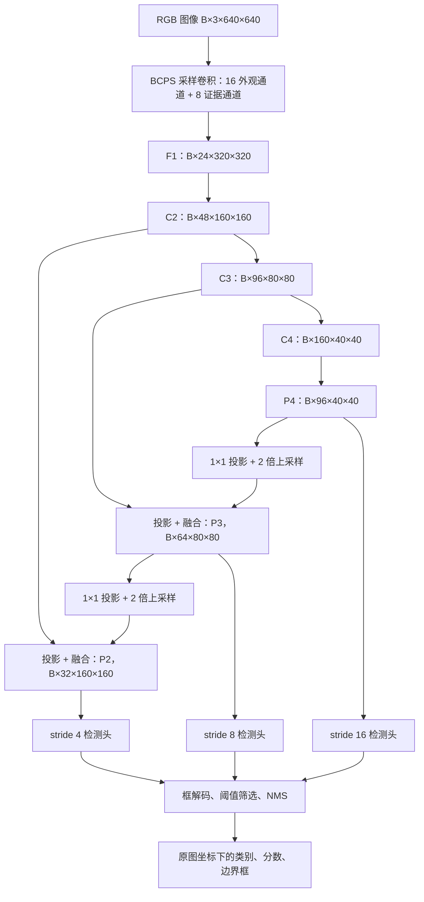
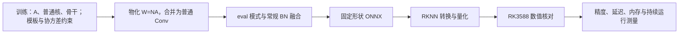
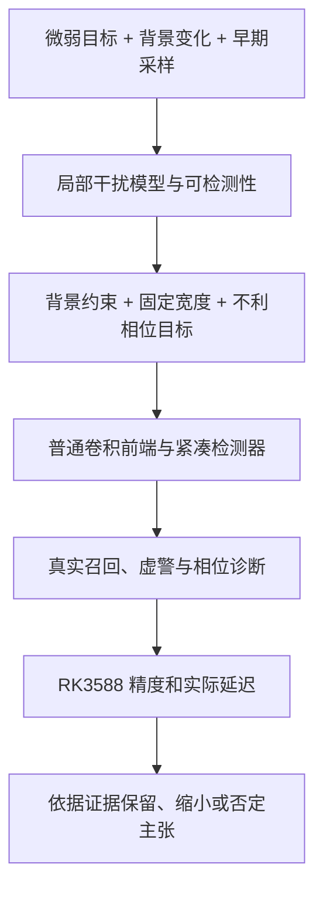

# 数学启发的小目标轻量检测：候选研究路线与完整方案

> 调研日期：2026-09-10。研究对象：RGB 单帧小目标检测；工程约束：轻量、快速，并能在 RK3588 上验证实际部署性能。本文独立于 BCRNet 的结构与故事，不沿用其模块，也不讨论已有算子／图优化课题。
>
> 文档性质：文献调研与研究设计，包含可实现的模型方案、数学推导和实验方案。没有真实数据训练结果、检测精度结果或 RK3588 实测速度。“建议提出”与“已经验证”在本文中严格区分。

## 1. 结论与阅读导航

**最推荐研究“背景消除约束下的相位稳健可检测性保持”：把轻量网络第一次下采样视为一个受通道预算约束的观测压缩问题，学习既排除一部分背景干扰、又尽量保留最不利采样位置上目标证据的卷积核。**

这条路线的关键不是增加高频响应，而是回答：

> 在相同输出通道数下，一个微弱目标经过下采样后，还剩多少区别于背景与噪声的证据？这种证据是否会因为目标移动一个像素而明显下降？

数学起点是子空间检测、噪声加权的可分性和最坏情况优化。拟议方法把这些约束用于训练一个普通卷积形式的采样前端；推理阶段不计算矩阵逆、不动态估计背景、不执行多相位多次推理。轻量骨干负责利用保留下来的证据完成分类与定位。

三个候选方向按本课题的匹配程度排序如下。排序是研究判断，不是客观的创新性评分。

| 优先级 | 候选方向 | 数学启发 | 拟解决的具体矛盾 | 当前判断 |
| --- | --- | --- | --- | --- |
| 1 | 背景消除约束下的相位稳健可检测性保持 | 子空间检测、Mahalanobis 距离、minimax 优化 | 压低背景时可能同时抹掉弱目标；固定步长采样可能对不同位置不均衡 | 最适合成为模型主线；需要避开差分卷积与采样方法的近邻工作 |
| 2 | 面向小目标定位信息的静态计算预算分配 | Fisher 信息、Cramér–Rao 下界、实验设计 | 通道重要性高，不代表其对小目标定位重要 | 数学故事较强；估计量与实际 AP 的联系更难验证 |
| 3 | 面向微弱目标判别间隔的量化鲁棒训练 | 扰动分析、率失真思想、鲁棒优化 | 全局量化误差小，不代表微弱目标不会跨过判别边界 | 与设备约束直接相关；已有小目标感知 QAT，创新空间更窄 |

第 2～4 节给出调研判断与备选故事；第 5～10 节给出第一优先级的论文式完整方案；第 11～15 节给出实验、失败条件和论文组织；附录提供参考文献与检索边界。

### 1.1 关于“没有被提出”的准确表述

**本次检索未发现与第一优先级方案的完整定义相同的公开方法；这不等于证明其从未被提出。** 搜索不能排除未收录论文、术语不同的工作、未公开研究或专利。本文也没有完成覆盖所有数据库与专利库的新颖性检索。

更重要的是，构成方案的数学工具和部分结构都有明确先例。因此，不能把“背景投影”“差分滤波”“相位处理”“普通卷积部署”分别包装成首次提出。潜在贡献是一个具体的**约束、目标函数与检测问题的联合设计**，并且必须由后续实验证明这种联合设计不是无效组合。

建议在开题或初稿中使用：

> 本研究拟研究背景干扰约束下、具有固定输出预算的相位稳健采样表征，以改善轻量检测器对微弱小目标证据的保留能力。

暂时不要使用“首次”“最优小目标检测器”“无损保留全部目标信息”“已达到实时性能”等表述。

## 2. 先把问题讲准确

### 2.1 像素少意味着可用证据少，不意味着所有小目标都需要超分辨率

真实观测受到目标投影尺寸、光学模糊、曝光、运动、噪声以及输入缩放共同影响。把目标放大到更大的张量，不会凭空恢复没有被传感器记录的独立信息。

因此，本课题应优先研究：**如何更有效地使用已经存在的目标证据，并减少网络计算过程中额外发生的损失。** 若原图缩放阶段已经把目标消除，后续模块无法提供普遍恢复保证。论文必须分别分析成像损失、输入预处理损失和网络内部损失。

### 2.2 “特征弱”需要一个能测量的定义

直接比较前景与背景的激活强度会有问题：放大卷积权重可以同时放大目标和噪声，但没有改善判别能力。

更有解释力的定义是：在背景扰动和噪声尺度确定后，目标引起的特征变化是否足够大。第一条路线据此使用噪声加权的可分性，而不是只用响应幅度。

### 2.3 背景影响至少包含三种不同机制

| 机制 | 例子 | 第一条路线能否直接处理 |
| --- | --- | --- |
| 局部平滑变化 | 亮度偏移、缓慢渐变天空 | 可以在明确的局部模型内消除一部分变化 |
| 纹理与噪声干扰 | 树叶、压缩纹理、云边缘、传感器噪声 | 用训练背景统计约束响应；不能保证全部消除 |
| 语义相似干扰 | 鸟、风筝、与目标相似的物体 | 主要依赖后续语义表征和负样本监督 |

将三类干扰统一称为“高频背景”，然后声称一个滤波模块全部解决，缺乏说服力。RGB 小目标也不一定具有红外点目标的成像形态，不能直接搬用红外假设。

### 2.4 固定步长会引入“采样相位”问题

这里的相位是目标相对采样网格的位置，不是傅里叶相位。

例如 stride=2 时，目标中心移动一个像素，其相对偶数采样网格的位置就改变了。对于由大量像素组成的物体，局部变化可能被其他证据补偿；对于只有几个有效像素的目标，某些滤波器响应可能明显改变。

这一风险不能直接写成“所有小目标的主要失败原因”。应先通过平移诊断实验测量它在目标数据上的贡献。已有抗混叠与多相采样工作已经研究平移行为，因此“首次发现步长卷积对平移敏感”也不成立。[BlurPool](https://proceedings.mlr.press/v97/zhang19a.html)、[APS](https://arxiv.org/abs/2011.14214)、[LPS](https://arxiv.org/abs/2210.08001)

### 2.5 轻量化应与证据处理连接起来

合理的因果链是：

> 小目标证据稀少 → 在前端压缩时优先保留判别所需证据 → 让较小的后续网络也能完成任务 → 在设备延迟预算内寻找更好的精度。

这里最后两步是待验证假设。不能因为前端有数学约束，就直接推导出整网一定更快。低 FLOPs 也不必然带来更低延迟，访存、并行度、算子实现与张量规模都会影响速度。[FasterNet](https://openaccess.thecvf.com/content/CVPR2023/html/Chen_Run_Dont_Walk_Chasing_Higher_FLOPS_for_Faster_Neural_Networks_CVPR_2023_paper.html)

## 3. 文献调研：哪些故事已经被讲过

下表是与本报告研究判断直接相关的近邻。并非完整综述；会议论文、预印本、作者仓库和出版商摘要的证据层级见附录。

| 相关工作 | 已有核心内容 | 对本课题的约束 |
| --- | --- | --- |
| [Matched Subspace Detectors，1994](https://www.mssc.mu.edu/~daniel/mscs6960/spring2010/ScharfFriedlanderTSP94.pdf) | 子空间干扰下的检测理论 | 背景投影与匹配检测不是新原理 |
| [PDE-Net，2018](https://web.stanford.edu/~yplu/pub/PDENet.pdf) | 通过滤波器矩约束学习微分算子 | 零矩、消失矩约束不具有独立首创性 |
| [PiDiNet，2021](https://openaccess.thecvf.com/content/ICCV2021/html/Su_Pixel_Difference_Networks_for_Efficient_Edge_Detection_ICCV_2021_paper.html) | 高效像素差分表征 | 加入中心差分或梯度滤波不能单独构成新故事 |
| [SPD-Conv，2022](https://arxiv.org/abs/2208.03641) | 空间到通道重排后卷积，面向低分辨率与小目标 | 保留采样位置、减少下采样信息损失已有研究 |
| [BlurPool，2019](https://proceedings.mlr.press/v97/zhang19a.html) | 抗混叠改善网络的平移行为 | 不能把所有平滑归为错误，也不能声称首次考虑混叠 |
| [APS，2021](https://arxiv.org/abs/2011.14214)、[LPS，2022](https://arxiv.org/abs/2210.08001) | 自适应／可学习多相采样 | 相位稳健需要和这些方法区分，不能改名复用 |
| [Bottom-heavy backbone，2023](https://arxiv.org/abs/2303.11267) | 向浅层高分辨率部分分配更多计算 | “小目标需要更多浅层计算”已有先例 |
| [FDI-Net，2023](https://www.ijcai.org/proceedings/2023/0066.pdf) | 流体力学启发的红外小目标检测 | 跨学科类比本身不能充当创新证明 |
| [PConv，2025](https://arxiv.org/abs/2412.16986) | 与红外点目标形态相关的卷积设计 | PSF／高斯目标形态启发已有近邻 |
| [ESOD-YOLOv8，2026](https://www.sciencedirect.com/science/article/pii/S0957417425026636) | 二阶中心差分结合普通卷积，并处理下采样特征损失 | 与“背景抑制＋普通卷积保留信息”的叙事直接相近，必须重点比较 |
| [Group Fisher Pruning，2021](https://proceedings.mlr.press/v139/liu21ab.html) | 用 Fisher 指标评估通道／耦合通道重要性 | “Fisher 指导剪枝”已经被提出 |
| [QATDet，2026，作者仓库](https://github.com/tum-bgd/QATDet) | 面向检测与小目标的尺度感知量化训练 | “给小目标更大量化训练权重”不能作为新的核心主张 |
| [Deep-NFA，2023 预印本](https://arxiv.org/abs/2303.01363) | 将 a contrario 统计判断引入小目标检测 | 以背景异常和虚警控制为核心也已有工作 |

### 3.1 对几个容易想到的方案的直接评价

ESOD-YOLOv8 的出版商公开片段列出 SIRST 与 CrackTree 实验，因此不能把其结果当作 RGB 对空检测证据；但数据不同也不能消除方法上的重合。是否已有同类差分与背景融合设计，要按方法判断。[出版商公开片段](https://www.sciencedirect.com/science/article/abs/pii/S0957417425026636)

- **小波／高频增强＋轻量 YOLO：** 容易实现，但泛化故事较弱，需要证明为什么噪声与目标不会一起被增强。
- **拉普拉斯／二阶差分＋注意力：** 近邻拥挤，尤其需要避开 ESOD-YOLOv8。不能仅靠数学符号提升创新性。
- **保留四个采样相位再融合：** 必须认真对比 SPD-Conv、APS、LPS。重排可逆不意味着后续通道压缩无损。
- **Fisher 剪枝：** 只有指标真正针对目标位置参数，而不是更换损失权重的普通参数敏感性，才可能形成不同研究问题。
- **面向小目标的量化感知训练：** 已有直接近邻。需要定位到误判机制、约束或预算分配，而不是只说小目标对量化敏感。

### 3.2 本报告选择的差异化问题

第一条路线把研究问题限定为：

> 给定局部背景干扰模型与固定输出通道数，如何训练一个静态卷积采样器，使其对目标尺度与采样位置变化保留尽可能均衡的噪声加权可检测性？

与上述近邻相比，拟议差异在于**对压缩后可检测性的最坏相位约束**。背景矩约束和普通卷积只是实现这一问题的组成部分。

这一差异目前属于有依据的候选研究空间；是否足以形成论文贡献，还需要同算量实验、机制实验与进一步全文查新。

## 4. 三个候选方向的完整故事

### 4.1 优先级一：背景消除约束下的相位稳健可检测性保持

**困难：** 微弱目标与局部背景混在少量像素中。轻量网络很早就压缩这些像素，目标证据可能被背景变化主导，也可能因采样位置不同而被不同程度地削弱。

**启发：** 子空间检测先处理可建模的干扰，再度量剩余观测对目标的支持；任务导向采样则强调保留完成任务所需的信息，而不一定重构全部输入。[子空间检测](https://www.mssc.mu.edu/~daniel/mscs6960/spring2010/ScharfFriedlanderTSP94.pdf)、[Task-Based Analog-to-Digital Converters](https://arxiv.org/abs/2009.14088)

**拟提出：** 一个受背景矩约束的固定宽度采样前端，以及一个针对目标采样相位的可检测性保持目标。前者排除局部仿射背景变化，后者避免剩余少量通道只服务于容易的目标位置。

**精度逻辑：** 同样宽度的网络得到更均衡的初始目标证据，有机会提高极小目标召回，并降低不同采样位置造成的性能波动。

**速度逻辑：** 训练约束不出现在推理图中；前端权重可直接存成普通卷积核。是否能用更小骨干达到原有精度，需要通过多个宽度实例的实际速度—精度曲线验证。

**主要风险：** 可见光背景可能不满足局部模型；形状先验可能与真实目标不匹配；前端改善可能被后续网络抵消；差分特征可能在 INT8 下不稳定。

**值得做的条件：** 首先证明真实数据存在可重复的采样相位敏感性，而且它与小目标漏检有关。若这一前提不成立，应降低本路线优先级。

### 4.2 优先级二：面向定位信息的计算预算分配

**困难：** 小目标宽度只有几个像素时，相同的一像素位置误差会带来更大的相对定位损失；按总体损失或通道激活大小压缩网络，可能保留分类能力，却优先牺牲这些位置线索。

**启发：** Fisher 信息衡量观测对待估参数变化的敏感性；在满足正则性等条件的统计模型中，Cramér–Rao 下界联系了信息与无偏估计方差。这里的参数应是目标中心与尺度，不是神经网络权重。

设局部目标参数为

$$
\eta=(c_x,c_y,\log w,\log h),\quad
f\mid\eta\sim\mathcal N(\mu(\eta),R),
$$

当协方差与参数近似无关时，信息矩阵的代理为

$$
F_\eta=J^TR^{-1}J,\quad J=\frac{\partial\mu}{\partial\eta}.
$$

**拟提出的方法：** 通过受控平移／尺度变化估计通道对位置参数的敏感性，在训练时为各层分配静态通道预算，优化小目标组的定位信息指标，并以设备实测延迟约束总预算：

$$
\min_{\mathbf c}\ \max_{g\in\mathcal G_{small}}
\operatorname{tr}\left[D_g(F_{\eta,g}(\mathbf c)+\epsilon I)^{-1}D_g^T\right],
\quad T_{device}(\mathbf c)\le T_{max}.
$$

其中 $D_g$ 用目标尺寸归一化中心误差，$\mathbf c$ 是各层通道数，最终固化为普通紧凑网络。计算预算按验证后的候选网络实测，而不假设各层延迟简单相加。

**完整故事：** 小目标定位对证据损失更敏感 → 通用压缩指标不直接保护定位信息 → 使用位置参数的信息下界指导静态通道分配 → 在同样设备预算下争取更低定位误差与更高 AP75。

**创新边界：** 需要和参数 Fisher 剪枝清楚区分，并对比“按小目标加权的 Group Fisher”这个强基线；不能把指标换名视为创新。Fisher 指导资源选择在其他领域也已有研究。[Group Fisher Pruning](https://proceedings.mlr.press/v139/liu21ab.html)、[SCOSARA](https://arxiv.org/abs/2410.18954)

**最关键的实验：** 相同实际延迟下比较小目标中心归一化误差、AP75、AP50；消融参数 Fisher、位置 Fisher、随机预算、统一缩宽。若只提高分类分数而没有改善定位，该故事不成立。

**主要风险：** 特征并不严格服从高斯分布；裁剪插值可能主导数值导数；相关通道的信息不能直接相加；真实预测器通常有偏。因此只能把公式作为代理与设计依据，不能宣称真实检测器达到了 CRLB。

### 4.3 优先级三：面向微弱目标判别间隔的量化鲁棒训练

**困难：** INT8 的全局重构误差可能很小，但一个微弱目标与困难背景之间的判别间隔本来就小，少量量化扰动可能让其变成漏检。背景占据大量位置，还可能主导校准统计。

**启发：** 用任务相关的判别间隔评价扰动，比只最小化张量均方误差更贴近检测目标。

设正样本位置与匹配困难负样本之间的分数差为 $m$，量化使中间特征产生扰动 $e$。局部一阶近似下，

$$
|\Delta m|\lesssim\|\nabla_fm\|_1\|e\|_\infty.
$$

这个近似不能跨越任意大的扰动、激活切换或离散匹配改变。应同时测量实际浮点／量化分数差。

**拟提出的方法：** 在训练期用浮点模型确定可靠正样本与困难负样本，对不同尺寸、对比度、采样位置组优化低分位判别间隔保持；在设备支持的 INT8 方案下联合学习激活裁剪范围。推理时仍是固定精度、固定结构的检测器。

**完整故事：** 小目标证据容易被量化扰动越过判别边界 → 全局 MSE 与目标错误不匹配 → 用尺寸与困难背景条件下的间隔约束保护脆弱决策 → 缩小真实 INT8 与浮点模型之间的检测差距。

**创新边界：** 小目标感知 QAT 已有直接研究，因此“给小目标加权”不够。潜在差异必须落在困难负样本配对、低分位间隔目标及其对真实硬件量化的解释力上。[QATDet 作者仓库](https://github.com/tum-bgd/QATDet)、[Q-DETR](https://arxiv.org/abs/2304.00253)

**最关键的实验：** 普通 PTQ、常规 QAT、尺度加权 QAT、拟议间隔 QAT，在同一转换流程中比较小目标 AP 与浮点差距，并分析因量化新增的漏检／虚警。收益不能来自偷偷增加精度或更换输入尺寸。

**主要风险：** 浮点教师可能已经判断错误；PyTorch 假量化和 RKNN 实际数值路径可能不同；容易成为较好的训练技巧，而不是独立模型创新。因此排在第三。

## 5. 第一优先级方案的论文定位

### 5.1 暂定名称

中文标题：**面向轻量小目标检测的背景约束相位稳健采样**。

英文标题：**Background-Constrained Phase-Robust Sampling for Lightweight Tiny Object Detection**。

文中暂用 **BCPS** 指代采样方法，**BCPS-Det** 指代装配该方法的检测器。名称仅用于沟通，不代表已验证的命名唯一性。

### 5.2 研究摘要草案：保持研究设计时态

小目标只包含有限的有效像素，其检测证据容易受到背景变化与早期空间压缩的共同影响。现有细节保持方法主要关注空间信息或频率响应，而固定计算预算下，不同采样位置的微弱目标是否仍具有足够的可检测性，值得进一步研究。本文拟将早期下采样建模为带背景干扰的低维观测设计问题，提出背景约束相位稳健采样方法。该方法通过滤波器零空间参数化排除局部仿射背景变化，并利用噪声加权的可检测性保持目标，约束固定宽度滤波器组在不同目标形态与采样相位下的证据保留。训练得到的前端可直接表示为标准步长卷积，与紧凑的多尺度检测网络结合。拟通过尺寸分层检测、平移干预、背景扰动和 RK3588 部署实验，检验该方法能否改善小目标检测的精度—延迟关系。

正式投稿前，应将“拟”替换为真实实验支持的结论，并补入实际结果；不能预填提升百分比。

### 5.3 可以直接用于 Introduction 的故事

远距离目标检测面临两种同时存在的约束。一方面，目标在图像中只占少量像素，有限的外观证据必须与复杂背景区分；另一方面，边缘设备限制了高分辨率特征的处理成本，使检测器需要尽早压缩空间表示。扩大输入或增加浅层计算虽然可能改善检测，但会占用本已有限的处理预算。

我们关注这种矛盾中的一个具体环节：早期下采样不仅减少空间位置，还选择了哪些局部变化能够进入后续网络。对于微弱小目标，背景亮度变化与局部纹理可能主导这些变化；同时，同一目标相对采样网格的位置变化，也可能导致其证据被不均衡地保留。仅提高整体特征响应，不能说明目标相对噪声变得更可分。

受子空间检测和任务导向观测设计启发，我们将前端看作一个有输出预算的测量系统。理想前端应对可建模的背景变化保持不敏感，同时保留区分微弱目标所需的观测方向。由于目标位置未知，还需要避免采样器只对部分相位敏感，而在其他相位上产生证据薄弱点。

基于这一认识，我们拟设计背景约束相位稳健采样方法。其背景约束通过卷积核参数化实现，相位稳健性通过训练期可检测性目标学习。二者共同作用于固定数量的输出通道，另保留普通外观通道供后续语义判断使用。所有矩阵分析与统计估计均留在训练阶段，部署时前端仍为标准卷积。

该方法的研究价值需要通过两条证据链建立：首先，在受控条件下证明背景敏感性与不利相位证据损失确实减少；其次，在真实数据与边缘设备上证明这些变化能够转化为更好的小目标精度—延迟关系。若只能得到更清晰的响应图，而无法改善实际检测与部署表现，则不足以支持方法有效性。

### 5.4 三项候选贡献

1. **问题与度量：** 面向轻量小目标检测，研究固定宽度早期采样器的背景约束可检测性，以及不同采样位置之间的证据差异。
2. **方法：** 联合背景零空间参数化与最坏相位可检测性训练目标，在固定输出预算下学习采样卷积核；保留普通外观通道承担未被建模的信息。
3. **实证：** 建立机制干预、真实检测和设备部署相连接的验证流程。只有实验完成后，才可将其改写为已实现的性能贡献。

这三项是一个中心问题的三个组成部分。普通 FPN、检测头、BN 融合和导出流程不单独列为算法创新；已有工作也充分展示了训练结构与普通卷积部署结构之间的转换思路。[RepVGG](https://openaccess.thecvf.com/content/CVPR2021/papers/Ding_RepVGG_Making_VGG-Style_ConvNets_Great_Again_CVPR_2021_paper.pdf)

## 6. 方法：从背景模型推导采样器

### 6.1 符号与假设

| 符号 | 形式 | 含义 |
| --- | --- | --- |
| $x$ | $\mathbb R^{d}$，$d=3k^2$ | 归一化 RGB 输入的局部像素块，按通道展平 |
| $U$ | $\mathbb R^{d\times r}$ | 固定背景基，初版为逐通道常数项与两个线性项 |
| $\beta$ | $\mathbb R^r$ | 当前局部背景系数，不在推理中显式估计 |
| $s_{t,\phi}$ | $\mathbb R^d$ | 类型／尺度为 $t$、相对采样相位为 $\phi$ 的目标扰动模板 |
| $a$ | 标量 | 对比度幅值，可正可负 |
| $n,\Sigma_g$ | 随机向量、$d\times d$ 矩阵 | 残余扰动及背景组 $g$ 的协方差 |
| $N$ | $d\times(d-r)$ | $U^T$ 的正交零空间基 |
| $A$ | $(d-r)\times m$ | 证据滤波器的可学习系数 |
| $W=NA$ | $d\times m$ | 受约束证据滤波器组 |
| $m$ | 初版 8 | 固定证据通道预算 |

局部分析模型为：

$$
H_0:x=U\beta+n,
\qquad
H_1:x=U\beta+a s_{t,\phi}+n.
$$

初步推导假设 $n\sim\mathcal N(0,\Sigma_g)$，且 $\Sigma_g\succ0$。这只是建立可解释训练目标的近似，不是“自然图像服从高斯分布”的事实断言。真实背景残差可以明显非高斯，必须用真实检测实验检验代理是否有效。

以下给出为本方案整理的线性观测推导；背景子空间检测原理已有经典研究，不主张这些基础恒等式为新定理。[理论来源](https://www.mssc.mu.edu/~daniel/mscs6960/spring2010/ScharfFriedlanderTSP94.pdf)

### 6.2 用零空间参数化限制背景响应

取 $k=5$，空间坐标 $u,v\in\{-2,-1,0,1,2\}$。单个 RGB 通道的背景基为

$$
P=[\mathbf1,\mathbf u,\mathbf v]\in\mathbb R^{25\times3},
\quad U=\operatorname{diag}(P,P,P)\in\mathbb R^{75\times9}.
$$

离线求一个正交零空间基 $N\in\mathbb R^{75\times66}$，满足

$$
U^TN=0,\qquad N^TN=I.
$$

以 $W=NA$ 参数化 8 个证据卷积核，则

$$
W^TU=0,\qquad
z=W^Tx=aW^Ts_{t,\phi}+W^Tn.
$$

对应到每个输入通道，每个证据核满足

$$
\sum_{u,v}w(u,v)=0,\quad
\sum_{u,v}u\,w(u,v)=0,\quad
\sum_{u,v}v\,w(u,v)=0.
$$

因此，**在线性层、精确实数计算和完整局部块的条件下**，该通道不响应逐通道仿射背景的变化。它仍可能响应二阶变化、边缘、纹理和目标。

这不是自动分离“目标与所有背景”。目标中与背景基重合的成分也会被消除。正因为存在这种代价，必须保留普通外观通道，并测量消除约束的损失。卷积矩约束本身也有已有研究。[PDE-Net](https://web.stanford.edu/~yplu/pub/PDENet.pdf)

### 6.3 为什么不能只让目标响应更大

记

$$
g_{t,\phi}=N^Ts_{t,\phi},\qquad
C_g=N^T\Sigma_gN.
$$

为了避免背景组下标与向量混淆，下文在固定背景组内简写 $C=C_g$、$g_s=g_{t,\phi}$。

压缩后目标的均值变化是 $aA^Tg_s$，噪声协方差是 $A^TCA$。当 $A$ 满列秩时，定义单位幅值的可检测性代理：

$$
q_A(s,C)=g_s^TA(A^TCA)^{-1}A^Tg_s.
$$

实际平方可分性为 $a^2q_A$。它是这一局部观测下的 Mahalanobis 均值距离；**不是完整检测器的 AP，也不是未知形状目标的无条件检测概率。**

这个量对应“给定一个模板后，观测中还剩多少可区分信息”的分析。实际检测器不知道正确模板与相位，还要处理大量候选位置，因此不能获得一个免费的、事先知道目标形态的最优读出器。后续网络能否学会利用这些方向，是单独需要检验的假设。

把所有卷积权重乘以非零常数，精确公式中的 $q_A$ 不改变。它避免了仅靠放大响应“提高信号强度”的漏洞。

### 6.4 可检测性保持率及其边界

在不限制背景正交空间输出维数时，参考值为

$$
q_{\perp}(s,C)=g_s^TC^{-1}g_s.
$$

定义压缩保持率

$$
\rho_A(s,C)=\frac{q_A(s,C)}{q_{\perp}(s,C)},
\quad q_{\perp}>0.
$$

令 $v=C^{-1/2}g_s$、$B=C^{1/2}A$，则

$$
q_A=v^TB(B^TB)^{-1}B^Tv=\|P_Bv\|_2^2,
\quad q_{\perp}=\|v\|_2^2.
$$

于是

$$
0\le\rho_A\le1.
$$

直观上，$\rho_A$ 衡量的是：**在已经排除了指定背景变化后，8 个输出通道还保留了多少有利于该目标的观测方向。** 只有当相关白化目标方向落入滤波器列空间时，才达到 1。

但是，仅看 $\rho$ 会掩盖背景消除已经损坏目标的情况。因此同时计算

$$
q_{raw}=s^T\Sigma_g^{-1}s,
\quad\eta=\frac{q_{\perp}}{q_{raw}},
\quad R_A=\frac{q_A}{q_{raw}}=\eta\rho_A.
$$

这里 $q_{raw}$ 是背景已知／可移除时的理想参考，不是假定真实检测时能直接获得的性能。在线性模型下有 $0\le R_A\le\eta\le1$。

- $\eta$ 小：当前背景约束本身与这个目标冲突；继续优化压缩不能恢复被消除的信息。
- $\rho$ 小：约束后仍有目标信息，但低维滤波器组没有保留好。
- 两者都较好，真实 AP 仍可能不改善：代理没有覆盖实际问题，或后续网络没有利用这些信息。

当 $q_{\perp}$ 接近零时不计算不稳定的比值，应单独报告该模板，并依靠 $R_A$ 和普通外观分支分析失败。不得静默删除所有难模板后宣布保持率提高。

### 6.5 从平均最优改为保护不利采样相位

对 stride=2，先考虑四个整数相位

$$
\Phi=\{(0,0),(0,1),(1,0),(1,1)\}.
$$

它们表示同一目标在输入空间移动后，相对于采样中心的不同位置。模板构造必须用同一个连续目标形态平移再采样，不能分别改变其形状或随意归一化每个截断模板。

拟议优化目标为

$$
\max_A\ \min_{t,\phi,g}R_A(s_{t,\phi},\Sigma_g),
\quad W^TU=0,\quad\operatorname{cols}(W)=m.
$$

初版实现采用分层的平滑最坏情况损失：

$$
\mathcal L_{phase}=
\frac1{|\mathcal T||\mathcal G|}
\sum_{t,g}\tau\log\left[
\frac1{|\Phi|}\sum_{\phi\in\Phi}
\exp\frac{1-R_A(s_{t,\phi},\Sigma_g)}{\tau}
\right].
$$

当 $\tau\to0$ 时，内层趋近该模板／背景组中的最大损失。这个可训练版本保护每组的不利相位，再对组平均；**它不是严格实现同时对全部模板与背景取全局最坏值**。若需更强鲁棒性，可以增加组间 softmax，必须单独消融，防止少数不合理模板主导训练。

初始建议 $\tau=0.1$，测试 $0.05,0.1,0.2$。这些是研究起点，不是经过调优的结论。

归一化保持率不包含实际对比度幅值 $a$，因而不能保证极低对比度目标已经足够可见。诊断时同时记录 $a^2q_A$ 与对比度分层召回。当前目标还只约束一个局部块的输出；邻近重叠块、后续步长层和检测头对整体平移行为的影响，必须通过整网实验测量。

**不主张：** 严格的整网平移等变性、任意连续相位的保证、真实场景的 CFAR 保证。此处保护的是有限训练模板和所建模噪声下的局部采样证据。

### 6.6 数值实现与防退化

1. $U,N$ 注册为固定 buffer，梯度仅更新 $A$。
2. 用 $\widehat\Sigma_g=(1-\lambda)S_g+\lambda\operatorname{tr}(S_g)I/d+\epsilon I$ 获得正定协方差；初始 $\lambda=0.1$，与单位协方差比较。
3. 使用 Cholesky 分解和线性求解，避免显式求逆；模板相关量可以缓存。
4. 初始 $A$ 取随机正交列；用参考协方差下的 $\|A^T\bar CA-I\|_F^2$ 约束改善条件数。它是数值正则项，不是额外检测模块。
5. 实际求解可加入 $\epsilon_A I$。这时严格投影恒等式与缩放不变性只是理想参考，必须记录正则尺度，并检查权重是否通过异常增大范数降低数值损失。
6. 记录 $A^TCA$ 的条件数、核范数、$W^TU$ 的残差，以及近零参考值模板的数量。
7. $N$ 和协方差分析在 FP32 或 FP64 执行；不要在 FP16 下求小矩阵逆或分解。

## 7. 训练先验从哪里来

### 7.1 目标模板只是先验，不能冒充真实目标分离结果

只有边界框时，无法知道框内每个像素究竟属于目标还是背景。初版不声称从 bbox 中恢复了真实目标信号。

拟使用一个小型合成扰动字典：

- 窄高斯斑点、模糊短线、模糊小矩形，表示不同局部强度结构；
- 正负对比度与多种 RGB 对比方向，覆盖亮目标与暗目标；
- 高斯标准差约 0.6～1.6 输入像素，配合短线／矩形长度变化；
- 四个整数采样相位，并在扩展实验中加入固定的亚像素位置。

所有字典参数固定种子、写入配置。模板首先在足够大的连续／过采样画布上生成，再截取同一采样网格对应的 $5\times5$ 局部块。相位间不重新归一化局部块，否则会人为补偿本应研究的能量变化。单位幅值参考与绝对 $q_A$ 都要保存。

该字典主要约束极小目标的局部结构，不代表所有 $\sqrt{wh}<16$ 的物体形状，也不代表无人机必然为高斯点。较大目标和语义信息由普通外观通道及后续网络处理。PSF 相关卷积已在红外研究中出现，因此这部分只能作为物理先验设计，不能单列为首创贡献。[PConv](https://arxiv.org/abs/2412.16986)

### 7.2 背景协方差只从训练集估计

初版在训练集抽取局部 RGB 背景块：排除经过适度扩张的标注框、ignore 区域和填充区域；负样本图像也参与。统一输入归一化和采样尺度后，使用组内中心化的完整块估计全维协方差代理，再进行收缩正则。证据空间的残差协方差通过 $C_g=N^T\widehat\Sigma_gN$ 得到。

不能先对每块完全消除仿射成分，再把其奇异协方差直接当成“原始噪声协方差”计算 $q_{raw}$，否则会混淆背景消除前后的参考。实际估计包含自然背景变化，是设计代理，不等于已知的传感器噪声；$q_{raw},\eta$ 对协方差模型的敏感性也应报告。

分组可以用训练块的梯度能量和亮度得到 3～4 个简单组，覆盖较平滑与较复杂背景。分组仅服务训练，不产生推理时的背景分类器。先比较单位协方差、全局协方差和分组协方差，只有分组带来稳定收益才保留。

人工标注可能漏掉目标，因此协方差估计不能被称为“纯背景真值”。可使用稳健截断减少异常块影响，并检查少量样本。严禁使用 test 图像进行统计、校准或选择模板。

### 7.3 数学先验和真实检测监督如何配合

总目标为

$$
\mathcal L=\mathcal L_{det}
+\lambda_p\mathcal L_{phase}
+\lambda_c\mathcal L_{cond}.
$$

$\mathcal L_{det}$ 由真实图像和框提供；$\mathcal L_{phase}$ 只约束前端系数；$\mathcal L_{cond}$ 保持数值条件合理。后两项的梯度不需要经过整张图像。

初版 $\lambda_p$ 可从 $0.01,0.05,0.1$ 中在验证集选择，$\lambda_c$ 从 $10^{-3}$ 起步。必须报告检测损失与辅助损失对前端的梯度量级，避免数字大小看似小而梯度实际占主导。

相位先验不要求每张真实训练图像做四次前向。训练使用常规随机平移即可；四相位真实图像推理留给机制评估。这样训练额外代价主要是小矩阵计算，推理没有多次前向开销。

## 8. 完整检测器结构与数据流

### 8.1 先区分方法与验证载体

BCPS 是可插拔的采样方法，不依赖下面唯一一种骨干。完整研究建议使用两个载体：

1. **BCPS-Det-Micro：** 下表定义的紧凑网络，用来进行清晰的机制消融和初步设备验证。
2. **成熟轻量检测器载体：** 在固定版本的公开轻量检测器中，只替换最早处理 RGB 的采样卷积，验证结论能否迁移。若原模型前端包含重排等结构，应单独描述接入方式，不能称为直接同构替换。

Micro 是完整、可实现的研究原型，**不是已证实有竞争力的最佳配置**。不能只战胜一个自行设计的弱网络就声称优于主流检测器。

### 8.2 BCPS 前端

输入：$X\in\mathbb R^{B\times3\times640\times640}$，RGB，使用固定归一化与 letterbox。

参数：

- 16 个不受约束的 $5\times5$ 外观核：学习颜色、亮度、局部纹理和普通语义线索；
- 8 个满足 $W=NA$ 的 $5\times5$ 证据核：学习背景约束下的弱目标观测方向；
- 两组核都使用 stride=2、padding=2，并沿输出通道维合并；
- 合并结果经过 BN 和 LeakyReLU，初始负斜率 0.1。

输出：$F_1\in\mathbb R^{B\times24\times320\times320}$。

选择带负斜率的激活是为了保留负方向响应的表示机会，并不意味着它对量化或检测一定更好；应与 ReLU／载体原有激活做同条件比较。前述可检测性证明仅针对激活前的线性证据通道。

两组通道不是两次完整网络推理。实现时组装为一次普通 Conv2d：

```text
appearance_kernel: [16, 3, 5, 5]
evidence_coeff A:  [66, 8]
evidence_kernel:   reshape((N @ A).T, [8, 3, 5, 5])
merged_kernel:     concat([appearance_kernel, evidence_kernel], out_channel)
F1 = LeakyReLU(BN(Conv2d(X, merged_kernel, stride=2, padding=2)))
```

这里的 reshape 按第 6 节“逐 RGB 通道展平”的顺序执行。训练时每步构造核保持梯度；导出前一次性物化合并核，部署模型不保存需要执行的 $N@A$ 节点。

### 8.3 普通基础块

为了使结构能被直接实现，定义两个常规模块：

- `Down(Cin, Cout)`：3×3 depthwise convolution，stride=2，padding=1，接 BN／LeakyReLU；再接 1×1 convolution 将通道变为 Cout，接 BN／LeakyReLU。
- `Block(C)`：3×3 depthwise convolution，stride=1，padding=1，接 BN／LeakyReLU；再接 1×1 convolution 与 BN；与输入相加，最后接 LeakyReLU。

这些是普通轻量卷积构件，不是拟议创新。深度可分离卷积是否在 RK3588 上更快，必须实测；必要时用普通卷积版本替换，但主方法与基线必须同步替换。

### 8.4 Micro 骨干与颈部结构

所有形状采用 NCHW，表中省略 batch 维。

| 阶段 | 操作 | 输出形状 | 输出含义 |
| --- | --- | --- | --- |
| 输入 | RGB 归一化 | 3×640×640 | 待检测图像 |
| F1 | BCPS，5×5，stride 2 | 24×320×320 | 普通外观和受约束证据混合表示 |
| C2 | Down(24,48)＋2×Block(48) | 48×160×160 | stride 4 的局部细节 |
| C3 | Down(48,96)＋2×Block(96) | 96×80×80 | stride 8 的局部结构与语义 |
| C4 | Down(96,160)＋3×Block(160) | 160×40×40 | stride 16 的更大范围上下文 |
| P4 | 1×1 Conv(C4,96)＋Block(96) | 96×40×40 | 高层检测特征 |
| P3 | 1×1 Conv(C3,64)＋Up[1×1 Conv(P4,64)]，再 Block(64) | 64×80×80 | 语义与局部结构融合 |
| P2 | 1×1 Conv(C2,32)＋Up[1×1 Conv(P3,32)]，再 Block(32) | 32×160×160 | 小目标定位特征 |
| Heads | 每个 Pi 接 Block(Ci)＋1×1 预测卷积 | 各尺度 (K+5)×Hi×Wi | 类别、存在概率与框参数 |

`Up` 固定为最近邻 2 倍上采样；通道投影先在低分辨率上执行，再上采样。表中的横向 1×1 卷积使用 BN／LeakyReLU。预测卷积有 bias、不接 BN；其他卷积通常不使用 bias。

用相加而不是拼接控制融合后的通道数，是普通工程选择。P2 检测也不是新贡献。没有在所有浅层插入证据模块：初版只干预第一次采样，便于归因。



### 8.5 检测头、监督与后处理

初版采用普通 anchor-free 参数化，每个位置输出

$$
(t_x,t_y,t_w,t_h,o,c_1,\ldots,c_K).
$$

对 stride 为 $s$、整数网格坐标为 $(u,v)$ 的预测：

$$
\hat c_x=(u+t_x)s,\quad \hat c_y=(v+t_y)s,
\quad\hat w=e^{t_w}s,\quad\hat h=e^{t_h}s.
$$

物体存在分数与类别分数经 sigmoid 后相乘。指数解码在后处理中实施，必要的数值截断范围必须对所有基线一致。

训练采用已经成熟的动态正样本分配，例如固定版本的 SimOTA，并使用其配套检测损失，避免将新采样器与新分配器同时引入。YOLOX 是这一设计的可用参考；Micro 的简化头不是原样复现 YOLOX。[YOLOX](https://arxiv.org/abs/2107.08430)

必须记录每个尺寸组的正样本数量和未分配 GT 数量。若 tiny GT 因匹配候选规则完全得不到监督，应先修复所有实验共有的分配问题。对极小框，不应强制“网格中心必须落在框内部”而导致系统性无正样本。任何 fallback 都必须在所有对照中一致，并单独说明。

后处理统一执行阈值筛选、Top-K 与 NMS，再撤销 letterbox 转换。三个尺度共有 $160^2+80^2+40^2=33,600$ 个预测位置，因此 P2 可能增加 CPU 后处理开销，必须计入实际延迟。

### 8.6 接口与消融模式

即使后续只写初版代码，也应预留以下独立配置，不把研究选择写死：

```yaml
method:
  stem_mode: bcps             # plain3 / plain5 / background_only / phase_only / bcps
  kernel_size: 5
  stem_channels: 24
  evidence_channels: 8
  nuisance_basis: affine_rgb  # constant_rgb / affine_rgb
  covariance_mode: grouped    # identity / global / grouped
  phase_objective: soft_worst # mean / soft_worst
  phase_temperature: 0.1
  lambda_phase: 0.05
  lambda_condition: 0.001
model:
  input_size: [640, 640]
  width_multiplier: 1.0
  use_p2: true
  block_type: depthwise
export:
  materialize_stem: true
  batch_size: 1
```

`phase_only` 的滤波器不受背景约束，应取 $N=I$，并相应计算其可检测性；不能保留零空间却把名字改为“无背景约束”。上述配置是拟议接口，不是当前 BCRNet 已支持的命令。

## 9. 计算量、训练与部署

### 9.1 前端成本的明确账本

以单张 640×640、24 输出通道为例，不计 bias、BN 与激活：

$$
\mathrm{MAC}_{5\times5}=320^2\times3\times24\times25=184,320,000.
$$

相同宽度的 3×3 stride 2 卷积为 66,355,200 MAC，两者相差 117,964,800 MAC。

**因此，BCPS 的 5×5 实例并不比同宽 3×3 前端更省计算。** “训练约束不增加推理计算”只是在与同形状 5×5 普通卷积比较时成立。必须设置普通 5×5 强对照，排除收益仅来自更大卷积核。

推理核权重都是 $24\times3\times5\times5=1,800$ 个数。训练时证据核有 $66\times8=528$ 个自由系数，外观核有 $75\times16=1,200$ 个自由参数；固定基不属于可学习参数。应分别报告训练自由度与实际部署权重存储量。

### 9.2 Micro 实例的解析预算

按第 8 节逐个卷积计数，单类别、640×640 输入时：

| 项目 | 解析值 | 统计口径 |
| --- | --- | --- |
| 全模型卷积权重存储数 | 195,696 | 含物化后的完整前端；不含 BN 参数与预测 bias |
| 卷积 MACs | 970,137,600 | 含 depthwise、pointwise、前端及所有预测卷积 |
| 2×MAC 口径计算量 | 1.9402752 GFLOPs | 一乘一加计两次操作；不计激活、相加、resize、解码和 NMS |
| 前端 MACs | 184,320,000 | 上一节的普通 5×5 实现 |
| 三尺度预测位置 | 33,600 | 不等于最终输出框数 |

这些值经过一个独立的逐层算术脚本核算，**不是模型 profiler 输出，也不是实测运行成本**。实现后要用实际图核对形状、参数和 FLOPs，不能把该表作为速度结论。

Micro 容量很小，可能欠拟合复杂背景。研究应比较宽度系数 1.0、1.5、2.0 等实例；通道数按配置取整并明确记录，证据通道数也需说明是否随宽度改变。不要预先断言 0.2M 量级模型能达到课题所需精度。

### 9.3 训练建议

先建立收敛良好的普通卷积基线，再研究新方法。初版训练可以采用以下流程：

1. 固定数据划分、输入尺度、增强、匹配器、检测损失与优化器，验证 tiny GT 能稳定得到监督。
2. 只用训练集构建背景统计与模板字典，并保存配置、随机种子与文件指纹。
3. 普通外观核按常规初始化，证据系数使用满秩初始化。所有对照使用相同训练预算。
4. 前约 5% 训练轮次逐步增加辅助损失权重，之后联合优化。若做模板预热初始化，必须另设同训练预算对照。
5. 以验证集 AP、tiny 分层 AP、召回与虚警选择模型；不能只选 $\rho$ 最高的 checkpoint。
6. 将完整训练轮数设为可配置起点，例如 150～200 epoch，但以实际收敛诊断为准。若比较预训练，应使预训练资源公平，并单独报告新前端随机初始化的影响。

图像增强应保留真实目标尺寸分布的记录。过强缩小、模糊或 Mosaic 可能把目标完全消除；新增增强不能只施加于新方法。batch size 根据训练设备确定，与论文推理 batch=1 分开描述。

### 9.4 RK3588 部署路径



RKNN Toolkit2 是 Rockchip 提供的转换与部署工具。其支持范围和限制随版本变化，最终必须固定 Toolkit、Runtime、驱动、ONNX opset 与板卡版本。本方案优先使用规则卷积、逐点卷积、相加和固定 resize，以降低接入复杂度；这只是设计上的可部署性考虑，不能代替实际转换检查。[官方项目](https://github.com/airockchip/rknn-toolkit2)、[官方版本变更记录](https://github.com/airockchip/rknn-toolkit2/blob/master/rknn-toolkit2/doc/changelog-2.3.2.txt)

部署前端中不应出现矩阵逆、特征分解、背景协方差估计、动态采样或多分支条件执行。物化卷积核属于普通导出步骤，不作为另一个图优化创新点。

BN 的逐输出通道缩放在浮点条件下保留核的零矩关系；融合 bias 使输出不一定为零，但对背景增量的消除关系仍成立。训练态 BN 的批次统计、边界填充、后续非线性与量化都不在简单局部线性保证范围内。

### 9.5 INT8 可能破坏什么

令物化后核的量化误差为 $E$，则

$$
W_q=W+E,\quad W_q^TU=E^TU.
$$

所以浮点下精确的背景消除，在量化后一般只近似成立。单个核在没有饱和、采用步长 $\Delta$ 的最近舍入时，其权重量化引起的输出误差满足

$$
|e^Tx|\le\|e\|_\infty\|x\|_1
\le\frac\Delta2\|x\|_1.
$$

这只是权重量化的一部分误差界，不包含激活量化、饱和、累加与重定标误差。亮背景下 $\|x\|_1$ 较大，核的微小不平衡也可能产生不希望的残差。

初版部署需分别比较：PyTorch FP32、物化后的浮点模型、ONNX、RKNN 浮点可用路径、RKNN INT8。检查整体 AP 之外，还检查证据通道背景响应和新增漏检。

先使用常规 PTQ，若差距明显再评估与工具链匹配的 QAT。若必须保留首层更高精度，必须确认设备支持并报告成本；不能仍将其写成全 INT8。第三候选方向可作为后续研究，但本方案不依赖它才能获得浮点收益。

### 9.6 速度测量口径

至少同时报告：

- NPU 模型推理时间，以及真实设备执行分配情况；
- 已解码图像进入预处理，到最终框输出的端到端延迟；
- batch=1、固定输入大小下的 p50／p95 延迟；
- 持续运行后的温度、频率、内存占用与性能变化。

视频解码和传输若不在端到端定义内，须明确注明；如课题最终需要摄像头实时工作，再单独测完整视频链路。异步流水线吞吐与单帧延迟分别报告。串行情况下才能直接用 $1000/\text{平均毫秒}$ 表示对应的处理帧率。

“实时”的目标必须预先定义，例如端到端 25 FPS 或 30 FPS 是任务需求，不是本文对硬件的预测。不要用 RK3588 标称算力直接推导本模型 FPS。

## 10. 核心研究假设与能否被证伪

| 假设 | 正向证据 | 会削弱或推翻它的结果 |
| --- | --- | --- |
| H1：小目标检测存在值得解决的相位敏感性 | 相同目标的平移后漏检率／分数波动显著，且小尺寸组更明显 | 波动主要来自边界裁剪或插值；有效区域中没有稳定现象 |
| H2：指定背景变化确实干扰前端 | 背景强度变化引起错误响应，受约束核在相同条件下更稳定 | 普通同预算卷积已学得同等抑制能力；约束反而损伤目标 |
| H3：联合设计优于单独两部分 | 在完整 2×2 消融中，联合方案稳定改善检测与相位指标 | 只有核增大有效，或单独方案相同甚至更好 |
| H4：理论代理对真实检测有解释力 | $R_A$ 变化与受控弱目标召回方向一致，真实数据也改善 | 代理显著上升而 AP／召回不变或恶化 |
| H5：收益在轻量预算和部署后保留 | 设备延迟匹配的模型比较中获得更好的精度；INT8 仍保留主要收益 | 仅 GPU 浮点有效，或设备开销抵消全部精度收益 |

不要在 H1 未建立时直接把“采样相位”写为最重要的困难；也不要在 H5 未建立时把“RK3588 高效”放进标题当作结果。

## 11. 完整实验设计

### 11.1 数据选择与划分

模型输入保持 RGB 单帧。可以使用现有课题中的 Anti-UAV RGB 与 DUT，但本方案不依赖其特定路径或既有模型的数据流程。先核对实际采用的数据版本、标注形式和许可，再制定实验表。

若数据来源于视频，按视频或场景分组划分训练／验证／测试，防止相邻帧跨集合造成泄漏。保留官方可信划分时，应检查重复源视频和近重复图像，而不是随意重新随机划分。

研究至少需要一个真实复杂背景集和一个独立验证集。若只有天空背景，无法充分支持“背景干扰鲁棒”的广泛结论；若测试集没有负帧，不能把负帧虚警率记为零。

### 11.2 尺寸和困难程度的定义

同时保留两套尺寸记录：

1. 数据集原图尺度下的标准指标，用于与公开评估协议对齐。
2. 网络输入尺度下的目标尺寸，用于解释网络机制，例如 $\sqrt{w_{in}h_{in}}$ 的 `[0,4)`、`[4,8)`、`[8,16)`、`[16,32)` 和更大组。

分组阈值是研究协议，不应称为所有文献一致认可的 tiny 定义。每组都报告样本数和序列数。样本极少的组不适合单独作统计结论。

对比度和背景复杂度可以用框内外统计、梯度能量等代理分层，但因为 bbox 含有背景，不能称为真实目标信噪比。分析方法需固定并公开。

### 11.3 标准检测指标

- AP50:95、AP50、AP75、标准 small AP；
- 输入尺度下各尺寸组 AP／Recall，清楚区分其与标准 small AP 的不同；
- 固定误报预算下的召回，以及固定召回下的每图误报数；
- 对有负帧的数据，报告至少一个框的负帧比例与每负帧错误框数；阈值只在验证集选择；
- 使用正帧时也统计未匹配预测，避免仅统计负帧漏掉大量背景误报。

主比较采用相同 max detections、NMS 与评估阈值协议。不要用分类 accuracy 代替目标检测质量。

### 11.4 相位干预实验

对每张评估图像构造 $(0,0),(0,1),(1,0),(1,1)$ 的整数平移，标注同步平移，预测映射回原坐标。只使用四个版本都有效的公共区域；过滤被边界截断的目标。

整数平移采用画布移动，避免插值造成额外模糊。检测器总 stride 更大，补充 `[0,3]×[0,3]` 或更大范围的平移诊断，但与第一次采样的四相位结果分开。

报告三种不同指标：

- **相位组 AP：** 各固定平移版本分别计算 AP，报告最小值与极差。它不是“对每张图挑最差预测再算”的 AP。
- **目标级最坏相位召回：** 对每个 GT，在所有相位上都满足 IoU／分数要求才算成功；比平均召回严格，应另列。
- **分数和框误差波动：** 对匹配目标报告分数标准差与归一化中心误差；漏检单独计数，不静默忽略。

相位评估是离线诊断。正式速度与正式检测结果都使用单次前向，不能把四次结果融合后冒充单次模型精度。

### 11.5 背景与弱目标受控实验

构建不参与训练的合成诊断集，分离以下因素：目标对比度、模糊程度、相位、局部背景斜率、纹理强度、噪声强度。至少包含不同于训练字典的形态与相关噪声。

比较原始与前端输出下的检测／区分能力，画出召回—对比度曲线及相位最差值，而不仅是彩色热图。

对于真实图像，分别在天空、云层、植被、建筑边缘、相似物体等子集中分析错误；以实际数据有无这些场景为准。受控实验只证明模型内机制，不能替代真实场景 AP。

### 11.6 必须完成的消融矩阵

| 编号 | 前端 | 背景约束 | 相位目标 | 核心问题 |
| --- | --- | --- | --- | --- |
| A0 | 普通 3×3 | 无 | 无 | 原始轻量成本参考 |
| A1 | 普通 5×5 | 无 | 无 | 是否只是更大核带来收益 |
| A2 | 16 外观＋8 约束核 | 有 | 无 | 背景约束单独的作用 |
| A3 | 16 外观＋8 自由核 | 无 | 有 | 相位可检测性目标单独的作用 |
| A4 | BCPS 完整版 | 有 | 有 | 两者联合是否必要 |
| A5 | BCPS，改用平均相位损失 | 有 | 平均 | 最不利相位保护是否必要 |
| A6 | BCPS，单位协方差 | 有 | 有 | 背景噪声加权是否真正有用 |
| A7 | BCPS，不保留普通外观通道 | 有 | 有 | 强背景约束会不会破坏语义信息 |

A1～A6 的主对照应保持输出宽度、卷积核大小、后续网络、训练预算一致。A7 改变了功能分工，应同时设置 24 个约束核和 8 个约束核两种版本，区分通道减少与外观消除的影响。

A3 的自由证据核使用未投影的背景协方差计算目标，并明确其可行空间与 A4 不同。A3 不应偷偷使用额外背景消除步骤。

进一步消融证据通道数 4／8／12、常数背景与仿射背景、3×3 与 5×5 支持域、是否使用 P2、模板形态和损失温度。不要在发现主假设无效后不停叠加新模块扩大搜索空间。

### 11.7 必须包含的外部对照

至少包括：

1. 一个成熟的轻量检测器及其公平调参版本。
2. 同一载体的普通 3×3／5×5 前端。
3. SPD-Conv 与抗混叠采样；能可靠接入时增加 APS／LPS，并解释其原始任务与检测任务的差异。
4. 中心差分／二阶差分前端，与普通外观分支共存的版本。
5. ESOD-YOLOv8 的可靠复现或可获得实现。若只能复现摘要描述的部分，必须标为“基于公开描述的近似对照”，不能称为完整原论文复现。

不同文献在不同数据集报告的 AP 不能直接拼接成主表。没有代码、难以复现的工作可以进行方法比较，但不能编造其在本数据集上的结果。

### 11.8 精度—延迟比较

绘制同一 RK3588、相同输入和量化精度下的实测延迟—AP 曲线。至少覆盖三个宽度实例；不能只挑一个对新方法有利的点。

分别回答：

- 相同宽度／同核预算下，BCPS 是否提高精度？
- 相同设备延迟下，BCPS 是否提高精度？
- 达到相同精度时，能否使用更小、更快的后续网络？

第三个问题如果没有被支持，就不能写“更好的证据降低了后续语义计算需求”。仍可写成固定轻量网络的精度改进，但应缩小贡献范围。

### 11.9 随机性与统计

关键结论至少使用 3 个独立训练种子，报告均值与波动。视频数据的 bootstrap 应以视频／序列为单位，避免把高度相关帧当作独立样本。

报告所有预先确定的核心对照；参数选择只使用验证集。测试集只能用于冻结方案后的最终评价。若多次使用测试集选择方案，应另留一个未使用的独立测试集。

## 12. 优先开展的最小研究闭环

### 阶段一：确认问题，而不是先写大模型

在一个已经收敛的普通轻量检测器上，完成四相位平移诊断和尺寸分层误差分析。检查漏检是否真的随采样位置明显变化，以及这一现象是否主要发生在极小目标。

**继续条件：** 存在足以影响目标任务的稳定差异，且排除了图像边界和标注变换错误。

### 阶段二：只验证前端主张

实现 A1～A4，先固定一个宽度、一个数据集、相同训练预算。验证真实检测指标与相位指标是否同时改善，再开展多种子和第二数据集。

**继续条件：** 联合设计相对普通 5×5 及单独约束有可重复收益；增益不是来自额外训练或不公平初始化。

### 阶段三：尽早完成一次设备闭环

导出普通 5×5 与 BCPS 的物化模型，确认数值一致性和 RKNN 转换可用性，测首层与整网延迟，再评估 INT8 精度差距。

**继续条件：** 部署转换不依赖不可接受的回退，实际精度—延迟关系具有价值。无需等所有消融完成后才发现部署路径不适用。

### 阶段四：形成论文证据

冻结主要配置，完成机制对照、复杂背景、外部基线、多宽度曲线与第二数据集验证，最后再写结果摘要和论文结论。

预计工作量主要取决于数据规模、基线是否成熟以及板卡是否可用。本文不承诺固定天数内完成有效论文，也不建议为满足预设故事而选择性报告结果。

## 13. 可能失败的地方与合理调整

| 观察到的问题 | 优先解释与调整 | 不应做的事 |
| --- | --- | --- |
| 天空有效，树木建筑无效 | 背景模型适用范围有限；检查纹理协方差与外观通道 | 声称解决了所有背景干扰 |
| $\eta$ 很低 | 仿射消除也抹掉目标；比较仅常数约束或较弱约束 | 只报告高 $\rho$ |
| 相位代理改善，真实召回无变化 | 模板与任务不匹配，或其他瓶颈更重要 | 增加热图代替检测证据 |
| 普通 5×5 同样有效 | 收益主要来自支持域，需重新评估主张 | 只和 3×3 比较 |
| A2 与 A4 相同 | 相位目标缺少独立价值 | 仍把相位稳健写成核心突破 |
| 只在 Micro 有效，成熟基线无收益 | 弱基线缺陷或模型容量问题 | 以弱基线结果替代通用性证明 |
| INT8 严重掉点 | 核抵消与激活量化敏感；先完成数值诊断 | 只展示 FP32，再宣称适合实际部署 |
| 设备上比普通同精度模型更慢 | 前端与 P2 的成本超出收益 | 用 FLOPs 更小反驳实测延迟 |

若本路线失败，应回到实际错误分析，考虑第二候选的定位预算分配。不要为了维持原故事强行加入超分辨率、注意力、动态卷积等无关模块。

## 14. 按 SCI 论文组织正文与图表

### 14.1 建议章节

1. **Introduction：** 场景约束、具体损失机制、现有研究缺口、方法概述与贡献。
2. **Related Work：** 小目标证据保持、采样与平移行为、背景约束滤波、轻量检测与边缘部署。
3. **Problem Formulation：** 局部背景模型、输出预算、可检测性代理、适用假设。
4. **Method：** 背景零空间、相位目标、外观与证据通道、检测器与训练。
5. **Experiments：** 协议、主比较、机制实验、消融、实际部署。
6. **Discussion：** 背景失配、模板偏差、信息损失与 INT8 限制。
7. **Conclusion：** 只总结被实验支持的结论。

SCI 是期刊索引体系，不代表所有期刊有相同结构或创新门槛。正式投稿前再按目标期刊模板调整，本文不据题目或模块数量预测录用。

### 14.2 建议图表

| 图表 | 要回答的问题 |
| --- | --- |
| 图 1：目标移动一像素的真实例子与响应曲线 | 采样位置问题是否真实且直观 |
| 图 2：背景子空间、目标残差与低维观测示意 | 数学模型为什么导向该模块 |
| 图 3：训练约束与单卷积推理结构 | 复杂数学是否增加运行图成本 |
| 图 4：相位×对比度的召回图 | 新方法是否改善不利条件 |
| 图 5：RK3588 延迟—AP 曲线 | 是否符合轻量部署目标 |
| 表 1：真实数据主结果 | 实际检测能力如何 |
| 表 2：A1～A6 核心消融 | 每个设计是否必要 |
| 表 3：浮点、物化、ONNX、RKNN、INT8 | 部署阶段损失来自哪里 |
| 表 4：失败分组与误差分析 | 方法适用边界是什么 |

### 14.3 预期审稿问题与需要准备的证据

**“是不是差分卷积换个名字？”**

必须展示与二阶差分、普通 5×5、背景约束但无相位目标的对照。论文的区别是明确的可检测性保持问题与相位目标，不是零矩公式。

**“线性高斯模型和复杂 RGB 场景有什么关系？”**

解释其作为局部设计代理的角色，同时展示非高斯背景、未知目标形态与真实数据。不能用局部证明覆盖整网。

**“为什么不直接使用 SPD 或更大输入？”**

在相同设备延迟预算下比较，同时报告 SPD 的完整后续投影成本与更大输入的开销。若替代方案更好，应如实接受。

**“为什么 8 个通道够？”**

用证据通道数曲线回答，不声称任意目标家族都能无损压缩到 8 维。有限通道不可能保留任意高维目标的所有方向。

**“为什么说更轻量？”**

轻量网络实例可以由参数与计算账本描述，但更好的精度—速度折中必须由设备曲线支持。单个模块不增加额外图节点并不自动代表整网更快。

## 15. 最终研究建议

**优先投入第一条路线，但把第一个实验定为“采样相位敏感性诊断”，而不是完整网络训练。** 它决定故事的中心困难是否在实际数据中成立。

第一条路线值得研究的原因，是其困难、数学量、模块与实验可以逐项对应：



一篇有说服力的论文需要这条链条中的每一步都有证据。数学推导可以帮助提出可检验的问题，不能替代检测效果；完整结构可以帮助复现，不能替代创新性；设备转换成功可以证明可运行，不能替代速度优势。

## 附录 A：参考文献与本次阅读范围

以下均链接到论文原文、出版方页面或作者／官方项目。未取得完整内容的文献不用于推断其未公开的实现细节。本文引用的是与研究判断有关的部分，没有逐篇完成系统综述级全文复现。

| 编号 | 来源 | 本次用于什么／阅读层级 |
| --- | --- | --- |
| R1 | [Scharf & Friedlander. Matched Subspace Detectors. IEEE TSP, 1994](https://www.mssc.mu.edu/~daniel/mscs6960/spring2010/ScharfFriedlanderTSP94.pdf) | 读取 PDF 的干扰模型与投影解释；为经典理论溯源 |
| R2 | [Long et al. PDE-Net: Learning PDEs from Data. ICML, 2018](https://web.stanford.edu/~yplu/pub/PDENet.pdf) | PDF 中滤波器矩约束；识别已有方法边界 |
| R3 | [Zhang. Making Convolutional Networks Shift-Invariant Again. ICML, 2019](https://proceedings.mlr.press/v97/zhang19a.html) | 官方论文页；抗混叠近邻 |
| R4 | [Chaman & Dokmanić. Truly Shift-Invariant Convolutional Neural Networks. APS](https://arxiv.org/abs/2011.14214) | 作者预印本；多相位近邻 |
| R5 | [Rojas-Gomez et al. Learnable Polyphase Sampling for Shift Invariant and Equivariant Convolutional Networks. NeurIPS, 2022](https://arxiv.org/abs/2210.08001) | 作者预印本及论文检索；可学习采样近邻 |
| R6 | [Sunkara & Luo. No More Strided Convolutions or Pooling: A New CNN Building Block for Low-Resolution Images and Small Objects. 2022](https://arxiv.org/abs/2208.03641) | 作者预印本；SPD-Conv 的研究目标与结构 |
| R7 | [Su et al. Pixel Difference Networks for Efficient Edge Detection. ICCV, 2021](https://openaccess.thecvf.com/content/ICCV2021/html/Su_Pixel_Difference_Networks_for_Efficient_Edge_Detection_ICCV_2021_paper.html) | 官方论文页；差分网络近邻 |
| R8 | [Ning, Guan & Spratling. Rethinking the Backbone Architecture for Tiny Object Detection. 2023](https://arxiv.org/abs/2303.11267) | 作者预印本；浅层计算分配近邻 |
| R9 | [Fluid Dynamics-Inspired Network for Infrared Small Target Detection. IJCAI, 2023](https://www.ijcai.org/proceedings/2023/0066.pdf) | 官方论文；跨领域数学／物理启发近邻 |
| R10 | [Yang et al. Pinwheel-Shaped Convolution and Scale-Based Dynamic Loss for Infrared Small Target Detection. AAAI, 2025](https://arxiv.org/abs/2412.16986) | 作者预印本与出版检索；目标形态启发近邻 |
| R11 | [Yu et al. ESOD-YOLOv8: Small Object Detection Enhanced with Auto-Disturbance Rejection Convolution. ESWA, 296, 129046, 2026](https://www.sciencedirect.com/science/article/pii/S0957417425026636) | 出版商摘要、引言与公开片段；未取得付费完整正文。DOI 含 2025，与卷期年不同 |
| R12 | [Liu et al. Group Fisher Pruning for Practical Network Compression. ICML, 2021](https://proceedings.mlr.press/v139/liu21ab.html) | 官方论文页；Fisher 压缩近邻 |
| R13 | [Learning Structured Compressed Sensing with Automatic Resource Allocation. arXiv:2410.18954](https://arxiv.org/abs/2410.18954) | 作者摘要；其他领域的信息资源分配近邻，不当作检测结果 |
| R14 | [Neuhaus et al. Task-Based Analog-to-Digital Converters. arXiv:2009.14088](https://arxiv.org/abs/2009.14088) | 作者摘要；任务导向采样启发，不当作卷积检测证据 |
| R15 | [Q-DETR: An Efficient Low-Bit Quantized Detection Transformer. arXiv:2304.00253](https://arxiv.org/abs/2304.00253) | 作者摘要；检测量化近邻 |
| R16 | [QATDet：Quantization-Aware Training for Efficient Object Detection on FPGAs: Case Studies，作者仓库](https://github.com/tum-bgd/QATDet) | 阅读作者 README 的方法说明与论文信息；期刊页访问失败，未精读论文。可追踪 [DOI](https://doi.org/10.5194/isprs-annals-XI-2-2026-697-2026) |
| R17 | [Ciocarlan et al. Deep-NFA: A Deep a Contrario Framework for Small Object Detection. arXiv:2303.01363](https://arxiv.org/abs/2303.01363) | 作者摘要；背景统计与虚警思路近邻 |
| R18 | [Chen et al. Run, Don't Walk: Chasing Higher FLOPS for Faster Neural Networks. CVPR, 2023](https://openaccess.thecvf.com/content/CVPR2023/html/Chen_Run_Dont_Walk_Chasing_Higher_FLOPS_for_Faster_Neural_Networks_CVPR_2023_paper.html) | 官方论文；计算量与速度的不同口径 |
| R19 | [Ding et al. RepVGG: Making VGG-Style ConvNets Great Again. CVPR, 2021](https://openaccess.thecvf.com/content/CVPR2021/papers/Ding_RepVGG_Making_VGG-Style_ConvNets_Great_Again_CVPR_2021_paper.pdf) | 已有结构重参数化参考；普通卷积部署不是本方法的独立首创 |
| R20 | [Ge et al. YOLOX: Exceeding YOLO Series in 2021](https://arxiv.org/abs/2107.08430) | 作者论文页；检测头与匹配器参考 |
| R21 | [Rockchip RKNN Toolkit2 官方项目](https://github.com/airockchip/rknn-toolkit2) | 部署工具依据；未在本任务连接或测试板卡 |
| R22 | [RKNN Toolkit2 官方 changelog-2.3.2](https://github.com/airockchip/rknn-toolkit2/blob/master/rknn-toolkit2/doc/changelog-2.3.2.txt) | 版本相关支持变化；不把该文件宣称为当前最新完整支持矩阵 |

## 附录 B：检索策略、新颖性边界与待补工作

### B.1 本次检索策略

围绕“弱目标观测—背景干扰—采样压缩—轻量部署”的交叉区域检索，优先查看 arXiv 作者页面、CVF／PMLR／NeurIPS／IJCAI 官方论文、出版商内容及 Rockchip 官方仓库。

检索词组覆盖：

```text
tiny object detection downsampling phase information preservation
small object detection background suppression difference convolution
matched subspace detection interference projection
vanishing moments learnable convolution PDE-Net
adaptive polyphase sampling learnable polyphase sampling
compressed detection minimax subspace shift
sampling detectability small object convolution
Fisher information localization channel pruning object detection
small object quantization noise object scale aware training
RKNN Toolkit2 RK3588 operator support
```

组合词检索中没有出现精确命中，不是新颖性的充分证据。近邻论文的正文、公式与补充材料比名称是否相同更重要。

### B.2 第一条路线的新颖性审查表

| 内容 | 是否可主张首创 | 当前处理 |
| --- | --- | --- |
| 背景子空间消除 | 否 | 引用经典检测理论 |
| 卷积零矩／差分滤波 | 否 | 引用 PDE-Net、PiDiNet 等 |
| 相位采样与平移稳健 | 否 | 与 APS、LPS 等区分 |
| 保留外观分支与差分分支 | 否 | 特别核对 ESOD-YOLOv8 |
| 标准卷积部署、BN 融合 | 否 | 作为工程实现 |
| 有固定输出预算的背景约束可检测性目标，显式保护不利相位，并用于 RGB 轻量检测 | 尚未发现完全相同方案，仍待进一步查新与实证 | 作为候选核心贡献 |
| 提高真实 AP 与 RK3588 速度—精度关系 | 目前不能主张 | 等待实验 |

下一步最值得补读 ESOD-YOLOv8 全文、鲁棒压缩检测／子空间观测设计中的相关工作，以及近年的可学习采样研究。若发现同等目标函数与使用方式，应缩小贡献到真正不同的条件，或放弃该路线。

### B.3 本次已经核验与没有核验的内容

已经完成：

- 检索上述近邻并对照核心问题；
- 给出明确局部模型、维度一致的推导与可实现结构；
- 用 NumPy FP64 随机矩阵检查零空间约束与保持率边界：随机种子 20260910，$d=75,r=9,m=8$，100 个随机向量；最大 $|W^TU|$ 约 $5.61\times10^{-15}$，$\rho$ 范围约 0.0121～0.1593，$\eta$ 范围约 0.5479～0.9399；
- 用逐层算术核对 Micro 的卷积权重与 MAC 口径。

这些随机矩阵数值用于检查公式与实现口径，没有使用图像，不是训练结果；较低的随机 $\rho$ 不代表拟议模型的真实表现，也不证明优化后一定会提高。

没有完成：

- 覆盖全部论文与专利的穷尽查新；
- BCPS 检测器代码与真实数据训练；
- 真实 RGB 模板／背景模型适配验证；
- RKNN 转换、INT8 数值核对和 RK3588 实测；
- 论文创新性或性能优越性的最终证明。
