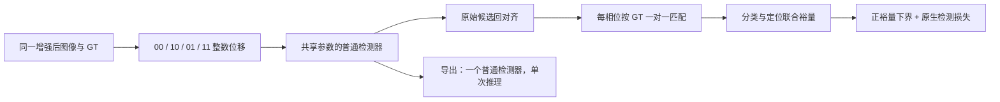
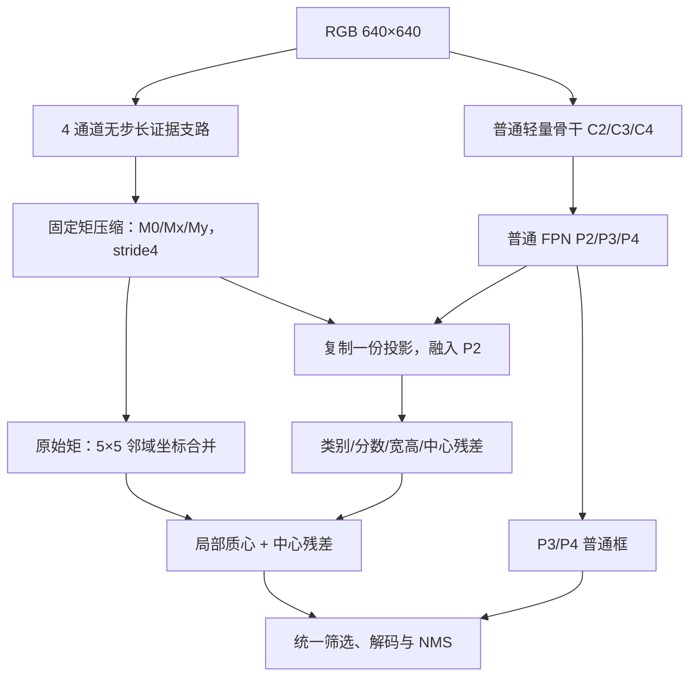
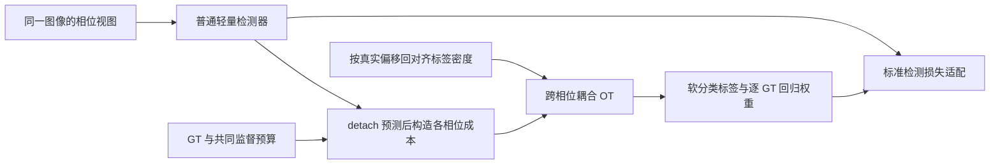

# 相位稳定性问题的三条独立解决路线与 SCI 论文方案

> 调研与设计日期：2026-09-12。对象：RGB 单帧无人机检测；目标：改善小目标检测及相位稳定性，并兼顾轻量模型与 RK3588 部署。
>
> 本文已阅读[原研究方案](F:/antiuav/TSCRNet/BCRNet-main/docs/数学启发的小目标轻量检测研究路线与完整方案.md)，并核对本地 YOLO11s、YOLO26s、CascadeRCNN、RT-DETR 的 DUT test 原始汇总。下述三条路线均为**待实现、待训练验证的研究设计**。现有实验是问题证据，不是这些新方法的性能证据。本文只进行了附录中的合成数值核对。

## 1. 优先级与选题结论

**综合推荐顺序：① 相位轨道检测裕量学习；② 守恒矩位置表征与轻量检测头；③ 相位耦合的软标签最优输运。**

三条路线分别干预检测决策、前向位置表征、训练标签分配，不能互相用一个损失权重替代。它们均不使用原方案的背景零空间、目标扰动模板字典、背景协方差及 Mahalanobis 可检测性保持目标，也不沿用原方案另外两条 Fisher 预算分配、量化判别间隔路线。

| 顺序 | 暂定方法名 | 数学起点 | 核心研究问题 | 推理结构变化 | 创新判断与排序理由 |
|---|---|---|---|---|---|
| 1 | **POML：Phase-Orbit Margin Learning，相位轨道检测裕量学习** | 有限集合最坏风险、均值—离散程度下界、集合匹配 | 同一目标在某个相位仍跨不过分类或定位的检测边界，如何直接保护它？ | 不变；只改训练 | 创新潜力中等，实施与证据匹配最好；能覆盖定位波动和置信度翻转，不依赖先确认哪个采样层有问题 |
| 2 | **CMT-Det：Conservative Moment Transport Detector，守恒矩输运检测器** | 离散测度的零阶/一阶矩、可加性、局部矩合并；有限新息率作为启发 | 下采样后能否用很少的数，同时保留目标证据总量和格内位置？ | 增加极窄全分辨率证据支路，修改最细层中心解码 | 三者中结构差异最明确、数学—模块对应最强；但证据学习、背景污染和部署收益的风险更高 |
| 3 | **PCOT：Phase-Coupled Optimal Transport，相位耦合最优输运分配** | 熵正则最优输运、强凸优化稳定性、质量保持的坐标输运 | 目标移动一像素，训练监督是否因硬分配切换而不连续，能否控制这种切换？ | 不变；替换训练分配器 | 潜在贡献集中，但“监督切换是当前问题的重要来源”尚未被现有输出实验验证，因此先做诊断再投入 |

这里的排序是研究投入顺序，不是对未来 AP 的预测。**如果论文必须以“新的模型结构”为第一创新点，应优先开发第 2 条，同时把第 1 条作为强对照。** 如果允许把训练方法作为核心贡献，第 1 条更适合先开展最小闭环。

这不是“先给模型加三个模块”的方案。建议先独立验证一条主线；只有互补性得到证据支持时，再研究组合。

### 1.1 关于新颖性的表述

截至本次检索，没有找到与本文三套完整定义完全相同的公开方案；但这**不能证明从未有人提出**。尤其是鲁棒训练、矩定位、软标签分配都有成熟先例，单独更换术语不能构成创新。

本文给出的是可查新、可实现、可证伪的候选贡献。拟投稿时须进一步核对近邻全文、代码和新发表论文，并将创新范围限定到真正不同的机制与目标函数。下文不编写未经实验支持的“提高 X%”“达到实时性能”等结果。

## 2. 现有实验究竟支持什么

### 2.1 已核对的 DUT test 结果

主实验是模型预处理后的四个整数平移：

$$
\Phi=\{(0,0),(1,0),(0,1),(1,1)\}.
$$

这里的相位指相对离散采样网格的位置，不是傅里叶相位。目标尺寸采用当前 skill 的输入等效边长：

$$
s_{in}=\sqrt{w_{in}h_{in}}.
$$

下表读取各模型的 `summary_by_area_and_shift.csv`；百分数按现存结果换算，N 是 **clean GT 实例数，不是图片数**。

| 模型与协议 | Tiny / Small / Non-small 的 clean N | 三组 PFR | Tiny Conditional PFR | Tiny mean phase recall |
|---|---|---|---:|---:|
| YOLO11s，原实验协议 | 718 / 786 / 726 | 9.19% / 3.69% / 1.79% | 9.69% | 90.49% |
| YOLO26s，原实验协议 | 718 / 786 / 726 | 3.06% / 2.93% / 2.34% | 3.22% | 93.63% |
| CascadeRCNN，MMDetection 原生 keep-ratio + 右/下填充 | 716 / 782 / 706 | 11.87% / 6.39% / 1.27% | 28.62% | 35.51% |
| RT-DETR，common letterbox 640 | 718 / 786 / 726 | 10.58% / 8.78% / 14.74% | 11.43% | 88.13% |

数据来源：[YOLO11s](F:/antiuav/sensitivity_experiments/YOLO11s/DUT/test/summary_by_area_and_shift.csv)、[YOLO26s](F:/antiuav/sensitivity_experiments/YOLO26s/DUT/test/summary_by_area_and_shift.csv)、[CascadeRCNN](F:/antiuav/sensitivity_experiments/CascadeRCNN/DUT/test/summary_by_area_and_shift.csv)、[RT-DETR common](F:/antiuav/sensitivity_experiments/RTDETR/DUT/common_letterbox_640/test/summary_by_area_and_shift.csv)。

**可以把“相位相关检测不稳定确实存在”作为研究前提，但不能把“所有模型都在 Tiny 上显著更严重”作为已证明前提。**

- YOLO26s 的 Tiny−Small PFR 差值为 **0.138 个百分点**，95% bootstrap CI 为 **[−1.693, 1.748] 个百分点**，不能据此声称两组差异显著。见[组间比较](F:/antiuav/sensitivity_experiments/YOLO26s/DUT/test/paired_group_comparison.json)。
- CascadeRCNN 的 Tiny 四相位平均召回只有约 35.5%。始终漏检也会得到 PFR=0，因此稳定性必须与召回、Conditional PFR 一起解释。
- RT-DETR 存在 IoU 较稳定、confidence 却大幅翻转的实例；当前排查尚未确认具体 feature/query 层原因。见[反常排查报告](<F:/antiuav/TSCRNet/docs/RT-DETR PFR 反常排查报告.md>)。
- CascadeRCNN 与其他模型的几何和 clean 集合并不完全相同，表格是各自诊断结果，不能直接当作公平跨模型排名。

### 2.2 适合论文 Introduction 的问题表述

> 对空 RGB 检测中的小目标只有有限的可见证据。现有检测器对输入的一像素平移会产生实例级置信度和定位变化，并可能出现 Detect/Miss 翻转。与此同时，资源受限部署不适合依赖更大输入、宽通道的高分辨率网络或多次推理。本文因此研究：如何在固定或较小推理预算下，使有限位移集合中的目标检测保持正确，而不仅仅保持数值一致。

这一问题不预设所有失败都来自第一层 stride=2，也不要求小目标必须比所有其他组更差。它允许不同模型由不同环节产生不稳定。

### 2.3 统一目标：分类随目标保持，位置随平移变化

记图像平移为 $T_\delta$，输出框回对齐为 $T_{-\delta}$。理想关系为

$$
T_{-\delta}D_\theta(T_\delta x)\approx D_\theta(x),
$$

其中 $D$ 是带类别、分数和边界框的**集合**，不能按输出数组下标直接相减。

分类的目标是同一物体的语义与可靠性稳定；定位的目标是坐标等变。让两个相位输出完全相同的绝对坐标，会训练出错误定位。四个偏移也不是整个检测器所有 stride 的完整相位集合，更不是对任意平移的证明。

目标检测平移敏感性本身已有专门研究，其中也讨论过抗混叠、输出分辨率和分配不连续。因此论文的贡献必须是新的处理方法及证据，而非“首次发现检测器对一像素平移敏感”。[Manfredi & Wang, 2020](https://arxiv.org/abs/2008.05787)

## 3. 必须避开的近邻与简单改名

| 近邻工作 | 已有内容 | 本文新方案必须补上的差异 |
|---|---|---|
| [BlurPool，ICML 2019](https://proceedings.mlr.press/v97/zhang19a.html)；[LPS，NeurIPS 2022](https://arxiv.org/abs/2210.08001) | 抗混叠或多相位采样处理平移行为 | 不能只加低通/相位权重就称新方法 |
| [TIPS，WACV 2025](https://openaccess.thecvf.com/content/WACV2025/html/Saha_Improving_Shift_Invariance_in_Convolutional_Neural_Networks_with_Translation_Invariant_WACV_2025_paper.html) | 以 maximum-sampling bias 分析并学习多相采样；发表版含目标检测实验 | 原文遗漏的重要强近邻；比较时不能把它仅视为分类方法 |
| [CSD，NeurIPS 2019](https://papers.nips.cc/paper_files/paper/2019/hash/d0f4dae80c3d0277922f8371d5827292-Abstract.html) | 检测分类与定位的一致性学习 | 路线一必须超出一般的双视图一致性损失 |
| [Group DRO，ICLR 2020](https://arxiv.org/abs/1911.08731)；[FreeAnchor，NeurIPS 2019](https://arxiv.org/abs/1909.02466) | 最坏组训练；将候选匹配与检测目标结合 | 最坏风险、候选 bag 或匹配本身均不是路线一首创 |
| [Objects as Points](https://arxiv.org/abs/1904.07850)；[Integral Regression，ECCV 2018](https://openaccess.thecvf.com/content_ECCV_2018/papers/Xiao_Sun_Integral_Human_Pose_ECCV_2018_paper.pdf)；[DSNT](https://arxiv.org/abs/1801.07372) | 中心点检测；热图积分及连续坐标读出 | 路线二不能仅把 soft-argmax 改称“矩定位” |
| [GHS，2026 预印本](https://arxiv.org/html/2603.17098v1) | Gaussian-Hermite 矩与采样；正文给出 wrap-shift 条件下的不变性分析 | “用矩改善平移行为”已有近邻；本文要区分局部坐标矩输运与不变描述/重构 |
| [MCA，AAAI 2024](https://ojs.aaai.org/index.php/AAAI/article/view/28035)；[EMPEROR，2025 预印本](https://arxiv.org/abs/2509.16379) | 特征统计矩、通道注意力或分布描述 | 路线二使用坐标加权的一阶空间矩，不是特征值方差或高阶统计注意力 |
| [OTA，CVPR 2021](https://arxiv.org/abs/2103.14259)；[RFLA，ECCV 2022](https://arxiv.org/abs/2208.08738)；[NWD](https://arxiv.org/abs/2110.13389) | 最优输运分配、针对 tiny 的监督分配、平滑框距离 | 路线三必须证明跨相位耦合有价值，不能只更换距离或使用 Sinkhorn |

对于 GHS 等预印本，本文只用于识别方法重合风险，不把摘要中的广泛表述当作真实 RGB 检测的无条件定理。路线二需要对照其具体边界条件和中心化操作；不以“原文实验不是 DUT”回避方法近邻。

## 4. 方案一：相位轨道检测裕量学习 POML

### 4.1 拟题、摘要与核心贡献

**拟题：** *Phase-Orbit Detection Margins for Robust Tiny-Object Detection Without Additional Inference Cost*

**中文：** 面向极小目标的相位轨道检测裕量学习。

**研究设计摘要：** 微小平移可以改变检测器的置信度与定位，使同一物体在不同相位上跨越检测边界。常规平均检测损失对每个增强样本独立优化，一般一致性约束则不能排除“一致地漏检”。本研究拟将同一图像的有限整数平移视为一个监督单元，通过 GT 对齐的集合匹配构造同时约束分类与定位的检测裕量，并保护该裕量在轨道内的下界。方法保留原有背景监督与检测结构，只在训练期计算多个视图。实验将检验其在相同虚警预算下的召回、相位稳定性与部署后收益。

拟验证的贡献限于：

1. 将跨相位的“正确检测”表示为分类—定位联合可行裕量，区分稳定检出与稳定漏检。
2. 构造候选身份可变化、但 GT 身份保持的轨道目标，避免将 DETR 的 query 下标或 YOLO 的 anchor 下标误认为对象身份。
3. 验证训练期的相位风险控制能否改善轻量检测器，且不增加部署网络的参数、MAC 和视图数。

这些基础数学工具不是新定理；创新必须来自该问题定义、损失设计和实证结果的结合。

### 4.2 完整 story

> 小目标可见证据少，同一物体的分类分数或 IoU 容易因离散位置变化而越过检测边界。常规增强主要优化平均训练表现，不能保证同一物体的困难相位也被检出。受有限集合鲁棒优化启发，我们把同一物体的四个相位共同建模，直接提高最不利相位的分类—定位联合裕量；同时保持背景约束，防止靠增加误报换取召回。由于全部新增计算发生于训练，推理仍使用一次轻量检测器前向。

这里的“不能保证”不是说随机平移无效。**相同四视图下的普通增强训练是必须击败的第一强基线。**

### 4.3 数学定义：先把真正的检测条件写出来

对 GT $g_i=(b_i,c_i)$，第 $\phi$ 个相位的原始候选集合为

$$
\mathcal P_\phi=\{(p_{j,\phi},\hat b_{j,\phi})\}_{j=1}^{M}.
$$

候选必须读取阈值筛选、Top-K、NMS 之前的输出，框先减去输入偏移。单类别 DUT 中，$p$ 必须是实际使用的最终分数定义，例如载体的 objectness×class，不能随意用另一个中间 logit 替代。

预先定义训练参考分数 $t$、参考定位门槛 $u$、正的尺度平衡系数 $\alpha$。对候选与 GT 定义

$$
a_{ij,\phi}=\operatorname{logit}(p_{j,\phi})-\operatorname{logit}(t),
$$

$$
d_{ij,\phi}=\alpha\,[\operatorname{IoU}(\hat b_{j,\phi},b_i)-u],
\qquad m_{ij,\phi}=\min(a_{ij,\phi},d_{ij,\phi}).
$$

$m>0$ 表示该候选同时越过分数和定位门槛。只提高分类分数不能弥补低 IoU，只改善 IoU 也不能补偿置信度骤降。

多类别接入时，还应在 min 内加入正确类相对其他类的 logit 间隔；否则“正确类分数高”不一定代表实际输出类别正确。logit 计算用 FP32 并做数值截断，记录截断范围。

每个相位独立执行 GT—候选的一对一最大总裕量匹配，得到 $j_i(\phi)$，然后令

$$
m_{i,\phi}=m_{i,j_i(\phi),\phi}.
$$

对于单目标图像，该匹配退化为取最佳可行候选。多目标时一对一约束防止同一个候选同时“证明”两个 GT 都可检测。匹配索引停止梯度，梯度传给所选候选及原有检测损失。框无交叠时 IoU 梯度不足，由载体的 GIoU/DIoU/DFL 等原有监督提供优化方向。

若必须限制候选集合，应只用预注册的几何范围并提供每个 GT 的 fallback；不能先删除低分候选后再声称优化了原本漏检的对象。初版 DUT 的目标较少，可直接使用全部候选与小型矩形匹配矩阵。

### 4.4 有限相位的裕量下界

对 $K$ 个相位，定义总体标准差，分母为 $K$：

$$
\bar m_i=\frac1K\sum_\phi m_{i,\phi},\quad
\sigma_i^2=\frac1K\sum_\phi(m_{i,\phi}-\bar m_i)^2.
$$

存在基本不等式

$$
\min_\phi m_{i,\phi}\ge \bar m_i-\sqrt{K-1}\,\sigma_i\equiv\underline m_i.
$$

**推导：** 令 $a=\bar m_i-\min m_{i,\phi}$。其余 $K-1$ 个中心化项的和为 $a$，由 Cauchy–Schwarz，它们平方和至少为 $a^2/(K-1)$。故 $K\sigma^2\ge a^2+a^2/(K-1)$，整理即得。

对四相位，系数为 $\sqrt3$。若 $\underline m_i>0$，**在当前样本、当前四相位、当前训练门槛、当前匹配候选下**，每个相位都有不同 GT 可同时使用的合格候选。

这不是对未见图像、任意平移或最终 NMS 输出的认证。前后处理还会改变保留的候选，必须另外测量。也不把这一基本均值—方差不等式主张为新理论。

### 4.5 目标函数与防止虚假稳定

基础轨道损失为

$$
L_{orbit}=\frac{\sum_i w_i[\kappa-\underline m_i]_+^2}{\sum_i w_i},\qquad\kappa>0.
$$

建议初版 $w_i=1$；再单独比较 bounded tiny weighting，例如 Tiny=2、其他=1。不能同时改变大量尺度权重后把收益全归给相位设计。

实现时用 $\sqrt{\sigma_i^2+\epsilon_\sigma^2}$ 避免零方差处的数值问题；这会使下界稍保守，仍保留上述不等式方向。由于定位裕量上限为 $\alpha(1-u)$，应设置 $0<\kappa<\alpha(1-u)$。没有合法 GT 的图像令轨道项为零，仍完整计算原生背景损失。

总目标为

$$
L=\frac1K\sum_\phi L_{det}(T_\phi x,T_\phi G)
+\lambda_oL_{orbit}+\lambda_bL_{bg}.
$$

$L_{bg}$ 对各相位中的合法背景候选保留原生负样本目标，或增加固定数量的困难背景分数惩罚。背景候选须排除 GT 邻域、ignore 和 padding；它是普通负样本控制，不具有背景零空间消除的理论保证。初版可令 $\lambda_b=0$，先依靠完整原生背景损失；只有诊断发现误报上升才启用独立消融。

为什么这个目标不等价于只压低方差：若所有相位都为 $m=-1$，则 $\sigma=0$，但 $\underline m=-1$，仍会受到正裕量目标惩罚。它要求稳定地正确，而不是只要求稳定。

还必须比较更直接的目标：

$$
L_{worst}=\frac1N\sum_i\max_\phi[\kappa-m_{i,\phi}]_+^2.
$$

**均值—离散程度形式不保证优于直接 worst-phase loss。** 若后者一样好或更好，保留更简单版本，并把论文贡献缩小到检测联合裕量与对象级轨道监督；不要为了保留数学包装强行使用更复杂损失。

### 4.6 详细数据流与接口

| 环节 | 输入 | 输出及含义 | 运行阶段 |
|---|---|---|---|
| 共享基础增强 | 一张训练图像、原始 GT | 一张完成 resize/pad 的图像及输入坐标 GT | 训练 |
| 整数相位生成 | $B\times3\times H\times W$ | $K\times B\times3\times H\times W$；共享纹理与增强，仅位移不同 | 训练 |
| 共享检测器 | K 个视图，单套权重 | 各相位 raw class/box；普通 detection loss | 训练 |
| 坐标回对齐与匹配 | raw boxes、偏移、GT | $N_{GT}\times K$ 裕量矩阵 | 训练 |
| 轨道风险 | 裕量矩阵 | 标量损失、每尺度下界通过率 | 训练 |
| 导出检测器 | 训练后的普通权重 | 原载体完全相同的单视图检测图 | 推理 |



建议接口为 `raw_predictions(images)`、`decode_input_boxes(raw)`、`training_score(raw)`、`native_loss(raw, targets)`。YOLO、Cascade、DETR 各自适配这四项；不假设它们分数定义、候选身份和原生损失相同。

相位组必须共享基础增强。若载体使用 Dropout/随机深度，应在这项对照中关闭或共享随机掩码，并对基线采用相同设置；BatchNorm 的批次组成与统计更新策略也须固定记录。否则损失可能同时惩罚网络随机性，不能把全部效果解释为整数平移训练。

### 4.7 训练起点与资源账本

初版选 YOLO11s 做单变量实验；普通训练后前 5%–10% 的 warm-up 再线性开启 $\lambda_o$。建议起点：K=4、$u=0.5$、$t=0.25$、$\alpha=4$、$\kappa=0.2$、$\lambda_o\in\{0.05,0.1,0.2\}$。这是待验证的搜索空间，不是已调优参数。

训练门槛与最终 operational threshold 是不同角色。前者用于构造优化目标，后者仍在验证集按既定规则校准并冻结；不能用最终 test 值反向选择训练门槛。可在开发验证阶段比较少量门槛或预先定义门槛区间，不按 test 最佳 PFR 调参。

- 完整四视图训练大致需要四份前向/反向计算；峰值显存可用分批或重计算控制，仍须保留跨视图梯度关系。
- 若只对比例 $q$ 的 batch 使用四视图，粗略图像处理倍率为 $1+3q$，如 q=0.25 对应 1.75；它不是实际耗时承诺。
- 独立的普通四视图增强、普通一致性、POML 必须使用相同视图数、optimizer update 数和有效图像预算；另报原始单视图训练作为实际成本参考。
- 推理增加参数=0、结构增加 MAC=0，只要实现确实删除全部训练分支。训练免费、量化后效果不变、真实延迟绝对相同都需要各自核验，不能推定。

### 4.8 关键实验、失败条件与近邻边界

| 对照 | 回答什么 |
|---|---|
| 普通训练 / 同四视图平均训练 | 是否只是增加了训练数据和计算？ |
| 相同 GT 对齐的 score+box 一致性 | 是否只是 CSD 类一致性学习？ |
| 普通 detection loss 的四相位 max | 联合检测裕量是否优于直接鲁棒训练？ |
| 仅分类 / 仅定位 / 联合裕量 | 是否确实处理了两种失败模式？ |
| 方差约束 / 正裕量 / 完整形式 | 能否避免始终漏检与置信度整体抬高？ |
| 索引对应 / GT 集合对应 | 候选身份变化是否影响学习，特别是 query 检测器？ |
| 同 FP32 模型的 INT8 输出 | 稳定性收益能否保留到部署后？ |

主成功条件：相同误报预算下 Tiny all-phase recall 提高，phase0 dropout/Conditional PFR 降低，标准 AP 不因过度约束明显损伤。若仅 PFR 下降而 stable miss 增多、AP 下降，方法失败。

相对 [CSD](https://papers.nips.cc/paper_files/paper/2019/hash/d0f4dae80c3d0277922f8371d5827292-Abstract.html) 的候选差异是联合**正确检测边界**与对象轨道最不利状态；相对 [Group DRO](https://arxiv.org/abs/1911.08731) 的差异是对象级集合候选的构造，而不是把“相位”换成“组”的名称。相对 [FreeAnchor](https://arxiv.org/abs/1909.02466)，新增主张是跨变换联合裕量，不是重新发明学习匹配。若这些差异在强对照中没有独立收益，应承认创新不足。

### 4.9 建议论文结果章节

1. 不同模型的分数/定位失败分解，说明联合裕量的必要性。
2. 同训练预算的主比较：AP、all-phase recall、固定虚警召回。
3. 下界与实际翻转的关系，包括下界保守性和 NMS 后的反例。
4. 跨模型、第二数据集、多训练种子及 INT8 复核。
5. 对不可见目标、错误标注、后处理竞争的失败分析。

## 5. 方案二：守恒矩输运检测器 CMT-Det

### 5.1 拟题、摘要与核心贡献

**拟题：** *Conservative Spatial Moments for Phase-Stable Tiny-Object Localization in Lightweight Detectors*

**中文：** 面向轻量检测器的相位稳健空间矩表征。

**研究设计摘要：** 轻量检测器需要早期空间压缩，但单个粗网格标量难以同时描述目标证据强度和格内位置。本研究拟将少通道的全分辨率目标证据表示为非负离散测度，在压缩时显式保存每个单元的零阶与一阶坐标矩，再在最细检测层按坐标规则合并这些矩并读出中心。普通低分辨率语义通路负责类别、框尺寸和背景辨别。方法只承诺在指定条件下不额外损失已有证据的总量与质心，完整检测稳健性由实验验证。

拟验证贡献：

1. 将“是否有证据”和“证据在单元内部哪里”分开编码，构造可逐级合并的三通道空间矩接口。
2. 通过完整坐标换原点规则，把下采样前的格内位置信息显式传给轻量中心读出。
3. 验证该任务表征相对加宽浅层、普通 pooling、SPD 和普通热图偏移头，在同预算下的定位/稳定性价值。

### 5.2 完整 story

> 小目标由很少的有效像素支持。早期压缩如果只保留一个强度或一般混合特征，后续网络可能需要重新推断已经被折叠的格内位置。受可加测度与矩守恒启发，我们不要求保存全部纹理，而是让一条极窄支路先产生目标证据，再把“证据总量、横向一阶矩、纵向一阶矩”保留到检测层。这样即使证据跨过粗网格边界，也可通过合并相邻单元恢复其整体质心，普通语义通路继续完成目标识别和尺寸回归。

[有限新息率采样](https://bigwww.epfl.ch/publications/vetterli0201.html)提示低自由度目标可能用任务所需统计描述；本文并不使用其完整重构算法，也不假设自然 RGB 无人机都是 Dirac 信号。

### 5.3 严格定义“证据”，避免把图像亮度当目标

先用一个无步长的极窄网络产生

$$
Z=h_\theta(X)\in\mathbb R^{B\times1\times H\times W},\qquad E=\operatorname{ReLU}(Z)\ge0.
$$

E 是**学习到的非负定位证据**，不是图像亮度、物理能量、真实前景分割或已知目标密度。局部背景若也激活，它同样被后续矩运算保存，不能声称守恒自动抑制背景。

为了避免 E=0 附近的 ReLU 梯度阻断，辅助监督同时作用于截断前 Z：对 GT 中心构造训练 heatmap H，采用前景/背景分别归一化的 Huber(Z−H)。最终证据卷积可用小正 bias 初始化；这种初始化不属于研究贡献。

H 的构造只用训练框：每个对象一个中心核，离散核归一化为单位总量，宽度可从 `clip(min(w,h)/6, 0.75, 1.5)` 起步并在 3σ 截断；不同实例相加。它是监督模板，不声称 bbox 内是真实前景。初版同时给所有尺寸对象产生中心监督，重点评价 Tiny；不靠 test 尺寸切换推理分支。

### 5.4 每个粗单元保存什么

把像素中心坐标取为整数，步长 s 的单元为 $\Omega_k$，单元中心为 $o_k=(o_k^x,o_k^y)$。定义

$$
M_{0,k}=\sum_{u\in\Omega_k}E(u),
$$

$$
M_{x,k}=\sum_{u\in\Omega_k}(u_x-o_k^x)E(u),\quad
M_{y,k}=\sum_{u\in\Omega_k}(u_y-o_k^y)E(u).
$$

输出是 $B\times3\times H/s\times W/s$。M0 表示证据总量，Mx/My 表示该单元内部的坐标加权偏移，可正可负。不能对 Mx/My 再做 ReLU，也不能在需要严格矩关系的传递路径里对三个通道独立做 BN。

对于 s=4，这一运算可以直接由三个固定 4×4、stride=4、无 bias 的卷积核实现：全 1、横坐标 $(-1.5,-0.5,0.5,1.5)$、纵坐标对应核。它们作用于**已经学习出的 E**，不是原方案中作用于 RGB 的背景消除滤波器。

**半像素坐标约定必须统一。** 上述公式把数组索引 0 的像素中心记为 0，因此 $o_k^x=sk_x+(s-1)/2$。若框接口使用图像边缘为整数、像素中心为 0.5 的常见约定，构造证据监督时应将框中心减去 0.5，解码回该接口时再加上 0.5。也可以全程使用像素中心 u+0.5、单元中心 sk+s/2；两种方式的相对矩核相同，但不能混用绝对坐标。

### 5.5 可证明的性质与不能证明的部分

若区域 R 由完整单元组成，则

$$
A_R=\sum_{k\subset R}M_{0,k},\quad
B_R^x=\sum_{k\subset R}(M_{x,k}+o_k^xM_{0,k}),
$$

$$
B_R^y=\sum_{k\subset R}(M_{y,k}+o_k^yM_{0,k}),\qquad
c_R=(B_R^x,B_R^y)/A_R.
$$

因此，矩表征恢复的区域总量和一阶矩与直接从 E 逐像素求和**完全相同**，只存在浮点误差。普通 M0-only 池化无法仅凭单个单元总量区分其内部两个位置。

当证据场满足 $E_\delta(u)=E_0(u-\delta)$，且同一目标的全部证据均包含在读出区域中、没有新增背景/邻居证据时，

$$
A'_R=A_R,\qquad c'_R=c_R+\delta.
$$

这保证的是**已有证据的矩统计**，不是任意学习特征的无损压缩，更不是整网检测等变。实际固定读出窗口不一定随目标精确移动；目标尾部、背景和邻居进入/离开窗口会破坏条件。即使整个图像总量守恒，某个固定局部窗口的量也可能不守恒。

第一阶空间矩属于经典坐标统计，不能把上述恒等式当作新定理。新的可研究点是：在轻量检测中将它作为受预算限制的位置状态从高分辨率支路传到检测头，是否比隐式学习更有效。

### 5.6 逐级合并时不能遗漏的换原点项

若子单元 a 合并到中心为 O 的父单元，则

$$
M_0^{parent}=\sum_aM_{0,a},
$$

$$
M_x^{parent}=\sum_a[M_{x,a}+(o_a^x-O_x)M_{0,a}],
\quad
M_y^{parent}=\sum_a[M_{y,a}+(o_a^y-O_y)M_{0,a}].
$$

直接 sum/average Mx 和 My 会丢掉不同子单元之间的相对位置，破坏方案。原型可先使用一次 4×4 压缩，确认效果后才比较逐级合并。

### 5.7 完整网络与数据流

采用一个普通轻量 FPN 检测器作为语义通路，或在统一载体上建立以下研究原型。所有普通块都是工程载体，不主张创新：

- `D(a,b)`：DW 3×3 stride2 + PW 1×1，BN/激活采用载体标准定义。
- `R(c)`：DW 3×3 stride1 + PW 1×1，残差连接。
- 输入 640×640；各比较使用相同骨干、颈部和训练资源。

| 模块 | 操作 | 输出形状（省略 B） | 含义 |
|---|---|---|---|
| 普通 stem | Conv 3×3，3→24，s2 | 24×320×320 | 语义通路入口 |
| C2 | D(24,48)+2R(48) | 48×160×160 | 浅层细节 |
| C3 | D(48,96)+2R(96) | 96×80×80 | 中层语义 |
| C4 | D(96,160)+3R(160) | 160×40×40 | 上下文 |
| P4/P3/P2 | 投影、最近邻上采样相加、R | 96×40×40 / 64×80×80 / 48×160×160 | 三尺度检测特征 |
| 证据支路 | Conv3×3 3→4，s1；DW3×3 4，s1；PW4→1 | Z、E：1×640×640 | 极窄的全分辨率定位线索 |
| 矩压缩 | 固定 Conv4×4，1→3，s4 | M：3×160×160 | 单元总量及格内位置 |
| 语义融合 | P2 + Conv1×1(M,3→48) | 48×160×160 | 语义头读取矩信息；原始 M 旁路保留 |
| 矩读出 | 固定 5×5 窗口的坐标合并 | A、Nx、Ny：3×160×160 | 以每个 P2 单元为中心的局部总量/一阶矩 |
| P2 head | 普通分类、尺寸、中心残差 | 每位置 K+5 个数及矩读出 | objectness、K 类分数、2 个 log 尺寸、2 个中心残差 |
| P3/P4 head | 普通检测头 | 载体标准格式 | 保留一般目标能力 |
| 后处理 | 框解码、统一筛选/NMS | 类别、分数、原图框 | 单帧检测结果 |



整个过程没有第二次图像推理、ROI 动态采样或推理时的 GT。5×5 是粗网格邻域，s=4 时覆盖 20×20 输入像素。窗口大小是开发验证参数；不根据 test 案例逐图选窗口。

### 5.8 中心读出、训练损失与背景处理

对中心单元 k、邻域 $\mathcal N(k)$，计算

$$
A_k=\sum_{q\in\mathcal N(k)}M_{0,q},\qquad
N_{x,k}=\sum_q[M_{x,q}+(o_q^x-o_k^x)M_{0,q}],
$$

纵向同理。最终框中心为

$$
\hat c_k=o_k+\frac{(N_{x,k},N_{y,k})}{\max(A_k,\epsilon)}+r_k.
$$

$r_k$ 是由语义特征预测的残差，宽高正常回归。$A$ 很小时，读出不可靠；应记录低质量区域占比，用既有分类分数筛除。数值 epsilon 与最终分数阈值不是同一个量。残差加入后，不能再宣称最终框中心具有严格矩等变性。

总损失建议为

$$
L=L_{det}+\lambda_hL_{heat}(Z,H)+\lambda_cL_{centroid}+\lambda_rL_{residual}.
$$

- $L_{heat}$：前景支持域和合法背景分别归一化的 Huber，防止大量背景主导；ignore/padding 不参与。
- $L_{centroid}$：训练中仅在 GT 分配到的正窗口、且未包含其他 GT 的区域，对矩读出中心施加按宽高归一化的 SmoothL1。窗口内目标证据被截断时记录并降级，不把它当严格定理案例。
- $L_{residual}$：小权重的归一化残差惩罚，检验模型是否真的使用矩通路；不允许靠无限增大该项压制正确框回归。
- 复杂背景靠真实监督、语义通路和负样本学习处理，背景响应必须作为关键失败诊断。

$\lambda_h,\lambda_c$ 可从 0.1 级别、$\lambda_r$ 从 $10^{-3}$ 起步，并比较辅助梯度与检测梯度。所有含证据支路的强对照使用相同 heatmap 辅助监督，以排除“多了一个训练任务”这个解释。

### 5.9 计算量、显存与 RK3588 可行性

上述 4 通道支路，640 输入，新增卷积 MAC 解析账本如下：

| 新增操作 | MAC |
|---|---:|
| 全分辨率 3×3，3→4 | 44,236,800 |
| 全分辨率 DW 3×3，4 通道 | 14,745,600 |
| 全分辨率 1×1，4→1 | 1,638,400 |
| 矩压缩 4×4，1→3，stride4 | 1,228,800 |
| 邻域读出按普通稠密 5×5，3→3 计 | 5,760,000 |
| 矩投影 1×1，3→48 | 3,686,400 |
| **合计** | **71,296,000 MAC，约 0.143 GFLOPs（2×MAC）** |

这里不含激活、相加、除法、框解码、语义主干和训练反向；不是全模型 FLOPs 或设备速度。单个 4×640×640 的 FP32 张量为 **6.25 MiB**，实际峰值还要考虑其他激活和工具链缓存。

如果在已有无 P2 的模型上新增 P2，P2 的完整颈部、预测位置及后处理成本必须另算。不能用这 0.143 GFLOPs 掩盖增加高分辨率检测头的开销。

固定矩核、普通卷积与加法有利于导出，但 NPU 对精确张量形式、量化尺度和除法的支持要实测。可让 NPU 输出 A/Nx/Ny 与 raw heads，在原有 Top-K 之后由 CPU 计算少量质心除法；这个 CPU 成本仍计入端到端延迟，不属于另立的图优化创新。[RKNN Toolkit2 官方项目](https://github.com/airockchip/rknn-toolkit2)

量化需特别检查：非负 E 的微小值被舍零、Mx/My 的有符号动态范围、累加重定标、低 A 的除法放大。FP32 下的矩恒等式不自动延续到 INT8。

### 5.10 相对已有方法与原方案的精确区别

| 方法 | 它保存/处理什么 | 与 CMT-Det 的差异 |
|---|---|---|
| 原 BCPS | 背景约束下，线性采样核保留模板的可检测性 | CMT 不构造背景子空间或噪声距离；学习证据后显式传递坐标矩 |
| SPD-Conv | 空间到通道重排，再学习混合 | CMT 用三种任务统计压缩 E，不保存全部相位纹理；不声称可逆 |
| Integral Regression / DSNT | 从热图积分得到坐标 | CMT 把格内一阶矩保存在**热图被压缩的过程中**，并随区域合并换原点；不是只在低分辨率最终热图上积分 |
| GHS | 用 Gaussian-Hermite 矩和中心化/重构处理平移行为 | CMT 不建立全局不变描述或中心化重构，保留绝对位置并要求局部坐标等变 |
| MCA / EMPEROR | 特征值的统计矩或分布描述 | CMT 的矩为坐标×证据，不是特征值高阶统计 |
| 普通 P2/中心偏移头 | 用高分辨率特征学习位置与偏移 | CMT 显式携带压缩前的一阶坐标状态；必须证明优于同预算直接回归 |

相关依据：[SPD-Conv](https://arxiv.org/abs/2208.03641)、[Integral Regression](https://openaccess.thecvf.com/content_ECCV_2018/papers/Xiao_Sun_Integral_Human_Pose_ECCV_2018_paper.pdf)、[DSNT](https://arxiv.org/abs/1801.07372)、[GHS 正文](https://arxiv.org/html/2603.17098v1)、[MCA](https://ojs.aaai.org/index.php/AAAI/article/view/28035)、[EMPEROR](https://arxiv.org/abs/2509.16379)。

### 5.11 必须开展的消融与否定条件

核心消融必须共用同一支路、head 和辅助监督：M0 only；M0+Mx+My；三个自由学习压缩核；相同输出宽度的 SPD 投影；低分辨率热图+直接 offset；低分辨率积分读出；完整 CMT。M0-only 也要保留三个输入位置，用固定零通道补齐，避免 head 参数量变化。

另外比较同 MAC 的浅层加宽、s=2/4/8、读出窗口3/5/7、残差开/关。先做单个已学习证据 blob 穿越单元边界，再做真实天空/纹理背景，最后做双目标间距实验。

失败条件包括：

1. 只有理想证据场质心精确，真实 E 一直被背景主导。
2. 普通三通道学习压缩核或普通 offset 在同监督/预算下效果相同。
3. 最终中心残差完全抵消矩读出，说明显式矩通路没有使用价值。
4. 相邻目标合并成一个质心，在密集场景出现明显倒退。
5. 精度收益被高分辨率访存、量化舍零或后处理延迟抵消。

**三个矩不能普遍区分多个目标。** 同一窗口内两个同类目标可能产生一个位于中间的质心，这是信息不足，不是再加一个注意力就能自动解决。初版更适合稀疏对空目标；必须报告多目标失败。若需要一般拥挤检测，应另研究实例化证据槽或更丰富表征，其成本和贡献不能偷算进当前版本。

### 5.12 建议论文结果章节

1. 用已知 E 验证格内定位与跨单元合并，展示条件成立/不成立两类例子。
2. 真实 E 的中心偏差、背景占比、截断量与检测错误的关联。
3. 标准 AP75、中心归一化误差、定位稳定性和召回。
4. 同监督、同宽度、同设备延迟的三层对照。
5. INT8、低分母、多目标及复杂背景失败分析。

## 6. 方案三：相位耦合软标签最优输运 PCOT

### 6.1 拟题、摘要与核心贡献

**拟题：** *Phase-Coupled Optimal Transport for Stable Supervision in Tiny-Object Detection*

**中文：** 通过相位耦合最优输运稳定极小目标的训练监督。

**研究设计摘要：** 小目标仅覆盖少量网格，硬中心约束、Top-K 或离散匹配可能随一像素平移切换监督位置。单相位自适应分配并未显式约束同一物体跨相位的监督分布。本研究拟将多个相位的 GT—候选分配联立为带熵正则的最优输运问题，在固定每个目标监督总量与候选容量的同时，对回到共同坐标的软标签分布施加耦合约束。部署时移除分配器，保留普通轻量检测结构。该路线首先需要验证监督不连续与实际翻转之间的联系。

拟验证贡献：

1. 在目标尺度与整数相位的联合条件下，测量监督分配的空间变化及优化冲突。
2. 联立不同相位的软分配，保留每目标监督总量，且避免将相同网格下标错误地视作相同物理位置。
3. 在标准检测损失下隔离分配连续性的影响，验证它是否能改善推理稳定性。

### 6.2 完整 story

> 小目标落在少数候选网格附近，离散位置变化可能让正样本从一个网格跳到另一个，或者让一个阶段/层级失去正样本。网络不仅面对输入的变化，还面对自身训练目标的突变。受熵正则最优输运与优化稳定性启发，我们让每个目标的监督作为固定总量在邻近候选间连续分配，并联合约束同一目标在不同相位的分配。这样尝试减少由监督切换放大的响应不稳定，推理继续使用原来的轻量模型。

**这是一条待检验的机制假设。** 输出 PFR 不能证明训练时发生了重要的标签冲突。已有研究已讨论输出网格与匹配切换，[2020 年的检测平移研究](https://arxiv.org/abs/2008.05787)就是直接近邻；PCOT 的潜在贡献只能是新的联合分配方法与机制实验。

### 6.3 进入实现前的监督诊断

在训练集抽取固定子集；冻结一个早期和一个后期 checkpoint，使用其原生分配器为四相位生成训练标签，读取：

- 每 GT 正样本数量、无正样本比例、跨 FPN 层分配比例。
- 各相位正样本坐标回对齐后，监督质量在局部区域间如何变化。
- 回对齐后的分类梯度方向是否更冲突，是否集中于 tiny 和翻转实例。
- 用相同特征/预测，只改变 GT 的受控位置时，分配器本身的跳变。

第三项仅为相关证据；改变分配器并保持其他条件相同的重训，才是因果干预。不能把正样本 ID 变化直接判为错误：目标移动后，正确的正样本本就应移动。重要的是**物理坐标回对齐后多余的、不必要的监督变化**。

如果原分配已经相当平稳、GT 监督完整，且监督变化与翻转关系弱，则降低此路线优先级。尤其不能仅凭 RT-DETR 的异常就断言 Hungarian 匹配有问题。

### 6.4 表示 GT—候选之间的软分配

首先在具有固定网格的轻量单阶段检测器实现。令一张图像有 n 个 GT、m 个有效网格候选；每个相位定义

$$
\Pi^\phi\in\mathbb R_+^{(n+1)\times m},
$$

第 i 行为目标 i，第 0 行为背景，$\pi_{ip}^\phi$ 表示候选 p 接受目标 i 监督的权重。

采用共同边际约束：

$$
\sum_p\pi_{ip}^\phi=k_i,\qquad
\sum_{i=0}^{n}\pi_{ip}^\phi=1,
$$

$$
k_0=m-\sum_{i=1}^{n}k_i\ge0.
$$

每个候选容量为 1；不同对象竞争通过联合优化处理，不允许一个位置被多个对象同时赋予完整正标签。初版 $k_i=4$ 可作为起点，并与载体的典型正样本数对照；同一图像的所有相位必须使用同一组 k，不能让每相位各自的 dynamic-k 又引入总量切换。

当目标过密导致 $\sum_i k_i>m$ 时，应降低共同预算，或明确该配置不可行并记录；不能静默丢 GT。纯负图像直接由背景行承担全部容量。

### 6.5 平滑几何先验与运输成本

在输入空间用 GT 中心与宽高构造一个归一化高斯几何先验 $g_i(u)$。其作用是表达哪个网格附近适合监督，不声称等同于真实感受野。

对候选单元 $\Omega_p^\phi$，使用面积积分而非仅在中心点采样：

$$
q_{ip}^\phi=\int_{\Omega_p^\phi}g_i(u)\,du.
$$

对于轴对齐独立高斯，q 可由两个一维 CDF 差相乘计算，全部发生于训练期。用固定最小方差避免几乎零宽度的硬标签。FPN 多层时，每层先验单独归一化，再乘预注册层权重；层权重在同一相位组内相同。

这里将候选单元 $\Omega_p^\phi$ 回移到共同输入坐标，故 g 保持原 GT 中心；等价实现是保留每相位的原生网格，并将高斯中心平移到 $b_i^\phi$。二者选一，不能同时平移网格和 GT。有效候选取所有相位共同合法的固定集合，以保持下面的共同边际可行域。

候选成本建议为

$$
C_{ip}^\phi=\lambda_g[-\log(q_{ip}^\phi+\epsilon_q)]
+\lambda_c\,\ell_{cls}(p_p^\phi,c_i)
+\lambda_r\,\ell_{box}(\hat b_p^\phi,b_i^\phi).
$$

背景成本使用负分类损失。框成本用固定版本的原生 IoU/GIoU 等；NWD 作为独立成本对照，而不是默认再增加一个“创新距离”。

成本中的模型预测先 detach；否则网络可能通过操纵分配而逃避监督。初期可仅用几何成本 warm-up，再逐步开启预测质量项。小概率 q 在 FP32/log-space 处理，不在 FP16 中直接求指数。

高斯标签、平滑框距离和小目标分配不是新内容，必须对照 [RFLA](https://arxiv.org/abs/2208.08738)、[NWD](https://arxiv.org/abs/2110.13389)以及[2026 年的 Normalized Gaussian Label Assignment](https://www.mdpi.com/2072-4292/18/3/396)。区别不在高斯公式，而在下一节的跨相位联合约束。

### 6.6 将不同相位的标签输运回共同坐标

若检测层 stride=s，输入平移 1 像素相当于该层平移 $1/s$ 个网格。不能将标签图向旁边直接移一格，也不能要求同一网格下标的标签保持不变。

将每个网格的软权重看作对应单元上的均匀密度，按单元与共同参考网格的面积重叠构造线性输运算子 $S_\phi$。它将标签场回移 $-\delta$，并满足内部区域的非负、总量保持。用显式 halo 接收平移到外部的质量，不采用截断后偷偷重归一化的方式。背景行不加入对象间耦合，避免背景总质量压倒前景。

共同坐标下的每 GT 归一化标签为

$$
\tilde a_i^\phi=S_\phi(\pi_i^\phi/k_i).
$$

这是**标签密度的近似坐标对齐**，不是图像插值，也不是真实特征等变保证。面积重分配会产生平滑，存在偏差；需要单独对照“相同重分配的普通软标签训练”。有限网格下不应强迫该误差精确为零。

### 6.7 联立优化问题

在共同边际的可行集合 $\mathcal U$ 上求

$$
\min_{\{\Pi^\phi\in\mathcal U\}}
\sum_\phi\left[\langle C^\phi,\Pi^\phi\rangle+
\varepsilon\sum_{ip}\pi_{ip}^\phi(\log\pi_{ip}^\phi-1)\right]
+\frac\gamma2\sum_{i=1}^n\sum_{\phi<\psi}
\|\tilde a_i^\phi-\tilde a_i^\psi\|_2^2.
$$

三个部分分别负责：每相位检测质量、避免硬分配突跳、控制同一目标回对齐后的监督差异。

- $\gamma=0$：独立相位的熵正则分配，是核心消融。
- $\varepsilon\to0$：逼近硬分配，平稳性可能减弱。
- $\gamma$ 太大：可能把标签过度扩散到弱候选，损伤定位和精度。

设成本、候选集合、S 与边际固定，且 $\varepsilon>0$。线性成本加严格凸熵项、凸二次耦合，在非空可行集合上给出唯一的软最优解。由于列容量为 1，各 $\pi\le1$，熵项在内部的 Hessian 对角元为 $\varepsilon/\pi\ge\varepsilon$。在固定可行域和适当内积范数下，标准强凸稳定性论证给出

$$
\|\Pi^*(C+\Delta C)-\Pi^*(C)\|_F
\le\frac{\|\Delta C\|_F}{\varepsilon}.
$$

推导用最优性不等式相加，再结合强单调性与 Cauchy–Schwarz 即可。该界针对堆叠的多相位计划，条件是成本之外的项没有变化。**它不说明输入平移到网络输出是 Lipschitz 的，也不适用于变动 Top-K、候选数量、边际或坐标输运算子的情况。**

熵正则及 Sinkhorn 来自已有最优输运研究，不主张首创。[Cuturi, NIPS 2013](https://proceedings.neurips.cc/paper_files/paper/2013/hash/af21d0c97db2e27e13572cbf59eb343d-Abstract.html)

### 6.8 实现算法：不能把耦合问题误写成一次普通 Sinkhorn

普通 [OTA](https://arxiv.org/abs/2103.14259)已经用运输成本和 Sinkhorn 求分配；PCOT 增加了相位间二次耦合。它不能简单地把成本输入一次独立 Sinkhorn 就得到联合最优解。

一个可实现的原型流程为：

1. 每相位以 $\gamma=0$ 的熵正则 OT 初始化计划。
2. 对当前全部计划计算跨相位耦合梯度。
3. 进行 exponentiated-gradient / mirror-descent 更新。
4. 对每相位用 log-space Sinkhorn 做到共同边际的 KL 投影。
5. 按预设边际残差和相对目标变化判断收敛，必要时回溯调整步长。
6. detach 最终计划，将它作为分类与框损失的软权重。

具体地，令 Q 为二次耦合项，当前计划为 Π，则完整目标梯度为 $G=C+\varepsilon\log\Pi+\nabla Q$。在正计划上计算 $\log Z=\log\Pi-\eta G$，再做 $\Pi^{new}=\operatorname{KLProj}_{\mathcal U}(Z)$。零边际行应预先剔除；其余计算在 log-space 中完成，避免显式指数下溢。若采用只对 C+Q 求梯度、把熵作为近端项的另一种 mirror-descent 形式，必须同步改写更新公式，不能遗漏或重复计算熵。

例如可从 20–50 次外层更新、每次 20 次内层投影开始，边际相对残差阈值设 $10^{-3}$；这些是待 profiling 的原型参数，不是收敛保证。达到迭代上限但未收敛时必须标记，不把其输出报告为精确 OT 解。

普通前向依然只执行载体模型。当前主版本不额外加入 POML 或 feature consistency，以便单独判断“改变监督分配”是否有效。

### 6.9 训练标签与数据流

单类别时 $y_p=\sum_{i>0}\pi_{ip}\in[0,1]$；多类别时 $y_{p,c}=\sum_{i:c_i=c}\pi_{ip}$。分类损失使用支持软标签的 BCE/Focal，回归对不同对象分别加权后求和：

$$
L_{box}=\frac{\sum_{i,p}\pi_{ip}\ell_{box}(\hat b_p,b_i)}{\sum_{i>0}k_i}.
$$

**不能先把多个 GT 的坐标求加权平均，然后回归一个虚构的框。** 带 objectness、quality 或 DFL 的载体须明确这些分支的软标签适配，不能把连续权重直接交给只接受布尔 positive mask 的实现。

| 模块 | 输入 | 输出 | 含义 |
|---|---|---|---|
| 普通检测器 | 两/四相位图像 | $K\times B\times m\times(K_{cls}+4)$ 等 raw 数据 | 载体原始预测，实际分支维度按框架适配 |
| 成本构造 | detached 预测、GT、网格位置 | $K\times(n+1)\times m$ | 每相位运输成本 |
| 坐标输运 | 偏移、stride、网格边界 | 稀疏线性算子 S | 标签回到共同物理坐标 |
| 联合软分配 | C、S、共同 k | $\Pi^1,\dots,\Pi^K$ | 满足容量与总量条件的软监督 |
| 原生损失适配 | raw 预测与 detached Π | 标量梯度目标 | 只训练原检测器 |
| 导出 | 训练后的载体 | 原单视图推理图 | 推理没有 OT、CDF 或相位分支 |



### 6.10 初版配置、复杂度与适用范围

建议在 YOLO11s 或固定 FCOS/YOLOX 载体上先比较两个视图，再做四相位确认。预测图像位移要发生在几何增强之后；相位间不使用独立 Mosaic、裁剪和颜色增强，否则监督差异含有其他原因。

成本归一化后，可从 $\varepsilon\in\{0.05,0.1,0.2\}$、$\gamma\in\{0,0.1,1\}$、k=4/8 开始开发验证。ε 的数值依赖成本量级，必须同时记录成本分布、计划熵和有效正样本数。

存储为 $O(Knm)$，不是 $O(m^2)$ 的全候选两两距离矩阵。对稀疏对空图像，n 通常较小，但 m 包含高分辨率 FPN 时仍应测训练耗时。对候选进行裁剪的任何加速都可能破坏固定可行域假设，须保留完整版本作为正确性参考。

推理参数与图不变，OT 不进入 RKNN；不能因此说训练时间不增加。

**RT-DETR/Cascade 的接入是扩展研究，不是当前零成本通用接口。** Query 和 proposal 并非固定网格点，没有现成的 S。若要接入，必须定义共同 proposal/reference-point 空间或另一种对象级输运关系，并重新验证；不能照搬 dense 网格插值后声称所有框架兼容。

### 6.11 创新边界、消融和否定条件

相对 OTA，候选差异在于**同一目标多相位计划的联立与坐标耦合**；相对 RFLA/NWD，高斯或框距离只是成本组件。没有跨相位耦合时，不能再称为 PCOT 的完整核心贡献。

必做消融为：原生分配；相同视图普通分配；独立软 OT；独立软 OT + 相同面积回对齐；耦合 OT；强制相同网格下标的错误耦合作为诊断；独立/共同 k；仅几何/逐步加入预测成本。错误耦合用于证明坐标处理的重要性，不能作为击败主流方法的主要对照。

成功证据应形成顺序链：回对齐后额外的监督变化降低 → 梯度冲突减少 → 同条件重训后的 all-phase recall 或实际 AP 改善。中间两项下降但检测无收益，只能支持监督更平滑，不能支持方法有效。

否定条件包括：原生分配已经稳定；独立软 OT 获得全部收益；耦合仅增加标签模糊；训练慢到无法满足研究预算；推理 PFR 降低仅因预测置信度整体缩小。这些情况应收缩或放弃故事。

### 6.12 建议论文结果章节

1. GT 位移穿越网格边界时的监督轨迹，而不仅是标签热图。
2. 成本扰动、标签总量、熵、边际残差和收敛曲线。
3. 同四视图预算的 OTA/RFLA/NWD/普通一致性强对照。
4. 监督变化、梯度冲突与最终检测行为之间的联系。
5. 密集目标、低质量标注和不同载体的适用边界。

## 7. 三条路线如何比较与选择

### 7.1 对应不同的可检验瓶颈

| 诊断发现 | 优先路线 | 关键干预 |
|---|---|---|
| 框还较准，但分数跨相位翻转；或者正确候选只在部分相位出现 | POML | 在对象级监督中直接保护分类/定位可行裕量 |
| 下采样前存在可用定位证据，压缩后格内中心信息明显不稳定 | CMT-Det | 显式保存并输运零阶/一阶坐标矩 |
| 回对齐后的训练标签或层级预算有明显额外切换，并与错误相关 | PCOT | 稳定共同坐标中的软监督分配 |

上述三种原因可能共存，也可能只有一种重要。先识别与干预，再决定是否组合，不能为了有三个贡献点预先把三条路线全部放进一个网络。

### 7.2 对本课题的投入建议

1. **立即推进 POML 的小规模对照。** 它与已有输出证据直接相连，保留成熟模型结构，失败也能帮助判断普通增强是否足以解决大部分问题。
2. **同步进行 CMT 的证据场可行性检查，但先不全量训练。** 在训练集上确认窄支路能否提供位置有用的 E，再判断是否值得做完整检测器。若强调模型结构创新，它是三者中更合适的主候选。
3. **PCOT 先诊断后投入。** 先记录分配，不直接写大型求解器。若大量不稳定与分配无关，应把有限资源投入前两条。

POML 与 CMT 的组合只能在各自相对公平基线有独立收益后研究。组合的最低证据是 2×2 消融：baseline、POML、CMT、POML+CMT；不能只展示组合优于 baseline。

### 7.3 “足以成为 SCI 论文”的最低论证标准

SCI 是索引体系，不是统一创新门槛。无论目标期刊如何，下述问题都必须有答案：

- 方法与最相近工作有何形式上可检查的区别？
- 区别是否产生独立收益，而不是更多训练、参数、输入分辨率或辅助监督？
- 指标改善是否意味着检测更正确，而不是稳定漏检或阈值移动？
- 数学成立的范围与实际网络之间有哪些近似，实验是否验证了这些近似？
- 在轻量化和设备预算下，精度—稳定性—延迟关系是否仍有价值？

三条路线都不适合用“某数学理论启发 + YOLO + 注意力 + 新损失”这样的模块堆叠作为主要论证。

## 8. 三条路线共用的论文实验协议

### 8.1 数据划分与确认集

开发可以使用现有 DUT train/val。现有 DUT test 已被多次用于错误分析和路线选择，应在论文中说明其作用，**不能再把同一集合当成完全未接触的确认集**。后续建议选择新的按视频/场景隔离的确认集合，或 Anti-UAV RGB、DetFly 的未使用划分。

保留数据版本、原始视频 ID、每帧来源、近重复审计与抽帧策略。官方划分不应随意重分，先核对跨 split 的源视频与近重复风险。没有序列 ID 时按 image bootstrap，但说明可能低估相关帧导致的方差。

三条路线都不把 test 图像用于背景统计、heatmap 参数选择、阈值选择或成本标定。val+test 并集继续作为描述统计，不能代替新确认集。

### 8.2 相位与尺度

- 主表：四相位 00/10/01/11，位移在原生 resize/pad 后、归一化前完成；数组搬运，不插值。
- 三个互斥组：Tiny $s_{in}<10$，Small $10\le s_{in}<32$，Non-small $s_{in}\ge32$。
- 派生组：Tiny+Small $s_{in}<32$，从实例并集重新计算全部统计。
- 补充：$<4,4–6,6–8,8–10,10–20,20–32,\ge32$；每组给实例数与序列数。
- 主 clean margin 至少 2 px，但 GT 未裁剪不能证明网络感受野不受填充边界影响；额外报告远边界子集。
- ±1/±2/±3 的 signed-level 比较采用相同数量偏移。累计 9/25/49 相位的 PFR 随范围增大，混有测试机会增加，不能单凭该曲线证明位移幅度效应。

### 8.3 指标必须覆盖正确性与稳定性

$$
PFR=\frac{\#\{0<\text{detected phases}<K\}}{N},
$$

$$
CPFR=\frac{\#\{0<\text{detected phases}<K\}}
{\#\{\text{any phase detected}\}},
$$

$$
D_0=\frac{\#\{\text{phase0 detected, some shift missed}\}}
{\#\{\text{phase0 detected}\}}.
$$

同时报告 mean/all/any phase recall、stable miss 比例、score/IoU range 的 median/P90、独立高置信阈值下 dropout。始终未匹配而导致 range=0 的实例要单列；对连续指标另外报告至少一个候选有效/全部相位有效的条件统计，并声明其选择偏差。

标准检测指标保留 AP50:95、AP50、AP75、原始 COCO area-small AP；输入尺度分层指标另命名。不能在不同方法间换成更宽松的 IoU 指标来体现稳定性。

每个训练方法在验证集用同一规则校准 operational threshold；此外给出固定误报预算下的 recall、固定 recall 下的 false positives/image。POML 尤其需要排除“把所有目标分数一起抬高”的解释。

若数据没有负图像，就不能报告“负帧虚警率为零”；应报告正图像背景误检，并另找包含负帧的评测数据。

### 8.4 把 PFR 事件分解，避免机制误判

每个 phase0→shift 事件，使用 raw 候选保存：

1. 定位可行、分类分数不足。
2. 分数可行、定位不足。
3. 两者都不足。
4. 原始候选合格，但被 Top-K/NMS 或重复框竞争删除。
5. 候选身份切换，但集合级检测并未失败。

条件可重叠时先预定义互斥优先顺序，或者并列多标签统计，不把占比相加成 100%。GT 对齐要一对一；不得固定某个 query ID 后把身份变化误记为对象消失。

路线一主要针对前两/三项；路线二主要期待改善定位相关项；路线三期待由训练监督变化引发的项改善。若主要失败位于后处理，需要重新收缩当前方法的解决范围。

### 8.5 公平对照矩阵

| 比较类型 | 必须固定的条件 |
|---|---|
| 训练方法比较 | 权重初始化/预训练资源、基础增强、视图数、更新次数、有效样本数、优化器与调参预算 |
| 结构比较 | 同一 backbone/head 基础、P2 使用情况、辅助监督、输出候选数；另做同 MAC 和实测同延迟比较 |
| 跨模型比较 | 同源 GT、预处理口径审计、分数含义、阈值校准规则、匹配及 clean 实例集合 |
| 量化比较 | 相同工具链、校准数据、输入、精度模式、后处理；单列量化新增漏检 |

外部基线至少覆盖：普通轻量检测器；强随机整数平移训练；普通一致性；BlurPool；可靠接入的 SPD/LPS/TIPS；路线二的普通 heatmap+offset/DSNT；路线三的 OTA/RFLA/NWD。不要求一次实现所有不能可靠迁移的代码；无法复现的条目标注原因，绝不编造表格结果。

### 8.6 统计与预注册的继续/停止规则

关键配置至少 3 个独立训练种子。方法与基线的差值采用相同图像/序列 block 的 paired bootstrap；组间 Tiny−Small 比较与方法−基线比较是两个不同问题，不混用 CI。

建议在开发阶段预设如下研究管理规则，正式数值可按课题需要调整后冻结：

- 核心约束：普通 AP 不劣于可接受幅度，例如 −0.3 AP 点；同时 all-phase recall 或固定误报 recall 必须改善。
- 实际价值目标：相同误报预算下 Tiny all-phase recall 提高至少 1 个百分点，或 phase0 dropout 相对下降至少 15%，且不能伴随 stable miss 上升。低基线 dropout 时改用绝对改善而非夸大的相对百分数。
- 置信证据：确认集方法−基线的主要差值 CI 不跨 0，多种子方向一致；不把某一个种子的漂亮结果作为主表。
- 否定规则：若同预算简单对照已获得全部收益，则否定复杂设计的独立贡献。

这些阈值是建议的事前决策规则，不是本文承诺的方法结果。检验多个模型、多个指标、多个超参数时，报告选择过程，并控制多重比较或指定一个主终点。

### 8.7 设备实验的完整口径

本任务不讨论已有算子/图优化课题，也不要求为了数学模块开发特殊 kernel。RK3588 在这里是模型设计的实际约束。

三条路线都要给：参数、MAC、激活内存；batch1 固定640下模型 p50/p95；从解码图像到最终框的端到端 p50/p95；温度/频率和持续运行情况；FP32/导出/INT8 精度及稳定性。

POML 和 PCOT 的推理图保持原样，预期收益是“在原有速度预算下更准/更稳”，不能写成直接提速。若要声称更快，需要证明更小宽度版本能达到基线精度，并用实际延迟—精度曲线支持。

CMT 增加固定成本，应报告 4/8 通道支路以及多个语义宽度，确认精度收益是否抵得过额外访存与读出。FLOPs 的下降或微小增加不能替代 RK3588 实测。

## 9. 三篇论文各自应怎样组织

三条路线各可独立形成一篇“问题—方法—证据”完整稿件。没有必要把每条数学公式单独列成贡献点。

| 论文部分 | POML | CMT-Det | PCOT |
|---|---|---|---|
| Introduction | 有平均正确率仍会发生相位漏检；需要正确检测的轨道风险 | 压缩后存在/位置线索混合；需要低维但位置可读的状态 | 监督可能随小位移突变；需要跨相位连续分配 |
| Related Work | 平移鲁棒、检测一致性、鲁棒训练、集合匹配 | 小目标表征、矩/热图定位、采样、轻量结构 | 小目标匹配、软标签、OT、训练一致性 |
| Problem Formulation | 对象、候选集合、联合裕量与有限相位 | 非负 E、局部单元、零阶/一阶矩和条件 | 标签质量、候选容量、坐标映射和成本 |
| Method | 匹配→裕量→轨道目标→普通检测器 | E 学习→矩压缩→换原点→语义辅助读出 | 成本→共同边际→相位耦合→软监督 |
| Experiments | 同训练预算、分类/定位分解、量化保留 | 同结构/监督/延迟，真实 E 与多目标失败 | 监督轨迹、求解收敛、独立 OT 与耦合 OT |
| Discussion | 有限相位、后处理、不可检测目标 | 背景污染、局部截断、低分母、实例混合 | 可行域变化、软标签扩散、机制适用范围 |
| Conclusion | 仅总结确认集支持的正确检测稳定性收益 | 仅总结任务矩表征的定位/预算收益 | 仅总结监督稳定化的独立作用 |

推荐图表：

1. 一个对象四相位的图像、raw score、IoU 与最终状态，展示两种失败模式。
2. 方法的数据流图，明确训练与推理节点。
3. 各尺度 all-phase recall 与 dropout，带 N 和 CI。
4. 方法专属机制图：裕量分布 / 跨单元质心曲线 / 监督输运轨迹。
5. 同设备延迟的 AP 与稳定性图。
6. 失败案例表，涵盖稳定漏检、复杂背景、邻近目标与量化新增错误。

不要为尚未训练的新方法填写 Results 数字；初稿摘要最后一句可以写“将通过……检验”，等实验完成再改为真实结果。

## 10. 当前最合理的下一步

**建议先把 POML 做成普通 YOLO11s 上的独立训练策略；若课题明确要求结构创新，则以 CMT-Det 为模型主线，并把普通四视图训练和 POML 纳入对照。**

最低成本闭环是：

1. 固定 DUT 开发集、输入几何、原生后处理和完整 raw 输出。
2. 做一轮训练集内的分类/定位/监督分配诊断，决定哪条机制最有证据。
3. 只做一条路线的最小变更，与同预算简单对照比较。
4. 结果通过继续条件后，再做多种子、第二数据集及 RK3588。
5. 没有独立收益就删去对应设计，不通过增加无关模块维持原故事。

这三条路线中，POML 的研究落地风险最低，CMT 的结构辨识度最高，PCOT 最需要先补机制证据。最终选择应由**可重复的实际收益与近邻差异**决定，而不是由方法名称或公式数量决定。

## 附录 A. 本次合成数值核对

为了检查公式、坐标和成本口径，运行了[数学核对脚本](F:/antiuav/TSCRNet/BCRNet-main/docs/phase_stability_alternatives_math_check.py)。固定种子 20260912，NumPy FP64；结果为：

| 检查 | 结果 | 证明范围 |
|---|---|---|
| 10,000 组四相位随机数：min≥mean−√3·std | 最大违反量 0 | 数值核对基本不等式，不证明学习会成功 |
| 64×64 合成非负证据，stride2/4/8 的矩重构 | 最大绝对误差约 4.55×10⁻¹³ | 完整区域内总量/一阶矩合并 |
| 49 个无环绕整数平移后的质心 | 最大误差约 1.42×10⁻¹⁴ 输入像素 | 已知 E、无裁剪、完整支持的条件 |
| 单点真实位置 (5,6)，stride4 | 矩读出 (5,6)；M0-only 单元中心 (5.5,5.5) | 单元总量本身不包含格内位置 |
| 两候选成本由 (0.499,0.501) 变为相反，ε=0.1 | 硬标签 L1 变化=2；独立熵软分配≈0.0200 | 简单无耦合 simplex 示例，不是 PCOT 求解器验证 |
| CMT 所列新增卷积成本 | 71,296,000 MAC | 解析账本，不是 profiler/设备结果 |

本次没有实现 POML/CMT/PCOT 完整模型，没有重训或重跑 DUT 实验，没有验证新方法的 AP，也没有连接 RK3588。数值核对不能替代论文的模型实验。

## 附录 B. 主要参考文献与使用层级

下面只列论文原文、官方会议页面、作者页面/仓库。预印本不自动等同于已完成同行评审；没有通过摘要推断其未公开实现。

1. [Manfredi & Wang. Shift Equivariance in Object Detection. 2020](https://arxiv.org/abs/2008.05787)。读取正文的检测等变定义、后处理问题与输出/分配讨论；用于避免重复提出问题。
2. [Zhang. Making Convolutional Networks Shift-Invariant Again. ICML 2019](https://proceedings.mlr.press/v97/zhang19a.html)。官方页；抗混叠基线。
3. [Rojas-Gomez et al. Learnable Polyphase Sampling. NeurIPS 2022](https://arxiv.org/abs/2210.08001)。论文摘要与方法定位；多相采样近邻。
4. [Saha & Gokhale. Translation Invariant Polyphase Sampling. WACV 2025](https://openaccess.thecvf.com/content/WACV2025/html/Saha_Improving_Shift_Invariance_in_Convolutional_Neural_Networks_with_Translation_Invariant_WACV_2025_paper.html)。发表版官方页/PDF 摘要与引言；[2024 预印本](https://arxiv.org/abs/2404.07410)与发表版摘要范围有差异，检测范围以发表版为准。
5. [Jeong et al. Consistency-based Semi-supervised Learning for Object Detection. NeurIPS 2019](https://papers.nips.cc/paper_files/paper/2019/hash/d0f4dae80c3d0277922f8371d5827292-Abstract.html)。官方摘要与论文相关段落；分类/定位一致性近邻。
6. [Sagawa et al. Distributionally Robust Neural Networks for Group Shifts. ICLR 2020](https://arxiv.org/abs/1911.08731)。作者摘要；最坏组训练及泛化边界。
7. [Zhang et al. FreeAnchor: Learning to Match Anchors for Visual Object Detection. NeurIPS 2019](https://arxiv.org/abs/1909.02466)。作者摘要；候选匹配学习近邻。
8. [Vetterli, Marziliano & Blu. Sampling Signals with Finite Rate of Innovation. IEEE TSP 2002](https://bigwww.epfl.ch/publications/vetterli0201.html)。作者页/PDF；低自由度采样启发，不把自然目标等同于其信号模型。
9. [Sun et al. Integral Human Pose Regression. ECCV 2018](https://openaccess.thecvf.com/content_ECCV_2018/papers/Xiao_Sun_Integral_Human_Pose_ECCV_2018_paper.pdf)。论文摘要与引言；积分坐标回归。
10. [Nibali et al. Numerical Coordinate Regression with Convolutional Neural Networks. DSNT, 2018](https://arxiv.org/abs/1801.07372)。作者摘要；热图到连续坐标的近邻。
11. [Zhou et al. Objects as Points. 2019](https://arxiv.org/abs/1904.07850)。作者页；中心检测及偏移基线。
12. [Sunkara & Luo. No More Strided Convolutions or Pooling. SPD-Conv, 2022](https://arxiv.org/abs/2208.03641)。作者页；空间到通道重排近邻。
13. [Singh, Bosilj & Cielniak. Accurate Shift Invariant CNNs Using Gaussian-Hermite Moments. 2026 预印本](https://arxiv.org/html/2603.17098v1)。读取正文矩中心化讨论、wrap-shift 定理与下采样重构；不能外推到有限填充检测保证。
14. [Jiang et al. MCA: Moment Channel Attention Networks. AAAI 2024](https://ojs.aaai.org/index.php/AAAI/article/view/28035)。官方摘要；特征统计矩近邻。
15. [Liu, Sharma & Kolouri. EMPEROR: Efficient Moment-Preserving Representation of Distributions. 2025 预印本](https://arxiv.org/abs/2509.16379)。作者摘要；分布矩描述近邻，未据此推断目标检测实现。
16. [Ge et al. OTA: Optimal Transport Assignment for Object Detection. CVPR 2021](https://arxiv.org/abs/2103.14259)。论文方法部分；运输成本、供需与 Sinkhorn 的直接基线。
17. [Xu et al. RFLA: Gaussian Receptive Field based Label Assignment for Tiny Object Detection. ECCV 2022](https://arxiv.org/abs/2208.08738)。官方论文摘要/相关工作；tiny 监督失配近邻。
18. [Wang et al. A Normalized Gaussian Wasserstein Distance for Tiny Object Detection](https://arxiv.org/abs/2110.13389)。作者摘要；平滑小目标框距离，不把指标改名当创新。
19. [Tiny Object Detection via Normalized Gaussian Label Assignment and Multi-Scale Hybrid Attention. Remote Sensing, 2026](https://www.mdpi.com/2072-4292/18/3/396)。出版方摘要/方法概述；近期高斯标签近邻。
20. [Cuturi. Sinkhorn Distances: Lightspeed Computation of Optimal Transport. NIPS 2013](https://proceedings.neurips.cc/paper_files/paper/2013/hash/af21d0c97db2e27e13572cbf59eb343d-Abstract.html)。官方页；熵正则 OT 的理论来源。
21. [Rockchip RKNN Toolkit2 官方项目](https://github.com/airockchip/rknn-toolkit2)。核对 RK3588 平台支持与工具定位，不据此承诺所有拟议算子的具体部署性能。

## 附录 C. 检索边界与后续查新清单

检索覆盖以下方向，并阅读了直接近邻的作者/会议页面及可获得正文：

```text
object detection shift equivariance consistency phase margin
polyphase sampling object detection TIPS LPS
moment preserving pooling spatial centroid downsampling
Gaussian Hermite moments shift invariance sampling
finite rate of innovation small target detection
phase coupled label assignment optimal transport
tiny object detection Gaussian label assignment
```

组合词没有精确命中不构成不存在性证明。本次没有完成所有数据库、专利及未公开工作的穷尽检索。

在正式立项前进一步核查：

- POML：是否已有在同对象多变换候选集合上优化分类—定位联合可行裕量的方案；尤其是 FreeAnchor、鲁棒检测与监督一致性的交叉工作。
- CMT：是否已有将局部一阶空间矩作为可合并状态穿过多尺度检测网络的方案；重点核查 GHS、积分定位及矩保持池化的全文/代码，而不只看名称。
- PCOT：是否已有联合多视图 OT 标签分配、显式几何输运与固定监督总量的同构目标；只有新增耦合在实验中有独立价值，才保留这一主张。

所有后续论文摘要、标题和贡献列表，都应依据最终实现与实验重写。当前优先级不应成为保留无效设计的理由。
