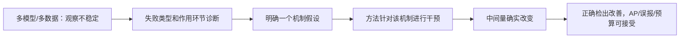

# 面向 SCI 一区的相位稳定性论文定位与“提出的方法”章节写作方案

> 日期：2026-09-12。面向 RGB 小目标/反无人机检测；候选方法为 BCPS、POML、CMT-Det、PCOT。本文提供研究规划和可展开的章节草稿，不声称四种方法已经训练成功，也不承诺任何期刊录用。
>
> 已阅读：[BCPS 原方案](F:/antiuav/TSCRNet/BCRNet-main/docs/数学启发的小目标轻量检测研究路线与完整方案.md)、[另外三条路线](F:/antiuav/TSCRNet/BCRNet-main/docs/相位稳定性问题的三条独立解决路线与SCI论文方案.md)。本文件重点回答“需要做多深、写到什么程度、怎样组织贡献”，不替代两份方案中的全部实现细节。

## 1. 先回答最关心的问题

**你的论文不需要先凑齐三个新模块。更合适的目标是：一个不能被简单方法替代的核心方法贡献，加上足够深入的问题刻画和验证。** 一个数学目标、一个采样模块或者一个标签分配算法，都可能成为方法主体；能否支持有竞争力的论文，取决于它与已有工作的距离、解决问题的实际价值和证据质量。

“工作量大”与“贡献大”不是一回事。训练四个检测器、适配三个数据集，是必要的实验工作；若仅复现已知现象，并不能自动抵消方法上的增量过小。反过来，推理代码只有几十行，也不意味着研究贡献小。

对你的四个候选，我的建议是：

- 如果希望以**采样方法/检测器**为论文中心，优先考察 BCPS，CMT-Det 是另一条结构路线；二者都需要更强的机制证据。
- 如果允许以**训练方法**为论文中心，POML 更适合先做可行性闭环，但“比普通一致性或最坏相位训练多了什么”会成为主要审稿问题。
- PCOT 应在监督诊断有证据后再升级为主线，不应从输出 PFR 直接跳到标签分配的因果结论。
- 初版先选一个主方法。BCPS+POML 可以形成有联系的组合，但不能因为单独方法不够强就默认相加；组合须有额外证据。

下面给出四套独立的“提出的方法”章节写法，以及一套有条件的组合写法。

## 2. “SCI 一区标准”怎样理解

### 2.1 分区不能换算成模块数量

“一区”可能指 JCR Q1，也可能指中科院期刊分区表中的一区，投稿时应明确所用体系、年份和学科类别。JCR 官方说明中，排名、四分位和百分位随年份及类别呈现；中科院分区表是另一套期刊评价产品。本文不把某个期刊的当前分区当作既定事实，也不把一区等同于所有期刊具有同一审稿门槛。[JCR 官方说明](https://journalcitationreports.zendesk.com/hc/en-gb/articles/28351430970001-Journal-Profile)、[期刊分区表官方平台](https://www.fenqubiao.com/Landing.html)

IEEE 的官方审稿说明关注期刊范围、原创性、研究有效性、数据解释、清晰度以及对领域的推进。下面的数字和结构是针对本课题的规划建议，**不是“一定要三个模块、三个数据集、提高两个 AP 点”的投稿规则**。[IEEE 审稿说明](https://journals.ieeeauthorcenter.ieee.org/submit-your-article-for-peer-review/about-the-peer-review-process/)

### 2.2 建议按六个问题判断方法是否足够强

| 审稿问题 | 本课题需要提供的答案 | 容易被认为不够的情况 |
|---|---|---|
| 为什么研究这个问题？ | 微小平移导致本来可检出的目标在部分相位漏检，且影响实际检测可靠性 | 只展示几张“框变了”的图片 |
| 已有方法为什么没有充分解决？ | 在统一预算和协议下，平移增强、抗混叠、相位采样或一致性方法仍有明确不足 | 没有实现最直接的简单对照 |
| 你到底新在哪里？ | 一句话能定位到新的优化对象、表征或跨相位分配关系 | 三个常见模块各改名字 |
| 为什么这一设计应当有用？ | 假设、推导、操作与目标错误之间可以逐步连接 | 从“存在 PFR”直接推出“第一层混叠是原因” |
| 有用的是哪一个新部分？ | 同预算消融、关键中间量、替代解释排查 | 只报告完整模型胜过 baseline |
| 是否具有可复用价值？ | 在声明范围内，跨数据、载体或部署精度仍有效，失败边界清楚 | 只在一个配置/一个种子上有效 |

这些问题的答案可以支持对高水平期刊的投稿判断，但不是录用评分公式。

### 2.3 可以只有一个核心创新吗？

可以。建议把三个层级分开：

1. **论文贡献**：例如系统问题刻画、一个新方法、机制与泛化验证。
2. **方法组成**：为了实现这个新方法，可能需要参数化、目标函数、读出或求解器。
3. **工程组成**：骨干、FPN、常规检测头、日志、导出、求解的数值稳定实现。

它们不能混为一谈。例如 BCPS 的背景约束、可检测性代理和最坏相位优化，可以共同构成**一个统一采样方法贡献**。不必把它们拆成三个彼此独立的“首次提出”。普通 BN、轻量骨干、Cholesky 求解都不需要成为创新点。

一个可用的贡献组织方式是：

> 我们在明确几何与检测匹配条件下刻画了小目标的实例级相位检测不稳定；针对其中可干预的瓶颈提出一种方法；通过机制、强对照及跨数据实验检验了该方法的价值。

其中第二项应当是论文的技术重心。第一、第三项需要有内容，但不是靠多写两条贡献来提高创新数量。

### 2.4 什么程度的数学才有价值？

不要求每篇方法论文都提出全新的数学定理。数学的价值在于使设计可检查：

- 明确优化的到底是响应强度、局部可分性、中心位置，还是最终检测的可行条件。
- 给出有用的性质：例如缩放不变性、矩合并恒等式、有限集合裕量下界、固定可行域下解的稳定性。
- 解释性质成立的条件，并指出完整网络为何只近似满足它们。
- 导出能检验的预测和能否定设计的实验。

下列做法不能增加实质创新：重命名 Cauchy–Schwarz；把矩恒等式称为新理论；把熵正则唯一解写成网络必然平移稳定；把局部高斯模型中的可分性写成真实场景的检测概率。

**方法章节中的公式应能回答一个具体设计问题。只负责让文章看起来复杂的公式可以删掉。**

## 3. 你的 story 需要补上的一环

### 3.1 保留主线，调整创新主张

你提出的主线是合理的：

> 发现问题 → 多模型、多数据集量化 → 提出方法 → 验证改善。

但“首次发现检测器对一像素平移敏感”不能作为主张。Manfredi 与 Wang 在 2020 年已经研究了单阶段/两阶段、anchor-based/anchor-free 检测器的一像素平移敏感性，并讨论了缓解方法。因此需要突出你的**小目标条件、实例级失败分解、统一评测与具体干预方法**，并核查这些更窄主张的近邻。[原论文](https://arxiv.org/abs/2008.05787)

建议把正式 story 写成：

> 已有工作表明目标检测具有平移敏感性，但平均检测精度不足以描述同一个微小目标在邻近采样位置上的可靠检出情况。我们在固定预处理与实例匹配条件下，系统研究小目标的相位相关 Detect/Miss 翻转，区分置信度不足、定位失败和后处理竞争。针对其中一个能够被实验支持的瓶颈，提出保持计算预算的改进方法，并检验它能否在维持标准检测质量与误报水平的同时，提高跨相位正确检出的概率。

“平均指标不足以描述实例行为”是两类统计对象的区别；不能因此声称以前没有任何实例级稳定性研究。若把 PFR 或协议单独作为创新，也必须另做查新与性质分析。

### 3.2 缺少的是“为什么选这个方法”



PFR 证明的是给定协议下存在状态变化。它本身不能判定原因是混叠、背景、下采样、标签分配还是阈值/NMS。

你不一定要证明一个解释了整网所有失败的因果理论。可以明确声明“本文处理其中一种重要且可干预的因素”。但是声称的范围越窄，实验越应准确对应这一因素。

### 3.3 PFR 降低为什么还不够？

同一目标的四相位检测状态若从 `[1,0,1,0]` 变成 `[0,0,0,0]`，PFR 从 1 变成 0，却变得更差。变成 `[1,1,1,1]` 才符合你的目标。

因此论文的主目标建议写为**相位稳健的正确检测**，而不是单纯最小化 PFR。至少配套：

- all-phase recall、mean phase recall、stable-miss 比例；
- conditional PFR、phase0 dropout；
- AP50:95/AP75，统一误报预算下的召回；
- score 与 IoU 变化，以及后处理新增失败；
- 参数/MAC/单次推理延迟，训练方法额外报告训练成本。

其中 conditional PFR 的分母也是方法相关的 any-detected 集合，应与全部 GT 指标和配对的状态转移表共同解释，不只挑选有利的条件子集。

### 3.4 多模型、多数据集需要支持什么程度的结论？

“多种模型均存在非零翻转”与“所有模型 Tiny 都显著比 Non-small 更差”是两个不同主张。后一主张必须有组间差值、置信区间及相应的统计支持。上一份报告已经指出模型间存在差异，不应为了维持统一叙事去隐藏反例。

在本文中，多模型、多数据集是**后续证据计划**；不能因为已有多模型 DUT 实验，就把尚未核对的其他数据集结果写成完成时。

## 4. Methods 应该承担哪些内容

### 4.1 文章级结构

| 章节 | 主要职责 | 本课题的具体内容 |
|---|---|---|
| 1 Introduction | 为什么值得研究、现有空缺、贡献 | 可靠检出与轻量预算的矛盾 |
| 2 Related Work | 与最接近方法比较 | 平移敏感性、抗混叠/相位采样、路线专属近邻 |
| 3 Problem and Empirical Motivation | 定义问题并提供关键现象证据 | 相位协议、PFR/正确检测、主要失败类型 |
| 4 Proposed Method | 新方法如何从问题推导出来、如何训练/推理 | 选定下文的一套章节 |
| 5 Experiments | 验证方法与解释 | 主结果、强对照、机制、泛化、效率 |
| 6 Discussion/Conclusion | 适用范围与已验证结论 | 未解决失败、边界条件、可重复结论 |

这是可用模板，不是所有期刊要求的固定目录。现象实验可以放在第 3 节，完整实验细节集中在第 5 节；不要让 Methods 重复整份采样实验报告。

### 4.2 一个方法章节的六个基本问题

1. **目的**：本方法具体干预哪一类失败？
2. **对象**：输入、输出、变量、坐标和假设是什么？
3. **核心**：新关系、新约束或新表征是什么？
4. **依据**：该设计具有什么性质，性质在哪些条件下成立？
5. **算法**：训练步骤、损失、梯度、推理流程如何实现？
6. **代价与边界**：增加多少计算，哪些问题没有解决？

对当前课题，可先按约 5–7 个方法小节、1 张总图、1 份符号表、1 个算法框架写作。若排成常见双栏版式，约 3–5 页可作为初稿预算；这只是写作估算，最终服从目标期刊篇幅要求和实际内容，不能为了页数重复普通骨干细节。

### 4.3 每个小节用“问题—定义—操作—性质—接口”写

以 BCPS 为例，不要只写：

> 为提高特征表达，本文设计一个背景增强模块与相位模块。

应写成：

> 早期空间压缩可能同时保留局部背景变化并削弱弱目标变化。为约束可建模的背景干扰，我们将部分采样核限制在背景子空间的正交补内。该约束通过固定基与可学习系数的乘积实现，在线性观测中满足零背景响应；其输出与普通外观通道拼接，以保留约束可能损失的信息。随后，我们在相同通道预算下优化不同相位的可检测性保持，而不使用目标响应幅度作为目标。

后者中的每一句都能对应一个公式、模块或消融；“增强表达”本身通常不能。

## 5. 需要多少实际工作量

### 5.1 工作量由需要回答的问题决定

以下是本课题的研究交付项，不是发表配额：

| 工作包 | 至少应交付什么 | 不能用什么代替 |
|---|---|---|
| W1：问题协议 | 统一输入几何、匹配、clean GT、阈值、尺度分组和元数据 | 不同模型各跑一次默认 predict |
| W2：现象与机制 | 失败分解、组间效应、一个可干预瓶颈 | PFR 柱状图加主观解释 |
| W3：方法正确性 | 数值/坐标/梯度检查，完整训练与导出路径 | 能 forward 或合成测试通过 |
| W4：简单强对照 | 同预算增强、相近方法、核心部件消融 | 仅与原始 baseline 比 |
| W5：独立检测收益 | 标准 AP、正确检出、误报、多个种子 | 只减少自定义指标 |
| W6：适用范围 | 声明范围内的多个数据和载体，失败案例 | 单一数据上换很多相似模型名字 |
| W7：效率与复现 | 推理/训练成本、配置、权重、脚本与版本 | 单报 FLOPs |

这些工作不意味着必须新增七个技术点。大部分是为了验证同一个核心点。

### 5.2 方法特有的工作负担

| 方法 | 原型开发负担 | 主要研究负担 | 推理代价 | 最先做的停走实验 |
|---|---|---|---|---|
| POML | 低至中：raw 输出、GT 匹配、跨视图损失 | 超过普通四视图/一致性/最坏检测损失；防置信度投机 | 图不变 | 同预算小规模重训，检查 all-phase recall/AP/误报 |
| BCPS | 中：约束核、统计估计、模板、稳定矩阵求解、导出 | 先验与真实 RGB 是否匹配；局部代理是否对应整网收益 | 同形状卷积可不增加算子；5×5 相对3×3会增加成本 | 未参与设计的模板/真实背景诊断 + 普通5×5对照 |
| CMT-Det | 中至高：证据支路、矩压缩、读出、头与辅助监督 | 极窄支路能否学到可用 E；是否胜过普通偏移/热图；密集目标失败 | 新增激活、卷积和读出 | 真实训练图像上证据定位检查 + 同监督读出对照 |
| PCOT | 高：原生分配诊断、软标签、坐标输运、耦合求解 | 分配变化是否重要；联合耦合是否胜过独立 OT | 图不变，训练更贵 | 先记录监督变化，再比较独立/耦合分配 |

“低”是相对四条路线而言，不代表研究容易，也不是可以直接投稿的成熟度。

### 5.3 给一个可计算的训练预算示例

不要在四条路线都没有最小收益时，同时展开全部实验。先在一个数据集、一个载体进行筛选；筛选结果只用于开发，不作为最终显著性结论。

选定一条方法后，下面是一份较充分的**示例矩阵**：

| 部分 | 组合 | 完整训练数 |
|---|---|---:|
| 主比较 | baseline/方法 × 2 个载体 × 3 个数据集 × 3 个种子 | 36 |
| 方法消融 | 6 个额外配置 × 1 个载体 × 1 个数据集 × 3 个种子 | 18 |
| 外部强对照 | 3 个对照 × 1 个载体 × 2 个数据集 × 3 个种子 | 18 |
| 合计 | 不重复计 baseline/完整方法 | 72 |

这不是“一区必须训练72次”。可根据论文范围采用较小矩阵，也可能因重现和失败消耗更多资源。三个数据集应有实际场景差异；三个 DUT 子集不是三个独立数据集。已有 checkpoint 只有在数据、训练预算和协议合适时才能替代重训。Frozen-model 的问题调查是推理工作，不能与这些训练数量混算。

训练方法对照中的 baseline 应包含同视图预算版本；原生单视图 baseline 还可作为实际成本参考。不能用四视图方法与一视图 baseline 的差值直接证明目标函数更好。

真实 GPU 预算应按

$$
T_{GPU}=\sum_j n_j t_j+T_{eval}+T_{failed}
$$

估算。其中 $t_j$ 是各方法实测的单次完整训练时长。POML/PCOT 的四视图不能直接按普通训练时长计；峰值显存、有效 batch 与并行度也不同。仅在所有运行平均确为6小时的假设下，72次才对应432 GPU小时，另加评测和失败成本；这不是针对你服务器的估时。

### 5.4 建议分阶段投入，避免把工作量当目的

1. **诊断阶段**：复用现有权重和训练数据，筛掉明显不符合机制的路线。
2. **可行性阶段**：实现一条路线，短程训练只看数值、梯度和方向，不据此写优越性。
3. **开发验证阶段**：一组完整训练，比较最强简单替代，确定是否继续。
4. **确认阶段**：冻结方法与调参规则，展开多种子、跨数据、载体及部署验证。
5. **成稿阶段**：按最终保留下来的设计重写标题、贡献与 Methods，删除无效部件。

不提供“若干周必能完成”的估计，因为训练时长、标注质量和原型成败都未确定。需要计划日期时，先测量一轮的真实耗时再安排。

## 6. 四条路线怎样选择论文中心

| 论文希望回答的问题 | 优先候选 | 最关键的独立贡献 | 最大的证据缺口 |
|---|---|---|---|
| 如何在早期压缩中保住弱目标不同相位的证据？ | BCPS | 背景约束与固定预算最坏相位可检测性联合设计 | 局部模型到真实检测的联系 |
| 如何避免压缩丢掉格内位置？ | CMT-Det | 将可合并的空间矩状态送到定位头 | 真实证据场和实际定位收益 |
| 如何训练原检测器，使困难相位仍跨过检出边界？ | POML | GT 对齐的分类—定位联合轨道裕量 | 超过同预算增强/一般鲁棒训练 |
| 如何避免训练监督切换放大不稳定？ | PCOT | 共同坐标中联立的软分配 | 监督机制证据和耦合的独立价值 |

**面向一篇“轻量相位稳健检测方法”论文，我会首先评估 BCPS 是否能成立；这不是预测它必然优于其他路线。面向最低成本的先行验证，仍然先做 POML。** 上一份报告排序强调原型落地，本文件的 BCPS 优先意见强调其与“采样问题—方法设计—轻量推理”的论文联系，二者的评价目的不同。

如果诊断显示主要是输出置信度翻转，而前端代理变化无法解释错误，应提高 POML 优先级。如果真实全分辨率证据可靠且定位是主要失败，可提高 CMT 优先级。现象数据应当影响选题，而不是只用于装饰已选方法。

## 7. 写法 A：以 BCPS 为唯一主方法

### 7.1 适合的论文主张

**方法主张：在固定输出预算下，将背景约束和最不利相位的证据保持统一为可部署的采样核学习问题。**

这不是“设计背景模块、相位模块、融合模块”三个独立贡献。标准卷积形式是实用优势；除非提出了新的执行算法，否则不把物化卷积核本身列为图优化贡献。

### 7.2 可用章节目录

```text
4. Background-Constrained Phase-Robust Sampling
  4.1 Design Objective and Overview
  4.2 Background-Constrained Observation Parameterization
  4.3 Detectability Retention under a Channel Budget
  4.4 Worst-Phase Learning with Background and Shape Priors
  4.5 Integration into a Lightweight Detector
  4.6 Training, Complexity, and Scope of the Guarantee
```

### 7.3 4.1 设计目标与整体框架——正文草稿

> 本文针对早期采样中弱目标证据的相位相关损失设计前端。我们不要求所有中间特征保持完全一致，因为目标平移后的位置信息本身应当变化；我们希望在固定输出通道数下，不同采样位置仍保有区分目标与局部扰动所需的观测方向。为此，将采样核划分为受约束的证据核与普通外观核。证据核在指定背景子空间的正交补中学习，并使用最不利相位的可检测性保持目标优化；普通核保留不符合该局部模型的外观信息。二者在推理时共同构成一个静态步长卷积。

本节放一张总图：输入 → 两类核的单次卷积 → 原骨干/颈部/头；旁边用虚线表示训练统计、模板和辅助损失。主图应明确“训练辅助计算不进入推理”。

### 7.4 4.2 背景约束参数化——正文草稿与必要公式

> 为刻画小范围内的平滑背景变化，我们将局部 RGB 向量表示为 $x=U\beta+a s_{t,\phi}+n$。其中 $U\beta$ 为可建模的背景分量，$s_{t,\phi}$ 为具有给定形态和相位的弱目标扰动，$n$ 为未解释残差。该模型用于构造训练先验，而非断言所有自然背景都满足该形式。令 $N$ 为 $U^T$ 的正交零空间基，将证据核写为 $W=NA$，可得 $W^TU=0$。因此，在线性观测及完整局部支持条件下，指定背景分量不进入证据通道。

$$
U^TN=0,\quad N^TN=I,\quad W=NA,\quad z=W^Tx.
$$

接着用一段明确代价：与 U 重合的目标成分也可能被删除，因此不能称为无条件前景分离。普通外观核正是为了保留这些未被先验覆盖的信息；其通道比例要做预算消融。

原方案可用实例为 5×5 RGB 核、背景基75×9、零空间75×66、8个证据通道与16个外观通道。这是实现实例，不是理论必须取这些数字。

### 7.5 4.3 固定预算下的证据保持——正文草稿与必要公式

> 响应幅值可以通过放大卷积权重任意增加，因此不足以衡量目标是否更可区分。我们在残余扰动的尺度下度量目标引起的均值变化。令 $g=N^Ts$、$C=N^T\Sigma N$，定义压缩观测的局部可检测性代理：

$$
q_A=g^TA(A^TCA)^{-1}A^Tg.
$$

> 在正定协方差和满列秩条件下，该量对共同权重缩放不变。进一步将其与背景正交空间及原始理想观测比较，分开量化“背景约束删除的信息”和“通道压缩未能保留的信息”。

$$
q_\perp=g^TC^{-1}g,\qquad q_{raw}=s^T\Sigma^{-1}s,
$$

$$
\rho_A=\frac{q_A}{q_\perp},\qquad
\eta=\frac{q_\perp}{q_{raw}},\qquad
R_A=\frac{q_A}{q_{raw}}=\eta\rho_A.
$$

正文保留 $0\le R_A\le\eta\le1$ 的条件及简要推导；完整投影证明可放附录，并引用经典子空间检测来源。它是方法的可解释依据，不能称为新发现的基本定理。[Matched Subspace Detectors](https://www.mssc.mu.edu/~daniel/mscs6960/spring2010/ScharfFriedlanderTSP94.pdf)

### 7.6 4.4 最不利相位学习——正文草稿与必要公式

> 平均保持率较高仍可能掩盖少数采样位置上的证据薄弱点。我们对同一模板与背景条件下的多个相位联立优化，以平滑最大损失保护其中的不利相位，再对不同模板和背景组平均。该设计优化的是相位间的证据底部表现，不要求所有相位具有完全相同的表征。

$$
L_{phase}=\mathbb E_{t,g}\left[
\tau\log\left(\frac1{|\Phi|}\sum_{\phi\in\Phi}
\exp\frac{1-R_A(s_{t,\phi},\Sigma_g)}{\tau}\right)\right].
$$

本节必须写明：模板如何产生、同模板如何平移、是否截断、背景协方差只用训练数据、正定化与近零分母如何处理。上述目标是**组内最坏相位、组间平均**，不能写成已经严格优化了全部背景/模板的全局最坏情况。

### 7.7 4.5 检测器集成——应该写什么

- 输入 B×3×H×W；输出 B×24×H/2×W/2，给出 padding/归一化/激活。
- 将16个普通核与8个证据核沿输出维拼接；训练时保留 $A\rightarrow W$ 的梯度。
- 其余 backbone/neck/head 尽量保持成熟载体一致，给形状表或引用，不把常规块重新介绍为新方法。
- 导出时一次物化 W，再拼接静态核；推理不计算 N、协方差、模板或矩阵逆。
- 机制结论在激活前成立，不能不加说明地延伸到 BN/激活后和整网输出。

### 7.8 4.6 训练、复杂度与理论边界——正文草稿

$$
L=L_{det}+\lambda_pL_{phase}+\lambda_cL_{condition}.
$$

> 检测损失由真实框监督提供，先验损失仅更新前端证据系数。我们用线性求解与数值正则控制协方差计算，不在部署中执行这些操作。BCPS 与同形状5×5普通卷积的推理计算形式一致；相较3×3同宽卷积则具有额外成本，因而实验同时包含同核大小和同实际预算对照。局部保持率不等于整网检测概率；我们分别验证代理性质和实际相位正确检出，以检验局部设计是否具有真实收益。

### 7.9 若以一区论文为目标，BCPS 还要补的工作

1. **普通5×5对照**：排除核变大带来的收益。
2. **背景约束开/关 × 相位目标开/关**：四格消融；无约束时应真正令 N=I 或使用等价自由核。
3. **平均保持与最坏相位保持**：这是核心优化目标的独立价值。
4. **模板与背景外推**：未用于优化的形态、位置、复杂背景；不能只测训练模板。
5. **局部到整网联系**：记录线性证据代理、真实特征变化和最终检测状态；用同训练条件的替换实验检验干预，不能以相关图单独证明因果。
6. **背景消除的代价**：报告低 η、复杂背景、多尺度及较大目标倒退。
7. **抗混叠/多相采样近邻**：在能够可靠接入的载体上对照；具体实现与训练预算必须公开。

原文 q 只描述单个局部块。真实卷积具有重叠窗口，后续还有采样与后处理。如果单块代理与整网错误不一致，应收缩主张，或另行研究共同区域内的多输出观测模型；不能仅靠追加更多公式略过这个缺口。

## 8. 写法 B：以 POML 为唯一主方法

### 8.1 适合的论文主张与目录

**方法主张：直接优化对象在有限相位集合中的正确检出条件，而不只惩罚输出差异。**

```text
4. Phase-Orbit Margin Learning
  4.1 Object-Centric Phase Orbits
  4.2 Classification–Localization Feasibility Margins
  4.3 GT-Aligned Set Matching
  4.4 Orbit Risk and Its Finite-Set Bound
  4.5 Training Algorithm and Inference Cost
```

此方案是训练方法论文，不应把它命名为全新 backbone。是否适配单阶段、两阶段、query 检测器是实证范围，不能只因公式看起来通用就声称通用。

### 8.2 4.1 对象级相位轨道——正文草稿

> 我们将同一基础增强图像的整数平移集合视为一个训练单元。各视图共享内容与增强，仅改变相对于采样网格的位置。框预测减去相应平移后回到共同坐标。方法关注同一 GT 是否在全部相位具有合格候选，而非要求不同视图中的输出下标保持不变。

写清平移发生在 resize/pad 后、归一化前，采用数组搬运；训练有效 GT 与 padding/边界规则一致。不要用独立 Mosaic/颜色扰动制造额外差异。

### 8.3 4.2 联合检出裕量——正文草稿与必要公式

> 一个候选成为正确检测，必须同时满足分数和定位条件。因此将相对于操作参考门槛的分类裕量与定位裕量取最小值，形成联合可行裕量。只有两项都为正，该候选才越过两个边界。

$$
m_{ij}^{\phi}=\min\left\{
\operatorname{logit}(p_j^\phi)-\operatorname{logit}(t),
\alpha[\operatorname{IoU}(\tilde b_j^\phi,b_i)-u]
\right\}.
$$

单类别先严格使用载体实际 score 定义，多类别补入正确类竞争条件。该裕量来自 raw 候选，不包含 NMS 保留保证。为什么不用单独 score/IoU，在本节用一对简短反例解释即可。

### 8.4 4.3 集合匹配——正文草稿

> 由于检测器的候选身份可以随图像平移改变，我们按 GT 而非固定候选索引建立跨视图对应。在每个相位内，求 GT 与候选的一对一最大总裕量匹配，得到每个对象的裕量向量。匹配索引停止梯度，梯度进入所选候选；原生检测损失继续监督所有正常分支。

说明无交叠框的梯度依靠原生回归损失补充、候选预筛选的几何规则、无 GT 图像处理。不同相位匹配到不同 query 本身不算错误。

### 8.5 4.4 轨道风险——正文草稿与必要公式

> 对匹配后的 K 个裕量，采用总体标准差定义离散程度。有限集合不等式给出最小裕量的保守下界。我们通过正裕量目标提高该下界，从而同时避免“平均正确但某相位失败”和“各相位一致地漏检”。

$$
\underline m_i=\bar m_i-\sqrt{K-1}\sigma_i
\le\min_\phi m_i^\phi,
\qquad L_{orbit}=\frac1N\sum_i[\kappa-\underline m_i]_+^2.
$$

本节给出简短推导，并强调它只针对当前有限相位与匹配候选。均值—离散程度下界不是新数学定理，也不保证比直接 $\max_\phi[\kappa-m_i^\phi]_+^2$ 更好。若直接最坏裕量更有效，应让最终 Methods 使用更有效的简式。

### 8.6 4.5 训练算法——正文草稿

$$
L=\frac1K\sum_{\phi}L_{det}^{\phi}+\lambda_oL_{orbit}.
$$

> 常规检测损失维持正负样本学习，轨道项在 warm-up 后逐步启用。我们保留原检测器的推理结构，新增步骤仅发生于训练。四视图训练的计算代价单独统计，并与使用相同视图数、更新次数和增强策略的对照比较。评测阈值按固定验证规则确定，以检查收益是否来自真正的正确检出改善。

算法框包含：共享增强 → K个前向 → 原生损失 → raw 解码与回对齐 → 匹配 → 裕量 → 反向。随机层/BN策略、零方差数值稳定、空 GT、推理去除训练代码均应说明。

### 8.7 POML 需要补足的创新与工作量

检测分类与定位一致性并非新内容，CSD 已经包含两者；最坏风险思想也不能单独主张首创。[CSD](https://papers.nips.cc/paper_files/paper/2019/hash/d0f4dae80c3d0277922f8371d5827292-Abstract.html)

它要作为强方法论文，至少需要回答：

- 相同四视图的普通训练能否获得全部收益？
- score+box 一致性与普通 detection loss 的最坏相位训练是否一样好？
- GT 集合对应是否有独立价值，还是固定候选也足够？
- 联合可行裕量是否比普通鲁棒损失更接近实际错误？
- PFR 改善是否同时对应稳定检出增加，而非稳定漏检或背景误报？

如果这些对照把差异消解了，不应把更多超参数或复杂下界当作补救。POML 可以是良好的训练基线，但未必足以成为论文主贡献。

## 9. 写法 C：以 CMT-Det 为唯一主方法

### 9.1 适合的论文主张与目录

**方法主张：在压缩时携带低维、可合并的格内位置状态，使定位头不必重新推断已经被折叠的位置。**

```text
4. Conservative Moment Transport for Tiny-Object Localization
  4.1 Evidence–Semantics Decomposition
  4.2 Conservative Spatial-Moment Encoding
  4.3 Coordinate-Aware Moment Aggregation
  4.4 Moment-Guided Detection Head
  4.5 Supervision and Computational Budget
```

### 9.2 4.1 证据与语义分工——正文草稿

> 本方法将高分辨率定位证据与低分辨率语义处理分开。一个无步长的极窄支路产生非负证据场 E，常规轻量骨干负责类别与背景辨别。E 不是亮度或真实分割；其作用是提供能够被空间矩描述的定位线索。我们用框中心构造的训练监督帮助学习该证据，再将其压缩为每单元三个数。

交代 E 的形状 B×1×H×W、极窄支路、非负激活、辅助监督和原始 RGB 输入；主张不能建立在“证据已经是真实目标”的假设上。

### 9.3 4.2 矩编码——正文草稿与必要公式

> 对单元 $\Omega_k$，我们保存证据总量及相对于单元中心的两个一阶空间矩。与只保存总量相比，这三个数额外表达证据在单元内部的横向与纵向位置，输出宽度与块内像素数无关。

$$
M_{0,k}=\sum_{u\in\Omega_k}E(u),\quad
M_{x,k}=\sum_{u\in\Omega_k}(u_x-o_k^x)E(u),\quad
M_{y,k}=\sum_{u\in\Omega_k}(u_y-o_k^y)E(u).
$$

输出 B×3×H/s×W/s；可用固定核实现。Mx/My 可为负，原始矩路径不经过破坏关系的激活或独立归一化。

### 9.4 4.3 换原点合并——正文草稿与必要公式

> 为在相邻单元间聚合位置，必须将每个局部矩换到同一参考原点。只相加局部一阶矩会遗漏单元之间的距离。下式保留该项，使完整区域的总量与一阶矩与直接在 E 上求和一致。

$$
M_x^{parent}=\sum_k\left[M_{x,k}+(o_k^x-O_x)M_{0,k}\right],
\quad M_0^{parent}=\sum_kM_{0,k}.
$$

纵向同理。由此得到区域质心 $c=O+(M_x^{parent},M_y^{parent})/M_0^{parent}$。

只有证据随输入正确平移、区域覆盖完整支持且无额外污染时，质心才按相同位移变化。固定局部窗口的截断、背景和邻居都可能破坏这些条件。不要把合并恒等式写成整网无条件平移等变。

### 9.5 4.4 矩引导检测头——正文草稿

> 我们将矩的一份投影融入最细语义层，同时保留未经变换的原始矩用于中心读出。每个候选以固定邻域合并矩，得到局部质心；语义头预测类别、宽高与中心残差。较粗检测层继续使用常规定位，以维持一般尺寸目标能力。

$$
\hat c_k=o_k+\frac{(N_{x,k},N_{y,k})}{\max(A_k,\epsilon)}+r_k.
$$

写清 stride、邻域、低分母、半像素坐标、残差及多目标窗口。正文用一个跨单元示意图解释为何需要 Mx/My，再用真实背景实验验证，而不只放合成单点成功图。

### 9.6 4.5 监督与预算——正文草稿

$$
L=L_{det}+\lambda_hL_{heat}+\lambda_cL_{centroid}+\lambda_rL_{residual}.
$$

> 辅助热图只由训练标注产生，前景与合法背景分别归一化；质心监督应用于适合读出的正窗口。我们通过极窄高分辨率支路控制额外计算，并分别统计卷积、激活内存、矩读出及后处理成本。所有证据分支对照使用相同辅助监督，以区分表示的价值与额外监督的收益。

### 9.7 CMT-Det 需要补足的创新与工作量

最直接质疑是：“这是否只是热图、soft-argmax 或普通 offset 的另一种写法？”积分坐标回归本来已有研究，因此独立差异必须落在**压缩前的格内状态保存、合并规则与预算收益**。[DSNT](https://arxiv.org/abs/1801.07372)

必要对照：同支路 M0-only、三个自由学习核、同预算热图+offset、低分辨率积分读出、同预算浅层加宽、残差开关。与 Gaussian-Hermite 矩采样等近邻还需核查具体重合，不能只因检测场景不同就宣布新颖。[GHS](https://arxiv.org/html/2603.17098v1)

最重要的实验是实图中 E 的可用性、局部污染与截断、多目标距离、最终残差是否完全绕开矩通路。若矩分支只在理想合成 E 上成立，尚不足以形成有效检测方法。

## 10. 写法 D：以 PCOT 为唯一主方法

### 10.1 适合的论文主张与目录

**方法主张：在共同物理坐标中联立不同相位的软监督，而不是独立选择各相位的正样本。**

```text
4. Phase-Coupled Optimal Transport Assignment
  4.1 Assignment Instability under Small Translations
  4.2 Shared-Mass Soft Assignment
  4.3 Transport to a Common Coordinate System
  4.4 Joint Entropic Optimization
  4.5 Solver, Soft Supervision, and Complexity
```

### 10.2 4.1 监督不稳定——正文草稿

> 本文研究硬分配切换是否会放大微小目标的相位不稳定。目标平移后，正样本位置本就应改变，因此我们不以候选下标变化作为错误，而比较回到共同坐标后的监督分布。根据前述诊断，我们将每对象的监督总量与不同相位的空间分配共同建模，尝试减少额外的监督突变。

“根据前述诊断”只有在实际结果支持后才能用于成稿。若没有诊断证据，本节只能写为待检验假设。

### 10.3 4.2 共同预算软分配——正文草稿与必要公式

> 每个相位使用一个包含背景行的 GT—候选计划。每个候选容量为1，每个 GT 在全部相位具有相同监督总量 k。联合容量约束处理对象竞争，共同总量避免动态正样本数量本身成为跨相位变化来源。

$$
\Pi^\phi\in\mathbb R_+^{(n+1)\times m},\quad
\sum_p\pi_{ip}^\phi=k_i,\quad
\sum_{i=0}^{n}\pi_{ip}^\phi=1.
$$

写清背景预算、共同有效候选集合、不可行总量的处理，初版限制为固定网格检测器。

### 10.4 4.3 坐标输运——正文草稿

> 输入1像素平移对应 stride-s 标签网格中的1/s格，而非一整格。我们将各单元软权重视为分片常量密度，通过面积重叠回移到共同坐标，得到可比较的监督分布。该操作用于标签，不对模型特征施加强制插值一致性。

$$
\tilde a_i^\phi=S_\phi(\pi_i^\phi/k_i).
$$

多 FPN 层按各自 stride 分块构造 S，保留共同层权重；用 halo 接收外移质量。离散密度重分配只是近似对齐，必须报告平滑偏差，不主张严格标签等变。

### 10.5 4.4 联合优化——正文草稿与必要公式

> 我们在每相位质量成本与熵正则外，加入共同坐标中的对象分配耦合，使计划同时考虑检测质量和跨相位监督变化。关闭耦合后退化为独立相位的软分配，这一情形是核心对照。

$$
\min_{\Pi^\phi\in\mathcal U}
\sum_\phi\left[\langle C^\phi,\Pi^\phi\rangle+
\varepsilon\sum_{ip}\pi_{ip}^\phi(\log\pi_{ip}^\phi-1)\right]
+\frac\gamma2\sum_i\sum_{\phi<\psi}
\|\tilde a_i^\phi-\tilde a_i^\psi\|_2^2.
$$

正文说明：固定可行域、S和正熵系数时，目标的严格凸性提供唯一计划；不能据此推出图像到检测结果的稳定保证。成本中的预测 detach，高斯几何、框成本、软标签必须有明确构造。

### 10.6 4.5 求解、监督与成本——正文草稿

> 由于二次项耦合多个相位，该问题不能由一次独立 Sinkhorn 完成。我们使用包含完整目标梯度的镜像下降，并对共同边际做 KL 投影，记录收敛残差和达到迭代上限的比例。最终计划停止梯度，用于软分类目标及逐 GT 加权的框损失；推理继续执行原检测器。

必须写出更新公式、迭代条件、数值精度及软 objectness/quality/DFL 的适配。多个 GT 的框损失应分别求值后加权，不能把框坐标平均成一个虚构目标。

### 10.7 PCOT 需要补足的创新与工作量

OTA 已将检测分配建模为最优输运，并用分类和回归成本求计划。因此“使用 OT/Sinkhorn 做分配”本身不足以构成新方法。[OTA](https://arxiv.org/abs/2103.14259)

必须有：原生监督诊断；同视图原生分配；独立软 OT；相同面积重分配但无耦合；完整耦合；共享/独立 k；收敛与训练成本；中间监督变化到最终正确检测的联系。固定网格结果不能直接推广到 RT-DETR query 或 Cascade proposal，后者需要另定义共同支持空间。

## 11. 写法 E：有条件地组合 BCPS 与 POML

### 11.1 什么情况下值得组合？

只有观察到以下情况才建议升级：

1. BCPS 单独改善局部证据代理并获得真实检测收益；
2. 仍有一部分目标具备可用候选，但分类/定位裕量在某些相位不足；
3. POML 在普通载体上具有超过同预算增强的独立作用；
4. 联合训练进一步提高正确检出，且不是以 AP/误报/训练预算失衡换来的。

这样可以讲：**前端保护可用证据，训练目标推动后续检测器在不利相位利用这些证据。** 它们解决链条上的两个不同环节。

### 11.2 可用目录与概述段落

```text
4. Phase-Robust Evidence Preservation and Detection Learning
  4.1 From Evidence Availability to Detection Feasibility
  4.2 Background-Constrained Sampling
  4.3 Worst-Phase Detectability Retention
  4.4 Object-Centric Detection-Margin Learning
  4.5 Joint Optimization and Static Inference
  4.6 Complexity and Limitations
```

> 局部证据保留与最终正确检测之间仍存在学习差距。前者关心采样输出是否包含可区分方向，后者要求后续网络利用这些方向，使候选同时满足分类与定位条件。因此，我们分别在采样前端和对象级训练目标上约束不利相位，并保留常规检测监督。两个约束共同训练一个单视图检测器，训练先验与多相位分支均不进入推理。

$$
L=\frac1K\sum_\phi L_{det}^\phi+
\lambda_bL_{BCPS}+\lambda_oL_{orbit}+\lambda_cL_{condition}.
$$

这一相加公式本身不自动产生新的联合理论。局部 q 与全网 margin 之间没有已证明的必然关系，正文应明确二者是互补的约束和待验证的联系。

### 11.3 四格消融是最低要求

| 配置 | BCPS | POML | 回答的问题 |
|---|---|---|---|
| A | 关 | 关 | 同视图预算基础表现 |
| B | 开 | 关 | 证据保护的独立作用 |
| C | 关 | 开 | 对象级训练的独立作用 |
| D | 开 | 开 | 联合是否有额外价值 |

四格都使用相同基础核大小/输出宽度、相同四视图数量和更新预算。另列原生单视图 baseline 与单视图 BCPS，呈现实际训练成本，避免把额外视图混入交互效应。

联合结果优于单项，可以支持组合有用；只有在预先定义的指标尺度上检验交互项，才讨论“超加和”。并非论文必须出现超加和，也不能只因 D 最好就宣称两个机制存在已证明的协同。

如果 BCPS+普通四视图已获得全部收益，删去 POML；如果 POML 获得全部收益，重新判断 BCPS 的价值。**不要同时加入 CMT 和 PCOT 来补齐贡献数量。**

## 12. 把方法章节与实验逐项对应

| Methods 中的主张 | 需要的实验 | 无法支持的替代材料 |
|---|---|---|
| 对最不利相位更稳健 | 同数量相位的 all-phase recall/dropout，含更远且未用于选择的偏移 | 只在训练四相位报告 PFR |
| BCPS 保留证据 | 保持率/约束代价 + 未参与优化的模板 + 真实检测干预 | 核可视化看起来像边缘滤波 |
| CMT 保存格内位置 | 跨单元矩正确性 + 真实 E 定位 + 同监督普通读出对照 | 理想单点的无误差质心 |
| POML 改善检出边界 | 联合 margin/真实状态转移 + 同预算强对照 | 所有分数整体提高 |
| PCOT 稳定监督 | 回对齐监督变化/求解残差 + 重训后检测改善 | 分配热图更平滑 |
| 轻量且有实际价值 | 同设备、batch1、输入和精度下的延迟—正确检测关系 | 只少几个参数 |
| 泛化 | 未用于设计的场景/数据/模型或偏移，按声明范围验证 | 在所有 test 上反复调参后汇总 |

如果现有 DUT test 已用于多次问题分析与选方法，应公开其开发性用途；新的确认集或独立场景应在方法冻结后使用。val+test 并集可以描述现象，不能自动成为独立验证。视频数据的置信区间优先按序列/场景成块，缺少序列信息时说明图像级独立近似的限制。

## 13. 可直接用于 Introduction 的贡献表述模板

下面均为研究设计语气；只有实现、实验完成后才能改成“我们验证了”。

### 13.1 单方法版本：推荐先采用

> 1. 我们在明确的输入几何和实例匹配协议下，系统刻画小目标的相位相关检出不稳定，并将状态翻转与稳定漏检及分类/定位失败区分。
> 2. 针对【已获证据支持的瓶颈】，提出【BCPS/POML/CMT/PCOT中的一个】，通过【一句核心数学或算法关系】改善不利相位下的【证据/定位/裕量/监督】。
> 3. 通过同预算对照、机制消融及跨数据实验，检验方法是否在保持常规检测质量和计算预算的同时改善相位正确检出。

第1条不能直接写“首次发现”；第3条只有实验设计具有实际价值时才值得单列，也可与第2条合并，贡献不必固定为三条。

### 13.2 BCPS+POML 版本：需要额外证据

> 1. 我们区分局部证据可用性与最终检测可行性，围绕相位不稳定建立可检验的问题分解。
> 2. 我们提出一个联合训练方法，在固定通道预算的背景约束采样中保护局部证据，并用对象级联合裕量约束后续检测器的不利相位，推理保留静态单视图结构。
> 3. 我们通过四格消融和对齐的训练预算，检验两类约束的独立与联合价值，并报告适用范围及失败情况。

不能在没有实证支持时，将第1条写成已经证明的普适机制。

## 14. 当前建议采取的行动

**写作上先准备“问题刻画 + 一个核心方法 + 强验证”，技术上先做 BCPS 与 POML 的小规模可行性比较，最终只保留有独立收益的主线。**

建议建立一页研究记录表，每个候选只回答四项：

| 候选 | 核心可证伪预测 | 最强简单替代 | 继续条件 |
|---|---|---|---|
| BCPS | 不利相位证据保持提高，并转化为正确检出 | 普通5×5 + 相同增强/预算 | 先验外和实图均有价值，约束代价可接受 |
| POML | 联合检出裕量比普通训练目标更能提高稳定检出 | 同四视图训练 / 直接最坏检测损失 | AP/误报受控且有独立增益 |
| CMT | 显式格内矩比同成本隐式回归更可靠 | 同支路热图+offset/自由压缩 | 真实 E 支撑定位收益，成本与多目标问题可接受 |
| PCOT | 联合软监督比独立软 OT 更有效 | 独立熵分配 + 同坐标平滑 | 监督机制有证据，耦合有最终检测收益 |

对任何一条路线，都无需现在编写“提高了多少 AP”的论文摘要。先完成证据链，再把本文件中的章节草稿改成与最终实现一致的 Methods。

## 参考与证据说明

- [IEEE 官方审稿说明](https://journals.ieeeauthorcenter.ieee.org/submit-your-article-for-peer-review/about-the-peer-review-process/)：用于说明审稿评价维度；本文所有模块数量、训练矩阵和篇幅建议均为研究规划判断。
- [JCR 官方 Journal Profile 说明](https://journalcitationreports.zendesk.com/hc/en-gb/articles/28351430970001-Journal-Profile)、[分区表官方平台](https://www.fenqubiao.com/Landing.html)：用于区分期刊评价体系，不据此预测文章录用。
- [Shift Equivariance in Object Detection](https://arxiv.org/abs/2008.05787)：已有的一像素平移敏感性研究，限制“首次发现”的主张。
- [CSD](https://papers.nips.cc/paper_files/paper/2019/hash/d0f4dae80c3d0277922f8371d5827292-Abstract.html)：分类/定位一致性的直接近邻。
- [OTA](https://arxiv.org/abs/2103.14259)：最优输运标签分配的直接近邻。
- BCPS、CMT 的数学和实现背景及更完整近邻，见本文开头链接的两份研究方案。本文未进行四种新方法的训练、部署或录用概率测算。
